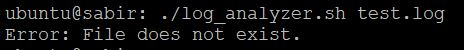
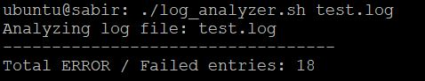
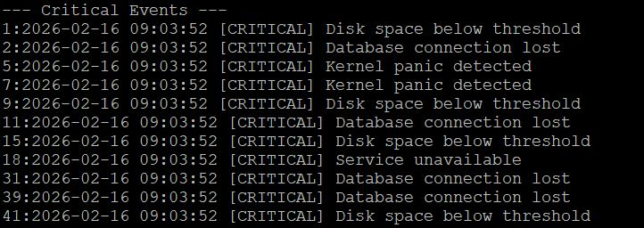
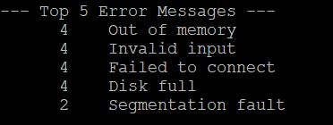
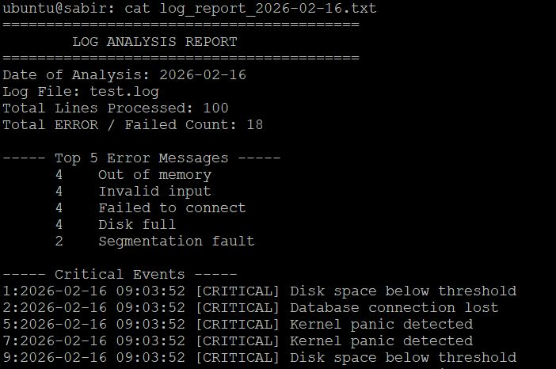
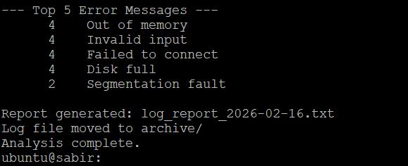

# Day 20 – Bash Scripting Challenge  
## Log Analyzer and Report Generator

---

## Task

Build a Bash script that analyzes system log files, extracts critical insights, and generates a structured daily summary report.

This project simulates real-world log monitoring tasks performed by system administrators and DevOps engineers.

---

# Project Files

- Log Analyzer Script: [log_analyzer.sh](script20/log_analyzer.sh) 
  
- A generated summary report: [log_report_2026-02-16.txt](script20/log_report_2026-02-16.txt)


# Sample Log File Generation

Logs were generated using:

```
./logs_generator.sh test.log 100
```

---

# Task 1 – Input and Validation

### Requirements
- Accept log file path as argument
- Exit if no argument provided
- Exit if file does not exist

### Screenshot


---

# Task 2 – Error Count

### Requirements
- Count lines containing `ERROR` or `Failed`
- Print total count to console

### Screenshot


---

# Task 3 – Critical Events

### Requirements
- Search for `CRITICAL`
- Print full log line with line number

### Screenshot


---

# Task 4 – Top 5 Error Messages

### Requirements
- Extract descriptive messages from `ERROR` logs
- Count occurrences
- Sort in descending order
- Display top 5

### Screenshot


---

# Task 5 – Summary Report Generation

The script generates:

```
log_report_2026-02-16.txt
```

Report includes:
- Date of analysis
- Log file name
- Total lines processed
- Total error count
- Top 5 error messages
- Critical events

### Screenshot


---

# Task 6 – Archive Processed Logs (Optional)

After analysis:
- Creates `archive/` directory (if not exists)
- Moves processed log file into archive

### Screenshot


---

# Commands & Tools Used

| Tool | Purpose |
|------|---------|
| `grep -E` | Search for multiple patterns (`ERROR` OR `Failed`) |
| `grep -n` | Print matching lines with line numbers (`CRITICAL`) |
| `wc -l` | Count total lines and error occurrences |
| `awk` | Remove timestamp and log level to extract descriptive error messages |
| `sort` | Sort log entries before counting duplicates |
| `uniq -c` | Count occurrences of identical error messages |
| `sort -rn` | Sort error counts numerically in descending order |
| `head -5` | Display top 5 most frequent error messages |
| `date +%Y-%m-%d` | Generate dynamic report filename |
| `mkdir -p` | Create archive directory if it doesn't exist |
| `mv` | Move processed log file into archive directory |

---

# What I Learned

### The most important pipeline commmand string:

```
grep "ERROR" | awk | sort | uniq -c | sort -rn | head -5
```
This pipeline filters ERROR logs, extracts the message text, groups identical messages, counts their occurrences, sorts them by highest frequency, and displays the top 5 most frequent errors.

#### Another example: See which services are logging the most activity

```bash
journalctl | awk '{print $5}' | sed 's/\[.*\]//' | sort | uniq -c | sort -rn | head
```
### output:
2642 systemd:
   1983 kernel:
    232 amazon-ssm-agent.amazon-ssm-agent:
    182 cloud-init:
    162 CRON:
     72 systemd-networkd:
     64 dbus-daemon:
     63 sshd:
     52 snapd:
     47 systemd-journald:

---

### Log Parsing Requires Clean Data Extraction  
Removing timestamps and metadata is critical for accurate aggregation of error messages.

---

### Automation Improves Operational Reliability  
Automating log analysis and report generation reduces manual effort and ensures consistent daily reporting — a key DevOps principle.

---

# Highlights 

- Log analysis is foundational for observability, incident response, and operational excellence.  

- This exercise reinforced how Bash scripting can be used to build lightweight yet powerful automation solutions in real-world production environments.

---
