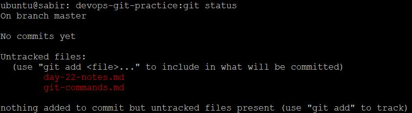
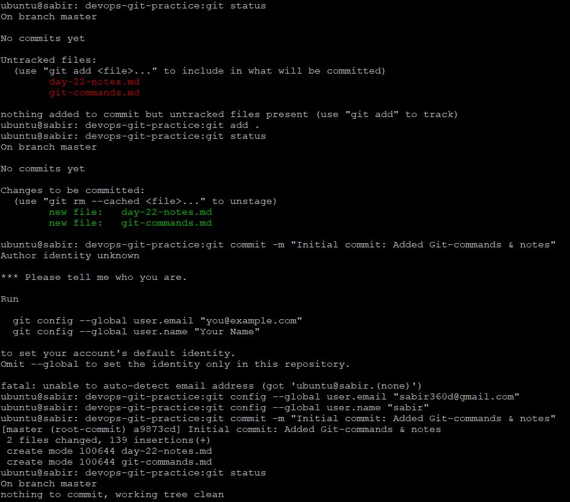
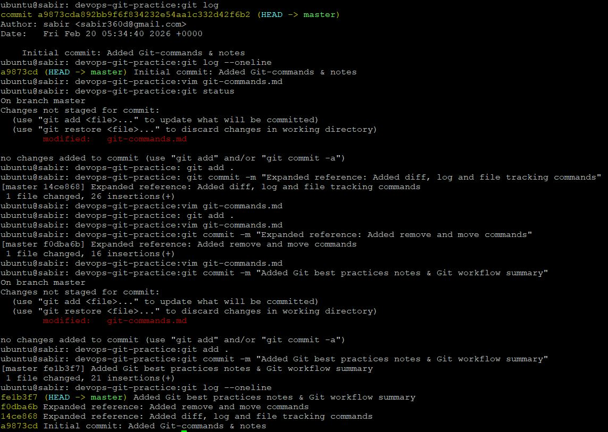

# Git Commands Reference
# Setup & Configuration

## Configure Git

## git --version
Shows installed Git version.
```bash
git --version
```

## git config --global user.name
Sets your global Git username.
```bash
git config --global user.name "Sabir"
```

## git config --global user.email
Sets your Git email address.
```bash
git config --global user.email "your@email.com"
```

## git config --list
Displays current Git configuration.
```bash
git config --list
```
---

## Create Your Git Project
## Repository Initialization


## git init
Initializes a new Git repository in the current directory.
```bash
git init
```

Creates a hidden `.git/` folder that stores repository metadata.

---

## Create Git Commands Reference



## git status
Shows the state of working directory and staging area.
```bash
git status
```

## git add <file>
Stages a file for the next commit.
```bash
git add git-commands.md
```



## git add .
Stages all modified files.
```bash
git add .
```

## git commit -m "message"
Creates a snapshot of staged changes.
```bash
git commit -m "Initial Git command reference"
```
---

# Viewing Changes

## git diff
Shows unstaged changes.
```bash
git diff
```

## git diff --staged
Shows staged changes before commit.
```bash
git diff --staged
```



## git log
Shows commit history.
```bash
git log
```

## git log --oneline
Compact commit history view.
```bash
git log --oneline
```

---

# File Tracking

## git rm <file>
Removes file from repository.
```bash
git rm oldfile.txt
```

## git mv <old> <new>
Renames or moves a file.
```bash
git mv old.txt new.txt
```

---

# Good Practice Notes

- Commit often, but meaningfully.
- One logical change per commit.
- Write descriptive commit messages.
- Always check `git status` before committing.

---

# Git Workflow Summary

Working Directory → Staging Area → Repository

1. Modify files
2. Stage changes (`git add`)
3. Commit snapshot (`git commit`)
4. View history (`git log`)

---

