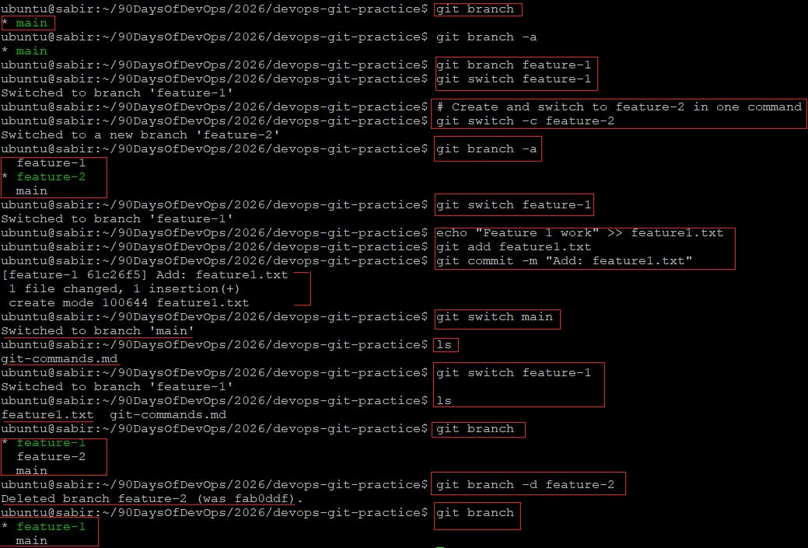
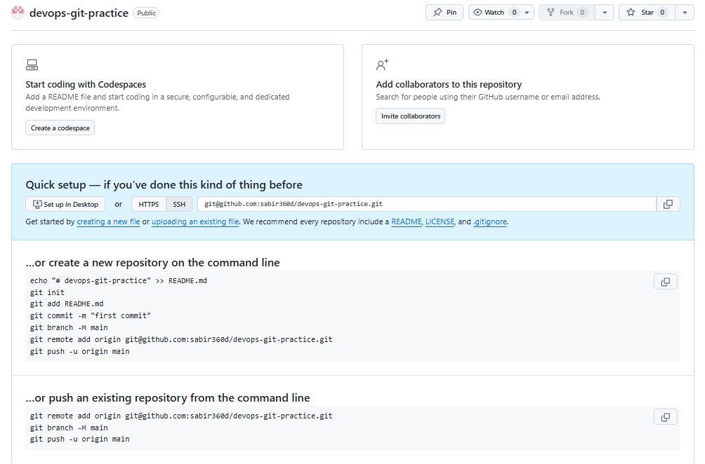
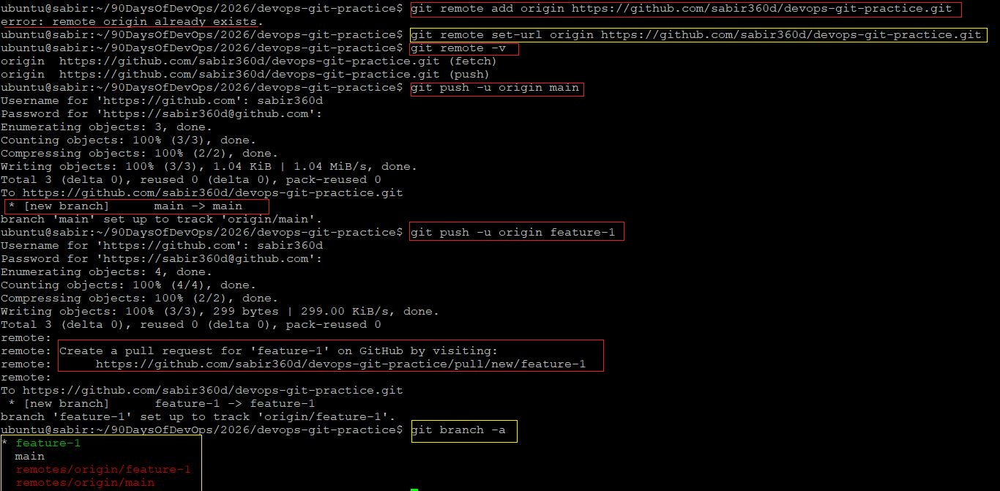
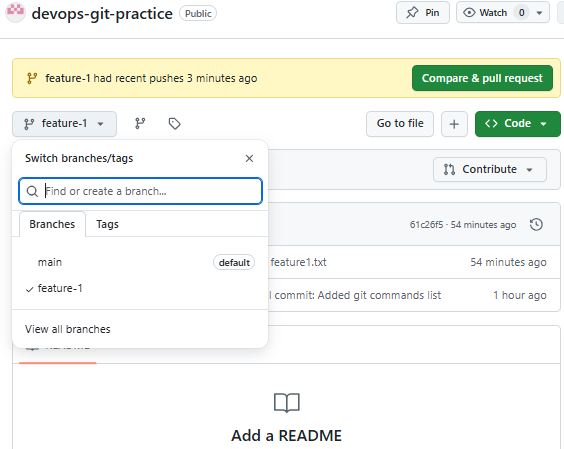
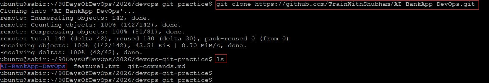
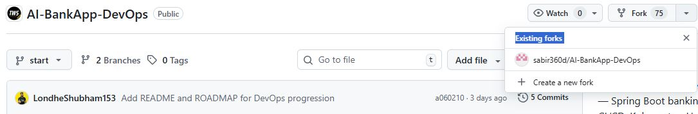

# Day 23 – Git Branching & Working with GitHub

## Task 1: Understanding Branches

### 1. What is a branch in Git?

A Branch is a parallel workspace. You can create a copy ofthe project to test any idea. If it fails you can delete the branch and the main project remains safe.

By default, Git starts with a branch called `main` (or historically `master`).

Each branch represents an independent line of development.

---

### 2. Why do we use branches instead of committing everything to main?

We use branches to:

- Develop new features without breaking stable code
- Fix bugs safely
- Experiment freely
- Work in parallel with other developers
- Keep production code clean and stable

If everything were committed directly to `main`, we risk:

- Breaking production
- Losing stable versions
- Creating messy commit history
- Causing merge conflicts in team environments

Branches provide isolation and control.

---

### 3. What is HEAD in Git?

A "You Are Here" sticker on the map. It is a pointer that refers to the current branch you are working on. It also point to the version you are currently looking at.

More specifically:
- HEAD points to the latest commit on the current branch.
- When you switch branches, HEAD moves to that branch.

You can see where HEAD is pointing using:

```bash
git status
```

### 4. What happens to your files when you switch branches?

When you switch branches:

Git updates your working directory to match the snapshot of the target branch.

Files that exist in one branch but not another will appear or disappear.

Commits unique to a branch will not appear in other branches unless merged.

Important:
Git prevents switching branches if you have uncommitted changes that would be overwritten.

---

## Task 2: Branching Commands -  Hands-On
### List all branches

```bash
git branch
```

To list all local and remote branches:

```bash
git branch -a
```

---

### Create a new branch called feature-1

```bash
git branch feature-1
```

---

### Switch to feature-1

```bash
git switch feature-1
```

Older alternative:

```bash
git checkout feature-1
```

---

### Create and switch to feature-2 in one command

Modern way:

```bash
git switch -c feature-2
```

Older way:

```bash
git checkout -b feature-2
```

---

### Difference between git switch and git checkout

**git checkout**
- Can switch branches  
- Can restore files  
- Does multiple things (can be confusing)  

**git switch**
- Only used for switching branches  
- Clearer and safer  
- Recommended modern approach  

---

### Make a commit on feature-1 that does not exist on main

```bash
git switch feature-1
echo "Feature 1 work" >> feature1.txt
git add feature1.txt
git commit -m "Add feature 1 file"
```

---

### Switch back to main and verify commit is not there

```bash
git switch main
ls
```

The file created in `feature-1` will not appear in `main` because it belongs only to that branch.

---

### Delete a branch you no longer need

Safe delete (if merged):

```bash
git branch -d feature-2
```

Force delete (if not merged):

```bash
git branch -D feature-2
```




---

## Task 3: Push to GitHub

### Create a new repository on GitHub

Create a new repository on GitHub without initializing it with a README.


---

### Connect local repository to GitHub



```bash
git remote add origin https://github.com/sabir360d/devops-git-practice.git
```

Verify:

```bash
git remote -v
```

---

### Push main branch

```bash
git push -u origin main
```

---

### Push feature-1 branch

```bash
git push -u origin feature-1
```
After pushing, both branches should be visible in the GitHub branch selector.


---

### What is the difference between origin and upstream?


**origin**
- Default name for the remote repository you push to  
- Usually your own repository  

**upstream**
- Refers to the original repository you forked from  
- Used to pull updates from the source project  

In fork workflows:
- origin = your fork  
- upstream = original repository  

---

## Task 4: Pull from GitHub

### Make a change directly on GitHub

Edit a file using the GitHub web editor and commit the change.


---

### Pull the change locally

```bash
git pull origin main
```


---

### What is the difference between git fetch and git pull?

**git fetch**
- Downloads changes from the remote repository  
- Does NOT merge automatically  
- Allows you to review changes before merging  

**git pull**
- Performs `git fetch` + `git merge`  
- Automatically merges changes into your current branch  

Best practice in collaborative environments:  
Use `git fetch` first, then merge manually.

---

## Task 5: Clone vs Fork

### Clone a public repository

```bash
git clone https://github.com/some-user/some-repo.git
```

This creates a local copy of the repository.



---

### Fork the same repository

Fork the repository on GitHub using the **Fork** button.



---

### What is the difference between clone and fork?

**Clone**
- Git operation  
- Creates a local copy of a repository  
- Does not create a new repository on GitHub  

**Fork**
- GitHub feature  
- Creates your own copy of someone else's repository on GitHub  
- Allows independent development and contributions  

Fork is a GitHub concept, not a Git concept.

---

### When would you clone vs fork?

Clone:
- When you have direct write access  
- When you just need a local copy  

Fork:
- When contributing to open-source projects  
- When you do not have write access to the original repository  

---

### After forking, how do you keep your fork in sync with the original repository?

Add upstream remote:

```bash
git remote add upstream https://github.com/original-owner/repo.git
```

Fetch updates:

```bash
git fetch upstream
```

Merge updates:

```bash
git merge upstream/main
```

Or rebase:

```bash
git rebase upstream/main
```

---

### What I learned:
- How Git branches isolate development  
- How HEAD works  
- The difference between switch and checkout  
- How to push branches to GitHub  
- The difference between origin and upstream  
- The difference between fetch and pull  
- The difference between clone and fork  
- How to keep a fork in sync with upstream  

Branching is the foundation of professional Git workflows.
