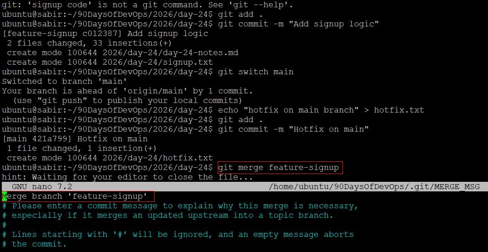
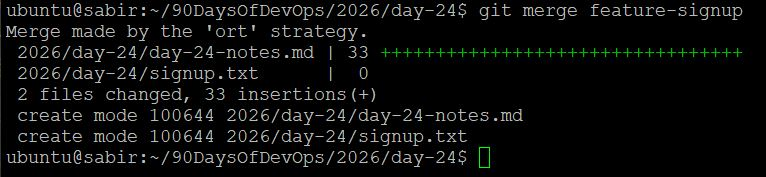
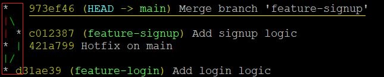
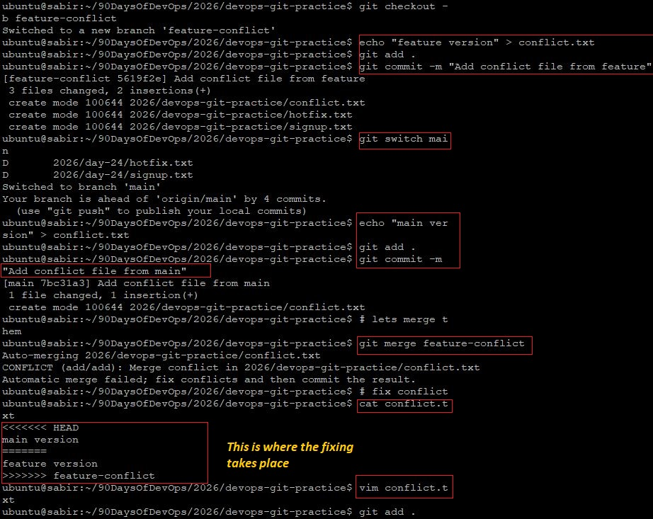
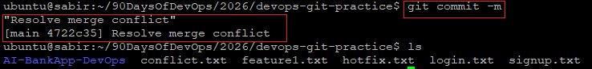
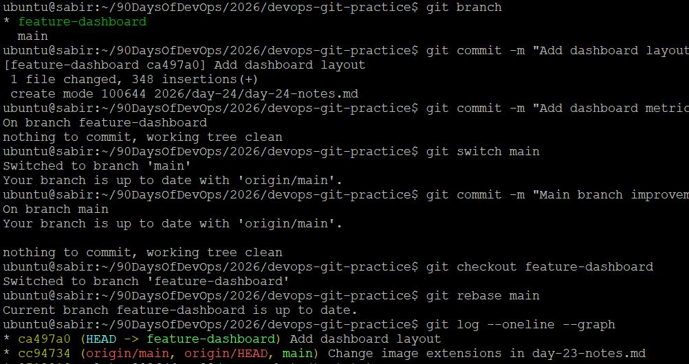
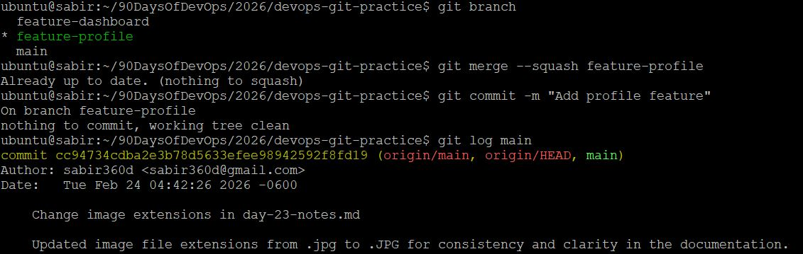
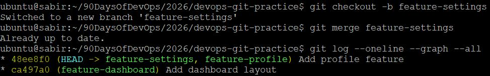

# Advanced Git: Merge, Rebase, Stash & Cherry Pick

## Challenge Tasks
## Task 1: Git Merge -  Hands-On

### 1: Create feature-login and Merge into main

```bash
git checkout main
git checkout -b feature-login

# Adding a file/commit
echo "login code" > login.txt

# make changes
git add .
git commit -m "Add login logic"
git switch main

# Merge
git merge feature-login
```
### Output:


- Git performed a fast-forward merge
- No merge commit was created
- main simply moved forward to match feature-login

### 2. Force a Merge Commit:

Create new branch feature-signup
From main:
```bash
git checkout -b feature-signup
# Add commits on feature-signup
echo "signup code" > signup.txt
git add .
git commit -m "Add signup logic"
```

```bash
git switch main
# Add a commit directly on main BEFORE merging
# this is where the branch divergence takes place
echo "hotfix on main branch" > hotfix.txt
git add .
git commit -m "Hotfix on main"
```

Now:
- main has a new commit
- feature-signup also has new commits
- Histories have diverged


# Merge feature-signup into main
```bash
git merge feature-signup
```
output:




- Git creates a merge commit
- History is no longer linear

# Checking the graph for confirmation
```bash
git log --oneline --graph --all
```


### 3. Create a Merge Conflict (Hands-On)
*** Creating a ne Branch ***
```bash
git checkout -b feature-conflict
```





---

### What is a Fast-Forward Merge?

A fast-forward merge happens when the target branch has not moved forward. Git simply moves the branch pointer ahead.

---

### When Does Git Create a Merge Commit?

When both branches have new commits and histories diverge.

---

### What is a Merge Conflict?

When the same file (or same lines in a file) are changed differently in two branches and Git cannot automatically decide which version to keep.

---

# Task 2: Git Rebase — Hands-On

## Steps

```bash
git checkout -b feature-dashboard
git commit -m "Add dashboard layout"
git commit -m "Add dashboard metrics"

git checkout main
git commit -m "Main branch improvement"

git checkout feature-dashboard
git rebase main

git reflog (This shows a list of recent HEAD changes)

```




---

## What Rebase Does

Rebase:
- Takes your feature commits
- Temporarily removes them
- Replays them on top of updated `main`

It rewrites commit history.

---

## Answers

### What does rebase actually do?

Rewrites commit base and reapplies commits on top of another branch.

### How is history different?
Rebase creates a linear history.
Merge preserves branch structure.

### Why should you NEVER rebase shared commits?
Because it rewrites commit hashes.
Other collaborators’ histories break.
Leads to forced pushes and chaos.

### When to use Rebase vs Merge?

Use **Rebase**:
- Before merging feature branch
- To keep history clean
- In solo development

Use **Merge**:
- In shared branches
- When you want preserved history
- In team environments

---

# Task 3: Squash Commit vs Merge Commit

## Squash Merge

```bash
git checkout -b feature-profile
# make small commits
git merge --squash feature-profile
git commit -m "Add profile feature"
```

### Result

All commits combined into ONE commit.

### `git log` on main:
Only 1 new commit added.



---

## Regular Merge

```bash
git checkout -b feature-settings
# multiple commits
git merge feature-settings
```

### Result

All individual commits preserved + merge commit.



---

## Answers

### What does squash merging do?
Combines multiple commits into a single commit before merging.

### When use squash?
- Cleanup messy feature history
- Before merging pull requests
- Keep main branch clean

### Trade-off?
You lose granular commit history.

---

# Task 4: Git Stash — Hands-On

## Scenario

Made changes without committing.

Attempted:
```bash
git checkout <branch-name>
```

Git blocked due to uncommitted changes.

---

## Stashing

```bash
git stash push -m "WIP dashboard styling"
```

Switch branches safely.

Return later:

```bash
git stash pop
```


---

## Multiple Stashes

```bash
git stash
git stash
git stash list
```

Example:
```
stash@{0}
stash@{1}
stash@{2}
```
Apply specific stash:
```bash
git stash apply stash@{1}
```

---

## Answers

### Difference between `pop` and `apply`?

- `pop` = apply + delete stash
- `apply` = apply only (stash remains)

### When use stash?
- Urgent context switch
- Mid-feature hotfix
- Experimental work

---

# Task 5: Cherry Picking

## Steps

```bash
git checkout -b feature-hotfix
git commit -m "Fix typo"
git commit -m "Critical security fix"
git commit -m "Refactor logging"

git checkout main
git cherry-pick <hash-of-second-commit>
```


---

## Observation
Only that one commit was added to `main`.

Verified with:

```bash
git log --oneline
```

---

## Answers

### What does cherry-pick do?

Applies a specific commit from another branch onto current branch.

---

### When use cherry-pick?

- Urgent hotfix from feature branch
- Backporting fixes to production
- Selective patch application

---

### What can go wrong?

- Duplicate commits
- Conflicts
- Messy history
- Hard-to-track changes

---

# Summary

- Merge preserves history.
- Rebase rewrites history.
- Squash cleans history.
- Stash protects unfinished work.
- Cherry-pick isolates surgical changes.

Advanced Git is not about commands.
It’s about controlling change with precision.

Strong engineers don’t just create branches.

They manage integration strategy intentionally.

---

                                                                                  
