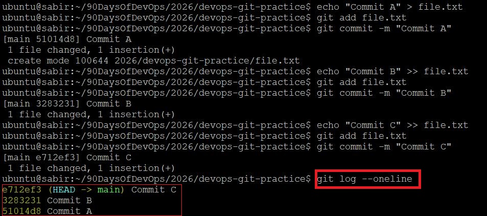
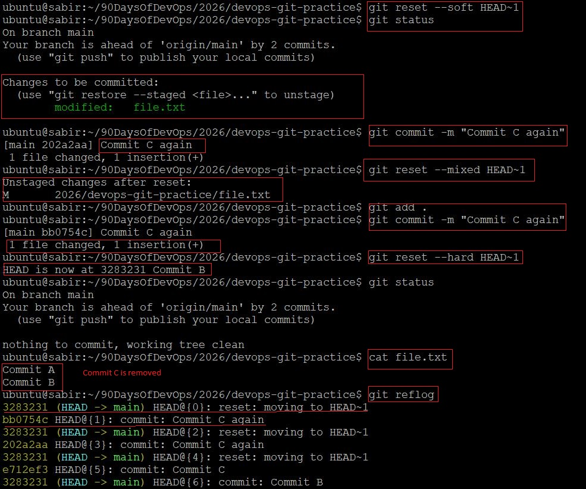
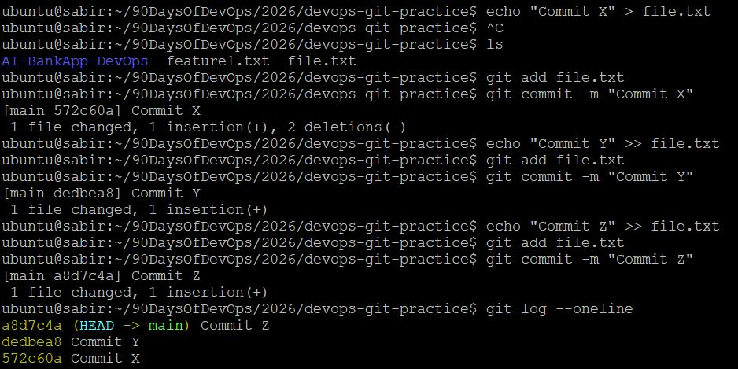
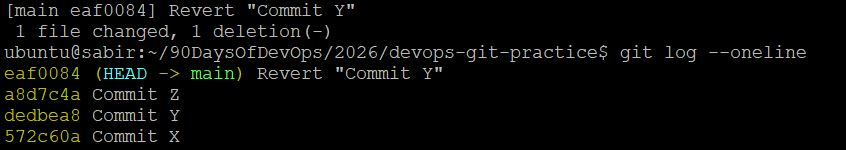

# Day 25 – Git Reset vs Revert & Branching Strategies

## Task 1: Git Reset — Hands-On



```bash
 git reset --soft HEAD~1
```
- Moves HEAD back to previous commit
- Changes from removed commit stay **staged**
- Nothing lost

```bash
git reset --mixed HEAD~1 # (default)
```
- Moves HEAD back
- Changes become **unstaged**
- Files remain modified in working directory

```bash
git reset --hard HEAD~1
```
- Moves HEAD back
- Removes commit
- Deletes changes from working directory




**Difference**
- `--soft` → keeps changes staged
- `--mixed` → keeps changes unstaged
- `--hard` → deletes changes completely

**Destructive?**
- `--hard` is destructive because it permanently removes working directory changes.

**When to use**
- `--soft` → fix last commit message or combine commits
- `--mixed` → redo commit cleanly
- `--hard` → discard unwanted work (local only)

**Use reset on pushed commits?**
- No. It rewrites history and breaks shared branches.

---

## Task 2: Git Revert — Hands-On



```bash
git revert <commit-Y>
```





- New commit created: “Revert Y”
- Commit Y still exists in history
- Changes from Y are undone safely

**Reset vs Revert**

- `reset` moves branch pointer
- `revert` creates a new commit that undoes changes

**Why revert is safer?**

- Does not rewrite history
- Safe for shared branches

**When to use**

- `reset` → local cleanup
- `revert` → undo pushed commits

---

## Task 3: Reset vs Revert Summary

|                              | git reset           | git revert              |
| ---------------------------- | ------------------- | ----------------------- |
| What it does                 | Moves HEAD backward | Creates new undo commit |
| Removes commit from history? | Yes                 | No                      |
| Safe for shared branches?    | No                  | Yes                     |
| When to use                  | Local cleanup       | Undo pushed commits     |

---

## Task 4: Branching Strategies

### 1. GitFlow

**How it works**

- `main` → production
- `develop` → integration
- `feature/*`
- `release/*`
- `hotfix/*`

**Used in**

- Enterprise teams
- Scheduled releases

**Pros**

- Structured
- Clear release cycles

**Cons**

- Complex
- Slower

---

### 2. GitHub Flow

**How it works**

- Single `main`
- Feature branches → Pull Request → Merge

**Used in**

- SaaS
- Continuous deployment

**Pros**

- Simple
- Fast shipping

**Cons**

- No strict release structure

---

### 3. Trunk-Based Development

**How it works**

- Everyone commits to `main`
- Very short-lived branches

**Flow**

```
small branch → main (daily)
```

**Used in**

- High-scale engineering teams
- CI/CD heavy orgs

**Pros**

- Fast integration
- Fewer merge conflicts

**Cons**

- Requires strong testing culture

---

**Startup shipping fast?**

- GitHub Flow or Trunk-Based Development

**Large team with scheduled releases?**

- GitFlow

**Example**

- Kubernetes → release branches + main (hybrid model)
- Linux Kernel → integration branches then merge to mainline
- React → main + release branches

---

## Task 5: git-commands.md Update (Days 22–25)

Update `git-commands.md` to cover everything from Days 22–25

