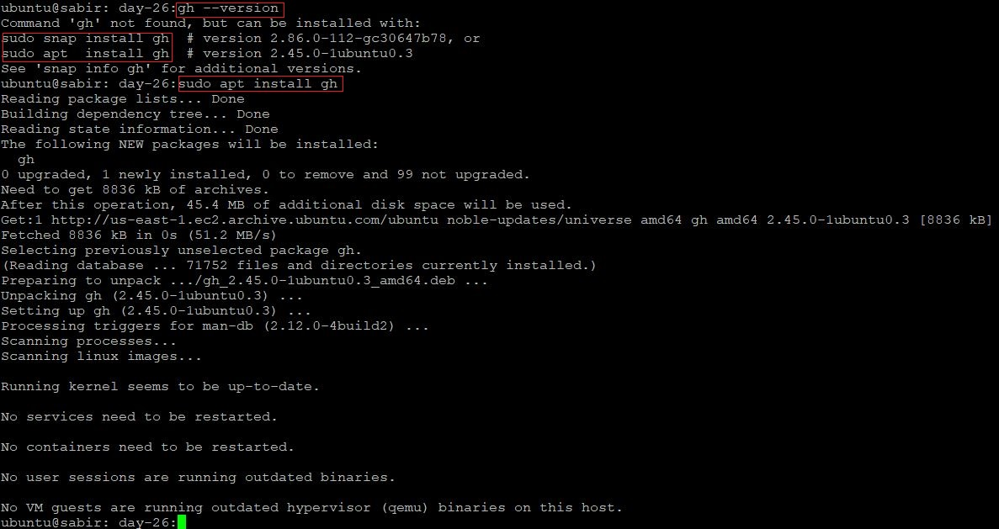
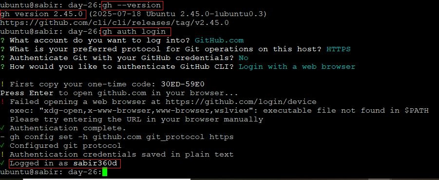
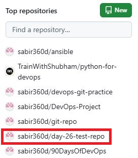
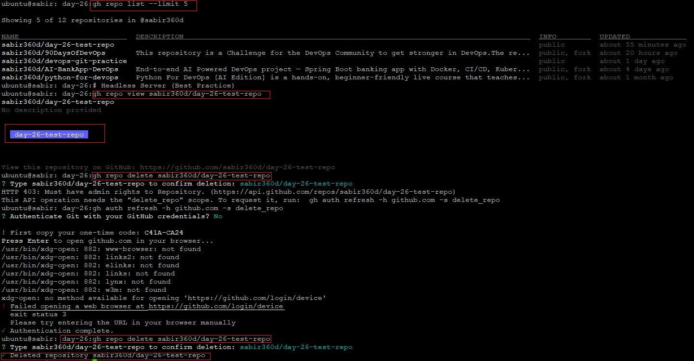
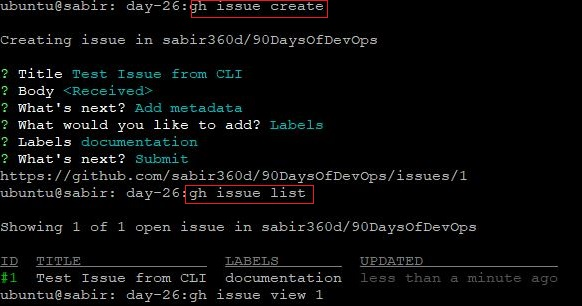
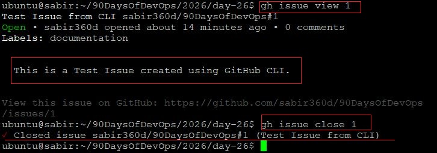
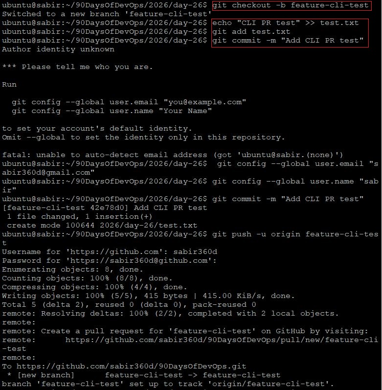
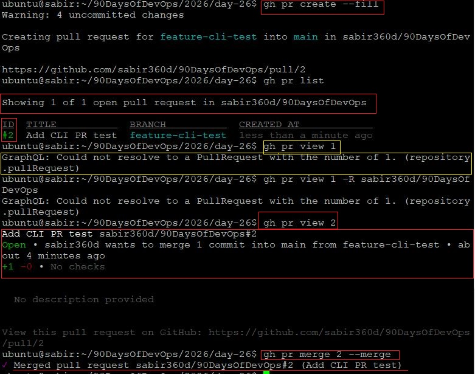
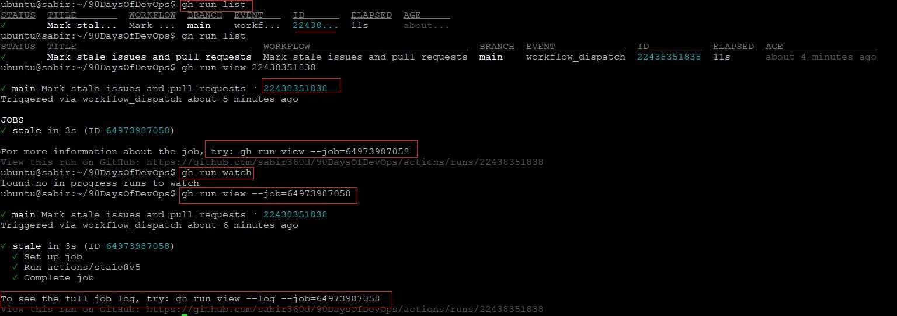

# Day 26 – GitHub CLI (`gh`): Manage GitHub from Your Terminal

GitHub is not a website.

For engineers, it’s an API-driven platform.
And the **GitHub CLI (`gh`)** turns that platform into something you can fully control from your terminal.

As a DevOps engineer, staying in context matters. Switching between terminal and browser is friction. `gh` removes that friction.

---

# Task 1: Install and Authenticate

## Installation

```bash
sudo apt update -y
sudo apt install gh -y
```

Verify:

```bash
gh --version
```



---

## Authentication

```bash
gh auth login
```

Flow:

- Choose GitHub.com
- HTTPS
- Login via browser
- Authorize CLI

Verify login:

```bash
gh auth status
```



---

## What authentication methods does `gh` support?

`gh` supports:

- Browser-based OAuth login (recommended)
- Personal Access Token (PAT)
- SSH authentication
- GitHub Enterprise authentication
- Environment variable (`GH_TOKEN`) for CI/CD pipelines

**DevOps Insight:**
For automation, use `GH_TOKEN` stored securely in CI secrets.

---

# Task 2: Working with Repositories

## Create a new public repo with README




```bash
gh repo create day-26-test-repo \
  --public \
  --clone \
  --add-readme
```
---

## Clone a repo using `gh`

```bash
gh repo clone sabir360d/90DaysOfDevOps
```

---

## View repo details

```bash
gh repo view <owner/repo>
```

Or specify:

```bash
gh repo view sabir360d/90DaysOfDevOps
```

---

## List all your repositories




```bash
gh repo list
```

Limit results:

```bash
gh repo list --limit 50
```

---

## Open repo in browser

```bash
gh repo view --web
```

if webpage is unable to open b/c of no wsl then use the Headles Server

```bash
gh repo view sabir360d/day-26-test-repo
```
---

## Delete a repo (Danger Zone)

```bash
gh repo delete day-26-test-repo --confirm
```

**Lesson:**
Infrastructure engineers must be intentional. CLI power requires discipline.

---

# Task 3: Issues



## Create an issue

```bash
gh issue create \
  --title "Test Issue from CLI" \
  --body "This is a Test Issue created using GitHub CLI." \
  --label "documentation"
```

---

## List open issues

```bash
gh issue list
```

---

## View specific issue



```bash
gh issue view 1
```
If the below issue arises:

```bash
 gh issue view 1
GraphQL: Projects (classic) is being deprecated in favor of the new Pr       ojects experience, see: https://github.blog/changelog/2024-05-23-sunse       t-notice-projects-classic/. (repository.issue.projectCards)
```
then use the below troubleshooting method. The official GitHub CLI installation guide requires adding the repository specifically using the stable label to avoid the "Release file not found" error:

```bash
(type -p wget >/dev/null || (sudo apt update && sudo apt-get install wget -y)) \
&& sudo mkdir -p -m 755 /etc/apt/keyrings \
&& wget -qO- https://cli.github.com/packages/githubcli-archive-keyring.gpg | sudo tee /etc/apt/keyrings/githubcli-archive-keyring.gpg > /dev/null \
&& sudo chmod go+r /etc/apt/keyrings/githubcli-archive-keyring.gpg \
&& echo "deb [arch=$(dpkg --print-architecture) signed-by=/etc/apt/keyrings/githubcli-archive-keyring.gpg] https://cli.github.com/packages stable main" | sudo tee /etc/apt/sources.list.d/github-cli.list > /dev/null \
&& sudo apt update \
&& sudo apt install gh -y
```

---

## Close an issue

```bash
gh issue close 1
```

---

## How could `gh issue` be used in automation?

- Auto-create issues from monitoring alerts
- Open incident tickets from failed deployments
- Close issues automatically after PR merge
- Generate issues from security scan outputs
- Integrate with cron jobs or alert pipelines

Example automation:

```bash
if ! curl -f http://my-service/health; then
  gh issue create --title "Service Down" --body "Health check failed."
fi
```

**DevOps Perspective:**
Everything becomes scriptable.

---

# Task 4: Pull Requests



## Create branch and push

```bash
git checkout -b feature-cli-test
echo "CLI PR test" >> test.txt
git add test.txt
git commit -m "Add CLI PR test"
git push -u origin feature-cli-test
```

---

## Create Pull Request from terminal




```bash
gh pr create --fill
```

Or manually:

```bash
gh pr create \
  --title "Add CLI test file" \
  --body "This PR was created entirely from terminal."
```

---

## List open PRs

```bash
gh pr list
```

---

## View PR details

```bash
gh pr view 2         # 1 or 2 is the ID number
```

View in browser:

```bash
gh pr view 2 --web
```

---

## Merge PR from terminal

```bash
gh pr merge 2 --merge
```

---

## What merge methods does `gh pr merge` support?

- `--merge` → standard merge commit
- `--squash` → squash commits into one
- `--rebase` → rebase and merge
- `--auto` → enable auto-merge when checks pass

---

## How would you review someone else's PR using `gh`?

```bash
gh pr checkout 12
gh pr diff 12
gh pr review 12 --approve
gh pr review 12 --comment -b "Looks good overall, consider refactoring."
gh pr review 12 --request-changes -b "Tests are failing."
```

**Power Move:**
Code reviews without touching the browser.

---

# Task 5: GitHub Actions & Workflows (Preview)



## List workflow runs

```bash
gh run list
```

## View specific workflow run

```bash
gh run view 22438351838
```

Watch logs:

```bash
gh run watch
```

---

## How could `gh run` and `gh workflow` be useful in CI/CD?

### 1. Monitoring Pipeline Execution (`gh run`)
- View workflow runs directly from the terminal.
- Check status (success, failure, in progress).
- Watch live execution of jobs.
- View detailed logs for debugging failed builds.

➡ This helps teams quickly detect and fix CI/CD failures without opening the browser.

## 2. Managing Workflows (`gh workflow`)
- List available workflows.
- Manually trigger workflows using `workflow_dispatch`.
- Automate workflow triggers from scripts.

➡ This enables controlled deployments, testing runs, and re-running pipelines when needed.

## 3. Faster Debugging & Automation
- Developers can inspect job logs instantly.
- Can integrate `gh` commands into shell scripts.
- Useful for remote servers and automated environments.

## 4. Improves Developer Productivity
- Reduces context switching (no need for web UI).
- Speeds up deployment monitoring.
- Allows automation as part of larger DevOps scripts.

# Conclusion
`gh run` helps monitor and debug pipeline runs.
`gh workflow` helps manage and trigger automation.

Together, they improve visibility, control, and efficiency in CI/CD processes.

---

# Final Observations

1. `gh` transforms GitHub from a website into an automation platform.
2. Everything is scriptable.
3. JSON output makes it CI/CD-friendly.
4. Reviewing and merging from CLI keeps engineers in flow.
5. This is foundational for large-scale DevOps automation.

