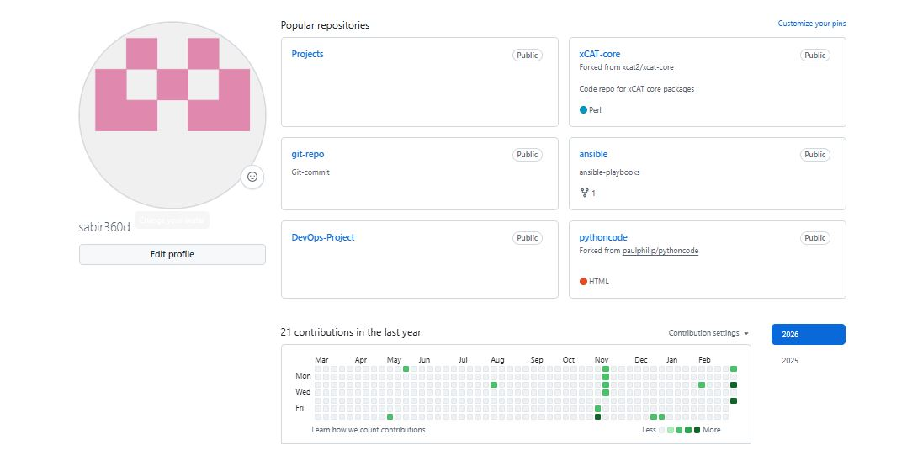
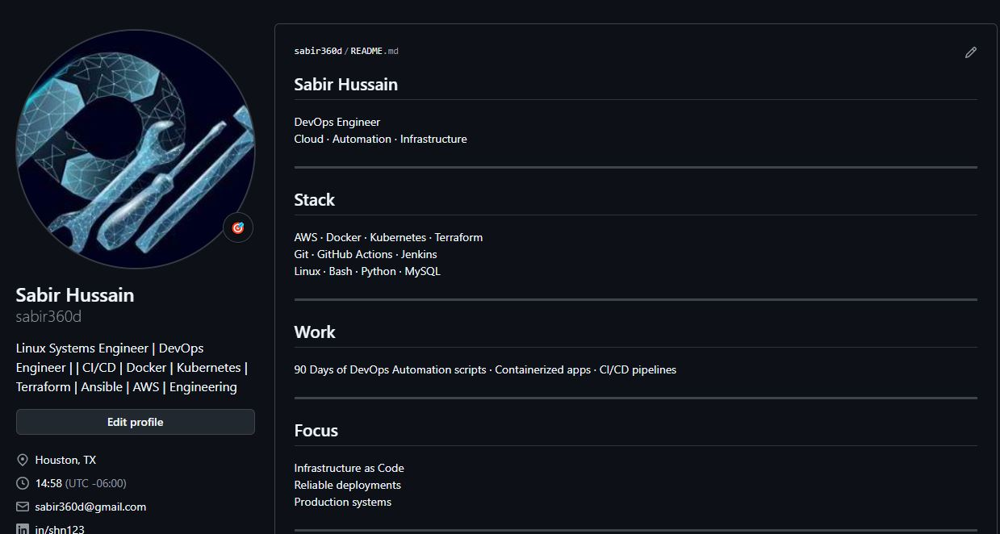

# Day 27 – GitHub Profile Makeover

Today was about positioning, not coding.

## Before

- Bio lacked clarity
- Random pinned repos
- Inconsistent naming
- Some repos missing descriptions
- No strong DevOps narrative

## After

### Created Profile README
- Clear DevOps focus  
- Highlighted 90 Days of DevOps  
- Listed core tools: Linux, Git, Bash, Python, Docker  

### Organized Repositories
- `90-days-of-devops` – structured by day  
- `shell-scripts` – centralized automation work  
- `python-scripts` – structured projects  
- `devops-notes` – cheat sheets & references  

### Cleaned Up
- Renamed unclear repos  
- Archived irrelevant ones  
- Checked for exposed secrets  
- Standardized naming (kebab-case)  

## 3 Improvements
1. Clear technical identity  
2. Structured portfolio  
3. Professional branding  

Your GitHub is not storage.  
It’s a signal.
