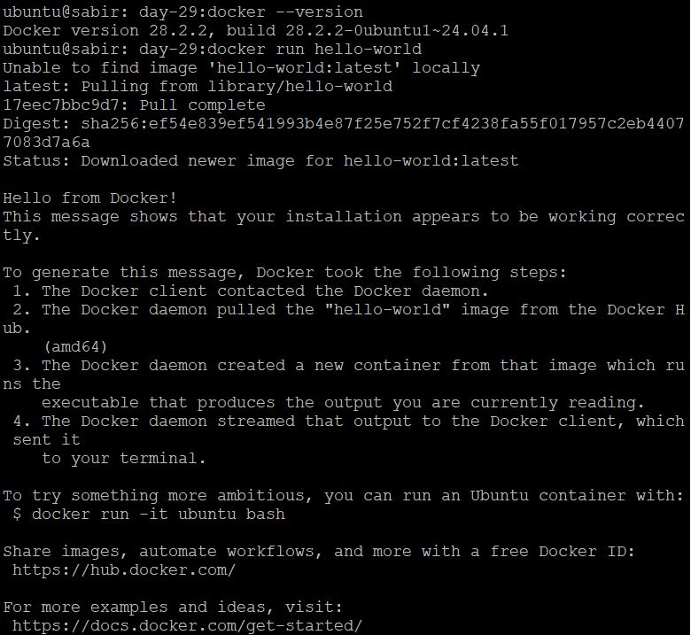
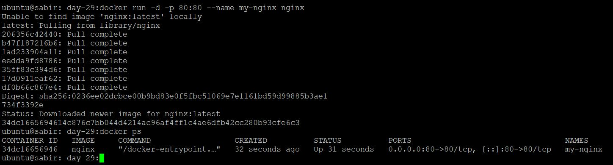
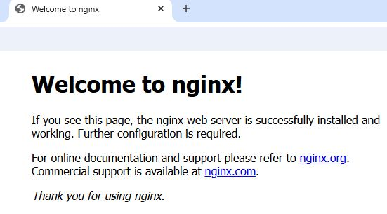
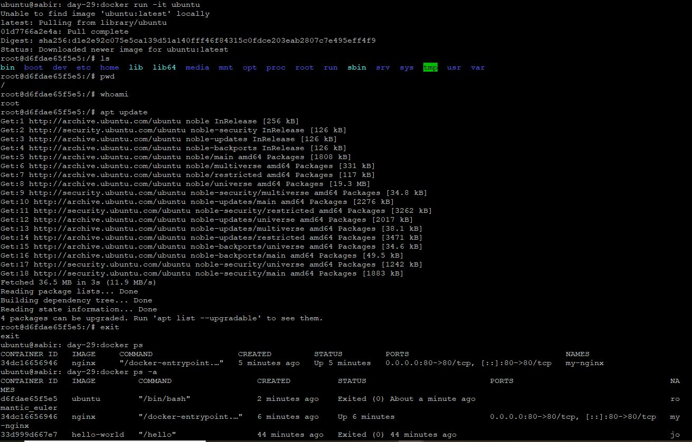
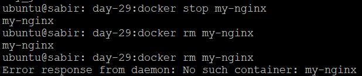
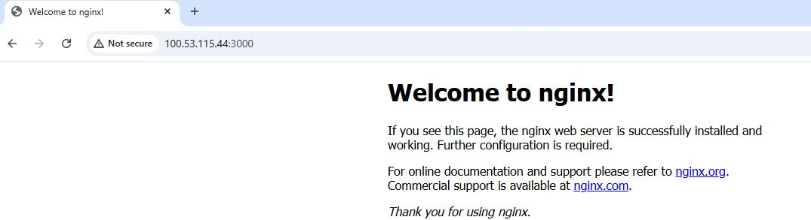
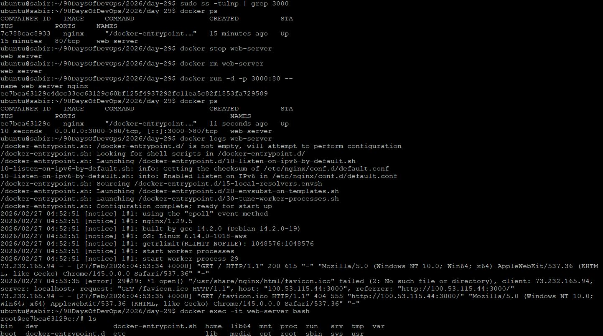

# Day 29 – Introduction to Docker  
## Objective
Understand what Docker is and run your first container.

---

## Task 1: What is Docker?

Docker is an open-source containerization platform that allows you to package an application and all its dependencies into a standardized unit called a **container**.

A Docker container includes:

- Application code  
- Runtime (Node, Python, Java, etc.)  
- System libraries  
- Dependencies  
- Configuration  

It ensures:
- The application runs the same way in development, testing, and production.

---

### What is a Container?

A **container** is a lightweight, isolated process that runs on top of the host operating system while sharing its kernel.

It behaves like a mini-environment but does not require a full OS.

### Why Do We Need Containers?

Before containers:

- Applications failed due to environment mismatches  
- “Works on my machine” was common  
- Virtual Machines were heavy and slow  
- Infrastructure was harder to scale  

Containers solve this by being:

- Lightweight  
- Fast to start (seconds)  
- Resource efficient  
- Portable  
- Easy to replicate  

---

### Containers vs Virtual Machines

| Feature | Containers | Virtual Machines |
|----------|------------|-----------------|
| Virtualization Type | OS-level | Hardware-level |
| OS Included | No (shared kernel) | Yes (full OS per VM) |
| Size | MBs | GBs |
| Startup Time | Seconds | Minutes |
| Resource Usage | Low | High |
| Isolation | Process-level | Full machine-level |

### Simple Explanation

- **VM = Full computer inside your computer**  
- **Container = Isolated application inside your OS**

Virtual Machines emulate hardware.  
Containers isolate applications using the same OS kernel.

---

### Docker Architecture

Docker uses a **client-server architecture**.

### Core Components

### Docker Client
The command-line interface where we run commands:

```bash
docker run nginx
```

### Docker Daemon
The background service that:

- Builds images  
- Creates containers  
- Manages networks  
- Manages storage  

### Docker Images
Read-only templates used to create containers.

### Docker Containers
Running instances of images.

### Docker Registry
Stores Docker images (e.g., Docker Hub).

---

### How It Works (Flow)

1. I run `docker run nginx`
2. Docker Client sends request to Docker Daemon
3. Daemon checks local images
4. If not found → pulls from registry
5. Creates container from image
6. Starts container

Architecture Flow:

Client → Daemon → Image → Container → Registry

---

## Task 2: Install Docker
### Install Docker Using docker.io (Ubuntu)

```bash
sudo apt update -y
sudo apt install -y docker.io
sudo systemctl --now enable docker
sudo systemctl status docker

```

### Verify Installation

```bash
docker --version
docker info
```

### Run Docker Without `sudo`

```bash
sudo usermod -aG docker $USER
newgrp docker
```

---

### Run Hello World

```bash
docker run hello-world
```




### What Happened?

- Docker pulled the image from Docker Hub  
- Created a container  
- Executed it  
- Printed confirmation message  
- Stopped the container  

This confirms:

-  Docker Engine is installed  
-  Daemon is running  
-  Registry connectivity works  
-  Container lifecycle works  

---

## Task 3: Running Real Containers

### Run Nginx Container

```bash
docker run -d -p 80:80 --name my-nginx nginx
```

Flags:

- `-d` → Detached mode (runs in background)  
- `-p 80:80` → Map host port 80 to container port 80  
- `--name` → Custom container name  




Access in browser:

```
http://<your-ec2-public-ip>:80
```

You should see the Nginx welcome page.



---

### Run Ubuntu in Interactive Mode

```bash
docker run -it ubuntu bash
```

Flags:

- `-it` → Interactive terminal  
- `bash` → Start shell inside container  

Inside container:

```bash
ls
whoami
apt update
```

It behaves like a mini Linux machine.

To exit:

```bash
exit
```

---

## Container Management

### List Running Containers

```bash
docker ps
```

### List All Containers (Including Stopped)

```bash
docker ps -a
```




### Stop a Container

```bash
docker stop my-nginx
```

## Remove a Container

```bash
docker rm my-nginx
```




---

## Task 4: Advanced Exploration
### Detached Mode

```bash
docker run -d nginx
```

Container runs in background.
Terminal is free for other commands.

---
### Custom Container Name

```bash
sudo docker run -d --name web-server nginx
```

### Port Mapping

```bash
docker run -d -p 3000:80 nginx
```

Access:

```
http://<your-ec2-public-ip>:3000
```
(Ensure port 3000 is open in Security Group)



---

### View Logs of a Container

```bash
docker logs  web-server
```



---

###  Execute Command Inside Running Container

```bash
docker exec -it my-nginx bash
```

Allows running commands inside an active container.

---

### Some Useful Commands

Removes all stopped containers.

```bash
docker container prune
```

Remove image:

```bash
sudo docker rmi nginx
```

Check Docker service status:

```bash
sudo systemctl status docker
```
---

## Key Concepts Learned

- EC2 itself is a VM
- Docker runs containers inside your EC2 VM.
- Images are blueprints.
- Containers are running instances.
- Port mapping exposes container apps to the internet.
- Security Groups must allow inbound traffic.

---

