# Day 30 – Docker Images & Container Lifecycle

## Objective
Understand how **Docker images** and **containers** work internally, how image layers function, and how to manage the complete container lifecycle.

---

## Task 1 – Docker Images

## Pull Required Images

```bash
docker pull nginx
docker pull ubuntu
docker pull alpine
```

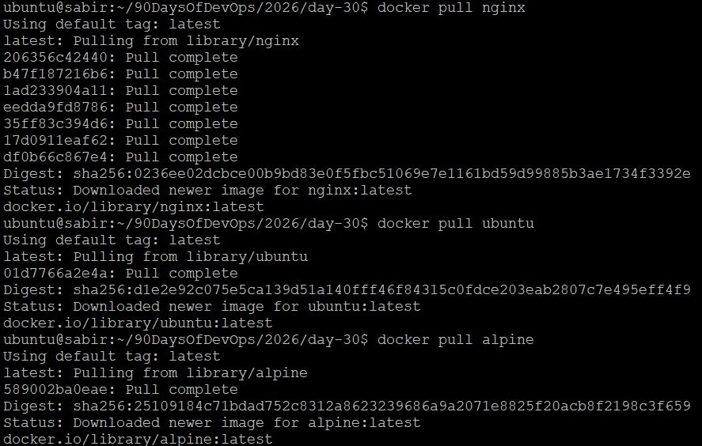

---

## 2️⃣ List Images & Compare Sizes

```bash
docker images
```
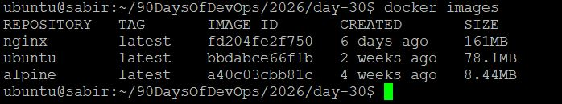

### Ubuntu vs Alpine

- **Ubuntu** includes full GNU utilities and package ecosystem.
- **Alpine** uses **musl libc** instead of glibc.
- Alpine is built for minimal containers.
- Fewer default packages = smaller attack surface.

**Conclusion:** Alpine is ideal for lightweight production containers.

---

## Inspect an Image

```bash
docker inspect nginx
```
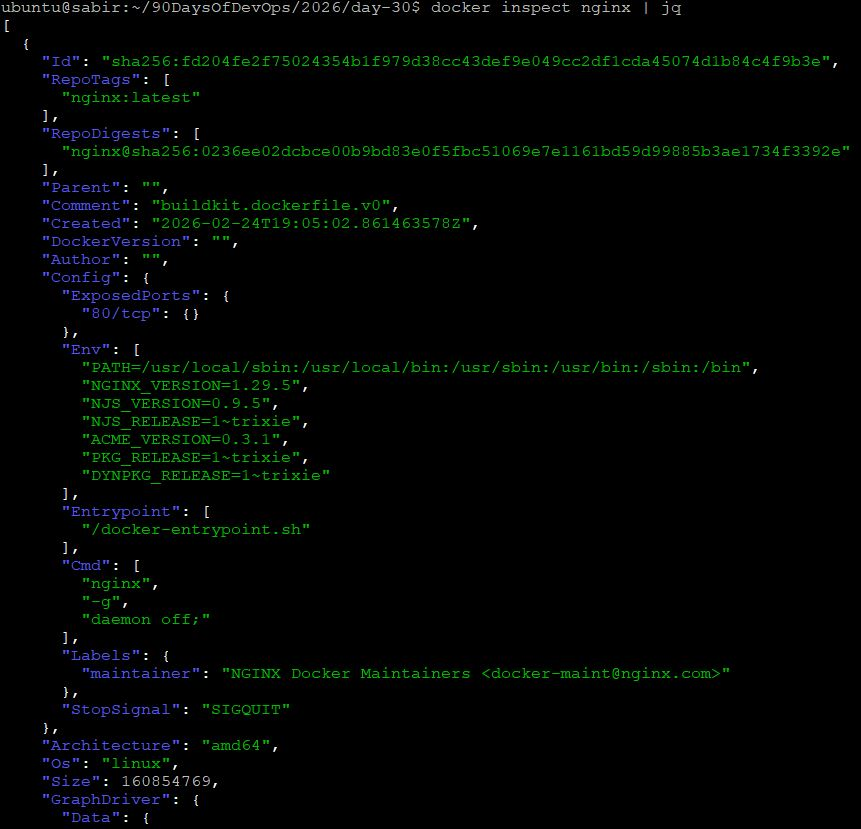

### Key Information Visible:
- Image ID
- Created timestamp
- OS/Architecture
- Environment variables
- Default command (CMD)
- Layer digests

---

### Remove an Image

```bash
docker rmi ubuntu
```
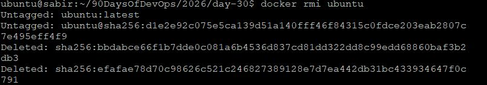

If in use:

```bash
docker rmi -f ubuntu
```

---

## Task 2 – Image Layers

## View Image History

```bash
docker image history nginx
```

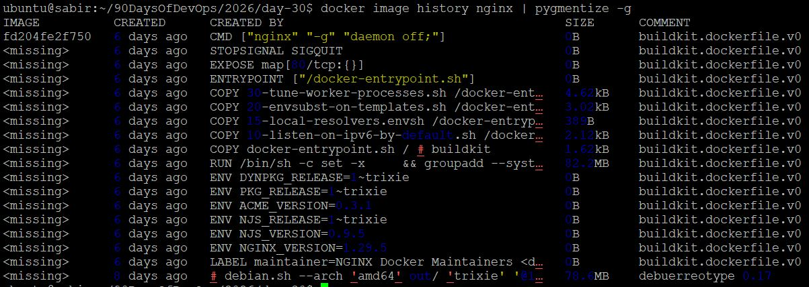

### What You See:
- Each row = one **image layer**
- Each Dockerfile instruction creates a layer
- Some layers show **0B**

### Why 0B Layers?
- Metadata-only changes (e.g., CMD, ENV)
- No filesystem modification

---

## What Are Layers?

Docker images are built in **read-only layers**.

When a container runs:
- Docker adds a **writable container layer** on top.
- Changes exist only in that container layer.

### Why Docker Uses Layers:
- Efficient storage
- Faster builds via caching
- Shared layers between images
- Reduced disk usage

Example:
If 5 containers use `nginx`, base layers are shared.

---

## Task 3 – Full Container Lifecycle

### Create (Without Starting)

```bash
docker create --name test-container nginx
```

Check state:

```bash
docker ps -a
```

State: `Created`

---

## Start

```bash
docker start test-container
```

State: `Up`

---

## Pause

```bash
docker pause test-container
```

State: `Paused`

---

## Unpause

```bash
docker unpause test-container
```

State: `Up`

---

## Stop

```bash
docker stop test-container
```

State: `Exited`

---

## Restart

```bash
docker restart test-container
```

State: `Up`

---

## Kill (Force Stop)

```bash
docker kill test-container
```

State: `Exited`

---

## Remove

```bash
docker rm test-container
```

Container deleted.

---

## Container Lifecycle Summary

```
Created → Running → Paused → Running → Stopped → Removed
```

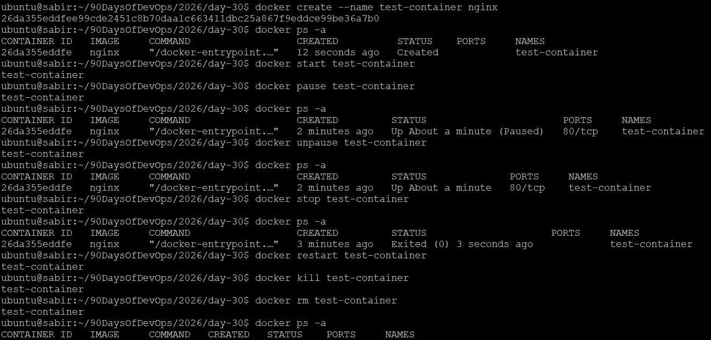

---

# Task 4 – Working with Running Containers

## Run Nginx in Detached Mode

```bash
docker run -d -p 8080:80 --name nginx-live nginx
```

Verify:

```bash
docker ps -a
```

Visit:
```
http://localhost:8080

http://<ec2 publib ip>:8080 # allow port 8080 in security group
```

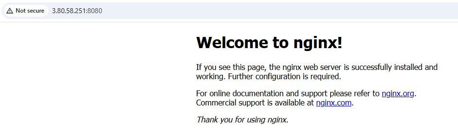

---

## View Logs

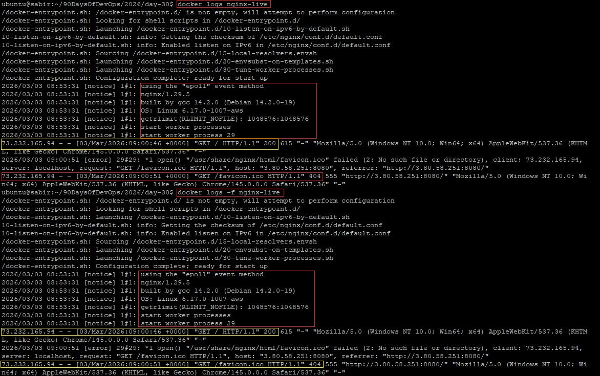

```bash
docker logs nginx-live
```

---

## Real-Time Logs

```bash
docker logs -f nginx-live
```

---

## Exec Into Container

```bash
docker exec -it nginx-live /bin/bash
```

If using Alpine-based container:

```bash
/bin/sh
```

Explore:

```bash
ls /
cd /usr/share/nginx/html
```

---

## Run Single Command Without Entering

```bash
docker exec nginx-live ls /etc/nginx
```

---

## Inspect Container

```bash
docker inspect nginx-live
```

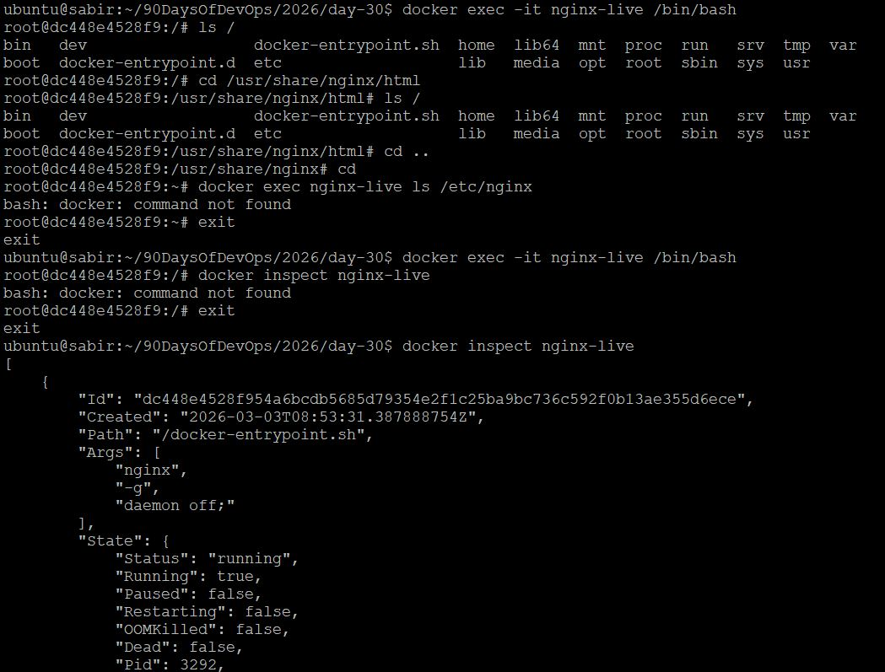

### Find:

- **IP Address**
- **Port Bindings**
- **Mounts**
- **Network Mode**

Example extraction:

```bash
docker inspect -f '{{range.NetworkSettings.Networks}}{{.IPAddress}}{{end}}' nginx-live # ip address

docker port nginx-live  # port mapping

docker inspect -f '{{json .Mounts}}' nginx-live # mounts
```

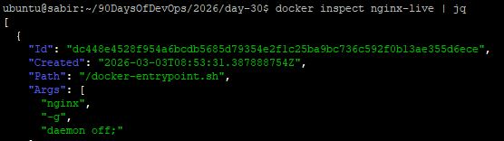


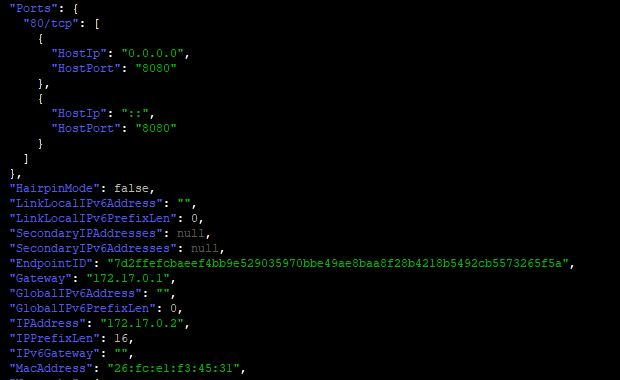

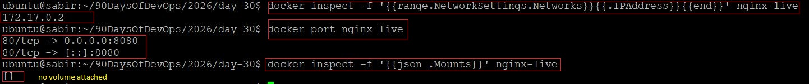


---

# Task 5 – Cleanup

## Stop All Running Containers

```bash
docker stop $(docker ps -q)
```

---

## Remove All Stopped Containers

```bash
docker rm $(docker ps -aq)
```

---

## Remove Unused Images

```bash
docker image prune -a
```

---

## Check Docker Disk Usage

```bash
docker system df
```

Full cleanup:

```bash
docker system prune -a
```

#### Removes unused:
- Containers
- Images
- Networks
- Build cache

---

# Key Takeaways

- Images are **blueprints**
- Containers are **runtime instances**
- Images are built from **layers**
- Layers improve **performance & storage efficiency**
- Containers follow a predictable lifecycle
- Proper cleanup prevents disk bloat

---

