# Day 31 – Dockerfile: Build Your Own Images

## Objective

Today's focus will be how to **write Dockerfiles and build custom images**.

Running containers is useful, but writing Dockerfiles is what enables engineers to **package applications, dependencies, and runtime environments into portable images**.

---

# Task 1 – My First Dockerfile

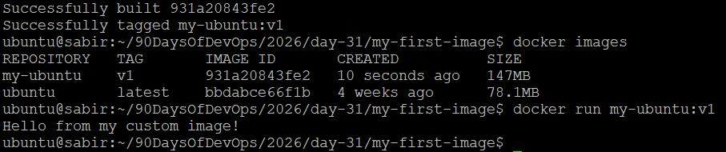


## Folder Structure

```
my-first-image/
 └── Dockerfile
```

## Dockerfile

```dockerfile
FROM ubuntu:latest

RUN apt update && apt install -y curl

CMD ["echo", "Hello from my custom image!"]
```

## Build the Image

```bash
docker build -t my-ubuntu:v1 .
```

## Run the Container

```bash
docker run my-ubuntu:v1
```

## Verification

Output:

```
Hello from my custom image!
```

### What Happened?

| Instruction | Purpose |
|-------------|----------|
| FROM ubuntu | Base image |
| RUN | Executes commands during build |
| CMD | Default command when container runs |

---

# Task 2 – Dockerfile Instructions Deep Dive

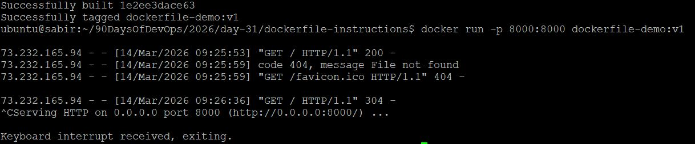


## Folder Structure

```
dockerfile-instructions/
 ├── Dockerfile
 └── index.html
```

## index.html

```html
<h1>Hello, from my Docker container!</h1>
<p>Dockerfile instructions demo.</p>
```

## Dockerfile

```dockerfile
# Base image
FROM python:3.11-slim

# Run commands during build
RUN apt-get update && apt-get install -y curl

# Set working directory
WORKDIR /app

# Copy files from host to container
COPY . /app

# Document the port used by the container
EXPOSE 8000

# Default command when container starts
CMD ["python", "-m", "http.server", "8000"]
```

## Build the Image

```bash
docker build -t dockerfile-demo:v1 .
```

## Run the Container

```bash
docker run -p 8000:8000 dockerfile-demo:v1
```

## Access

```
http://localhost:8000
```
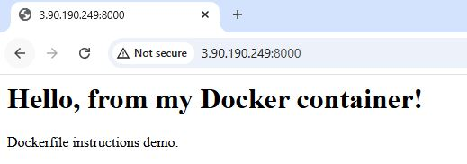

### Instruction Breakdown

| Instruction | Purpose |
|-------------|--------|
| FROM | Defines base image |
| RUN | Executes commands during build |
| WORKDIR | Sets working directory |
| COPY | Copies files from host into image |
| EXPOSE | Documents the container port |
| CMD | Defines default container command |

---

# Task 3 – CMD vs ENTRYPOINT

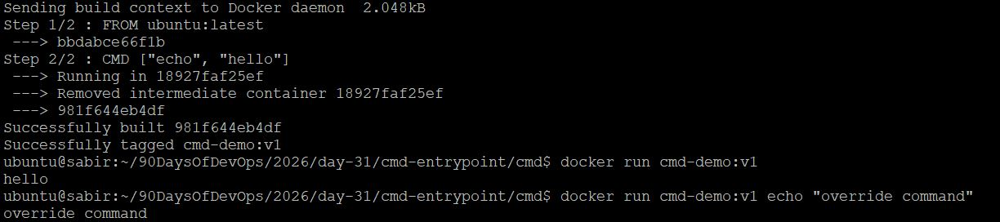

## Folder Structure

```
cmd-entrypoint/
 ├── cmd/
 │   └── Dockerfile
 └── entrypoint/
     └── Dockerfile
```

---

## CMD Example


### Dockerfile

```dockerfile
FROM ubuntu:latest
CMD ["echo", "hello"]
```

### Build

```bash
docker build -t cmd-demo:v1 .
```

### Run

```bash
docker run cmd-demo:v1
```

Output:

```
hello
```

### Override CMD

```bash
docker run cmd-demo:v1 echo "override command"
```

**Result:**  
`override command` replaces the default CMD instruction.

---

## ENTRYPOINT Example

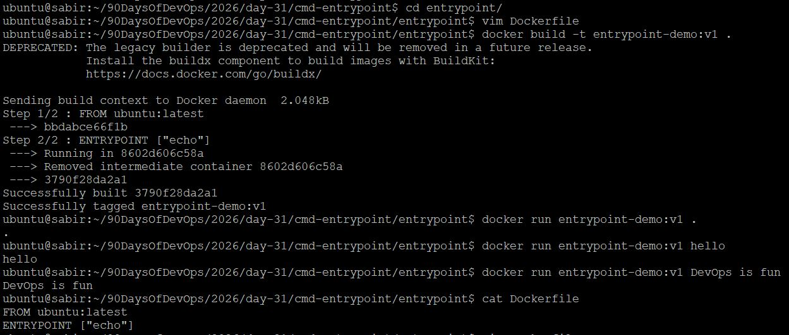

### Dockerfile

```dockerfile
FROM ubuntu:latest
ENTRYPOINT ["echo"]
```

### Build

```bash
docker build -t entrypoint-demo:v1 .
```

### Run

```bash
docker run entrypoint-demo:v1 hello
```

Output:

```
hello
```

### Add Arguments

```bash
docker run entrypoint-test DevOps is fun
```

Output:

```
DevOps is fun
```

---

## CMD vs ENTRYPOINT

| Feature | CMD | ENTRYPOINT |
|------|------|------|
| Overridable | Yes | No |
| Intended Use | Default command | Fixed executable |
| Arguments | Replaced | Appended |

### When to Use

- **CMD:** When you want a default command that users can override.
- **ENTRYPOINT:** When the container should always run a specific executable.

---

# Task 4 – Build a Simple Web App Image

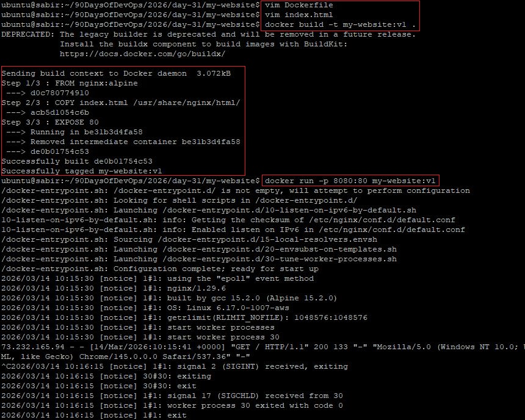

## Folder Structure

```
my-website/
 ├── Dockerfile
 └── index.html
```

## index.html

```html
<!DOCTYPE html>
<html>
<head>
  <title>My Website</title>
</head>
<body>
  <h1>Hello from my Dockerized Website</h1>
</body>
</html>
```

## Dockerfile

```dockerfile
FROM nginx:alpine

COPY index.html /usr/share/nginx/html/

EXPOSE 80
```

## Build

```bash
docker build -t my-website:v1 .
```

## Run

```bash
docker run -p 8080:80 my-website:v1
```

## Access

```
http://localhost:8080
```


Nginx serves static files from:

```
/usr/share/nginx/html/
```

---

# Task 5 – .dockerignore

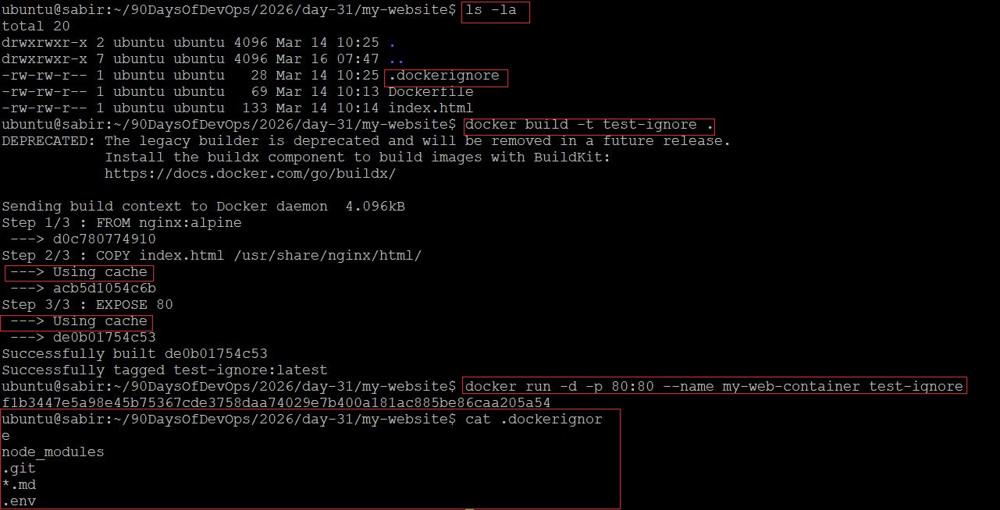

## Create `.dockerignore`

```
node_modules
.git
*.md
.env
```

## Why It Matters

- Reduces Docker **build context size**
- Improves **build speed**
- Prevents **sensitive files** from entering images
- Avoids copying **Git history and unnecessary files**

## Verification

Build the image:

```bash
docker build -t test-ignore .
```


Inspect image layers and confirm ignored files are not included.

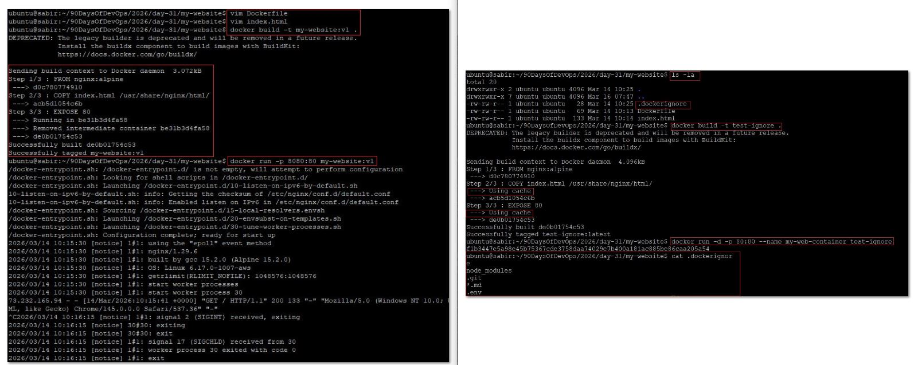

---

# Task 6 – Build Optimization & Docker Cache

## Folder Structure

```
cache-test/
 ├── Dockerfile
 └── app.sh
```

## app.sh

```bash
echo "Hello from Docker v2"
```

## Dockerfile

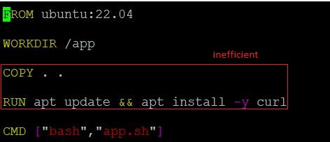

```dockerfile
FROM ubuntu:22.04

WORKDIR /app

COPY . .

RUN apt update && apt install -y curl

CMD ["bash","app.sh"]
```

## Build

```bash
docker build -t cache-test:v2 .
```

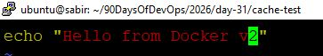

Change `app.sh` and reorganize `Dockerfile` and then rebuild:

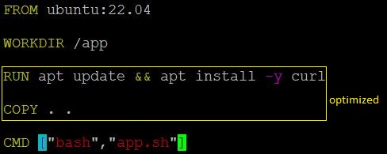

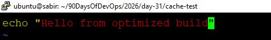

## app.sh

```bash
echo "Hello from Optimized build"
```
```dockerfile
FROM ubuntu:22.04

WORKDIR /app

RUN apt update && apt install -y curl

COPY . .

CMD ["bash","app.sh"]
```

```bash
docker build -t cache-test:v6 .
```
Docker will reuse cached layers for everything **before the COPY instruction**.

---

## Why Layer Order Matters

Docker builds images **layer by layer**.

If an earlier layer changes:

- All following layers must rebuild.
- This slows down build time.

### Example

Inefficient

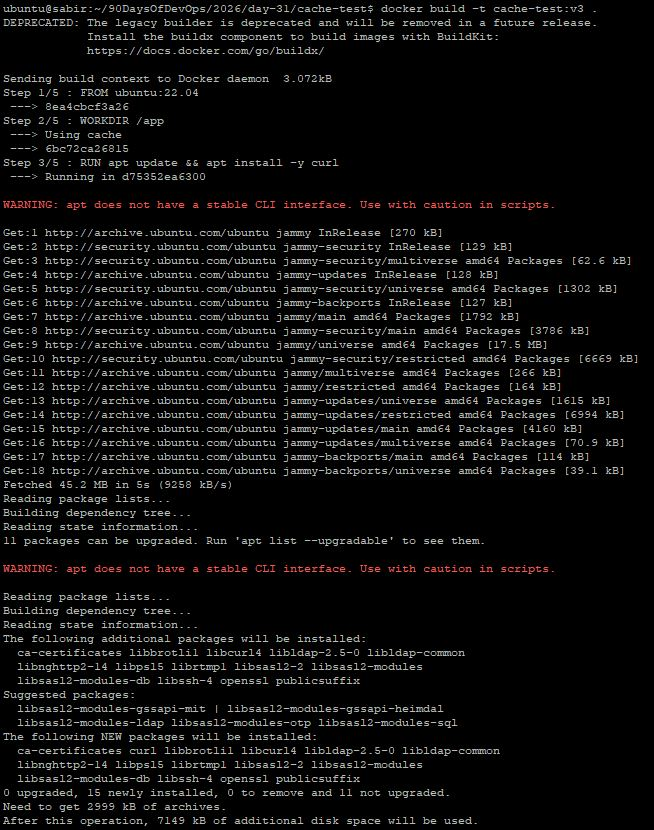

```dockerfile
COPY . .
RUN apt update && apt install -y curl
```

Any code change invalidates dependency layers.

---

Optimized

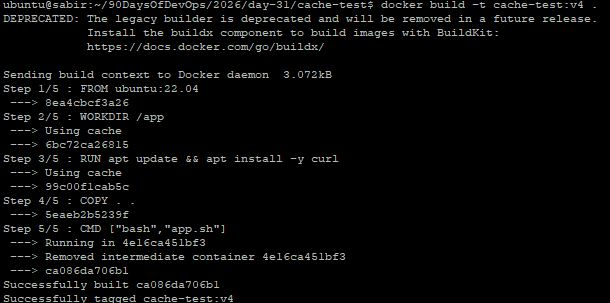

```dockerfile
RUN apt update && apt install -y curl
COPY . .
```

Now:

- Dependencies remain cached
- Only application code rebuilds

---

# Key Takeaways

- Dockerfiles define **how images are built**.
- Each instruction creates a **new layer**.
- `.dockerignore` prevents unnecessary files from entering images.
- `CMD` provides **default commands** that can be overridden.
- `ENTRYPOINT` defines **fixed container behavior**.
- Layer ordering impacts **build speed and caching efficiency**.

---

These concepts are fundamental for building **portable, reproducible container images used in real DevOps workflows**.
