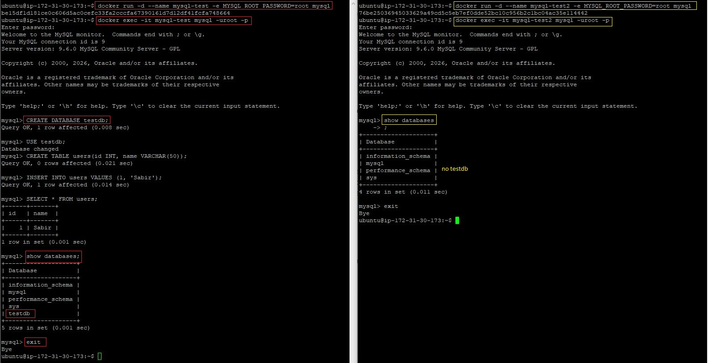
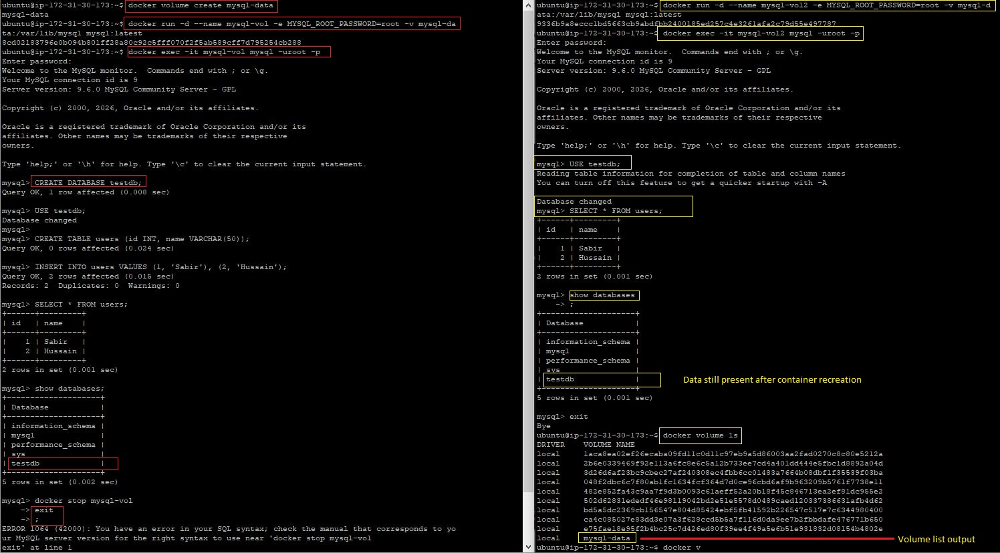
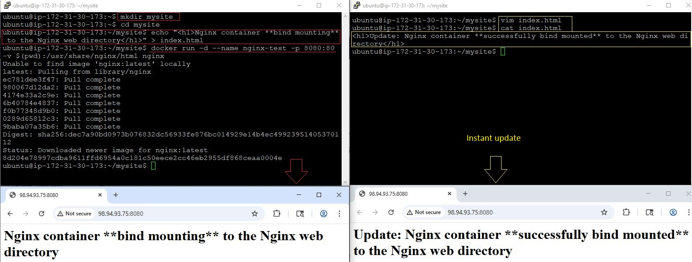
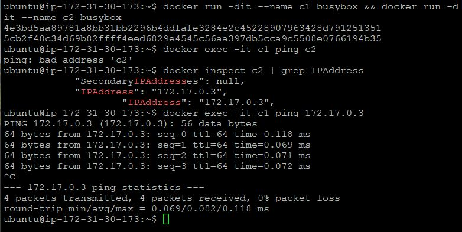
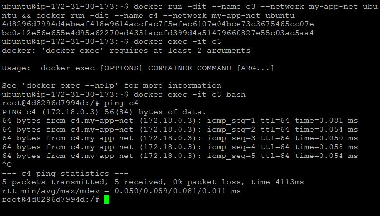
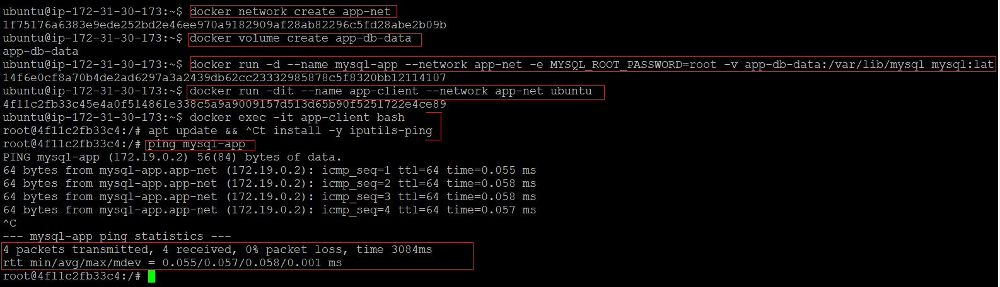

# Day 32 – Docker Volumes & Networking

**Environment:** Ubuntu on AWS EC2  
**Objective:** Solve two core container problems:
- Data persistence
- Container-to-container communication

---

## Task 1: The Problem (Data Loss Without Volumes)

```bash
docker run -d --name mysql-test -e MYSQL_ROOT_PASSWORD=root mysql:latest
docker exec -it mysql-test mysql -uroot -proot
```
```SQL
CREATE DATABASE testdb;
USE testdb;
CREATE TABLE users (id INT, name VARCHAR(50));
INSERT INTO users VALUES (1, 'Sabir');
SELECT * FROM users;
```
### Remove container

```bash
docker stop mysql-test
docker rm mysql-test

docker run -d --name mysql-test -e MYSQL_ROOT_PASSWORD=root mysql:latest
```



### Result
- Data is gone

###  Why?

- Containers are ephemeral
- Data stored inside container filesystem is deleted when container is removed

---

## Task 2: Named Volumes (Persistent Storage)
### Create Volume

```bash
docker volume create mysql-data
```

### Run Container with Volume
```bash
docker run -d --name mysql-vol -e MYSQL_ROOT_PASSWORD=root -v mysql-data:/var/lib/mysql mysql:latest
```

### Add Data Again

```bash
docker exec -it mysql-test mysql -uroot -proot
```
```SQL
CREATE DATABASE testdb;
USE testdb;
CREATE TABLE users (id INT, name VARCHAR(50));
INSERT INTO users VALUES (1, 'Sabir'), (2, 'Hussain');
SELECT * FROM users;
```

### Remove Container

```bash
docker stop mysql-vol
docker rm mysql-vol
```

### Re-run Container with SAME Volume

```bash
docker run -d \
  --name mysql-vol2 \
  -e MYSQL_ROOT_PASSWORD=root \
  -v mysql-data:/var/lib/mysql \
  mysql:latest
```

### Result
- Data still exists

### Verify Volume
```bash
docker volume ls
docker volume inspect mysql-data
```



- Volume list output
- Data still present after container recreation

---

Task 3: Bind Mounts
### Create Local Directory

```bash
mkdir mysite && cd mysite
echo "<h1>Nginx container **bind mounting** to the Nginx web directory </h1>" > index.html
```

### Run Nginx with Bind Mount

```bash
docker run -d \
  --name nginx-test \
  -p 8080:80 \
  -v $(pwd):/usr/share/nginx/html \
  nginx
```

### Access

Open browser → http://<EC2-PUBLIC-IP>:8080

### Modify File
```bash
echo "<h1>Update: Nginx container **successfully bind mounted** to the Nginx web directory</h1>" > index.html
```

### Result

- Changes reflect instantly in browser



- Browser showing initial page
- Browser after updating file

### Named Volume vs Bind Mount

| Feature     | Named Volume               | Bind Mount         |
| ----------- | -------------------------- | ------------------ |
| Managed by  | Docker                     | Host OS            |
| Location    | /var/lib/docker/volumes    | Any host directory |
| Portability | High                       | Low                |
| Use Case    | Databases, persistent data | Dev/live editing   |

---

### Task 4: Docker Networking Basics

### List Networks
```bash
docker network ls
```

### Inspect Default Bridge
```bash
docker network inspect bridge
```

### Run Two Containers
```bash 
docker run -dit --name c1 ubuntu busybox && docker run -dit --name c2 ubuntu busybox
```

### Test Connectivity

### By Name
```bash 
docker exec -it c1 ping c2
```
- Fails

### By IP

```bash 
docker inspect c2 | grep IPAddress
docker exec -it c1 ping <IP>
```

- Works



- Failed ping by name
- Successful ping by IP

---

### Task 5: Custom Network

### Create Network
```bash
docker network create my-app-net
```

### Run Containers

```bash
docker run -dit --name c3 --network my-app-net ubuntu && docker run -dit --name c4 --network my-app-net ubuntu
```

### Install Ping (Required)

```bash
docker exec -it c3 bash
apt update && apt install -y iputils-ping
```

### Test Ping by Name
```bash
docker exec -it c3 bash
ping c4
```
### Result
- Works
### Why?
- Custom networks use built-in DNS
- Containers can resolve names automatically





- Successful ping using container name

---

### Task 6: Putting It All Together
### Create Network

```bash
docker network create app-net
```

### Run MySQL with Volume

```bash
docker volume create app-db-data
docker run -d --name mysql-app --network app-net -e MYSQL_ROOT_PASSWORD=root -v app-db-data:/var/lib/mysql  mysql:latest
```

### Run App Container (Ubuntu for testing)

```bash
docker run -dit --name app-client --network app-net  ubuntu
```

### Install Ping

```bash
docker exec -it app-client bash
apt update && apt install -y iputils-ping
```

### Test Connectivity

```bash 
ping mysql-app # since already in bash shell
```

### Result
- App container can reach DB via container name





- Ping success from app container to MySQL

---

Summary:

- Containers are ephemeral by default
- Use named volumes for persistent data
- Use bind mounts for development workflows
- Default bridge:
    - No DNS (name resolution fails)
    - Works with IP
- Custom network:
    - Built-in DNS
    - Name-based communication
- Real-world systems use:
    - Volumes for storage
    - Networks for service communication
