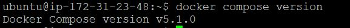
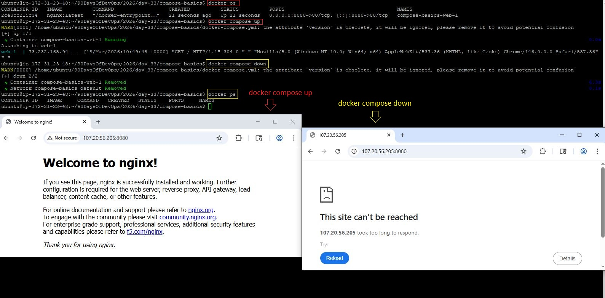
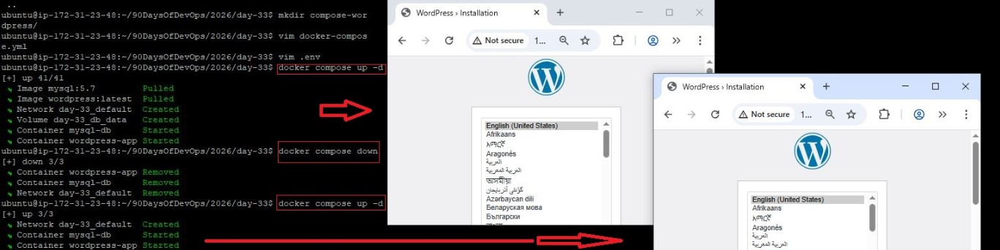
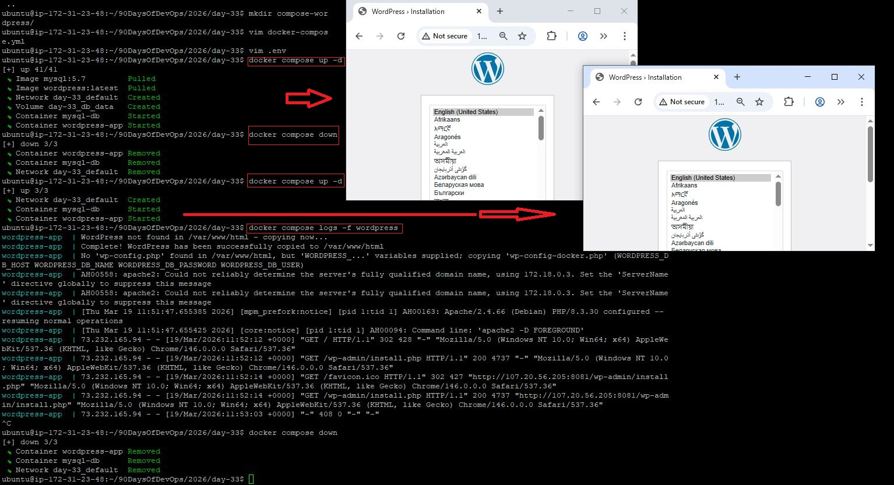
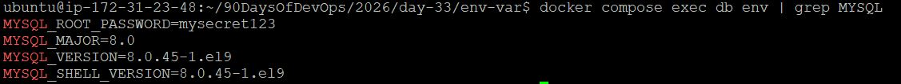
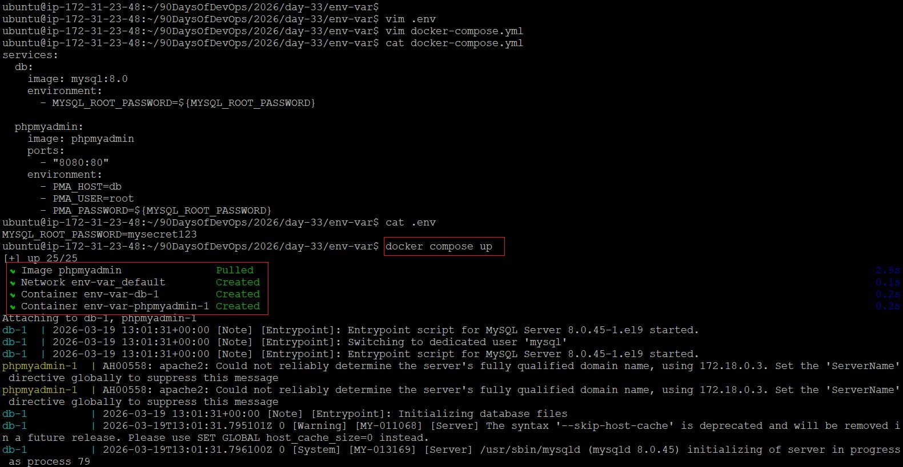
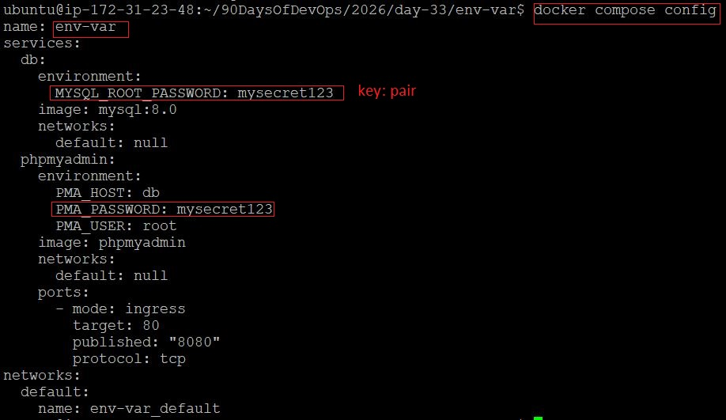
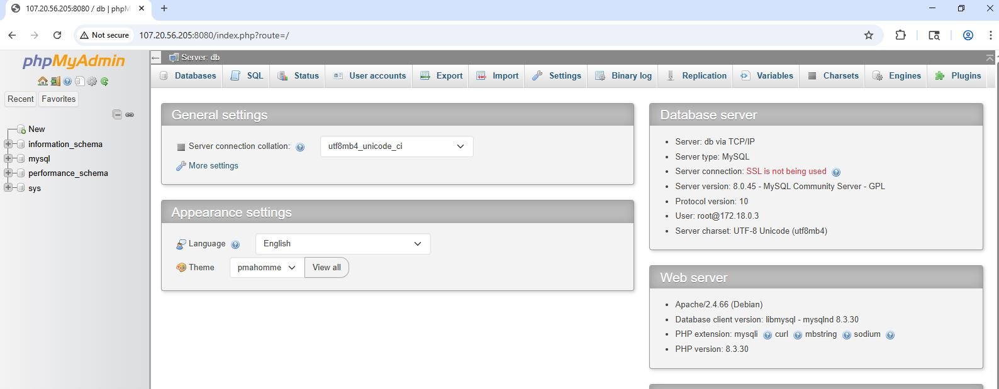
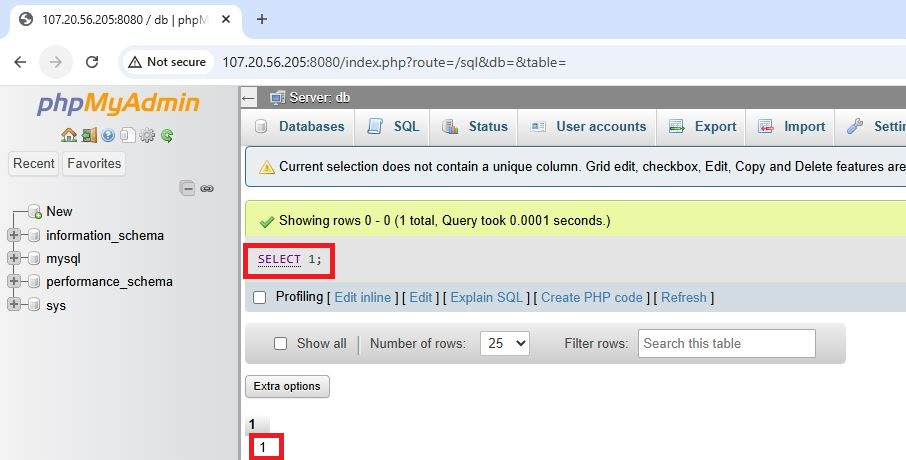

# Day 33 – Docker Compose: Multi-Container Basics

## Task:
Run multi-container applications using a single command with Docker Compose.

---

# Task 1: Install & Verify

## Check Docker Compose
```bash
docker compose version
```



---

# Task 2: Your First Compose File

## docker-compose.yml
```yaml
services:
  web:
    image: nginx:latest
    ports:
      - "8080:80"
```

## Start Container
```bash
docker compose up
```

## Access in Browser
```
http://localhost:8080
```

## Stop Containers
```bash
docker compose down
```




---

# Task 3: Two-Container Setup (WordPress + MySQL)

## Folder Structure
```
compose-wordpress/
 ├── docker-compose.yml
 └── .env
```

## docker-compose.yml
```yaml
services:
  db:
    image: mysql:5.7
    container_name: mysql-db
    restart: always
    environment:
      MYSQL_ROOT_PASSWORD: ${MYSQL_ROOT_PASSWORD}
      MYSQL_DATABASE: ${MYSQL_DATABASE}
      MYSQL_USER: ${MYSQL_USER}
      MYSQL_PASSWORD: ${MYSQL_PASSWORD}
    volumes:
      - db_data:/var/lib/mysql

  wordpress:
    image: wordpress:latest
    container_name: wordpress-app
    depends_on:
      - db
    ports:
      - "8081:80"
    restart: always
    environment:
      WORDPRESS_DB_HOST: db:3306
      WORDPRESS_DB_USER: ${MYSQL_USER}
      WORDPRESS_DB_PASSWORD: ${MYSQL_PASSWORD}
      WORDPRESS_DB_NAME: ${MYSQL_DATABASE}

volumes:
  db_data:
```

---

## .env File
```env
MYSQL_ROOT_PASSWORD=rootpass
MYSQL_DATABASE=wordpress
MYSQL_USER=wpuser
MYSQL_PASSWORD=wppass
```

---

## Start Services
```bash
docker compose up -d
```

## Access WordPress
```
http://localhost:8081
```

## Persistence Test
```bash
docker compose down
docker compose up -d
```

| Check            | Expected Result        |
|------------------|----------------------|
| WordPress data   | Still exists       |
| Database         | Persistent via volume |




---

# Task 4: Compose Commands

## Command Reference

| Action                         | Command                          |
|--------------------------------|----------------------------------|
| Start (detached)               | docker compose up -d             |
| View running services          | docker compose ps                |
| View all logs                  | docker compose logs -f           |
| Logs (specific service)        | docker compose logs -f wordpress |
| Stop services                  | docker compose stop              |
| Remove everything              | docker compose down              |
| Rebuild images                | docker compose up --build        |





---

# Task 5: Environment Variables

## Inline Variables (inside compose)
```yaml
services:
  db:
    image: mysql:8.0
    environment:
      - MYSQL_ROOT_PASSWORD=${MYSQL_ROOT_PASSWORD}

  phpmyadmin:
    image: phpmyadmin
    ports:
      - "8080:80"
    environment:
      - PMA_HOST=db
      - PMA_USER=root
      - PMA_PASSWORD=${MYSQL_ROOT_PASSWORD}
```

## Using `.env` File
```yaml
environment:
  MYSQL_ROOT_PASSWORD=mysecret123
```

## Verify Variables
```bash
docker compose up
```

### What Happens?

- Docker starts a MySQL database
- It reads the password from .env
- Sets the root password to:
```mysecret123```
```

### Verify It Works

```bash
docker compose exec db env | grep MYSQL
```
### Output
```bash
MYSQL_ROOT_PASSWORD=mysecret123
```



This proves the variable is being picked up correctly

### Why This Matters (Real-World Use)
- Instead of writing this (bad practice ):
```SQL
MYSQL_ROOT_PASSWORD=mysecret123
```
- Use:
```yaml
MYSQL_ROOT_PASSWORD=${MYSQL_ROOT_PASSWORD}
```

- Now one can:
    - Change passwords easily
    - Keep secrets out of your main config file
    - Avoid committing passwords to Git
    - One can change .env anytime
- Then restart:
```bash
docker compose down
docker compose up
```








---

# Key Learnings

- Docker Compose simplifies multi-container setups
- YAML defines services, networks, and volumes
- Services communicate using **service names (DNS)**
- Volumes ensure **data persistence**
- `.env` files improve **security & maintainability**

---

# Summary

| Concept            | Outcome                          |
|--------------------|----------------------------------|
| Single container   | Nginx via Compose                |
| Multi-container    | WordPress + MySQL setup          |
| Networking         | Automatic via Compose            |
| Storage            | Named volumes                    |
| Automation         | One command to run everything    |

---


Docker Compose is where containers start behaving like real applications — not isolated units, but **connected systems**.

