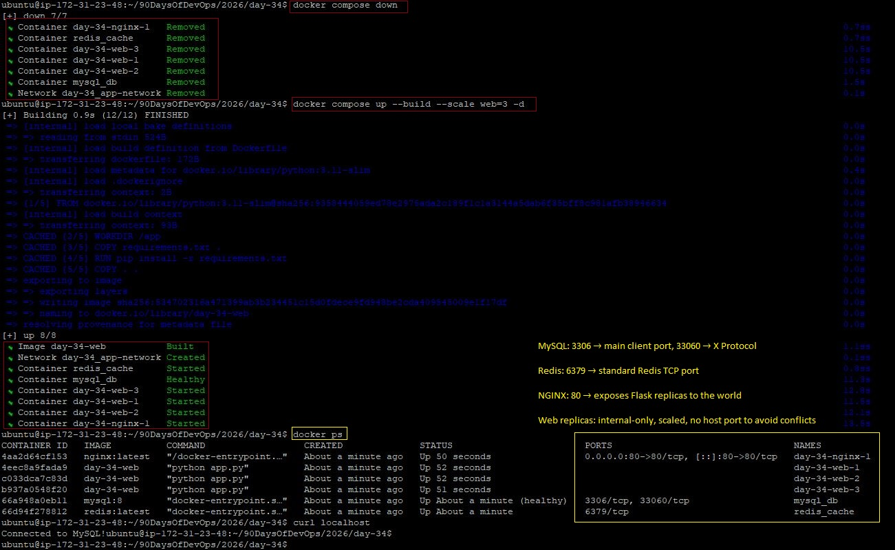

# Day 34 – Docker Compose: Real-World Multi-Container Apps

## Overview
Today focuses on building **production-like multi-container applications** using Docker Compose.

Tasks accomplished in order to create a **3-tier architecture**:
- Web App (Flask)
- Database (MySQL)
- Cache (Redis)
- Load Balancer (NGINX) for scaling - Task 6

Along with:
- Healthchecks
- Restart policies
- Custom builds
- Named networks & volumes
- Scaling with multiple replicas

---

## Project Structure

- Understanding the Project Structure is crucial to resolving this project. 

2026/day-34/
├── docker-compose.yml
├── nginx.conf    # Load Balancer for achieving 3-tier architecture replicas
├── app/
│ ├── Dockerfile
│ ├── requirements.txt
│ └── app.py
└── day-34-compose-advanced.md

---

## docker-compose.yml

```yaml
services:
  web:
    build: ./app
    depends_on:
      db:
        condition: service_healthy
    environment:
      DB_HOST: db
      DB_USER: root
      DB_PASSWORD: rootpass
      DB_NAME: testdb
    networks:
      - app-network
    restart: on-failure

  db:
    image: mysql:8
    container_name: mysql_db
    environment:
      MYSQL_ROOT_PASSWORD: rootpass
      MYSQL_DATABASE: testdb
    volumes:
      - db-data:/var/lib/mysql
    networks:
      - app-network
    restart: always
    healthcheck:
      test: ["CMD", "mysqladmin", "ping", "-h", "localhost"]
      interval: 10s
      timeout: 5s
      retries: 5

  cache:
    image: redis:latest
    container_name: redis_cache
    networks:
      - app-network

  nginx:
    image: nginx:latest
    ports:
      - "80:80"
    depends_on:
      - web
    volumes:
      - ./nginx.conf:/etc/nginx/nginx.conf:ro
    networks:
      - app-network
    restart: always

networks:
  app-network:

volumes:
  db-data:
```

---

## nginx.conf

```nginx
events {}

http {
  upstream flask_app {
    least_conn;
    server web:5000;
  }

  server {
    listen 80;

    location / {
      proxy_pass http://flask_app;
    }
  }
}
```

---

## Flask Application

### app/app.py

```python
from flask import Flask
import mysql.connector
import os

app = Flask(__name__)

@app.route("/")
def hello():
    try:
        conn = mysql.connector.connect(
            host=os.environ.get("DB_HOST"),
            user=os.environ.get("DB_USER"),
            password=os.environ.get("DB_PASSWORD"),
            database=os.environ.get("DB_NAME")
        )
        return "Connected to MySQL!"
    except Exception as e:
        return f"Database connection failed: {e}"

if __name__ == "__main__":
    app.run(host="0.0.0.0", port=5000)
```

---

### app/requirements.txt

```
flask
mysql-connector-python
```

---

### app/Dockerfile

```dockerfile
FROM python:3.11-slim

WORKDIR /app

COPY requirements.txt .
RUN pip install -r requirements.txt

COPY . .

CMD ["python", "app.py"]
```

---

## Task Explanations

### Task 1: 3-Service Stack

* Flask app connects to MySQL
* Redis included as cache layer
* Services communicate via Docker network
* NGINX acts as load balancer for multiple web replicas

---

### Task 2: ``depends_on`` & Healthchecks

* ```depends_on``` ensures the app waits for DB readiness
* Healthcheck ensures MySQL is actually ready before web starts

---

### Task 3: Restart Policies

| Policy     | Behavior                                 |
| ---------- | ---------------------------------------- |
| always     | Always restarts (even after manual stop) |
| on-failure | Restarts only if container fails         |

**Use Cases:**

* always → Databases, critical services
* on-failure → Apps where crashes matter

---

### Task 4: Custom Builds

* Build web service from local Dockerfile

Rebuild with:

```bash
docker compose up --build
```

---

### Task 5: Networks & Volumes

* Named network: app-network
* Named volume: db-data for MySQL persistence
* Services isolated and organized

---

### Task 6: Scaling

* Web service is scalable with multiple replicas
* NGINX load balances traffic across replicas

Scaling command:

```bash
docker compose up --scale web=3 --build -d
```

**Important Notes:**

* container_name is not set for web → required for scaling
* Web containers do not bind port 5000 to host → prevents conflicts
* NGINX listens on port 80 → entry point for all web traffic

---

## Commands

```bash
# Stop previous containers
docker compose down

# Build and start all services with scaling
docker compose up --build --scale web=3 -d

# Check running containers. Shows service name + replica number with state and ports.
docker ps

# Test from EC2 instance
curl localhost

# Access from browser
http://<EC2-PUBLIC-IP>

```


-


-
---


## Highlights

* Multi-container apps simulate real-world production systems
* Healthchecks and ``depends_on`` improve reliability
* Restart policies define resilience
* Named volumes ensure persistent data
* NGINX enables proper scaling of stateless services
* Dynamic service naming is essential for scaling
