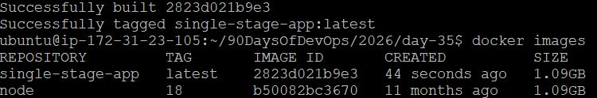
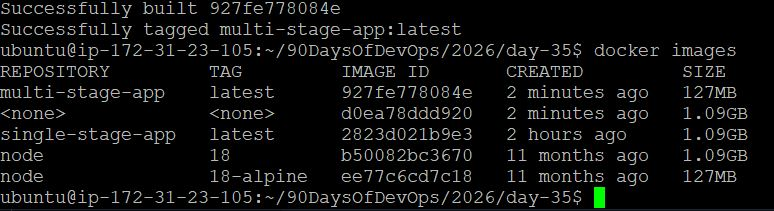
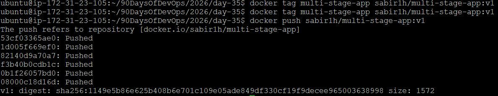
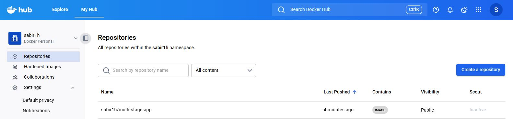
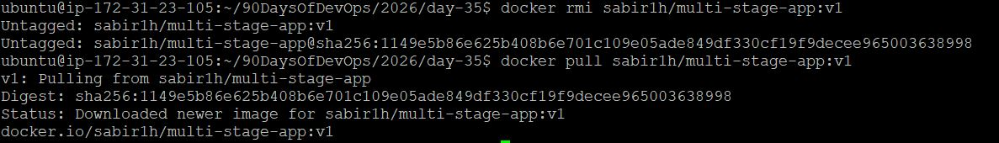
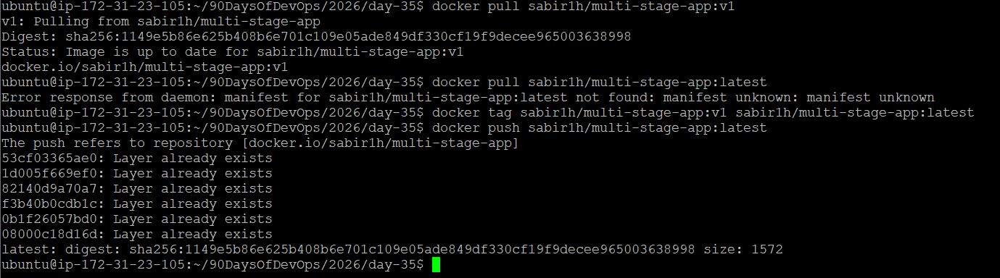
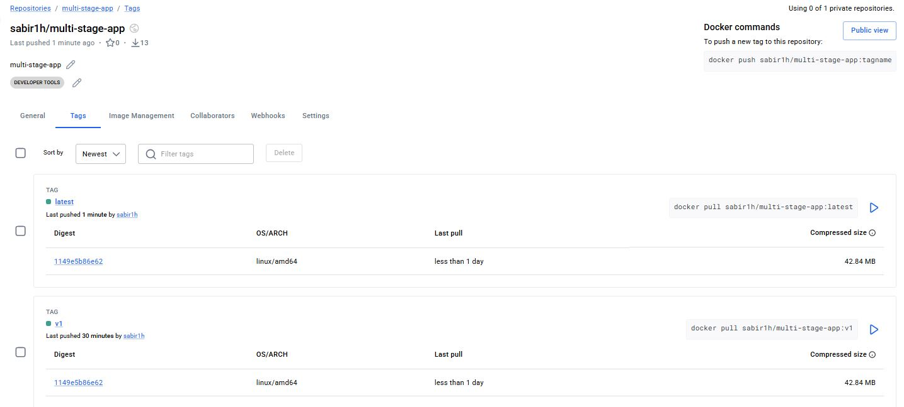

# Day 35 – Multi-Stage Builds & Docker Hub

## Overview
Today focuses on building **optimized Docker images** and distributing them using Docker Hub.

Multi-stage builds are used in real-world production to:
- Reduce image size
- Improve security
- Remove unnecessary dependencies

Docker Hub allows you to:
- Store images
- Share with teams
- Deploy anywhere

---

## Task 1: The Problem with Large Images

### Sample App (Node.js)

```
app/
 ├── index.js
 └── package.json
```

### `index.js`
```js
console.log("Hello from Docker!");
```

### `package.json`
```json
{
  "name": "simple-app",
  "version": "1.0.0",
  "main": "index.js"
}
```

---

### Single-Stage Dockerfile (Inefficient)

```dockerfile
FROM node:18

WORKDIR /app

COPY package.json .
RUN npm install

COPY . .

CMD ["node", "index.js"]
```

---

### Build Image

```bash
docker build -t single-stage-app .
```

---

### Check Image Size

```bash
docker images
```

---



---

### Problem

- Large image size (~800MB–1GB)
- Contains build tools + dependencies
- Slower to pull/push
- Higher security risk

---

## Task 2: Multi-Stage Build

### Multi-Stage Dockerfile (Optimized)

```dockerfile
# Stage 1: Builder
FROM node:18 AS builder

WORKDIR /app

COPY package.json .
RUN npm install

COPY . .

# Stage 2: Runtime
FROM node:18-alpine

WORKDIR /app

COPY --from=builder /app /app

CMD ["node", "index.js"]
```

---

### Build Optimized Image

```bash
docker build -t multi-stage-app .
```

---

### Check Image Size Again

```bash
docker images
```

---



---

### Comparison

| Build Type      | Image Size |
|----------------|-----------|
| Single Stage   | ~900MB    |
| Multi-Stage    | ~150MB    |

---

### Why Multi-Stage is Smaller?

- Build tools are **not included** in final image
- Uses **lightweight base image (alpine)**
- Only runtime files are copied
- Fewer layers and dependencies

---

## Task 3: Push to Docker Hub

### Login

```bash
docker login
```

---

### Tag Image

```bash
docker tag multi-stage-app yourusername/multi-stage-app:v1
```

---

### Push Image

```bash
docker push yourusername/multi-stage-app:v1
```

---

### Verify Pull

```bash
docker rmi yourusername/multi-stage-app:v1
docker pull yourusername/multi-stage-app:v1
```

---







---

## Task 4: Docker Hub Repository

### Steps

- Go to Docker Hub
- Open your repository
- Add:
  - Description
  - Category
- Explore **Tags tab**

---

### Tags Explained

| Tag     | Meaning                     |
|---------|---------------------------|
| latest  | Default version            |
| v1, v2  | Versioned releases         |

---

### Pull Specific Tag

```bash
docker pull yourusername/multi-stage-app:v1
```

### Pull Latest

```bash
docker pull yourusername/multi-stage-app:latest
```

If no tag is specified → Docker uses `latest`

---





---

## Task 5: Image Best Practices

### Improved Production Dockerfile

```dockerfile
FROM node:18-alpine

WORKDIR /app

# Create non-root user
RUN addgroup app && adduser -S -G app app

COPY package.json .

# Combine RUN commands
RUN npm install && npm cache clean --force

COPY . .

# Use non-root user
USER app

CMD ["node", "index.js"]
```

---

### Best Practices Applied

- Use minimal base image (`alpine`)
- Avoid running as root (`USER app`)
- Combine RUN commands (fewer layers)
- Clean cache to reduce size
- Use specific tags (`node:18-alpine` instead of latest)

---

## Final Outcome

- Built single-stage and multi-stage images
- Reduced image size significantly
- Pushed image to Docker Hub
- Verified pull from remote registry
- Applied production-grade best practices
- Multi-stage builds = **smaller, production-ready images**
- Docker Hub = **distribution & sharing platform**
- Tags = **version control mechanism**
- Best practices = **secure and efficient containers**

---

## Docker Hub repo link:

https://hub.docker.com/repository/docker/sabir1h/multi-stage-app/general

---
