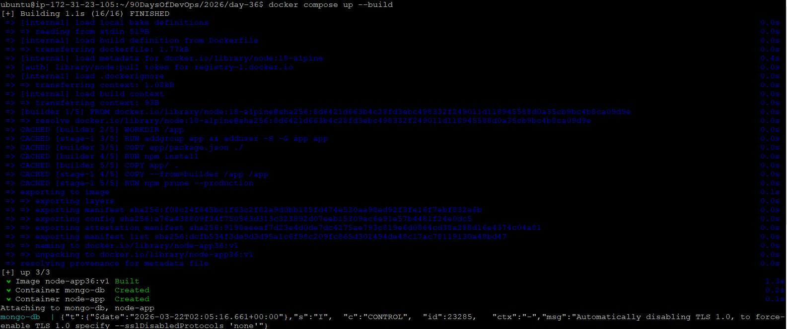
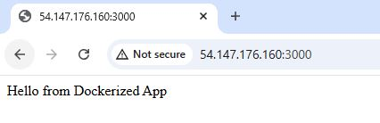
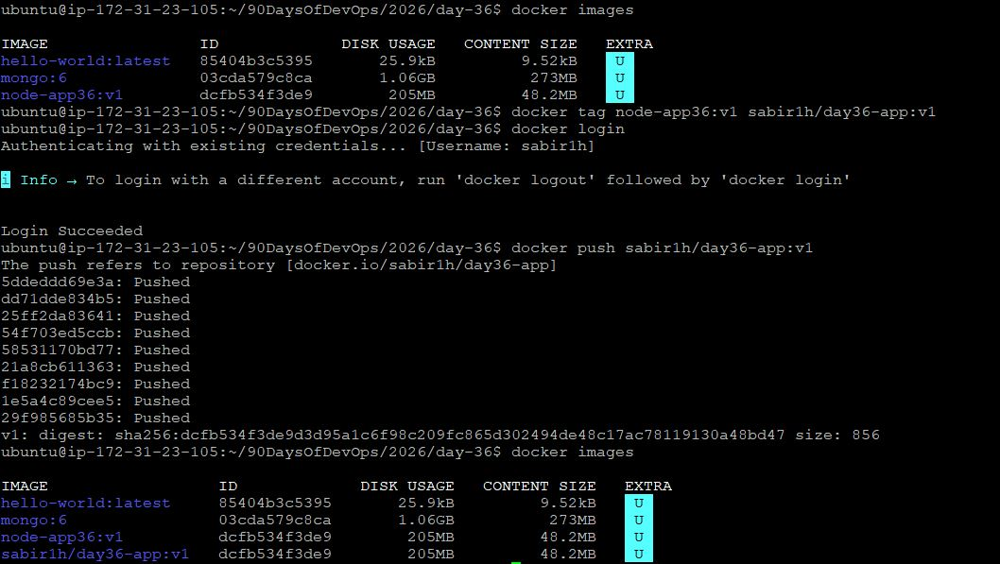

# Day 36 – Docker Project: Dockerize a Full Application

## Overview
This project demonstrates Dockerizing a full Node.js application with MongoDB using best practices such as multi-stage builds, non-root users, environment variables, and Docker Compose.

---

## Project App
I chose a Node.js Express app with MongoDB because:
- It reflects real-world backend architecture
- Requires multi-container setup
- Demonstrates networking, volumes, and environment configs

---

## Project Structure

```

day-36-app/
├── app/
│    ├── index.js
│    ├── package.json
├── Dockerfile
├── docker-compose.yml
├── .dockerignore
├── .env

```

---

## Dockerfile

```dockerfile
# Dockerfile Line-by-Line Explanation

# Stage 1: Build dependencies
FROM node:18-alpine AS builder
# Use a lightweight Node.js base image (Alpine Linux)
# "AS builder" names this stage so it can be referenced later

WORKDIR /app
# Sets the working directory inside the container to /app
# All following commands will run from this directory

COPY app/package.json ./
# Copies only package.json first
# This helps Docker cache dependencies (faster rebuilds if code changes but dependencies don’t)

RUN npm install
# Installs all dependencies listed in package.json
# This includes devDependencies as well (needed for build stage)

COPY /app
# Copies the rest of the application code into the container

# Stage 2: Production image
FROM node:18-alpine
# Starts a fresh, clean image (smaller + more secure)
# Does NOT include unnecessary build tools or dev dependencies

WORKDIR /app
# Again sets working directory for the new stage

# Create non-root user
RUN addgroup app && adduser -S -G app app
# Creates a group named "app"
# Creates a system user "app" inside that group
# Running containers as non-root improves security

COPY --from=builder --chown=app:app /app .
# COPY correctly: Copy the CONTENTS of builder's /app into current WORKDIR (.)
# Also, change ownership to our new 'app' user immediately

RUN npm prune --production
# Removes devDependencies
# Keeps only production dependencies → reduces image size

USER app
# Switches to the non-root user "app"
# Ensures container does not run as root (best practice)

EXPOSE 3000
# Documents that the app runs on port 3000
# Does NOT actually publish the port (done via docker run or compose)

CMD ["node", "index.js"]
# Default command to run when container starts
# Starts the Node.js application
```

---

## .dockerignore

```
node_modules
npm-debug.log
Dockerfile
docker-compose.yml
.git
.gitignore
.env
```

---

## docker-compose.yml

```yaml
# docker-compose.yml  and Explanation

services:
# Defines all the containers (services) that will run together

  app:
  # This is your Node.js application service

    build: .
    # Builds the Docker image using the Dockerfile in the current directory
    image: node-app36:v1  # name of the image to be created
    container_name: node-app
    # Assigns a custom name to the container instead of a random one

    ports:
      - "3000:3000"
    # Maps port 3000 of your local machine to port 3000 inside the container
    # Access app via http://localhost:3000

    depends_on:
      - mongo
    # Ensures MongoDB service starts before the app
    # Note: It does NOT guarantee MongoDB is ready, only that it has started

    env_file:
      - .env
    # Loads environment variables from .env file into the container

    networks:
      - app-network
    # Connects this container to a custom network so it can communicate with mongo

  mongo:
  # MongoDB database service

    image: mongo:6
    # Uses official MongoDB image (version 6) from Docker Hub

    container_name: mongo-db
    # Custom name for MongoDB container

    restart: always
    # Automatically restarts the container if it crashes or stops

    volumes:
      - mongo-data:/data/db
    # Mounts a named volume to persist database data
    # Even if container is deleted, data remains

    networks:
      - app-network
    # Same network as app → allows communication using service name "mongo"

    healthcheck:
    # Checks if MongoDB is actually ready to accept connections

      test: ["CMD", "mongosh", "--eval", "db.runCommand({ ping: 1 })"]
      # Runs a MongoDB ping command
      # If it succeeds → container is healthy

      interval: 10s
      # Runs the healthcheck every 10 seconds

      timeout: 5s
      # Waits 5 seconds before marking the check as failed

      retries: 5
      # If it fails 5 times → container is marked unhealthy

volumes:
  mongo-data:
  # Defines a named volume used by MongoDB
  # Managed by Docker (stored outside container filesystem)

networks:
  app-network:
  # Defines a custom bridge network
  # Allows containers to communicate using service names (DNS-based)
```

---

## .env

```
MONGO_URI=mongodb://mongo:27017/mydb
PORT=3000
```

---

## Application Code (index.js)

```javascript
const express = require("express");
const mongoose = require("mongoose");

const app = express();
const PORT = process.env.PORT || 3000;

mongoose.connect(process.env.MONGO_URI)
  .then(() => console.log("MongoDB connected"))
  .catch(err => console.log(err));

app.get("/", (req, res) => {
  res.send("Hello from Dockerized App");
});

app.listen(PORT, () => {
  console.log(`Server running on port ${PORT}`);
});
```

---

## package.json

```json
# package.json Explanation

{
  "name": "docker-node-app",
  # Name of the application/package
  # Used to identify the project in npm and Docker context

  "version": "1.0.0",
  # Version of the application
  # Follows semantic versioning (major.minor.patch)

  "main": "index.js",
  # Entry point of the application
  # Node will start execution from this file

  "dependencies": {
  # Lists all required libraries for the app to run

    "express": "^4.18.2",
    # Express framework for building the web server
    # ^ means it allows compatible minor/patch updates (4.x.x)

    "mongoose": "^7.0.0"
    # Mongoose library to interact with MongoDB
    # Also allows minor/patch updates within version 7
  }
}
```

---

## Build & Run

```bash
docker compose up --build
```

Visit:
[http://localhost:3000](http://localhost:3000)

for ec2

[http://ec2 public ip:3000](http:///<ec2 public ip>:3000)






---

## Push to Docker Hub

```bash
docker tag node-app36:v1 sabir1h/day36-app:v1
docker login
docker push sabir1h/day36-app:v1
```

## How to verify it worked:
- Locally: Run ``docker images`` again. You’ll see sabir1h/day36-app listed with the same ID as your node app.

- Online: Log in to hub.docker.com and check your repositories. Your app should be sitting right there!





Docker Hub Link:
[https://hub.docker.com/repository/docker/sabir1h/day36-app/tags](https://hub.docker.com/repository/docker/sabir1h/day36-app/tags)

---

## Test Fresh Setup

```bash
docker system prune -a
docker compose up
```

---

## Challenges Faced

* MongoDB connection failed initially due to wrong hostname
  * Fixed by using service name "mongo" instead of localhost

* Image size was large
  * Solved using multi-stage build and alpine base

* Permission issues with non-root user
  * Fixed by copying files before switching user

---

## Learning Highlights

* Multi-stage builds reduce image size significantly
* Docker Compose simplifies multi-container apps
* Environment variables improve flexibility
* Healthchecks ensure service readiness
* Non-root users improve container security

---
