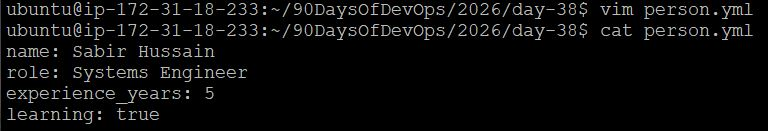
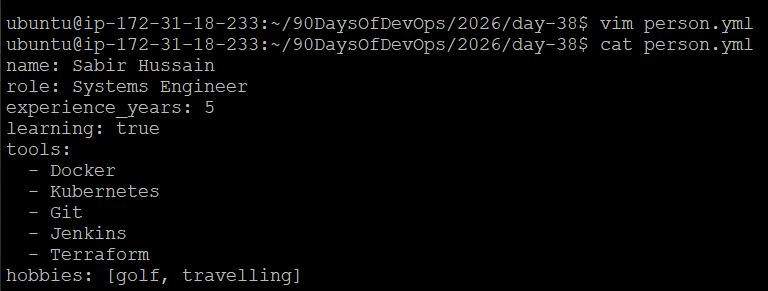
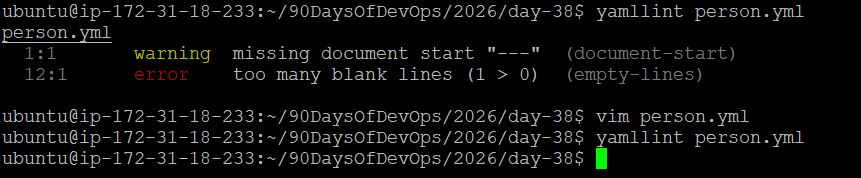
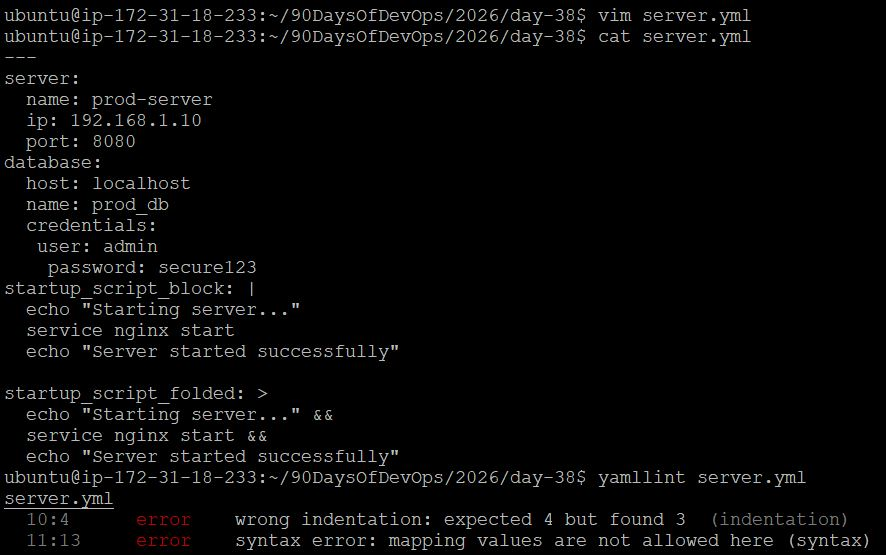

# Day 38 – YAML Basics

## Task
Before writing a single CI/CD pipeline, you need to get comfortable with YAML — the language every pipeline is written in.

You will:

Understand YAML syntax and rules
Write YAML files by hand
Validate them

---

## Task 1: Key-Value Pairs

**File:** `person.yml`

```yaml
name: Sabir Hussain
role: Systems Engineer
experience_years: 5
learning: true
```

**Verification:**

```bash
cat person.yml
```



*** No tabs, only spaces. YAML is clean and readable.***

---

## Task 2: Lists

**Updated `person.yml` with lists:**

```yaml
name: Sabir Hussain
role: Systems Engineer
experience_years: 5
learning: true
tools:
  - Docker
  - Kubernetes
  - Git
  - Jenkins
  - Terraform
hobbies: [golf, travelling]
```

**Notes:**
There are **two ways to write a list in YAML**:

1. **Block style** – each item on a new line with `-`
2. **Inline style** – comma-separated inside square brackets `[item1, item2]`





---

## Task 3: Nested Objects

**File:** `server.yml`

```yaml
server:
  name: prod-server
  ip: 192.168.1.10
  port: 8080
database:
  host: localhost
  name: prod_db
  credentials:
    user: admin
    password: secure123
```

**Notes:**

* YAML **does not allow tabs**. 
* YAML is **very particular on indentation**

---

## Task 4: Multi-line Strings

**Updated `server.yml` with multi-line strings:**

```yaml
server:
  name: prod-server
  ip: 192.168.1.10
  port: 8080
database:
  host: localhost
  name: prod_db
  credentials:
    user: admin
    password: secure123
startup_script_block: |
  echo "Starting server..."
  service nginx start
  echo "Server started successfully"

startup_script_folded: >
  echo "Starting server..." &&
  service nginx start &&
  echo "Server started successfully"
```

**Notes:**

* `|` preserves newlines exactly (good for scripts)
* `>` folds into a single line (good for long paragraphs or logs)

---

## Task 5: Validate Your YAML

**Steps:**

1. Install `yamllint`:

```bash
sudo apt-get install yamllint
yamllint person.yml
yamllint server.yml
```

**Error:**





```
 warning  missing document start "---"  (document-start)
 error    too many blank lines (1 > 0)  (empty-lines)

 error    wrong indentation: expected 4 but found 3  (indentation)
 error    syntax error: mapping values are not allowed here (syntax)

```

3. Fix indentation and validate again

---

## Task 6: Spot the Difference

**Block 1 - Correct**

```yaml
name: devops
tools:
  - docker
  - kubernetes
```

**Block 2 - Broken**

```yaml
name: devops
tools:
- docker
  - kubernetes
```

**Problem:**

* In Block 2, `- kubernetes` is incorrectly indented under `- docker`.
* Each list item must be **aligned at the same indentation level**.

---

## Key Learnings

1. YAML uses **spaces only**; tabs break files.
2. Lists and nested objects must follow **consistent indentation** (2 spaces standard).
3. Multi-line strings have two styles: `|` preserves line breaks, `>` folds into one line.

---
