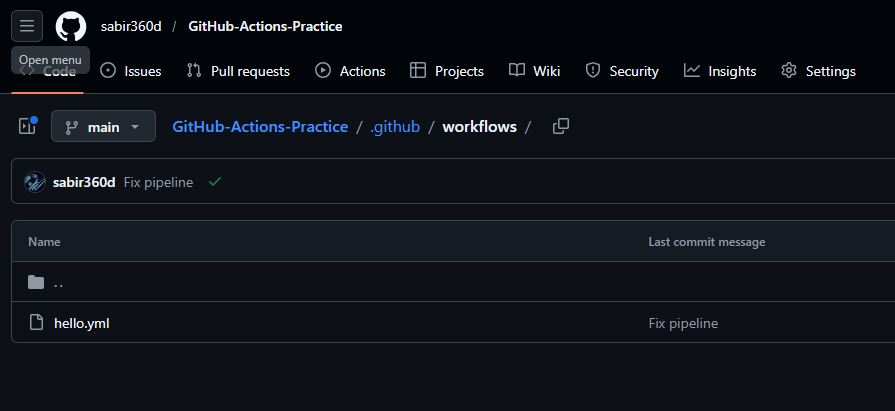
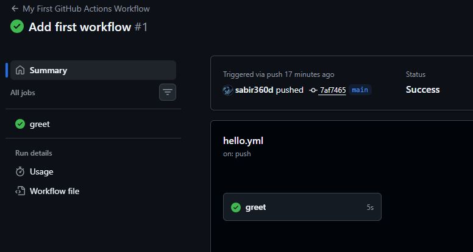
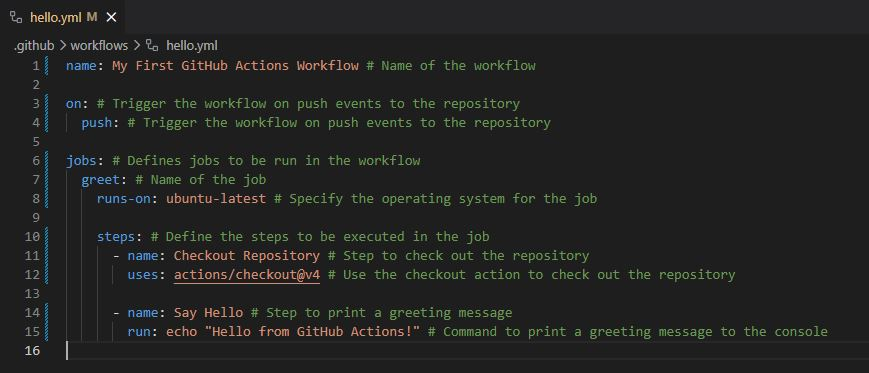
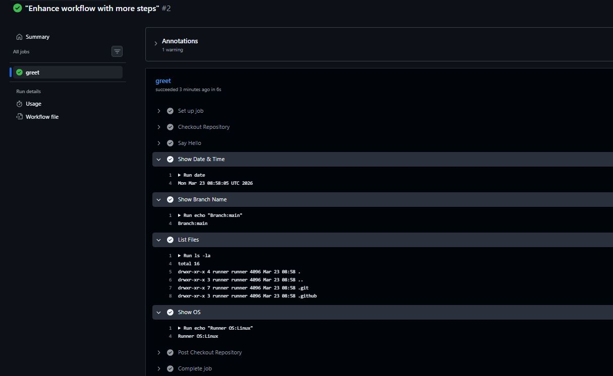
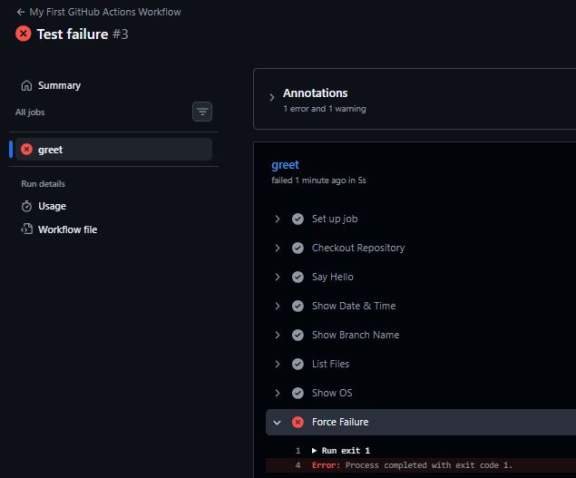
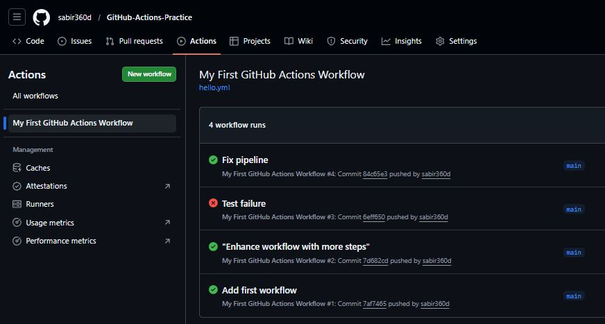

# Day 40 - GitHub Actions Workflow

## Overview
Created GitHub Actions workflow and executed a CI pipeline in the cloud.

---

### Task 1: Set Up
1. Create a new **public** GitHub repository called `github-actions-practice`
2. Clone it locally
3. Create the folder structure: `.github/workflows/`



---

### Task 2: Hello Workflow
Created `.github/workflows/hello.yml` with a workflow 
Push it. Go to the **Actions** tab on GitHub and watch it run.
**Verify:** Is it green? Click into the job and read every step.

```yaml
name: My First GitHub Actions Workflow

on:
  push:

jobs:
  greet:
    runs-on: ubuntu-latest

    steps:
      - name: Checkout Repository
        uses: actions/checkout@v4

      - name: Say Hello
        run: echo "Hello from GitHub Actions!"

      - name: Show Date & Time
        run: date

      - name: Show Branch Name
        run: echo "Branch: ${{ github.ref_name }}"

      - name: List Files
        run: ls -la

      - name: Show OS
        run: echo "Runner OS: $RUNNER_OS"
```



---

### Task 3: Understand the Anatomy

`on:`

Defines when the workflow runs.
“When should this pipeline run?”
Example: every push

`jobs:`

Defines a collection of tasks. Each job runs independently.
Example: A pipeline = collection of jobs

`runs-on:`

Specifies the machine/environment to run the job.
Example: `ubuntu-latest` GitHub gives you a cloud VM (Ubuntu here)

`steps:`

Defines how the job executes
Steps run sequentially

`uses:`

Uses pre-built GitHub Actions.
Example: `uses: actions/checkout@v4` pulls repo code.
pulls your repo into the runner

`run:`

Executes shell commands in the runner.
Example: run: `echo "Hello"`

`name:`

Just a label for readability
Shows nicely in logs



---

### Task 4: Add More Steps
Update your workflow to this:

```yaml
name: My First GitHub Actions Workflow

on:
  push:

jobs:
  greet:
    runs-on: ubuntu-latest

    steps:
      - name: Checkout Repository
        uses: actions/checkout@v4

      - name: Say Hello
        run: echo "Hello from GitHub Actions!"

      - name: Show Date & Time
        run: date

      - name: Show Branch Name
        run: echo "Branch: ${{ github.ref_name }}"

      - name: List Files
        run: ls -la

      - name: Show OS
        run: echo "Runner OS: $RUNNER_OS"
```

Output:



---

### Task 5: Break It On Purpose

### What I Did

Added a failing step:

```yaml
- name: Force Failure
  run: exit 1
```

### What Happened

* Pipeline turned red ❌
* Execution stopped immediately
* Error message:

  ```
  Process completed with exit code 1
  ```

  

### What I Learned

* Even a single failing step breaks the pipeline
* Logs help identify exactly where failure occurred
* Fixing and re-running is as simple as pushing again

### Fix it and push again



---

### Project Summary

* CI/CD pipelines automate workflows
* GitHub Actions is easy to start but powerful
* Observability (logs) is critical in debugging
* Small steps → production-ready automation

---
