# Day 41 – Triggers & Matrix Builds (GitHub Actions)

## Overview
This Project focused on making pipelines more dynamic, automated, and production-ready.I explored **different ways to trigger GitHub Actions workflows** and how to execute jobs across **multiple environments using matrix builds**.  

---

# Task 1: Trigger Workflow on Pull Request

## Workflow File: `.github/workflows/pr-check.yml`

```yaml
name: PR Check

on:
  pull_request:
    branches:
      - main
    types:
      - opened
      - synchronize

jobs:
  pr-job:
    runs-on: ubuntu-latest

    steps:
      - name: Print PR Branch
        run: echo "PR check running for branch: ${{ github.head_ref }}"
```

## Explanation

* `pull_request` → triggers workflow when a PR is created or updated
* `opened` → runs when PR is created
* `synchronize` → runs when new commits are pushed to the PR
* `${{ github.head_ref }}` → gives the source branch name

## Verification

* Created a feature branch and opened a PR to `main`
* Workflow appeared in:

  * PR page (Checks section)
  * Actions tab
* Logs showed:

  ```
  PR check running for branch: feature/test-pr
  ```
* Pushing another commit re-triggered the workflow automatically

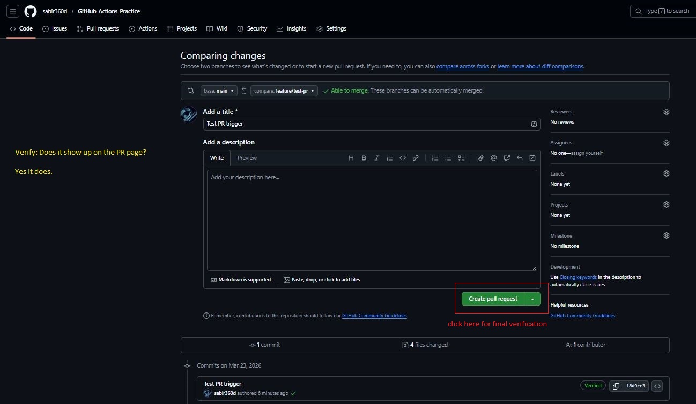 

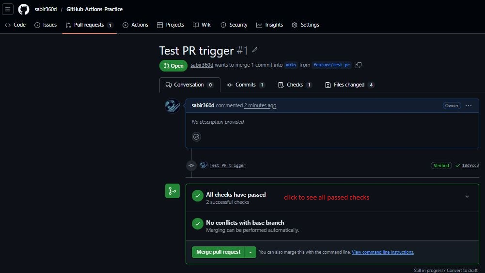 

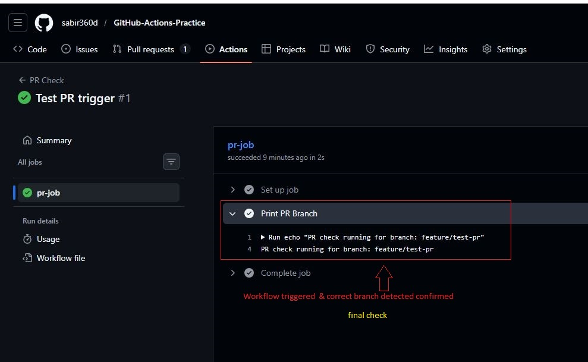 

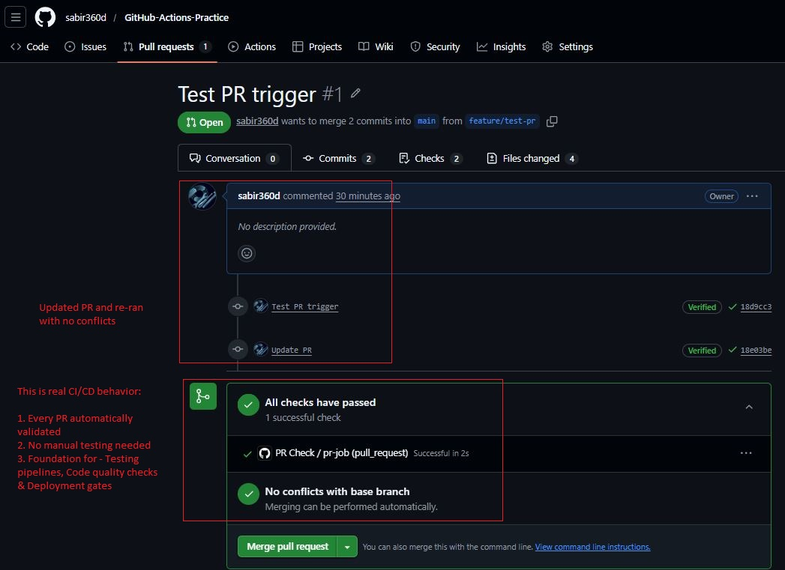

---

# Task 2: Scheduled Trigger (Cron Jobs)

## Workflow File: `.github/workflows/schedule.yml`

```yaml
name: Scheduled Job

on:
  schedule:
    - cron: '0 0 * * *'

jobs:
  scheduled-job:
    runs-on: ubuntu-latest

    steps:
      - name: Run scheduled task
        run: echo "Running daily at midnight UTC"
```

## Explanation

* `schedule` → triggers workflows automatically using cron syntax
* GitHub uses **UTC time**
* Runs only from the **default branch (main)**

## Cron Expressions

* Daily at midnight UTC:

  ```
  0 0 * * *
  ```
* Every Monday at 9 AM UTC:

  ```
  0 9 * * 1
  ```

## Key Learnings

* Scheduled jobs are useful for:

  * Nightly builds
  * Automated backups
  * Health checks
* They may not run immediately after creation

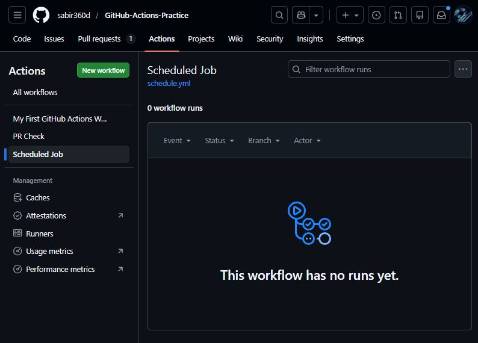

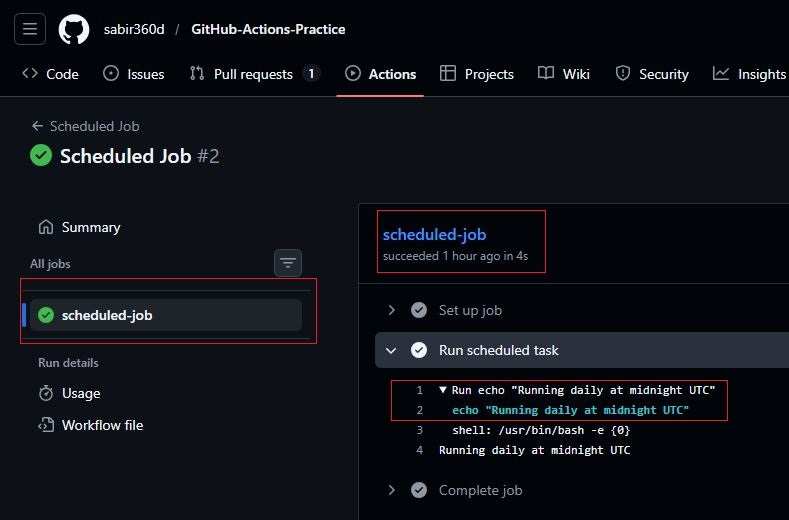


---

# Task 3: Manual Trigger (workflow_dispatch)

## Workflow File: `.github/workflows/manual.yml`

```yaml
name: Manual Workflow

on:
  workflow_dispatch:
    inputs:
      environment:
        description: "Choose environment"
        required: true
        default: "staging"

jobs:
  manual-job:
    runs-on: ubuntu-latest

    steps:
      - name: Print Environment
        run: echo "Deploying to ${{ github.event.inputs.environment }}"
```

## Explanation

* `workflow_dispatch` → allows manual execution from GitHub UI
* Inputs allow user-defined parameters

## Verification

* Triggered workflow from **Actions tab**
* Entered input (`staging`)
* Output displayed correct value in logs

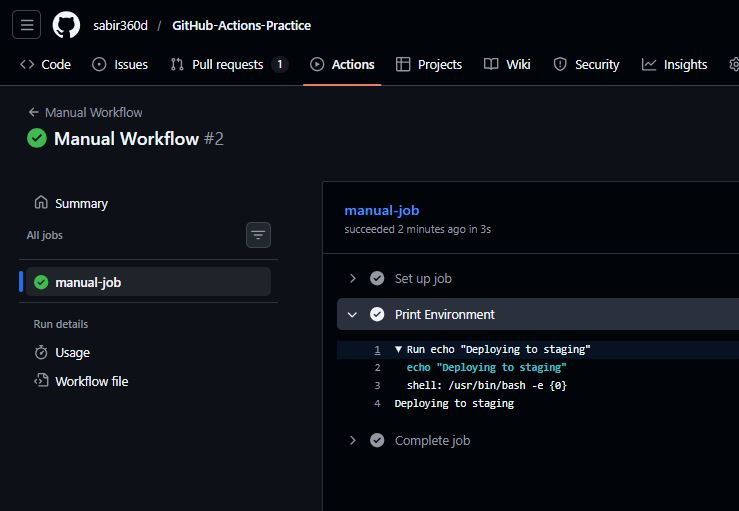

---

# Task 4: Matrix Builds

## Workflow File: `.github/workflows/matrix.yml`

```yaml
name: Matrix Build

on:
  push:

jobs:
  build:
    strategy:
      matrix:
        python-version: ["3.10", "3.11", "3.12"]

    runs-on: ubuntu-latest

    steps:
      - name: Setup Python
        uses: actions/setup-python@v5
        with:
          python-version: ${{ matrix.python-version }}

      - name: Print Version
        run: python --version
```

## Explanation

* Matrix strategy allows running jobs in parallel
* Each job runs with a different Python version

## Output

* 3 parallel jobs executed:

  * Python 3.10
  * Python 3.11
  * Python 3.12


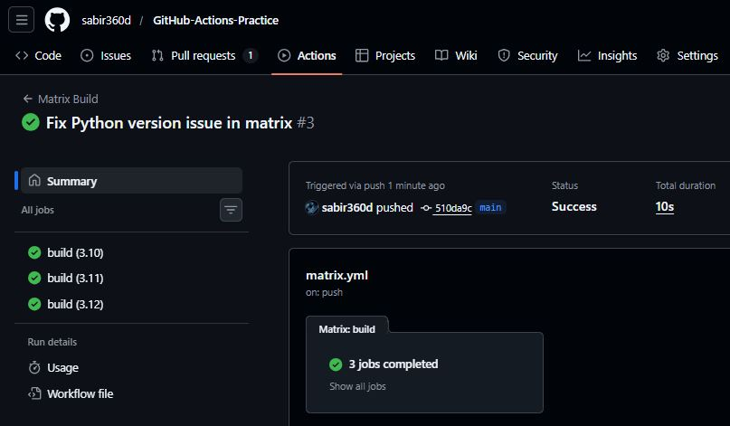

---

## Extended Matrix (OS + Python)

## Workflow File: `.github/workflows/matrixos.yml`

```yaml
name: Matrix Build OS

on:
  push:

jobs:
  build:
    strategy:
      matrix:
        os: [ubuntu-latest, windows-latest] # Define the operating systems to test against
        python-version: ["3.10", "3.11", "3.12"]

    runs-on: ${{ matrix.os }} 

    steps:
      - name: Setup Python
        uses: actions/setup-python@v5
        with:
          python-version: ${{ matrix.python-version }}

      - name: Print Version
        run: python --version
```

## Total Jobs

```
2 OS × 3 Python versions = 6 jobs
```

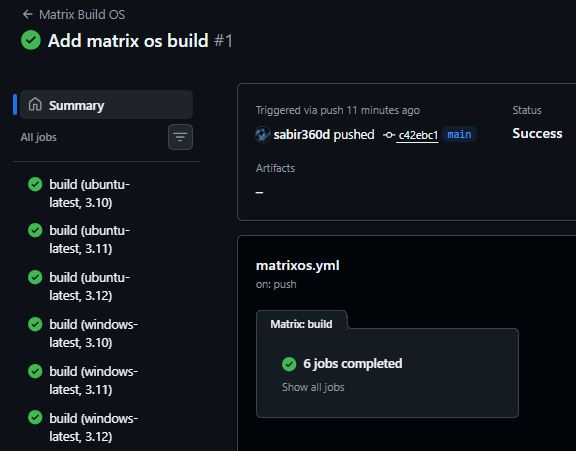

---

# Task 5: Exclude & Fail-Fast

## Workflow File 1: `.github/workflows/matrixad.yml`

```yaml
name: Matrix Build Advanced

on:
  push:

jobs:
  build:
    strategy:
      fail-fast: false
      matrix:
        os: [ubuntu-latest, windows-latest]
        python-version: ["3.10", "3.11", "3.12"]

        exclude:
          - os: windows-latest
            python-version: "3.10"

    runs-on: ${{ matrix.os }}

    steps:
      - name: Setup Python
        uses: actions/setup-python@v5
        with:
          python-version: ${{ matrix.python-version }}

      - name: Force Failure (Testing)
        run: |
          if [ "${{ matrix.python-version }}" = "3.11" ]; then
            exit 1
          fi

      - name: Print Version
        run: python --version
```

---

## Workflow File 2: `.github/workflows/matrixad2.yml`

name: Matrix Build Advanced

on:
  push:

jobs:
  build:
    strategy:
      fail-fast: true # If one job fails, the others will be canceled
      matrix:
        os: [ubuntu-latest, windows-latest]
        python-version: ["3.10", "3.11", "3.12"]

        exclude: # Exclude specific combinations of OS and Python version
          - os: windows-latest # Exclude Windows with Python 3.10
            python-version: 3.10 # Exclude Windows with Python 3.10

    runs-on: ${{ matrix.os }}

    steps:
      - name: Setup Python
        uses: actions/setup-python@v5
        with:
          python-version: ${{ matrix.python-version }}

      - name: Force Failure (for testing) # This step will intentionally fail for Python 3.11 to demonstrate the fail-fast behavior
        run: | # This command will fail if the Python version is 3.11
          if [ "${{ matrix.python-version }}" = "3.11" ]; then # Check if the Python version is 3.11
            exit 1 # Exit with a non-zero status to indicate failure
          fi # If the Python version is not 3.11, this step will pass successfully

      - name: Print Version
        run: python --version

## Explanation of both the files

### Exclude

* Prevents specific combinations from running
* Example:

  * Python 3.10 on Windows is skipped

### Fail-Fast Behavior

| Setting          | Behavior                                      |
| ---------------- | --------------------------------------------- |
| `true` (default) | Stops all jobs if one fails                   |
| `false`          | Allows all jobs to complete even if one fails |

---

## Observations

* When failure was introduced:

  * With `fail-fast: true` → other jobs stopped
  * With `fail-fast: false` → all jobs continued

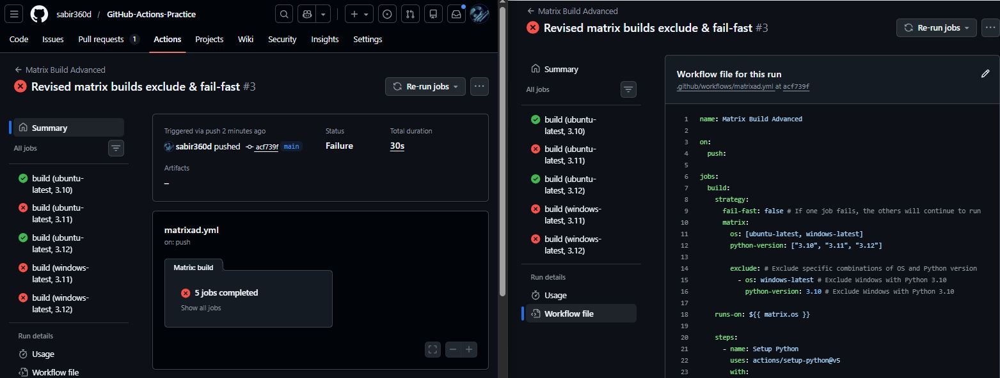

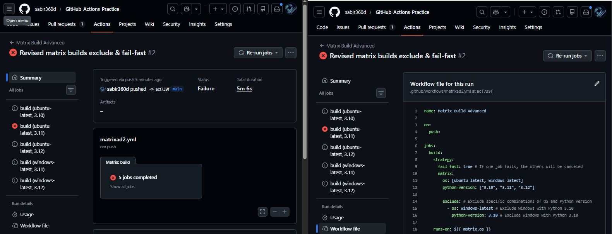

---

# Project Summary

* GitHub Actions supports multiple triggers:

  * Push
  * Pull Request
  * Schedule (cron)
  * Manual (workflow_dispatch)

* Matrix builds enable:

  * Parallel execution
  * Multi-environment testing

* Fail-fast control is critical in CI/CD pipelines

---

# Conclusion

Day 41 focused on making CI/CD pipelines:

* **Event-driven (PR, push, schedule)**
* **Flexible (manual inputs)**
* **Scalable (matrix builds)**

These concepts are essential for building **production-grade DevOps pipelines**.

---

