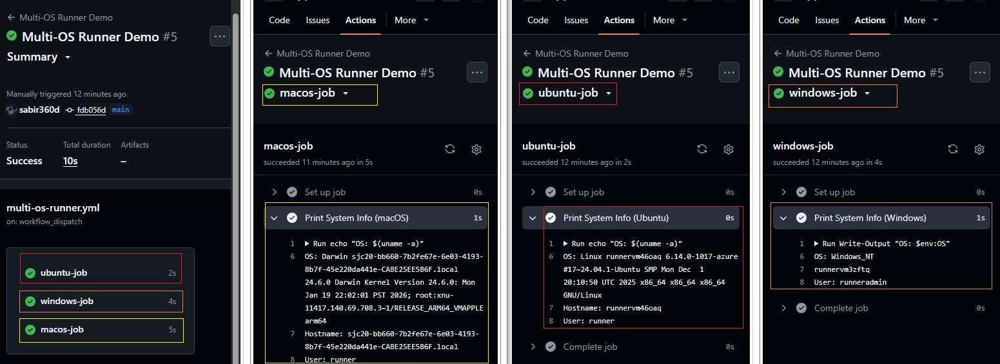
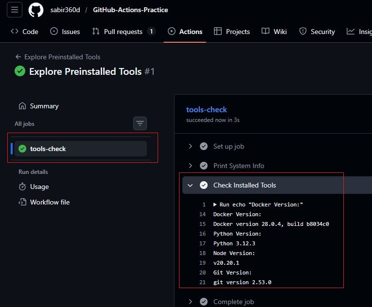
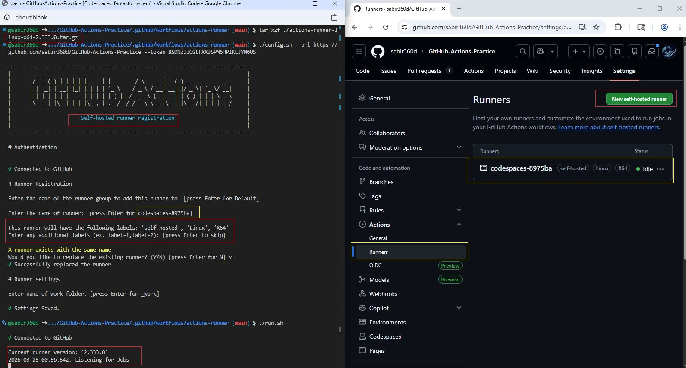
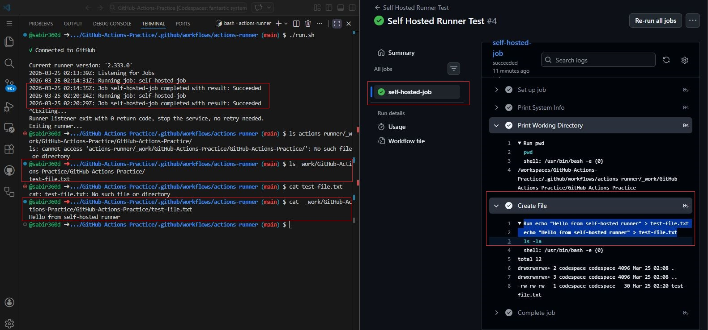
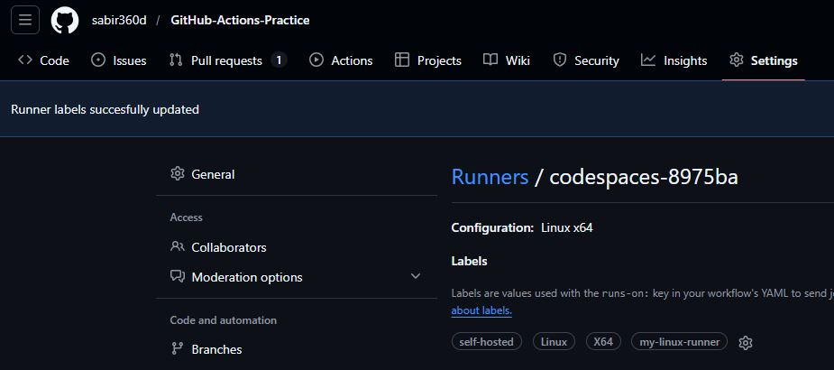
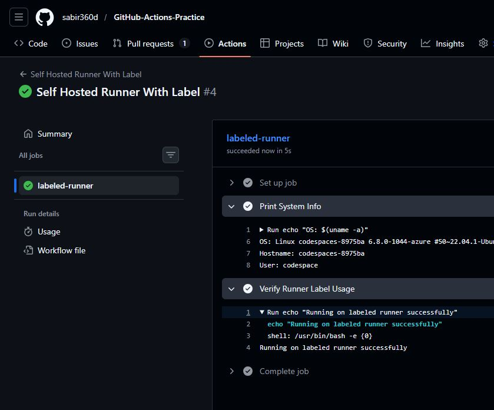
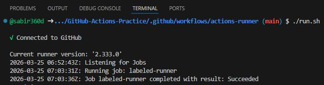

# Day 42 – Runners: GitHub-Hosted & Self-Hosted

## Task 1 – GitHub Hosted Runners

### What is a GitHub-hosted runner?
A GitHub-hosted runner is a virtual machine provided and managed by GitHub to execute workflows.

### Who manages it?
GitHub manages everything (setup, maintenance, updates).

### Created a workflow that runs on:
- ubuntu-latest
- windows-latest
- macos-latest

**Workflow File:** [GitHub Hosted Runners](workflows/multi-os-runner.yml)

Each job prints:
- OS name
- Hostname
- Current user

---

## Task 2 – Pre-installed Tools

### Why pre-installed tools matter?
- No setup time
- Faster workflows
- Standardized environments

Checked:
- Docker
- Python
- Node
- Git

**Workflow File:** [Pre-installed Tools.yml](workflows/explore-tools.yml)

---

## Task 3 – Self-Hosted Runner

- Runner set up inside Codespaces
- Connected to repository
- Status: Idle (green)

---

## Task 4 – Self-Hosted Workflow

Workflow successfully:
- Printed system info
- Printed working directory
- Created a file

**Workflow File:** [Self-Hosted Workflow](workflows/self-hosted.yml)

Verified file exists on runner machine.

---

## Task 5 – Labels

### Why labels?
- Target specific runners
- Useful in multi-runner environments

Added label:
my-linux-runner

Workflow used:
runs-on: [self-hosted, my-linux-runner]

**Workflow File:** [Labels](workflows/self-hosted-labeled.yml)

---

## Task 6 – Comparison

| Feature | GitHub-Hosted | Self-Hosted |
|--------|-------------|------------|
| Who manages it? | GitHub | You |
| Cost | Free (limited minutes) | Infrastructure cost |
| Pre-installed tools | Yes | Manual setup |
| Good for | Quick CI/CD | Custom workloads |
| Security concern | Shared environment | Full responsibility |

---

## Summary

- Used GitHub-hosted runners across 3 OS
- Explored pre-installed tools
- Set up self-hosted runner
- Ran workflows on personal machine
- Used labels to control runner selection
- All workflows triggered manually using `workflow_dispatch`

---
