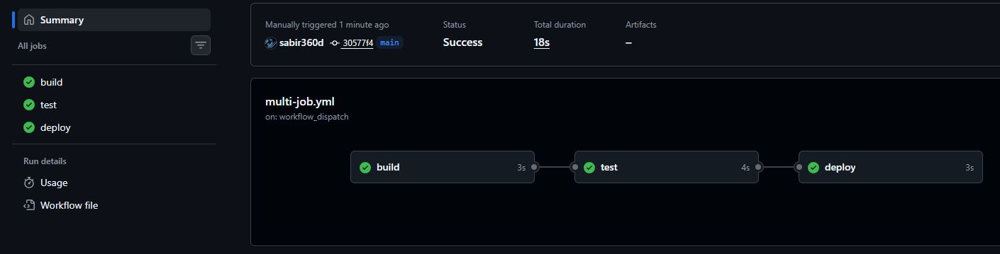
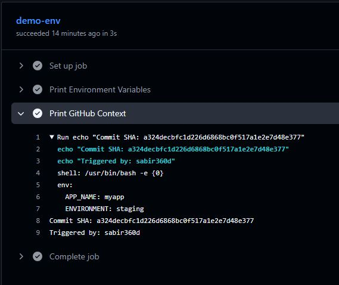
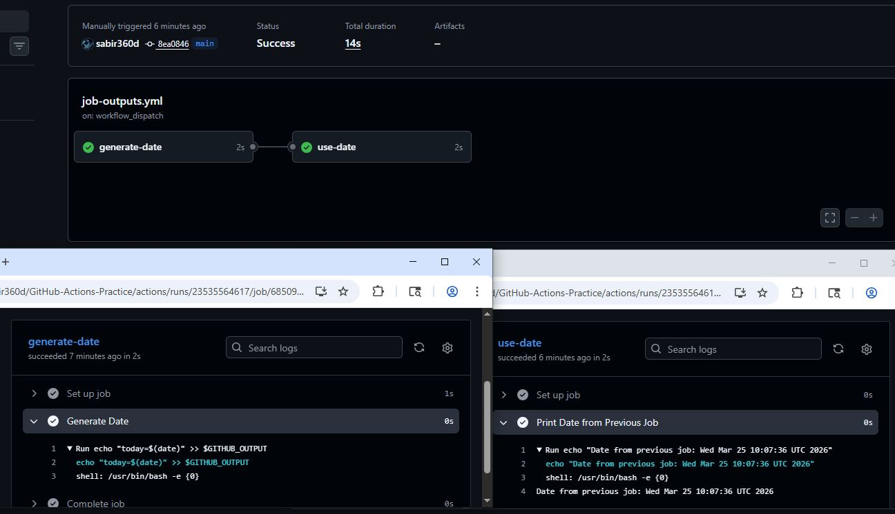
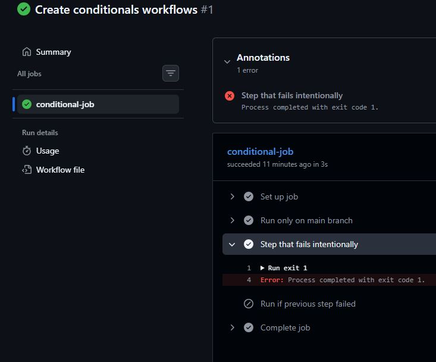
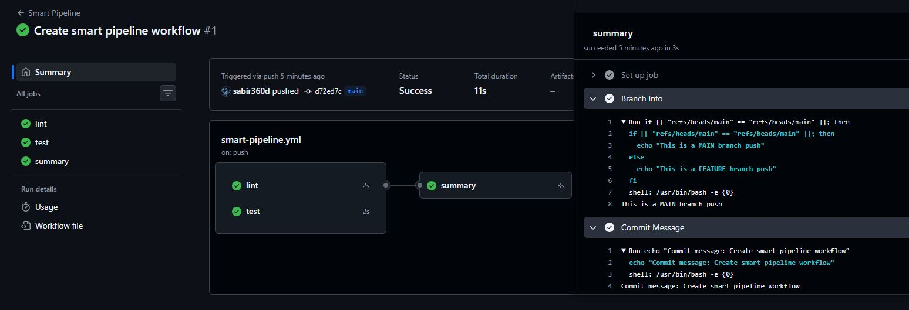

# Day 43 – Jobs, Steps, Env Vars & Conditionals

## Overview

This project is all about **controlling the flow of GitHub Actions pipelines**.

* How to run multiple jobs
* How to control execution order
* How to pass data between jobs
* How to use environment variables
* How to apply conditional logic

---

# Project Structure (important)

```
github-actions-practice/
│
├── .github/
    └── workflows/
        ├── multi-job.yml
        ├── env-vars.yml
        ├── job-outputs.yml
        ├── conditionals.yml
        └── smart-pipeline.yml

```

---

# Task 1: Multi-Job Workflow

## Objective

Create a workflow with **3 jobs**:

* build
* test
* deploy

Ensure proper execution order using dependencies.

---

**Workflow File** [Multi-Job Workflow](workflows/multi-job.yml)

---

## Key Concept: `needs`

* Defines **job dependency**
* Controls execution order
* Ensures pipeline flow

```
build → test → deploy
```



---


# Task 2: Environment Variables

## Objective

Use environment variables at:

* Workflow level
* Job level
* Step level

Also print GitHub context variables.

---


**Workflow File** [Environment Variables](workflows/env-vars.yml)

---

## Key Concept: Env Levels

| Level    | Scope                       |
| -------- | --------------------------- |
| Workflow | Available everywhere        |
| Job      | Available inside job        |
| Step     | Available only in that step |

---



---

# Task 3: Job Outputs

## Objective

* Create a job that generates output
* Pass it to another job
* Print it

---

**Workflow File** [Job Outputs](workflows/job-outputs.yml)

---

## Key Concepts

### Setting Output

```
echo "key=value" >> $GITHUB_OUTPUT
```

### Accessing Output

```
${{ needs.job-name.outputs.key }}
```

---

## Why Use Outputs?

* Share data between jobs
* Avoid recomputation
* Keep workflows modular
* Pass dynamic values (dates, versions, IDs)

---



---

# Task 4: Conditionals

## Objective

Use conditional execution in:

* Steps
* Jobs

---

**Workflow File** [Conditionals](workflows/conditionals.yml)

---

## Key Concepts

### Run on Main Branch

```
if: github.ref == 'refs/heads/main'
```

### Run if Failure

```
if: failure()
```

### Run Job Only on Push

```
if: github.event_name == 'push'
```

### continue-on-error

* Prevents workflow failure
* Allows pipeline to continue execution

---



---

# Task 5: Smart Pipeline

## Objective

Build a real pipeline with:

* Parallel jobs
* Dependency job
* Branch detection
* Commit message

---

**Workflow File** [Smart Pipeline](workflows/smart-pipeline.yml)

---

## Key Concepts

### Parallel Jobs

* `lint` and `test` run together

### Dependent Job

```
needs: [lint, test]
```

### Branch Detection

```
github.ref
```

### Commit Message

```
github.event.commits[0].message
```

---



---

# Project Summary

| Feature           | Purpose                      |
| ----------------- | ---------------------------- |
| needs             | Controls job execution order |
| env               | Stores reusable values       |
| outputs           | Pass data between jobs       |
| if                | Conditional execution        |
| continue-on-error | Prevent failure stop         |

---

# Highlights

* Pipelines can be **fully controlled**
* Jobs can **communicate with outputs**
* Env variables improve **reusability**
* Conditionals make workflows **dynamic**
* Parallel + dependent jobs = **real CI/CD design**

---