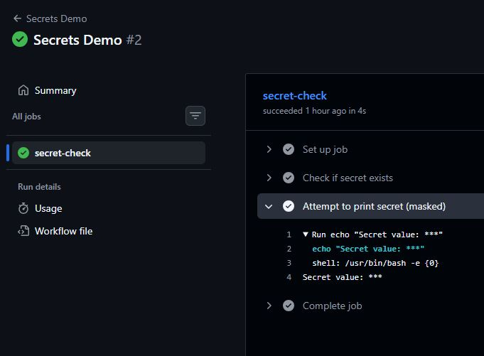
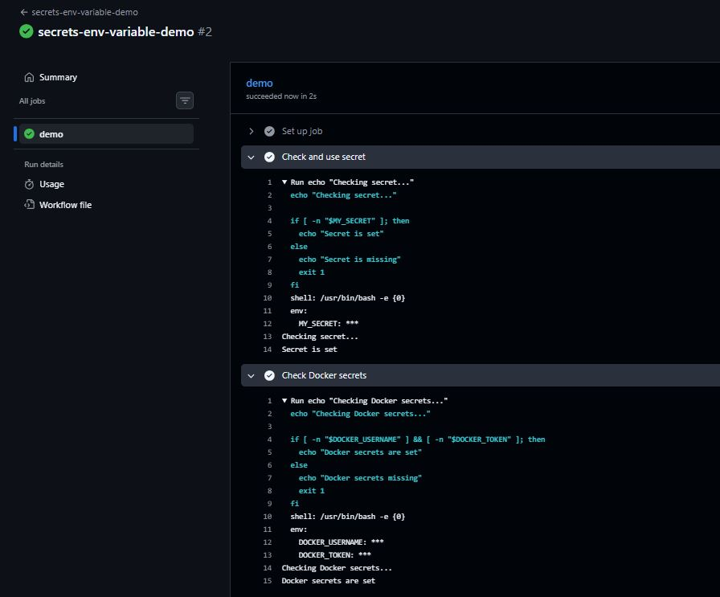
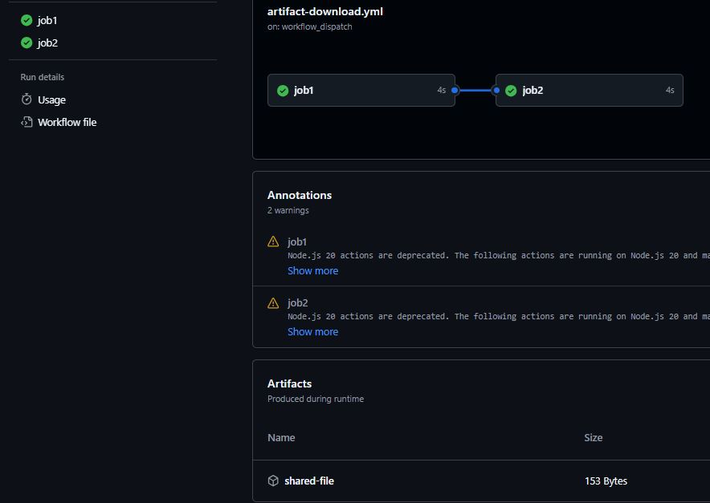
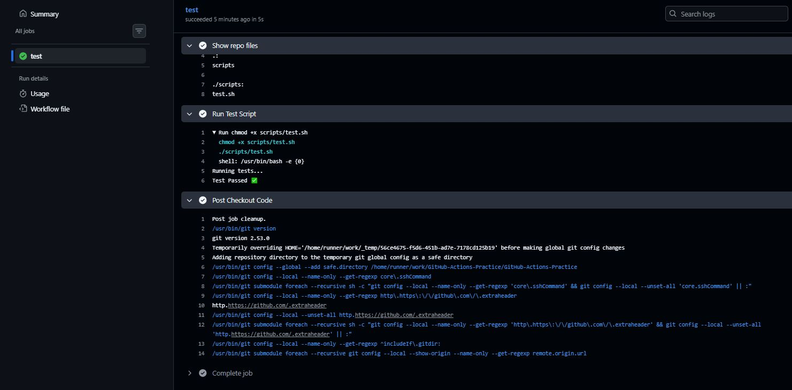
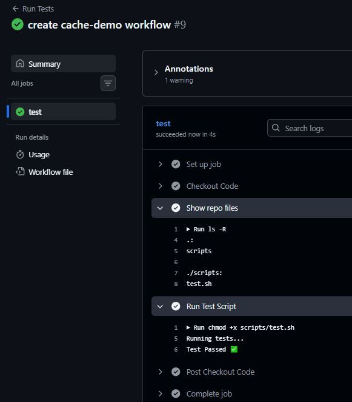

# Day 44 – Secrets, Artifacts & Running Real Tests in CI

## Overview

Today focuses on making your CI pipeline do **real-world tasks**:
- Securely handling sensitive data (Secrets)
- Storing and sharing build outputs (Artifacts)
- Running actual test scripts
- Speeding up builds using caching

---

# Task 1: GitHub Secrets

## Steps
1. Go to: Repo → Settings → Secrets and Variables → Actions
2. Add: `MY_SECRET_MESSAGE`

---

**Workflow file:** [GitHub Secrets](worflows/secrets-demo.yml)

---

## Observation
GitHub masks secrets automatically

Output will show:

``***``

## Why you should NEVER print secrets?
Logs are visible to collaborators
Secrets can be leaked via logs
Attackers can reuse credentials
Even masked values can sometimes be inferred

---

## Task 2: Use Secrets as Environment Variables

**Workflow file:** [Secrets as Environment Variables](worflows/Secrets-Environment-Variables.yml)

---

## Task 3: Upload Artifacts

**Workflow file:** [Upload Artifacts](worflows/artifact-upload.yml)

## Verification
1. Go to Actions tab
2. Open workflow run
3. Download artifact

---

## Task 4: Download Artifacts Between Jobs

**Workflow file:** [Download Artifacts Between Jobs](worflows/artifact-download.yml)

## When are artifacts used?
• Passing build outputs between jobs
• Storing logs/reports
• Sharing compiled binaries
• Debugging failures

---

## Task 5: Run Real Tests in CI

**Script**: [bash-script](worflows/scripts/test.sh)

**Workflow file:** [Run Real Tests in CI](worflows/test-run.yml)

## Break the Pipeline

### Change:

``if [ 2 -eq 3 ];``

**Fix It** Revert back → Pipeline PASSES

---

## Task 6: Caching

**Workflow:** [Caching](worflows/scripts/cache-demo.yml)

## What is being cached?

## Files in:

``~/.cache/demo``

## Where is it stored?
GitHub’s internal cache storage (not your repo)

## Benefit
Faster builds
Avoid reinstalling dependencies

---

## Key Learnings

## Secrets
Stored securely in GitHub
Automatically masked
Never print them

## Artifacts
Persist data across jobs
Useful for reports & builds

## CI Testing
Pipelines fail on non-zero exit codes
Helps catch bugs early

## Caching
Speeds up pipelines
Saves dependency install time

## Final Outcome

• Secrets handled securely

• Artifacts uploaded & downloaded

• Tests running in CI

• Cache improving performance

---
