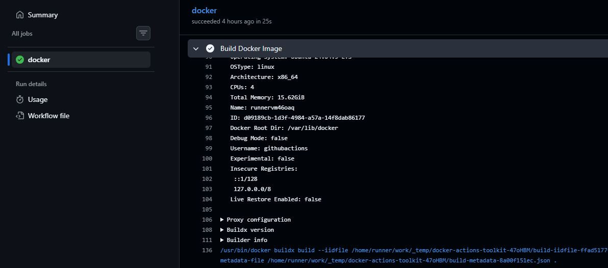
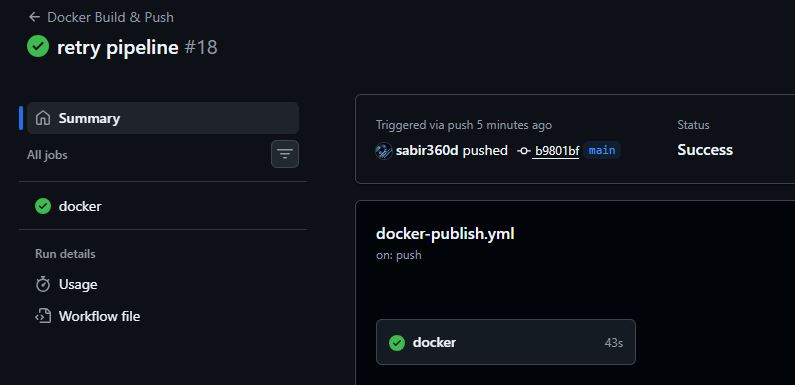
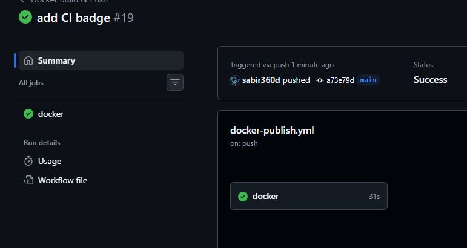
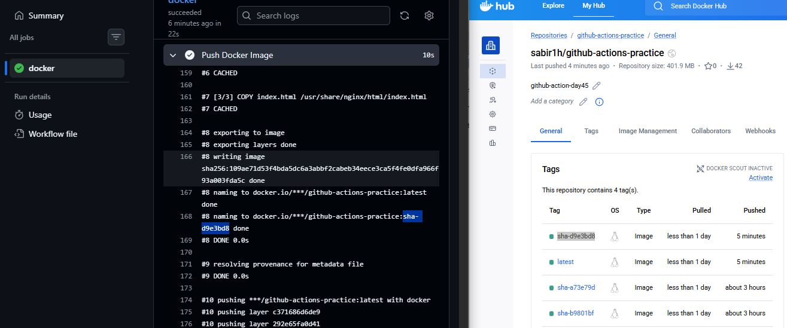
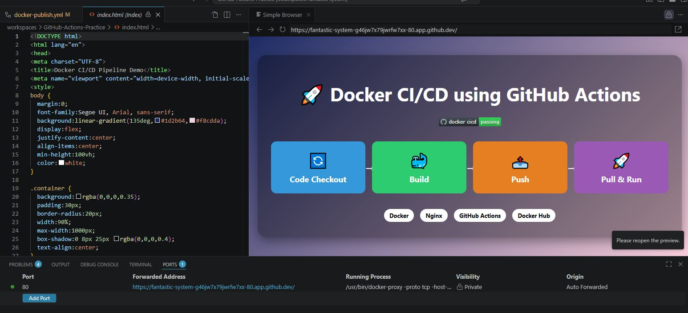
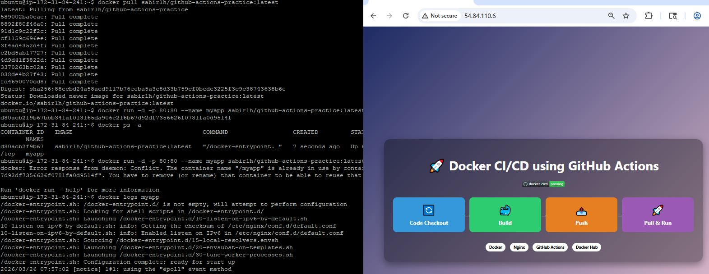

# Day 45: Docker CI/CD Pipeline

## Overview

This project demonstrates a complete **Docker CI/CD pipeline** using **GitHub Actions** and **Docker Hub**, deployed on an **EC2 instance**. The project runs a static HTML page (`index.html`).

---

## Task 1: DOCKERFILE 

[DOCKERFILE](scripts/Dockerfile)

---

## Task 2: GitHub Actions Workflow 

Below file are needed to accomplish this task:

[GitHubActionsWorkflow](scripts/docker-publish.yml)

[index.html](scripts/index.html)


```bash
git push origin main
```

## Verified:



✔ Build runs

✔ Image pushed to Docker Hub

---
## Task 3: 

**Go to:**
``Repo → Settings → Secrets → Actions``

**Add:**
DOCKER_USERNAME
DOCKER_TOKEN (Docker Hub access token, NOT password)



## Task 4: Only Push on Main

- Pushed and verified


---

## 5. Status Badge

[README](scripts/README.md)




---

## Task 6: Pull and Run It

## DockerHub final image:  

## Pull and run on VScode



---

## Summary:

1. Push Code: git push sends your code and Dockerfile to GitHub.
2. Trigger CI/CD: GitHub Actions starts the workflow on a fresh virtual runner.
3. Build Image: The runner downloads your code and builds a Docker Image.
4. Tag & Login: The image is labeled (e.g., latest) and the runner logs into Docker Hub.
5. Push to Registry: The image is uploaded to the cloud (Docker Hub).
6. Pull & Run: Any server pulls the image and starts the Container via docker run.
7. Live App: Your application is accessible (e.g., on port 3000).

## Pull and run on Ubuntu ec2: 




In short: Push → Automate Build → Store Image → Deploy Container.

---


