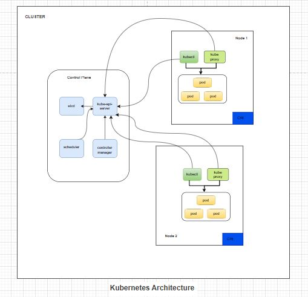
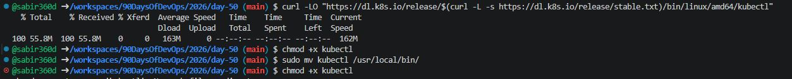
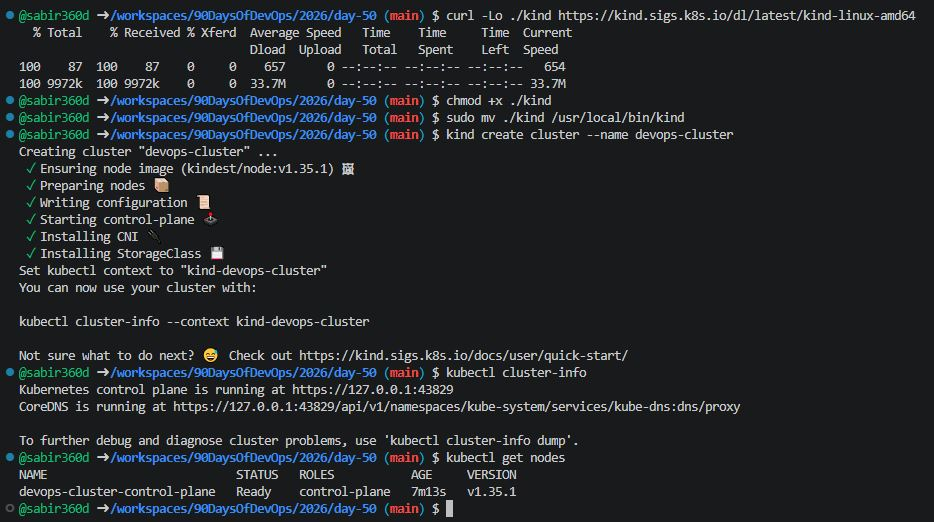
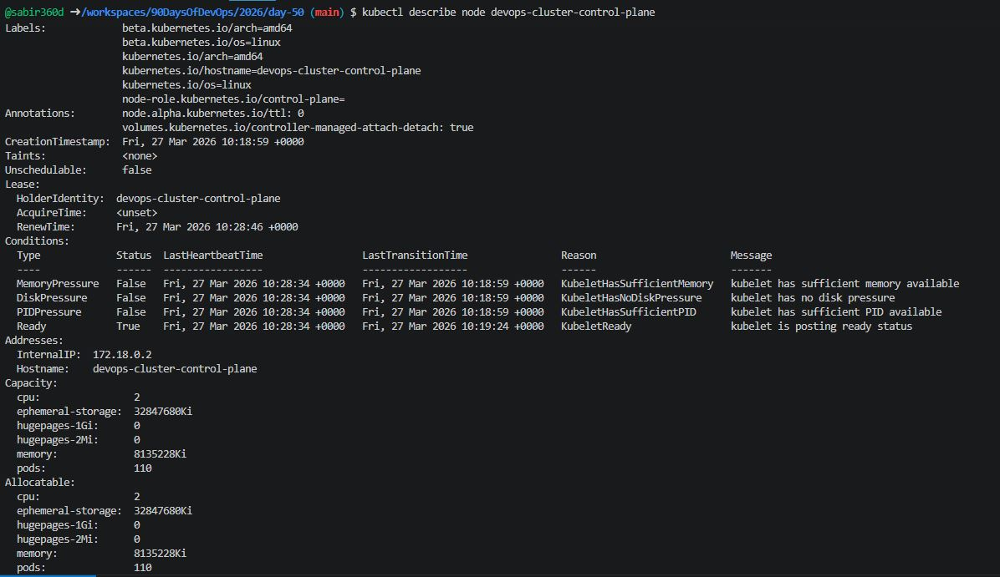
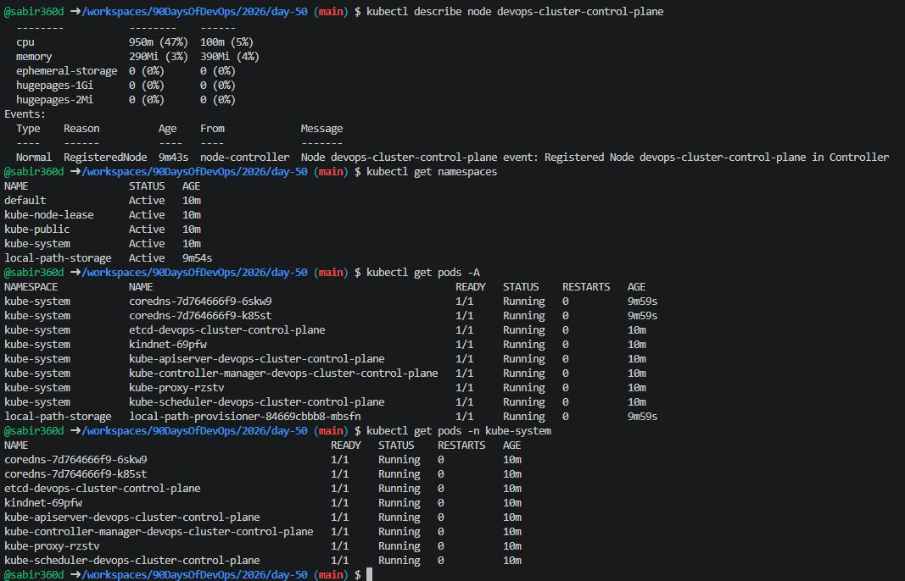
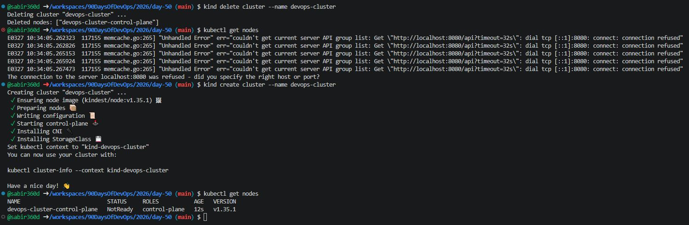

# Day 50 – Kubernetes Architecture and Cluster Setup

## Overview
Today marks the beginning of my Kubernetes journey. Moving from running single containers with Docker to managing containerized applications at scale using Kubernetes.

---

## Task 1: Kubernetes Story (From Memory)

### 1. Why was Kubernetes created?
Docker helps run containers, but it does not manage them at scale. When you have many containers across multiple servers, you need:
- Auto scheduling
- Scaling
- Self-healing
- Load balancing

Kubernetes solves this by acting as an **orchestrator**.

---

### 2. Who created Kubernetes?
Kubernetes was created by **Google**, based on their internal system called **Borg**, which they used to manage containers at massive scale.

---

### 3. Meaning of Kubernetes
- "Kubernetes" comes from Greek
- Meaning: **"Helmsman" or "Ship Pilot"**
- Short form: **K8s** (8 letters between K and S)

---

## Task 2: Kubernetes Architecture



---

### What happens when you run:
```bash
kubectl apply -f pod.yaml
```

Step-by-step:

1. kubectl sends request → API Server
2. API Server validates request
3. Data stored in etcd
4. Scheduler picks a node
5. kubelet on that node creates the pod
6. Container runtime runs the container

### What happens if the API server goes down?
1. Cluster becomes unmanageable
2. No new deployments
3. Existing apps keep running

### What happens if a worker node goes down?
1. Pods on that node are lost
2. Scheduler recreates them on other nodes

---

## Task 3: Install kubectl (Codespaces)

Codespaces is Linux-based, so run:
```bash
curl -LO "https://dl.k8s.io/release/$(curl -L -s https://dl.k8s.io/release/stable.txt)/bin/linux/amd64/kubectl"

chmod +x kubectl

sudo mv kubectl /usr/local/bin/
```
### Verify:
```bash
kubectl version --client
```



---

## Task 4: Set Up Your Local Cluster
Installing kind (Kubernetes in Docker) for a fully functional Kubernetes cluster on my machine.

# Install kind
# Linux
```bash
curl -Lo ./kind https://kind.sigs.k8s.io/dl/latest/kind-linux-amd64
chmod +x ./kind
sudo mv ./kind /usr/local/bin/kind
```

# Create a cluster
```bash
kind create cluster --name devops-cluster
```

# Verify
```bash
kubectl cluster-info
kubectl get nodes
```
### Choice Explanation

I chose kind because:

1. Works inside Codespaces
2. Faster setup
3. No VM required
4. Uses Docker (already installed)



---

## Task 5: Explore Your Cluster
### Cluster Info
```bash
kubectl cluster-info
```

### Nodes
```bash
kubectl get nodes
```

Detailed Node Info
```bash
kubectl describe node <node-name>
```

### Namespaces
```bash
kubectl get namespaces
```

### All Pods
```bash
kubectl get pods -A
```

### System Pods
```bash
kubectl get pods -n kube-system
```
### kube-system Components Explained

| Pod Name                | Purpose                 |
| ----------------------- | ----------------------- |
| etcd                    | Stores cluster data     |
| kube-apiserver          | Entry point to cluster  |
| kube-scheduler          | Assigns pods to nodes   |
| kube-controller-manager | Maintains desired state |
| kube-proxy              | Handles networking      |
| coredns                 | DNS for cluster         |






---

## Task 6: Cluster Lifecycle

### Delete Cluster
```bash
kind delete cluster --name devops-cluster
```

### Recreate Cluster
```bash
kind create cluster --name devops-cluster
```

### Verify Again
```bash
kubectl get nodes
```




### kubeconfig Explained
### What is kubeconfig?
1. Configuration file used by kubectl
2. Stores cluster connection details
3. Contains:
    - Cluster info
    - User credentials
    - Contexts

### Location:
```
~/.kube/config
```


## Useful Commands
```bash
kubectl config current-context
kubectl config get-contexts
kubectl config view
```

## Project Summary
- Kubernetes manages containers at scale
- Control Plane manages cluster decisions
- Worker Nodes run applications
- kind is best for local development in Codespaces
- kubectl is your main tool to interact with cluster
- Docker runs containers
- Kubernetes manages them at scale

---