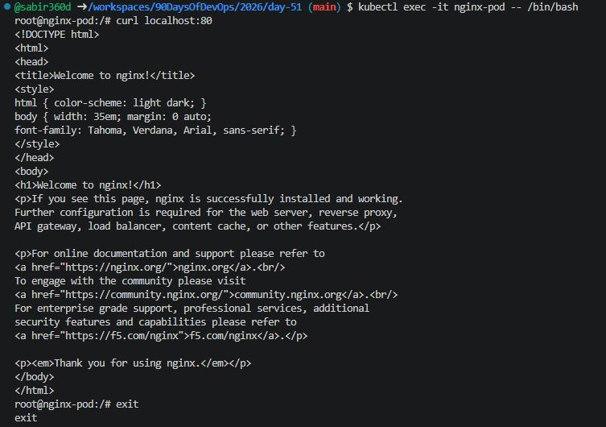
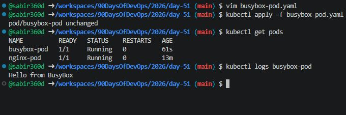
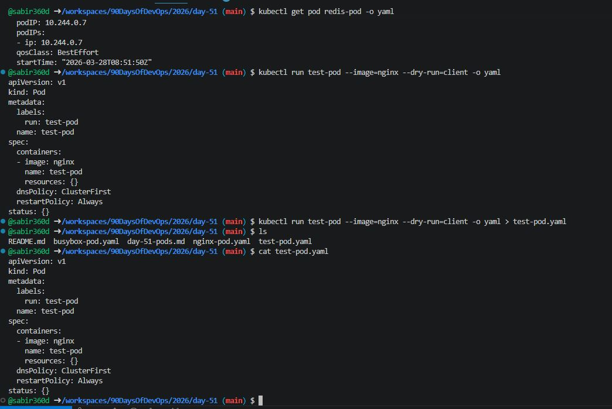
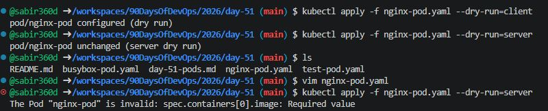
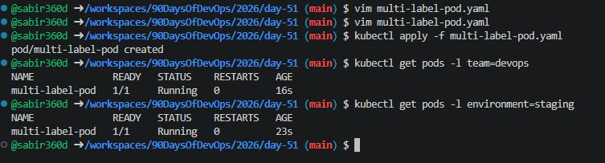
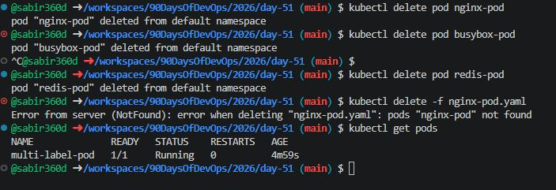

# Day 51 – Kubernetes Manifests and Pods

## Overview

Today I learned how to:
- Understand Kubernetes manifest structure
- Create Pods using YAML
- Run and inspect containers inside Pods
- Use labels and filtering
- Understand imperative vs declarative approach

---

### 1. Start Kubernetes Cluster

Using kind:

```bash
kind create cluster
```

Verify:

```bash
kubectl get nodes
```

---

## Task 1: Create Your First Pod (Nginx)

### nginx-pod.yaml

```yaml
apiVersion: v1     # API version
kind: Pod          # Resource type
metadata:          # Identity (name + labels)
  name: nginx-pod
  labels:
    app: nginx
spec:              # Desired state
  containers:
  - name: nginx
    image: nginx:latest
    ports:
    - containerPort: 80
```

### Apply it

```bash
kubectl apply -f nginx-pod.yaml
```

### Verify it

```bash
kubectl get pods
kubectl get pods -o wide
```

### Wait until the STATUS shows Running. Then explore:

```bash
# Detailed info about the pod
kubectl describe pod nginx-pod

# Read the logs
kubectl logs nginx-pod

# Get a shell inside the container
kubectl exec -it nginx-pod -- /bin/bash

# Inside the container, run:
curl localhost:80
exit
```

**Verify:** Can you see the Nginx welcome page when you curl from inside the pod?
### Yes, Nginx welcome page is verifiable when you curl from inside the pod



---

## Task 2: Create a Custom Pod (BusyBox)

### busybox-pod.yaml

```yaml
apiVersion: v1
kind: Pod
metadata:
  name: busybox-pod
  labels:
    app: busybox
    environment: dev
spec:
  containers:
  - name: busybox
    image: busybox:latest
    command: ["sh", "-c", "echo Hello from BusyBox && sleep 3600"]

```

### Apply & Verify

```bash
kubectl apply -f busybox-pod.yaml
```

```bash
kubectl get pods
kubectl logs busybox-pod
```

Notice the command field — BusyBox does not run a long-lived server like Nginx. Without a command that keeps it running, the container would exit immediately and the pod would go into CrashLoopBackOff.

**Verify:** Can you see "Hello from BusyBox" in the logs?
**Yes**



---

### Task 3: Imperative vs Declarative
You have been using the declarative approach (writing YAML, then `kubectl apply`). Kubernetes also supports imperative commands:

```bash
# Create a pod without a YAML file
kubectl run redis-pod --image=redis:latest

# Check it
kubectl get pods
```

Now extract the YAML that Kubernetes generated:
```bash
kubectl get pod redis-pod -o yaml
```

Compare this output with your hand-written manifests. Notice how much extra metadata Kubernetes adds automatically (status, timestamps, uid, resource version).

You can also use dry-run to generate YAML without creating anything:
```bash
kubectl run test-pod --image=nginx --dry-run=client -o yaml
```

This is a powerful trick — use it to quickly scaffold a manifest, then customize it.

**Verify:** Save the dry-run output to a file and compare its structure with your nginx-pod.yaml. What fields are the same? What is different?

### Dry Run (Generate without creating)

```bash
kubectl run test-pod --image=nginx --dry-run=client -o yaml > test-pod.yaml
```




### Key Difference

| Imperative | Declarative |
|------------|------------|
| Quick | Production-ready |
| One-time | Version controlled |
| Hard to track | Easy to maintain |

---

### Task 4: Validate Before Applying
Before applying a manifest, you can validate it:

```bash
# Check if the YAML is valid without actually creating the resource
kubectl apply -f nginx-pod.yaml --dry-run=client

# Validate against the cluster's API (server-side validation)
kubectl apply -f nginx-pod.yaml --dry-run=server
```

Now intentionally break your YAML (remove the `image` field or add an invalid field) and run dry-run again. See what error you get.

**Verify:** What error does Kubernetes give when the image field is missing?

### Error Test

Remove image field → run again

**Error:**

```bash output
The Pod "nginx-pod" is invalid: spec.containers[0].image: Required value
```



---

### Task 5: Pod Labels and Filtering
Labels are how Kubernetes organizes and selects resources. You added labels in your manifests — now use them:

```bash
# List all pods with their labels
kubectl get pods --show-labels

# Filter pods by label
kubectl get pods -l app=nginx
kubectl get pods -l environment=dev

# Add a label to an existing pod
kubectl label pod nginx-pod environment=production

# Verify
kubectl get pods --show-labels

# Remove a label
kubectl label pod nginx-pod environment-
```

Write a manifest for a third pod with at least 3 labels (app, environment, team). Apply it and practice filtering.

## Third pod with at least 3 labels (app, environment, team)

### multi-label-pod.yaml

```yaml
apiVersion: v1
kind: Pod
metadata:
  name: multi-label-pod
  labels:
    app: my-app
    environment: staging
    team: devops
spec:
  containers:
  - name: nginx
    image: nginx:latest
```

### Apply

```bash
kubectl apply -f multi-label-pod.yaml
```

### Filter

```bash
kubectl get pods -l team=devops
kubectl get pods -l environment=staging
```



---

## Task 6 – Cleanup
Delete all the pods you created:

```bash
# Delete by name
kubectl delete pod nginx-pod
kubectl delete pod busybox-pod
kubectl delete pod redis-pod

# Or delete using the manifest file
kubectl delete -f nginx-pod.yaml

# Verify everything is gone
kubectl get pods
```

Notice that when you delete a standalone Pod, it is gone forever. There is no controller to recreate it. This is why in production you use Deployments instead of bare Pods.


```bash
kubectl get pods
```



---

## Highlights

What happens when you delete a Pod?

- Pod is permanently deleted  
- It is NOT recreated automatically  
- No self-healing  

---

## Important Commands Cheat Sheet

```bash
kubectl apply -f file.yaml
kubectl get pods
kubectl describe pod <name>
kubectl logs <name>
kubectl exec -it <name> -- /bin/sh
kubectl delete pod <name>
```

---

## Summary

- How to write Kubernetes YAML manifests  
- How to deploy Pods manually  
- How to inspect and debug containers  
- How labels work for filtering  
- Why declarative approach is preferred  

---
