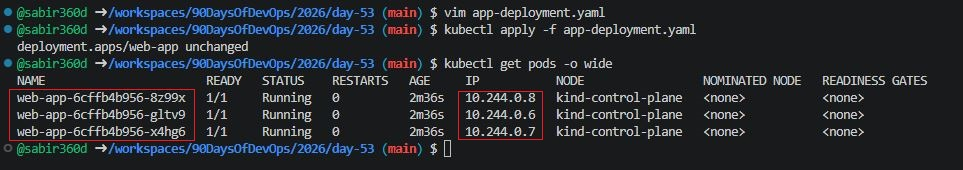
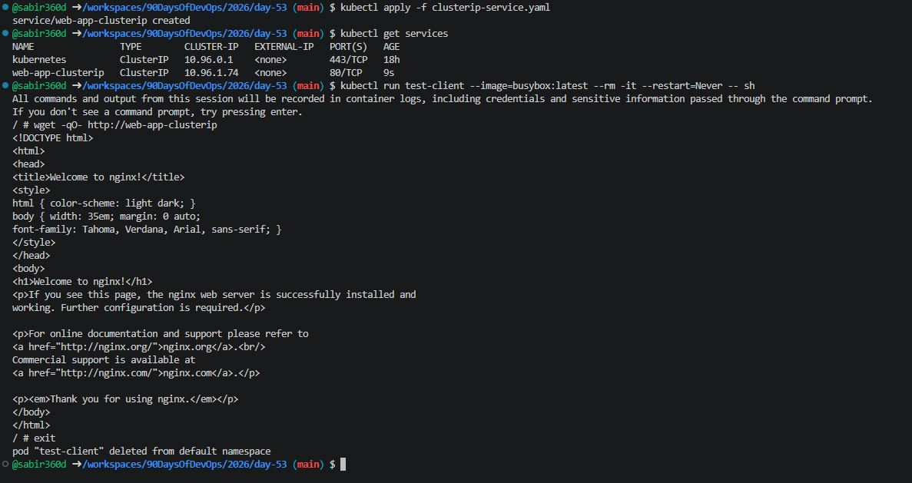
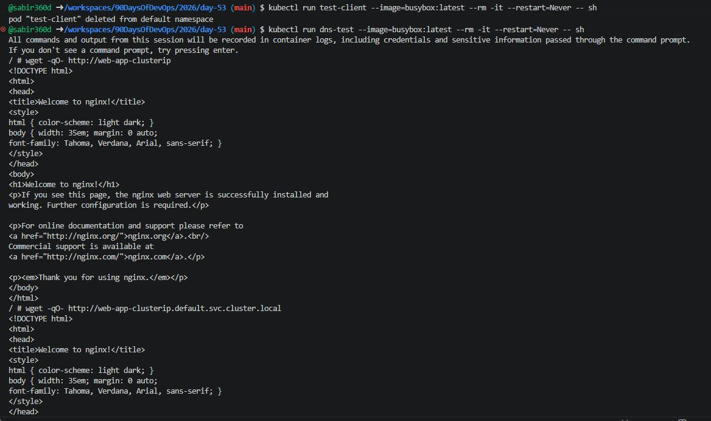
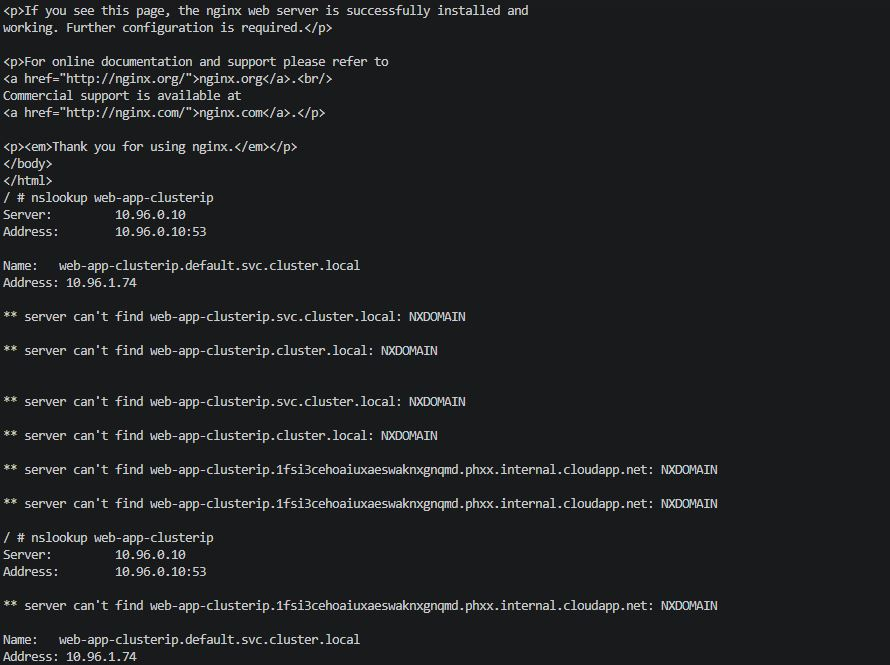
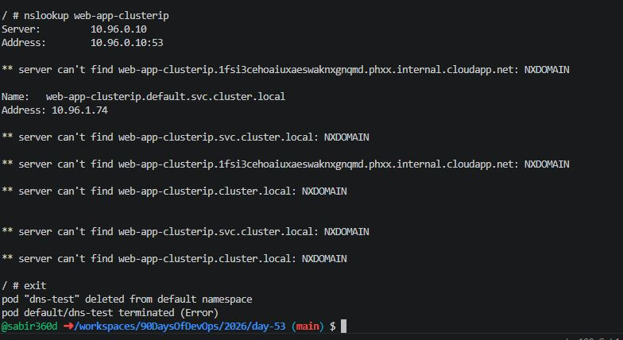
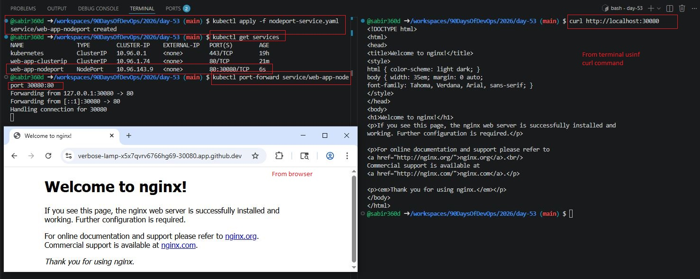
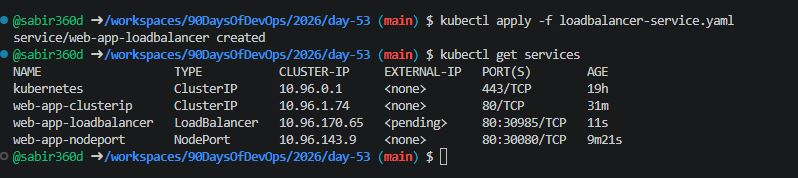
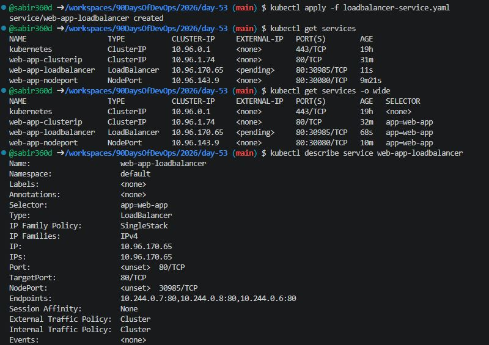
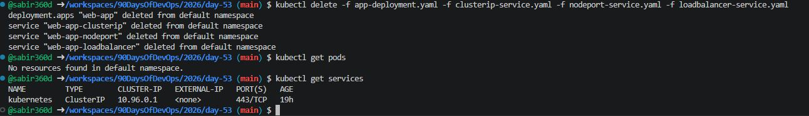

# Day 53 – Kubernetes Services

## Task
You have Deployments running multiple Pods, but how do you actually talk to them? Pods get random IP addresses that change every time they restart. Services solve this by giving your Pods a stable network endpoint. Today you will create different types of Services and understand when to use each one.

---

## Expected Output
- A Deployment exposed using ClusterIP, NodePort, and LoadBalancer services
- Verified Pod-to-Service communication from inside the cluster
- A markdown file: `day-53-services.md`
- Screenshot of `kubectl get services` showing your running services

---

## Why Services?

Every Pod gets its own IP address. But there are two problems:
1. Pod IPs are **not stable** — when a Pod restarts or gets replaced, it gets a new IP
2. A Deployment runs **multiple Pods** — which IP do you connect to?

A Service solves both problems. It provides:
- A **stable IP and DNS name** that never changes
- **Load balancing** across all Pods that match its selector

```
[Client] --> [Service (stable IP)] --> [Pod 1]
                                   --> [Pod 2]
                                   --> [Pod 3]
```

---

## Challenge Tasks

### Task 1: Deploy the Application

Create `app-deployment.yaml`:

```yaml
apiVersion: apps/v1
kind: Deployment
metadata:
  name: web-app
  labels:
    app: web-app
spec:
  replicas: 3
  selector:
    matchLabels:
      app: web-app
  template:
    metadata:
      labels:
        app: web-app
    spec:
      containers:
      - name: nginx
        image: nginx:1.25
        ports:
        - containerPort: 80
```

Apply it:

```bash
kubectl apply -f app-deployment.yaml
kubectl get pods -o wide
```

**Verification:**
- All 3 Pods are running
- Their IPs are noted (they will change if restarted)



---

### Task 2: ClusterIP Service (Internal Access)

Create `clusterip-service.yaml`:

```yaml
apiVersion: v1
kind: Service
metadata:
  name: web-app-clusterip
spec:
  type: ClusterIP
  selector:
    app: web-app
  ports:
  - port: 80
    targetPort: 80
```

Apply and check:

```bash
kubectl apply -f clusterip-service.yaml
kubectl get services
```

Test from inside cluster:

```bash
kubectl run test-client --image=busybox:latest --rm -it --restart=Never -- sh

wget -qO- http://web-app-clusterip
exit
```

**Verification:**
- Service responds with Nginx page
- Multiple requests are load-balanced



---

### Task 3: Discover Services with DNS

Test DNS resolution:

```bash
kubectl run dns-test --image=busybox:latest --rm -it --restart=Never -- sh

# Short name
wget -qO- http://web-app-clusterip

# Full DNS
wget -qO- http://web-app-clusterip.default.svc.cluster.local

# DNS lookup
nslookup web-app-clusterip

exit
```

**Verification:**
- DNS resolves to same ClusterIP
- Matches `kubectl get services`







---

### Task 4: NodePort Service (External Access)

Create `nodeport-service.yaml`:

```yaml
apiVersion: v1
kind: Service
metadata:
  name: web-app-nodeport
spec:
  type: NodePort
  selector:
    app: web-app
  ports:
  - port: 80
    targetPort: 80
    nodePort: 30080
```

Apply:

```bash
kubectl apply -f nodeport-service.yaml
kubectl get services
```

Access:

```bash
# Bypass NodePort completely if curl doesn't work
kubectl port-forward service/web-app-nodeport 30080:80

# Docker Desktop / Codespaces
curl http://localhost:30080
```

**Verification:**
- Nginx page is accessible from terminal and browser



---

### Task 5: LoadBalancer Service

Create `loadbalancer-service.yaml`:

```yaml
apiVersion: v1
kind: Service
metadata:
  name: web-app-loadbalancer
spec:
  type: LoadBalancer
  selector:
    app: web-app
  ports:
  - port: 80
    targetPort: 80
```

Apply:

```bash
kubectl apply -f loadbalancer-service.yaml
kubectl get services
```

**Verification:**
- EXTERNAL-IP shows `<pending>` in local clusters
- This is expected without a cloud provider



---

### Task 6: Compare Service Types

```bash
kubectl get services -o wide
```

| Type | Accessible From | Use Case |
|------|----------------|----------|
| ClusterIP | Inside cluster | Internal service communication |
| NodePort | External via Node IP | Dev/testing |
| LoadBalancer | External via cloud LB | Production |

Inspect:

```bash
kubectl describe service web-app-loadbalancer
```

**Verification:**
- LoadBalancer includes ClusterIP and NodePort



---

### Task 7: Clean Up

```bash
kubectl delete -f app-deployment.yaml
kubectl delete -f clusterip-service.yaml
kubectl delete -f nodeport-service.yaml
kubectl delete -f loadbalancer-service.yaml

kubectl get pods
kubectl get services
```

**Verification:**
- Only default `kubernetes` service remains



---

## Concepts Learned

### What Problem Services Solve
Services provide:
- Stable network identity for Pods
- Load balancing across multiple Pods
- Decoupling between clients and Pods

---

### Service Types Explained

#### ClusterIP
- Default type
- Internal-only communication
- Used for microservices communication

#### NodePort
- Exposes service on node IP + port
- Accessible externally
- Good for testing and dev

#### LoadBalancer
- Creates external load balancer (cloud)
- Used in production
- Automatically includes NodePort + ClusterIP

---

### Kubernetes DNS

Format:
```
<service-name>.<namespace>.svc.cluster.local
```

Examples:
- `web-app-clusterip`
- `web-app-clusterip.default.svc.cluster.local`

---

### Endpoints

Endpoints represent the actual Pod IPs behind a Service.

Check them:

```bash
kubectl get endpoints web-app-clusterip
```

This shows:
- Which Pods are receiving traffic
- Real backend IP addresses

---

## Key Notes

- Service selector must match Pod labels
- `port` = Service port
- `targetPort` = container port
- NodePort range: 30000–32767
- Use temporary pods to test internal connectivity
- LoadBalancer won’t work fully on local clusters

---