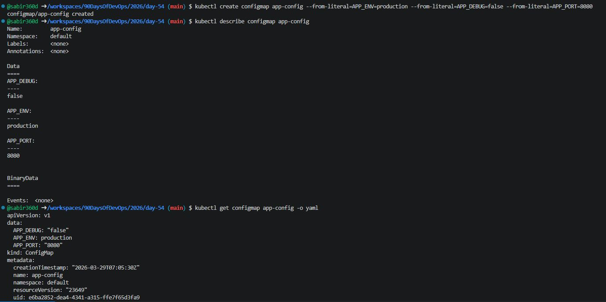
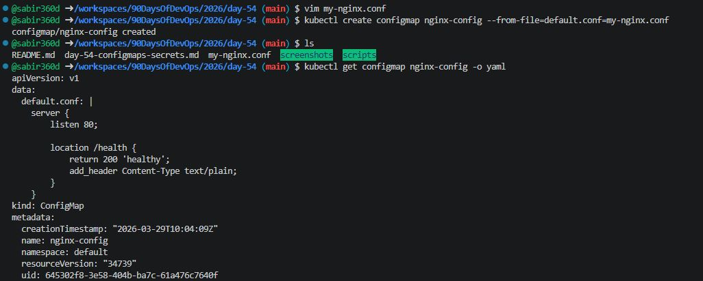
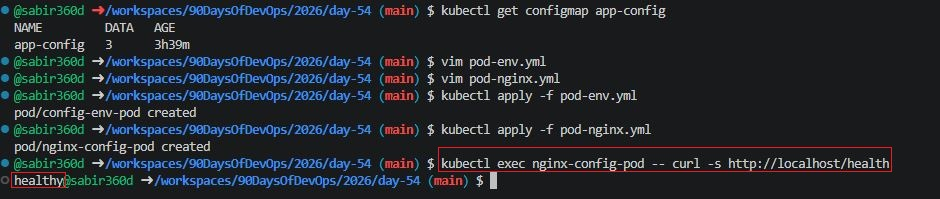
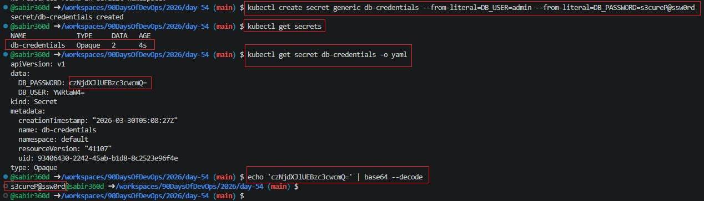
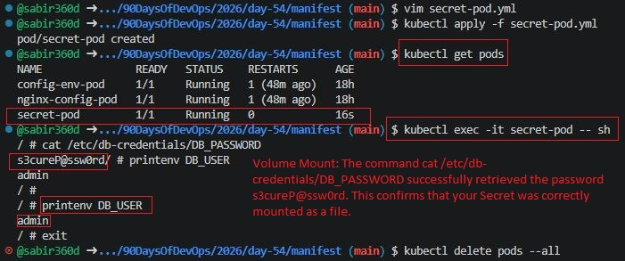
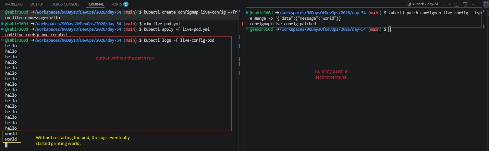

# Day 54 – Kubernetes ConfigMaps and Secrets

## Task
Your application needs configuration — database URLs, feature flags, API keys. Hardcoding these into container images means rebuilding every time a value changes. Kubernetes solves this with ConfigMaps for non-sensitive config and Secrets for sensitive data.

---

### Task 1: Create a ConfigMap from Literals
1. Use `kubectl create configmap` with `--from-literal` to create a ConfigMap called `app-config` with keys `APP_ENV=production`, `APP_DEBUG=false`, and `APP_PORT=8080`
2. Inspect it with `kubectl describe configmap app-config` and `kubectl get configmap app-config -o yaml`
3. Notice the data is stored as plain text — no encoding, no encryption

**Verify:** Can you see all three key-value pairs?
- Yes. See screenshot below:



---

### Task 2: Create a ConfigMap from a File
1. Write a custom Nginx config file (my-nginx.conf) that adds a `/health` endpoint returning "healthy"

```nginx
server {
    listen 80;

    location /health {
        return 200 'healthy';
        add_header Content-Type text/plain;
    }
}
```

2. Create a ConfigMap from this file using:
```bash
kubectl create configmap nginx-config --from-file=default.conf=<your-file>

# I'll use the below command 
kubectl create configmap nginx-config --from-file=default.conf=my-nginx.conf

```

3. The key name (`default.conf`) becomes the filename when mounted into a Pod

**Verify:** Does `kubectl get configmap nginx-config -o yaml` show the file contents?
- Yes. See screenshot below:



---

### Task 3: Use ConfigMaps in a Pod
- First, make sure you have the app-config ConfigMap created (from Task 1). This manifest will inject every key in that ConfigMap as an environment variable and print them.
```bash
kubectl get configmap app-config
```

### 1. Pod with envFrom (Environment Variables)
#### File: pod-env.yaml

```yml
apiVersion: v1
kind: Pod
metadata:
  name: config-env-pod
spec:
  containers:
    - name: busybox
      image: busybox
      command: ["sh", "-c", "env && sleep 3600"]
      envFrom:
        - configMapRef:
            name: app-config
```

```bash
kubectl apply -f pod-env.yml
```

### 2. Pod with Volume Mount (Nginx Config)
This manifest takes your nginx-config and "projects" it as a real file inside the Nginx container at the specific path where Nginx looks for configurations.
#### File: pod-nginx.yaml

```yml
apiVersion: v1
kind: Pod
metadata:
  name: nginx-config-pod
spec:
  containers:
    - name: nginx-container
      image: nginx
      ports:
        - containerPort: 80
      volumeMounts:
        - name: config-volume
          mountPath: /etc/nginx/conf.d  # This is where Nginx reads .conf files
  volumes:
    - name: config-volume
      configMap:
        name: nginx-config  # The ConfigMap created in Task 2

```

```bash
kubectl apply -f pod-nginx.yml
```

Test:
```bash
kubectl exec nginx-config-pod -- curl -s http://localhost/health
```

**Verify:** Does the `/health` endpoint respond?
- Yes. See screenshot below:



#### Success! That healthy output confirms two major things:
1. Volume Mounting worked: Kubernetes successfully took the default.conf key from your ConfigMap and turned it into a real file at /etc/nginx/conf.d/default.conf.
2. Nginx picked up the config: The Nginx process read that file and is now serving your custom /health endpoint instead of just the default welcome page.

- Notice how the output healthy@sabir360d is all on one line? That’s because your Nginx config returns plain text without a "newline" character at the end—perfectly normal for a simple health check.

---

### Task 4: Create a Secret
1. Create a Secret:
```bash
kubectl create secret generic db-credentials --from-literal=DB_USER=admin --from-literal=DB_PASSWORD=s3cureP@ssw0rd
```

2. Inspect it:
```bash
kubectl get secret db-credentials -o yaml
```

3. Decode a value:
```bash
echo '<base64-value>' | base64 --decode # general synatx

# replace <base64-value> by the actual DB_PASSWORD 
echo 'czNjdXJlUEBzc3cwcmQ=' | base64 --decode

```

**Verify:** Can you decode the password back to plaintext?
- Yes, you can easily decode the password back to plaintext. Because Kubernetes Secrets are Base64-encoded, they are not encrypted by default; anyone with access to the Secret can reveal the original value. 



---

### Task 5: Use Secrets in a Pod
#### Pod Manifest (secret-pod.yml)

```yml
apiVersion: v1
kind: Pod
metadata:
  name: secret-pod
spec:
  containers:
    - name: busybox
      image: busybox
      command: ["sh", "-c", "sleep 3600"]
      env:
        - name: DB_USER
          valueFrom:
            secretKeyRef:
              name: db-credentials
              key: DB_USER
      volumeMounts:
        - name: secret-volume
          mountPath: /etc/db-credentials
          readOnly: true
  volumes:
    - name: secret-volume
      secret:
        secretName: db-credentials
```
#### Create the Pod
```bash
kubectl apply -f secret-pod.yml
```

#### Verify inside the pod:
```bash
kubectl exec -it secret-pod -- sh
cat /etc/db-credentials/DB_PASSWORD
```

**Verify:** Are the mounted file values plaintext or base64?
- Volume Mount: The command cat /etc/db-credentials/DB_PASSWORD successfully retrieved the password s3cureP@ssw0rd. This confirms that your Secret was correctly mounted as a file.
- Environment Variable: Running printenv DB_USER returned admin, proving the Secret was also successfully mapped to an environment variable at pod startup.



---

### Task 6: Update a ConfigMap and Observe Propagation

1. Create ConfigMap:
```bash
kubectl create configmap live-config --from-literal=message=hello
```

2. Pod manifest: live-pod.yml
```yml
apiVersion: v1
kind: Pod
metadata:
  name: live-config-pod
spec:
  containers:
    - name: busybox
      image: busybox
      command: ["sh", "-c", "while true; do cat /config/message; echo ''; sleep 5; done"]
      volumeMounts:
        - name: config-volume
          mountPath: /config
  volumes:
    - name: config-volume
      configMap:
        name: live-config
```
#### Apply it: 
```bash
kubectl apply -f live-pod.yml
```

3. Watch for "hello"
Run this command. You should see the word "hello" appear every 5 seconds:
```bash
kubectl logs -f live-config-pod
```

4. Perform the Update (In a NEW terminal)
While the first terminal is still streaming logs, run this:

```bash
kubectl patch configmap live-config --type merge -p '{"data":{"message":"world"}}'
```

**Verify:** Did the value change without restarting the Pod?

- The Wait: The logs in your first terminal will continue to say hello for about 60 seconds.
- The Change: Without restarting the pod, the logs will eventually start printing world.

#### Why this happens: Kubernetes periodically syncs ConfigMap volumes (default ~1 minute). This proves that volume-mounted configurations update live, unlike environment variables which are static



---

### Task 7: Clean Up
```bash
kubectl delete pod config-env-pod nginx-config-pod secret-pod live-config-pod
kubectl delete configmap app-config nginx-config live-config
kubectl delete secret db-credentials
```

---

## Summary:

### What are ConfigMaps and Secrets?
- **ConfigMaps** store non-sensitive configuration data (e.g., environment variables, config files)
- **Secrets** store sensitive data (e.g., passwords, API keys)

---

### Environment Variables vs Volume Mounts

| Feature | Environment Variables | Volume Mounts |
|--------|----------------------|---------------|
| Updates automatically | No | Yes |
| Best for | Simple key-value | Full config files |
| Access method | env vars | Filesystem |

---

### Why base64 is Encoding, Not Encryption
- Base64 is reversible
- Anyone with access can decode it
- Secrets rely on:
  - RBAC
  - Node-level protections
  - Optional encryption at rest

---

### ConfigMap Updates Behavior
- Volume-mounted ConfigMaps update automatically
- Changes take ~30–60 seconds
- Environment variables are fixed at container startup
- Pods must be restarted to pick up env var changes

---