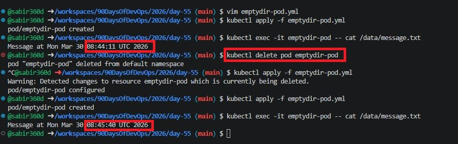
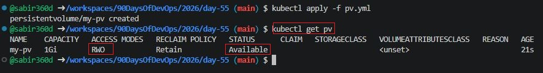
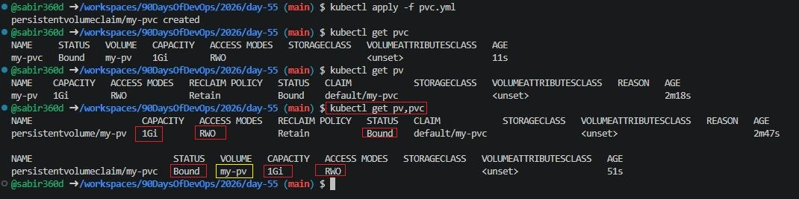
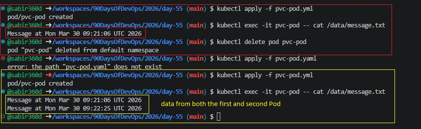
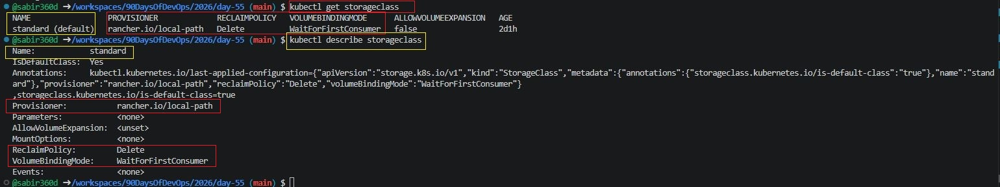
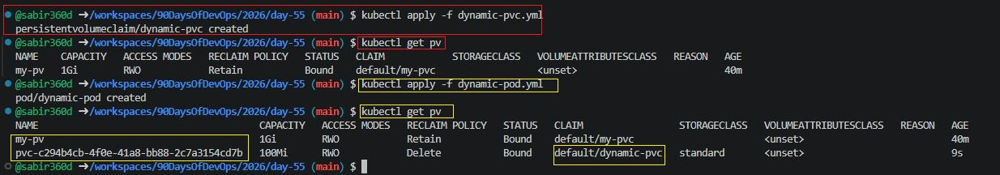
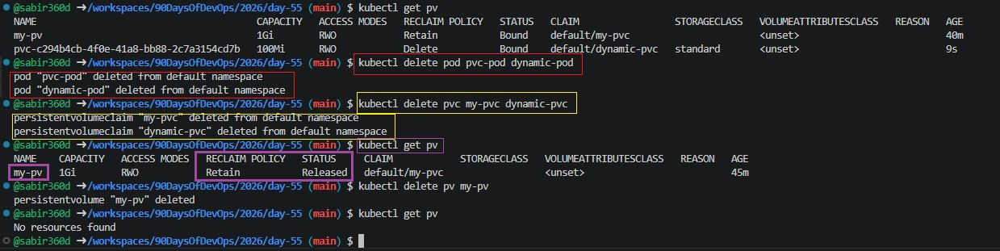

# Day 55 – Persistent Volumes (PV) and Persistent Volume Claims (PVC)

## Task
Containers are ephemeral — when a Pod dies, everything inside it disappears. That is a serious problem for databases and anything that needs to survive a restart. Today you fix this with Persistent Volumes and Persistent Volume Claims.

---

### Task 1: See the Problem — Data Lost on Pod Deletion
1. Write a Pod manifest that uses an `emptyDir` volume and writes a timestamped message to `/data/message.txt`

### Create ``emptydir-pod.yml``
```yml
apiVersion: v1
kind: Pod
metadata:
  name: emptydir-pod
spec:
  containers:
  - name: app
    image: busybox
    command: ["/bin/sh", "-c"]
    args:
      - echo "Message at $(date)" >> /data/message.txt && sleep 3600
    volumeMounts:
    - mountPath: /data
      name: data-volume
  volumes:
  - name: data-volume
    emptyDir: {}
```

2. Apply it, verify the data exists with `kubectl exec`

```bash
kubectl apply -f emptydir-pod.yml
kubectl exec -it emptydir-pod -- cat /data/message.txt
```

3. Delete the Pod, recreate it, check the file again — the old message is gone

```bash
kubectl delete pod emptydir-pod
kubectl apply -f emptydir-pod.yml
kubectl exec -it emptydir-pod -- cat /data/message.txt
```

**Verify:** Is the timestamp the same or different after recreation?
#### Different — data is lost



---

### Task 2: Create a PersistentVolume (Static Provisioning)

1. Write a PV manifest with `capacity: 1Gi`, `accessModes: ReadWriteOnce`, `persistentVolumeReclaimPolicy: Retain`, and `hostPath` pointing to `/tmp/k8s-pv-data`

#### Create ``pv.yml``

```yml
apiVersion: v1
kind: PersistentVolume
metadata:
  name: my-pv
spec:
  storageClassName: ""
  capacity:
    storage: 1Gi
  accessModes:
    - ReadWriteOnce
  persistentVolumeReclaimPolicy: Retain
  hostPath:
    path: /tmp/k8s-pv-data


```

2. Apply it and check `kubectl get pv` — status should be `Available`

```bash
kubectl apply -f pv.yml
kubectl get pv
```

Access modes to know:

* `ReadWriteOnce (RWO)` — read-write by a single node
* `ReadOnlyMany (ROX)` — read-only by many nodes
* `ReadWriteMany (RWX)` — read-write by many nodes

`hostPath` is fine for learning, not for production.

**Verify:** What is the STATUS of the PV?
#### Status = `Available`



---

### Task 3: Create a PersistentVolumeClaim

1. Write a PVC manifest requesting `500Mi` of storage with `ReadWriteOnce` access

#### Create ``pvc.yml``
```yml
apiVersion: v1
kind: PersistentVolumeClaim
metadata:
  name: my-pvc
spec:
  storageClassName: ""
  accessModes:
    - ReadWriteOnce
  resources:
    requests:
      storage: 500Mi

```

2. Apply it and check both `kubectl get pvc` and `kubectl get pv`

```bash
kubectl apply -f pvc.yml
kubectl get pvc
kubectl get pv
```

3. Both should show `Bound` — Kubernetes matched them by capacity and access mode

**Verify:** What does the VOLUME column in `kubectl get pvc` show?
#### `my-pv`



---

### Task 4: Use the PVC in a Pod — Data That Survives

1. Write a Pod manifest that mounts the PVC at `/data` using `persistentVolumeClaim.claimName`
#### Create ``pvc-pod.yml``

```yml
apiVersion: v1
kind: Pod
metadata:
  name: pvc-pod
spec:
  containers:
  - name: app
    image: busybox
    command: ["/bin/sh", "-c"]
    args:
      - echo "Message at $(date)" >> /data/message.txt && sleep 3600
    volumeMounts:
    - mountPath: /data
      name: persistent-storage
  volumes:
  - name: persistent-storage
    persistentVolumeClaim:
      claimName: my-pvc
```

2. Write data to `/data/message.txt`, then delete and recreate the Pod

```bash
kubectl apply -f pvc-pod.yml
kubectl exec -it pvc-pod -- cat /data/message.txt

kubectl delete pod pvc-pod
kubectl apply -f pvc-pod.yml
kubectl exec -it pvc-pod -- cat /data/message.txt
```

3. Check the file — it should contain data from both Pods

**Verify:** Does the file contain data from both the first and second Pod?
#### Yes



---

### Task 5: StorageClasses and Dynamic Provisioning

1. Run `kubectl get storageclass` and `kubectl describe storageclass`

```bash
kubectl get storageclass
kubectl describe storageclass
```

2. Note the provisioner, reclaim policy, and volume binding mode

3. With dynamic provisioning, developers only create PVCs — the StorageClass handles PV creation automatically

**Verify:** What is the default StorageClass in your cluster?
#### ``standard (default)``



---

### Task 6: Dynamic Provisioning

1. Write a PVC manifest that includes `storageClassName: standard` (or your cluster's default)
#### Create ``dynamic-pvc.yml``

```yml
apiVersion: v1
kind: PersistentVolumeClaim
metadata:
  name: dynamic-pvc
spec:
  accessModes:
    - ReadWriteOnce
  storageClassName: standard
  resources:
    requests:
      storage: 1Gi
```

2. Apply it — a PV should appear automatically in `kubectl get pv`

```bash
kubectl apply -f dynamic-pvc.yml
kubectl get pv
```

3. Use this PVC in a Pod, write data, verify it works

#### Create ``dynamic-pod.yml``

```yaml
apiVersion: v1
kind: Pod
metadata:
  name: dynamic-pod
spec:
  containers:
  - name: app
    image: busybox
    command: ["/bin/sh", "-c"]
    args:
      - echo "Dynamic $(date)" >> /data/message.txt && sleep 3600
    volumeMounts:
    - mountPath: /data
      name: storage
  volumes:
  - name: storage
    persistentVolumeClaim:
      claimName: dynamic-pvc
```

```bash
kubectl apply -f dynamic-pod.yml
kubectl exec -it dynamic-pod -- cat /data/message.txt
```

**Verify:** How many PVs exist now? Which was manual, which was dynamic?
#### One manual (hostPath), one dynamic (StorageClass)



---

### Task 7: Clean Up

1. Delete all pods first

```bash
kubectl delete pod pvc-pod dynamic-pod
```

2. Delete PVCs — check `kubectl get pv` to see what happened

```bash
kubectl delete pvc my-pvc dynamic-pvc
kubectl get pv
```

3. The dynamic PV is gone (Delete reclaim policy). The manual PV shows `Released` (Retain policy).

4. Delete the remaining PV manually

```bash
kubectl delete pv my-pv
```

**Verify:** Which PV was auto-deleted and which was retained? Why?
#### Dynamic PV deleted (Delete policy), Manual PV retained (Retain policy)



---

## Summary

### Why containers need persistent storage

Containers are ephemeral by design. When a Pod is deleted or restarted, all data inside the container is lost. This makes them unsuitable for stateful applications like databases unless persistent storage is used.

---

### What PVs and PVCs are and how they relate

* **PersistentVolume (PV):** A piece of storage in the cluster provisioned by an admin or dynamically
* **PersistentVolumeClaim (PVC):** A request for storage by a user

Relationship:

* PVC requests storage
* PV provides storage
* Kubernetes binds them together

---

### Static vs dynamic provisioning

* **Static provisioning:** Admin manually creates PVs
* **Dynamic provisioning:** Kubernetes automatically creates PVs using StorageClasses when a PVC is requested

Dynamic provisioning is preferred in real-world environments.

---

### Access modes and reclaim policies

**Access Modes**

* RWO — ReadWriteOnce
* ROX — ReadOnlyMany
* RWX — ReadWriteMany

**Reclaim Policies**

* Retain — Keeps data after PVC deletion
* Delete — Deletes storage automatically

---
