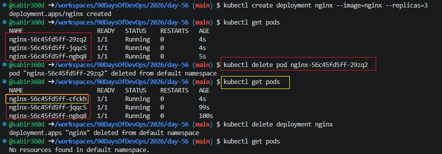
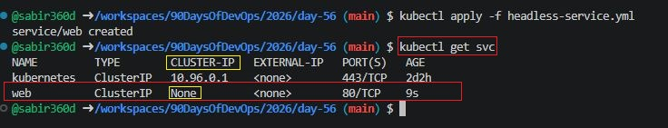
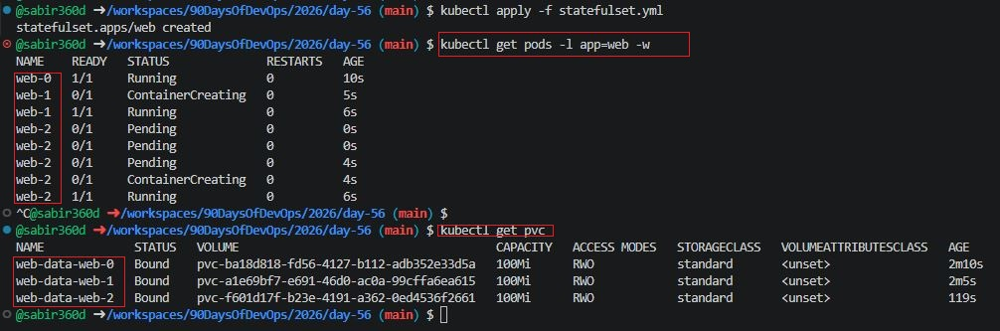
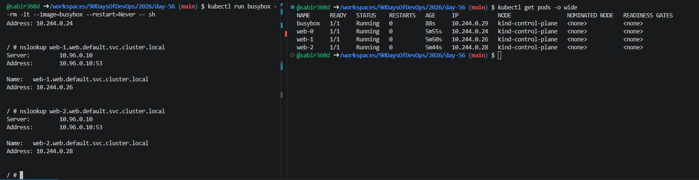
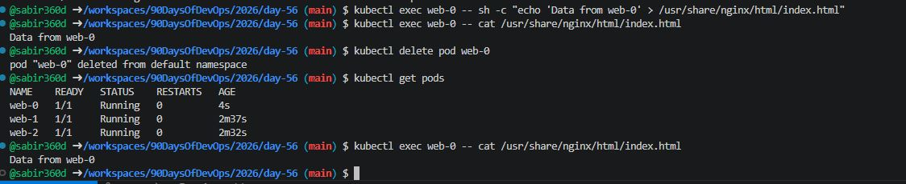
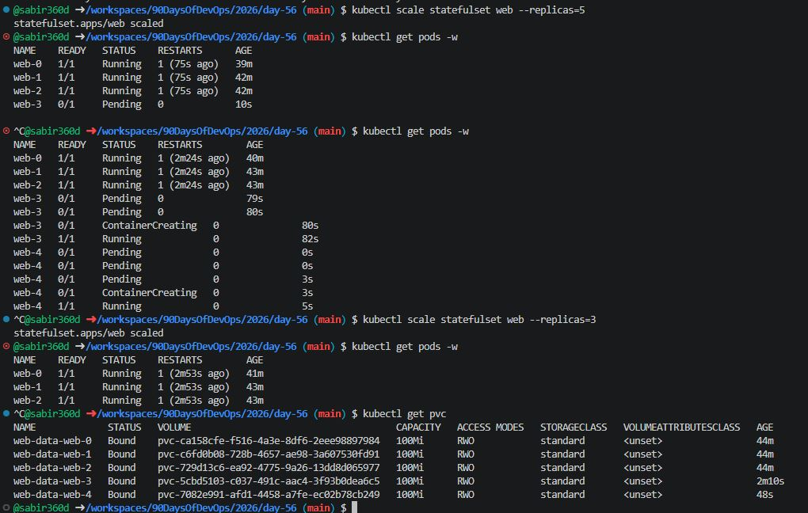
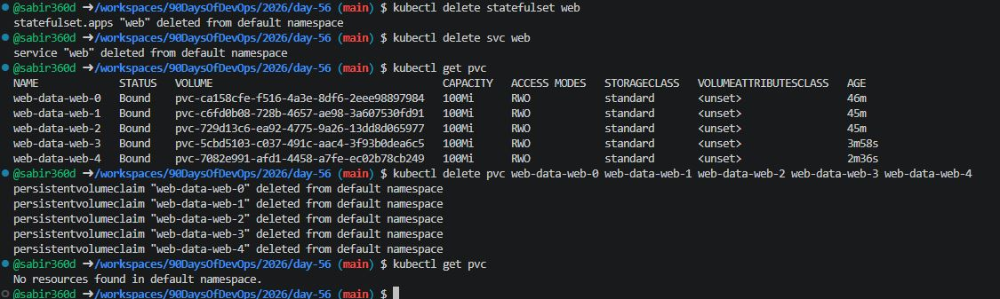

# Day 56 – Kubernetes StatefulSets

## Task
Deployments work great for stateless apps, but what about databases? You need stable pod names, ordered startup, and persistent storage per replica. Today you learn StatefulSets — the workload designed for stateful applications like MySQL, PostgreSQL, and Kafka.

---

## Expected Output
- A StatefulSet with 3 replicas and stable pod names
- DNS resolution tested for individual pods
- Data persistence verified across pod deletion
- A markdown file: `day-56-statefulsets.md`

---

### Task 1: Understand the Problem
1. Create a Deployment with 3 replicas using nginx:
```bash
kubectl create deployment nginx --image=nginx --replicas=3
kubectl get pods
````

2. Check the pod names — they are random (`nginx-xyz-abc`)
3. Delete a pod and notice the replacement gets a different random name:

```bash
kubectl delete pod <pod-name>
kubectl get pods
```

This is fine for web servers but not for databases where you need stable identity.

| Feature          | Deployment         | StatefulSet                            |
| ---------------- | ------------------ | -------------------------------------- |
| Pod names        | Random             | Stable, ordered (`app-0`, `app-1`)     |
| Startup order    | All at once        | Ordered: pod-0, then pod-1, then pod-2 |
| Storage          | Shared PVC         | Each pod gets its own PVC              |
| Network identity | No stable hostname | Stable DNS per pod                     |

Delete the Deployment before moving on:

```bash
kubectl delete deployment nginx
```

**Verify:** Why would random pod names be a problem for a database cluster?

### Because database nodes need consistent hostnames and persistent storage to maintain cluster membership and data.



---

### Task 2: Create a Headless Service

1. Write a Service manifest `headless-service.yml`:

```yml
apiVersion: v1
kind: Service
metadata:
  name: web
spec:
  clusterIP: None
  selector:
    app: web
  ports:
    - port: 80
      targetPort: 80
```

2. Apply it:

```bash
kubectl apply -f headless-service.yml
kubectl get svc
```

A Headless Service creates individual DNS entries for each pod instead of load-balancing to one IP.

**Verify:** What does the CLUSTER-IP column show?

### `None`



---

### Task 3: Create a StatefulSet

1. Write a StatefulSet manifest `statefulset.yml`:

```yml
apiVersion: apps/v1
kind: StatefulSet
metadata:
  name: web
spec:
  serviceName: "web"
  replicas: 3
  selector:
    matchLabels:
      app: web
  template:
    metadata:
      labels:
        app: web
    spec:
      containers:
      - name: nginx
        image: nginx
        ports:
        - containerPort: 80
        volumeMounts:
        - name: web-data
          mountPath: /usr/share/nginx/html
  volumeClaimTemplates:
  - metadata:
      name: web-data
    spec:
      accessModes: ["ReadWriteOnce"]
      resources:
        requests:
          storage: 100Mi
```

2. Apply it:

```bash
kubectl apply -f statefulset.yml
kubectl get pods -l app=web -w
kubectl get pvc
```

Observe ordered creation — `web-0` first, then `web-1`, then `web-2`.

Check the PVCs:

```bash
kubectl get pvc
```

You should see: `web-data-web-0`, `web-data-web-1`, `web-data-web-2`.

**Verify:** What are the exact pod names and PVC names?

### Pods: `web-0`, `web-1`, `web-2`
### PVCs: `web-data-web-0`, `web-data-web-1`, `web-data-web-2`



---

### Task 4: Stable Network Identity

1. Run a temporary busybox pod:

```bash
kubectl run busybox --rm -it --image=busybox --restart=Never -- sh
```

2. Inside busybox, use nslookup:

```sh
nslookup web-0.web.default.svc.cluster.local
nslookup web-1.web.default.svc.cluster.local
nslookup web-2.web.default.svc.cluster.local
```

3. Confirm the IPs match `kubectl get pods -o wide`.

**Verify:** Does the nslookup IP match the pod IP?

### Yes.



---

### Task 5: Stable Storage — Data Survives Pod Deletion

1. Write unique data to each pod:

```bash
kubectl exec web-0 -- sh -c "echo 'Data from web-0' > /usr/share/nginx/html/index.html"
kubectl exec web-1 -- sh -c "echo 'Data from web-1' > /usr/share/nginx/html/index.html"
kubectl exec web-2 -- sh -c "echo 'Data from web-2' > /usr/share/nginx/html/index.html"
```

2. Delete `web-0`:

```bash
kubectl delete pod web-0
kubectl get pods
```

3. After it comes back, check the data:

```bash
kubectl exec web-0 -- cat /usr/share/nginx/html/index.html
```

**Verify:** Is the data identical after pod recreation?

### Yes, because the pod reconnected to the same PVC.



---

### Task 6: Ordered Scaling

1. Scale up to 5:

```bash
kubectl scale statefulset web --replicas=5
kubectl get pods -w
```

Pods create in order: `web-3` then `web-4`.

2. Scale down to 3:

```bash
kubectl scale statefulset web --replicas=3
kubectl get pods -w
```

Pods terminate in reverse order: `web-4`, then `web-3`.

3. Check PVCs:

```bash
kubectl get pvc
```

All five PVCs still exist.

**Verify:** After scaling down, how many PVCs exist?

### 5 PVCs remain.



---

### Task 7: Clean Up

1. Delete the StatefulSet and Headless Service:

```bash
kubectl delete statefulset web
kubectl delete svc web
```

2. Check PVCs:

```bash
kubectl get pvc
```

PVCs are still present (Kubernetes does not auto-delete PVCs).

3. Delete PVCs manually:

```bash
kubectl delete pvc web-data-web-0 web-data-web-1 web-data-web-2 web-data-web-3 web-data-web-4
```

**Verify:** Were PVCs auto-deleted with the StatefulSet?

### No, they must be deleted manually.



---

## Summary:
1. Stable Pods for Stateful Apps – StatefulSets provide fixed pod names, ordered startup, and persistent storage, unlike Deployments with random pod names.
2. Headless Services – Essential for StatefulSets to create individual DNS entries for each pod.
3. Persistent Storage – Each pod gets its own PVC; data survives pod deletion and rescheduling.
4. Ordered Scaling & Termination – Pods are created sequentially (0 → N) and terminated in reverse (N → 0).
5. Network Identity & DNS – Each pod gets a stable DNS: <pod-name>.<service-name>.<namespace>.svc.cluster.local, ensuring reliable inter-pod communication for databases.

---