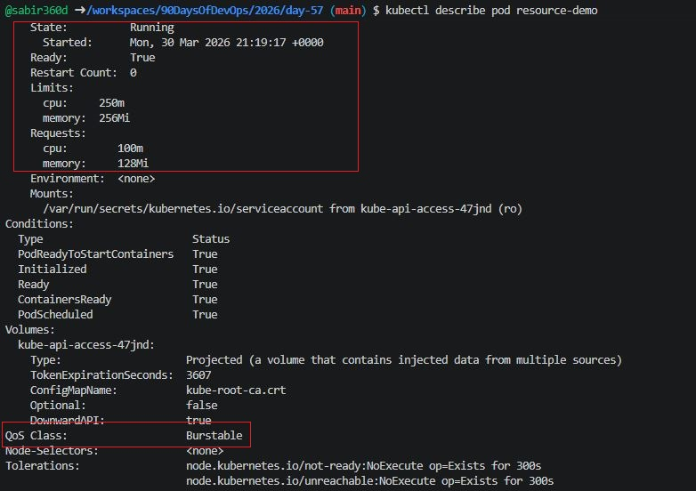
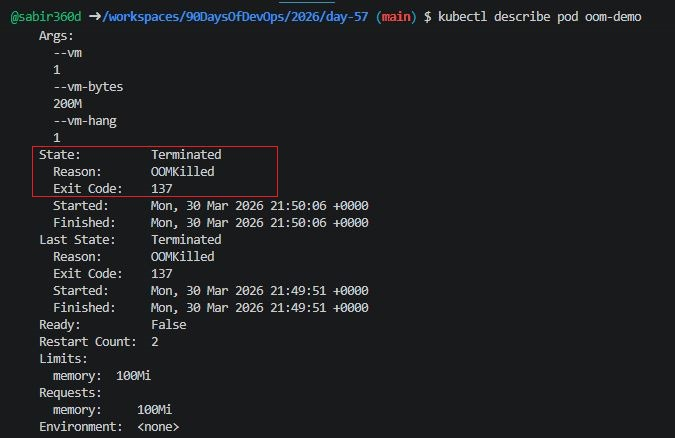
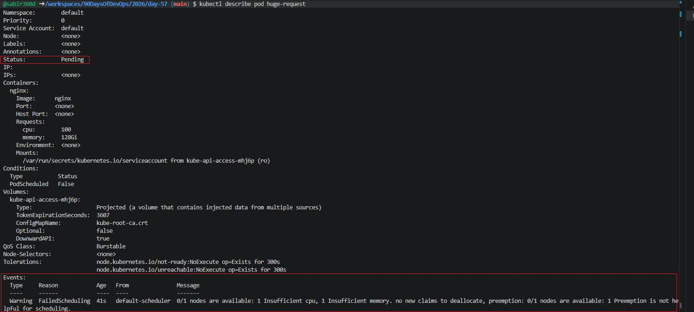
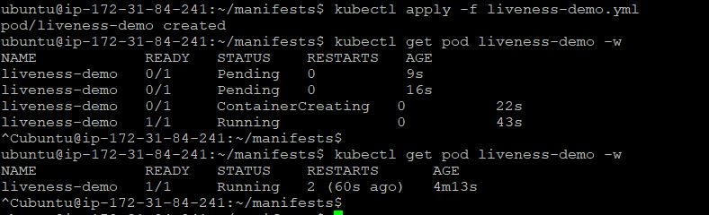
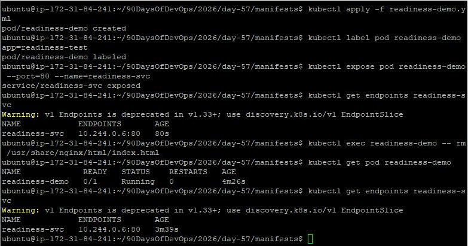
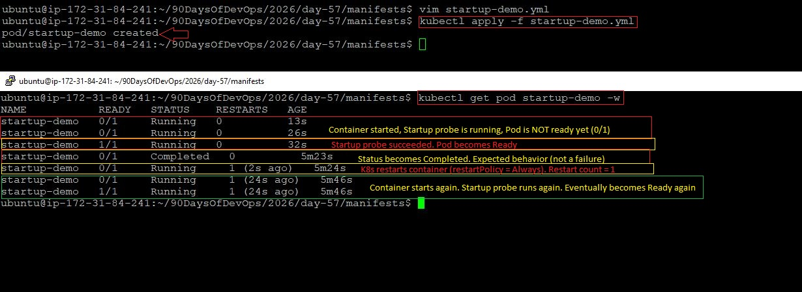

# Day 57 – Resource Requests, Limits, and Probes

## Task
Your Pods are running, but Kubernetes has no idea how much CPU or memory they need — and no way to tell if they are actually healthy. Today you set resource requests and limits for smart scheduling, then add probes so Kubernetes can detect and recover from failures automatically.

## Expected Output
A Pod with CPU and memory requests and limits
OOMKilled observed when exceeding memory limits
Liveness, readiness, and startup probes tested
A markdown file: day-57-resources-probes.md

### Task 1: Resource Requests and Limits
1. Write a Pod manifest with `resources.requests` (cpu: 100m, memory: 128Mi) and `resources.limits` (cpu: 250m, memory: 256Mi)
2. Apply and inspect with `kubectl describe pod` — look for the Requests, Limits, and QoS Class sections
3. Since requests and limits differ, the QoS class is `Burstable`. If equal, it would be `Guaranteed`. If missing, `BestEffort`.

CPU is in millicores: `100m` = 0.1 CPU. Memory is in mebibytes: `128Mi`.

**Requests** = guaranteed minimum (scheduler uses this for placement). **Limits** = maximum allowed (kubelet enforces at runtime).

**Verify:** What QoS class does your Pod have?

---
### Pod Manifest: ``resource-demo.yml``
```yml
apiVersion: v1
kind: Pod
metadata:
  name: resource-demo
spec:
  containers:
  - name: nginx
    image: nginx
    resources:
      requests:
        cpu: "100m"
        memory: "128Mi"
      limits:
        cpu: "250m"
        memory: "256Mi"
```

### Apply

```bash
kubectl apply -f resource-demo.yml
```

### Verify

```bash
kubectl describe pod resource-demo
```

### Output Observations

* Requests: 100m CPU, 128Mi Memory
* Limits: 250m CPU, 256Mi Memory
* QoS Class: **Burstable**

### Answer

**QoS Class = Burstable**



---

### Task 2: OOMKilled — Exceeding Memory Limits
1. Write a Pod manifest using the `polinux/stress` image with a memory limit of `100Mi`
2. Set the stress command to allocate 200M of memory: `command: ["stress"] args: ["--vm", "1", "--vm-bytes", "200M", "--vm-hang", "1"]`
3. Apply and watch — the container gets killed immediately

CPU is throttled when over limit. Memory is killed — no mercy.

Check `kubectl describe pod` for `Reason: OOMKilled` and `Exit Code: 137` (128 + SIGKILL).

**Verify:** What exit code does an OOMKilled container have?

---

### Pod Manifest: ``oom-demo.yml``

```yml
apiVersion: v1
kind: Pod
metadata:
  name: oom-demo
spec:
  containers:
  - name: stress
    image: polinux/stress
    resources:
      limits:
        memory: "100Mi"
    command: ["stress"]
    args: ["--vm", "1", "--vm-bytes", "200M", "--vm-hang", "1"]
```

### Apply

```bash
kubectl apply -f oom-demo.yml
```

### Verify

```bash
kubectl describe pod oom-demo
```

### Output Observations

* Reason: **OOMKilled**
* Exit Code: **137**

### Answer

**Exit Code = 137**



---

### Task 3: Pending Pod — Requesting Too Much
1. Write a Pod manifest requesting `cpu: 100` and `memory: 128Gi`
2. Apply and check — STATUS stays `Pending` forever
3. Run `kubectl describe pod` and read the Events — the scheduler says exactly why: insufficient resources

**Verify:** What event message does the scheduler produce?

---

### Pod Manifest: ``huge-request.yml``

```yml
apiVersion: v1
kind: Pod
metadata:
  name: huge-request
spec:
  containers:
  - name: nginx
    image: nginx
    resources:
      requests:
        cpu: "100"
        memory: "128Gi"
```

### Apply

```bash
kubectl apply -f huge-request.yml
```

### Verify

```bash
kubectl get pod huge-request
kubectl describe pod huge-request
```

### Output Observations

* Status: **Pending**
* Events:

  ```
  0/1 nodes are available: insufficient cpu, insufficient memory
  ```

### Answer

**Scheduler Message: insufficient resources (cpu, memory)**



---

### Task 4: Liveness Probe
A liveness probe detects stuck containers. If it fails, Kubernetes restarts the container.

1. Write a Pod manifest with a busybox container that creates `/tmp/healthy` on startup, then deletes it after 30 seconds
2. Add a liveness probe using `exec` that runs `cat /tmp/healthy`, with `periodSeconds: 5` and `failureThreshold: 3`
3. After the file is deleted, 3 consecutive failures trigger a restart. Watch with `kubectl get pod -w`

**Verify:** How many times has the container restarted?

---

### Pod Manifest: ``liveness-demo.yml``

```yml
apiVersion: v1
kind: Pod
metadata:
  name: liveness-demo
spec:
  containers:
  - name: busybox
    image: busybox
    command: ["/bin/sh", "-c"]
    args:
      - touch /tmp/healthy; sleep 30; rm -f /tmp/healthy; sleep 600
    livenessProbe:
      exec:
        command:
        - cat
        - /tmp/healthy
      periodSeconds: 5
      failureThreshold: 3
```

### Apply

```bash
kubectl apply -f liveness-demo.yml
```

### Watch

```bash
kubectl get pod liveness-demo -w
```

### Output Observations

* After ~30 seconds → file deleted
* Probe fails → container restarts

### Verification

**Container restarts after 3 consecutive failures**



---

### Task 5: Readiness Probe
A readiness probe controls traffic. Failure removes the Pod from Service endpoints but does NOT restart it.

1. Write a Pod manifest with nginx and a `readinessProbe` using `httpGet` on path `/` port `80`
2. Expose it as a Service: `kubectl expose pod <name> --port=80 --name=readiness-svc`
3. Check `kubectl get endpoints readiness-svc` — the Pod IP is listed
4. Break the probe: `kubectl exec <pod> -- rm /usr/share/nginx/html/index.html`
5. Wait 15 seconds — Pod shows `0/1` READY, endpoints are empty, but the container is NOT restarted

**Verify:** When readiness failed, was the container restarted?

---

### Pod Manifest: ``readiness-demo.yml``

```yml
apiVersion: v1
kind: Pod
metadata:
  name: readiness-demo
spec:
  containers:
  - name: nginx
    image: nginx
    readinessProbe:
      httpGet:
        path: /
        port: 80
      periodSeconds: 5
```

### Apply

```bash
kubectl apply -f readiness-demo.yml
```
- Label the pod manually so the service knows who to talk to:
### Give the pod a label
```bash
kubectl label pod readiness-demo app=readiness-test
```
### Expose Service

```bash
kubectl expose pod readiness-demo --port=80 --name=readiness-svc
```

### Verify

```bash
kubectl get endpoints readiness-svc
```

### Break Readiness

```bash
kubectl exec readiness-demo -- rm /usr/share/nginx/html/index.html
```

### Verify Again

```bash
kubectl get pod readiness-demo
kubectl get endpoints readiness-svc
```

### Output Observations

* Pod READY becomes **0/1**
* Endpoints become **empty**
* Container is still running

### Verification

**Container is NOT restarted**



---

### Task 6: Startup Probe
A startup probe gives slow-starting containers extra time. While it runs, liveness and readiness probes are disabled.

1. Write a Pod manifest where the container takes 20 seconds to start (e.g., `sleep 20 && touch /tmp/started`)
2. Add a `startupProbe` checking for `/tmp/started` with `periodSeconds: 5` and `failureThreshold: 12` (60 second budget)
3. Add a `livenessProbe` that checks the same file — it only kicks in after startup succeeds

**Verify:** What would happen if `failureThreshold` were 2 instead of 12?

---

### Pod Manifest: ``startup-demo.yml``

```yml
apiVersion: v1
kind: Pod
metadata:
  name: startup-demo
spec:
  containers:
  - name: busybox
    image: busybox
    command: ["/bin/sh", "-c"]
    args:
      - sleep 20; touch /tmp/started; sleep 300
    startupProbe:
      exec:
        command:
        - cat
        - /tmp/started
      periodSeconds: 5
      failureThreshold: 12
    livenessProbe:
      exec:
        command:
        - cat
        - /tmp/started
      periodSeconds: 5
```

### Apply

```bash
kubectl apply -f startup-demo.yml
```

### Output Observations

* Startup probe allows container time to initialize
* Liveness probe starts only after success

### Verification

If `failureThreshold = 2`:

* Container would be **killed too early (after 10 seconds)**
* App would **never start successfully**
* Startup probe allowed the container to initialize properly
* Pod became ready only after startup success
* Restart happened due to container completion, not probe failure



---

## Task 7: Clean Up

```bash
kubectl delete pod resource-demo oom-demo huge-request liveness-demo readiness-demo startup-demo
kubectl delete svc readiness-svc
```
---

## Summary

* QoS Class → **Burstable**
* OOMKilled Exit Code → **137**
* Pending Reason → **Insufficient CPU/Memory**
* Liveness → **Restarts container**
* Readiness → **Does NOT restart container**
* Startup failure (low threshold) → **Container killed too early**

---

