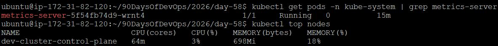
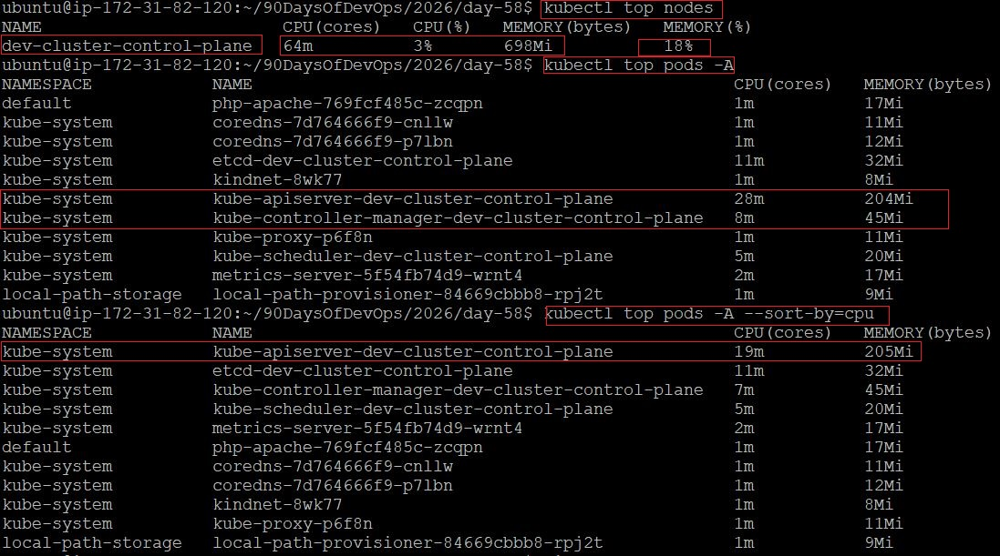
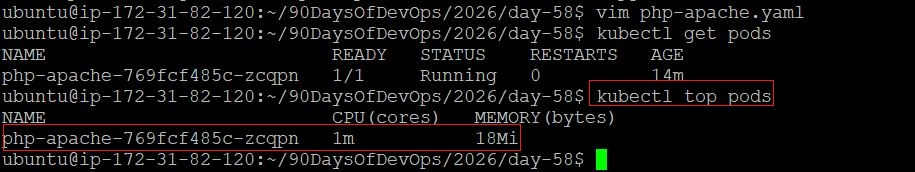
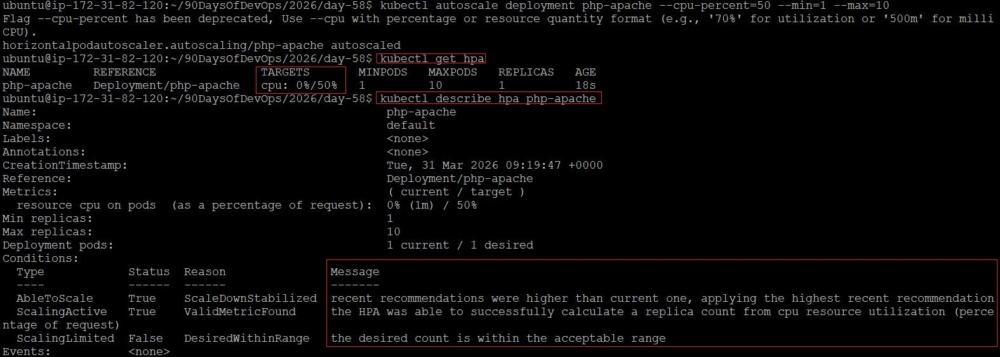
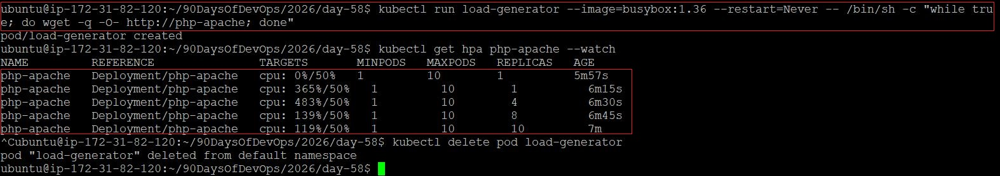
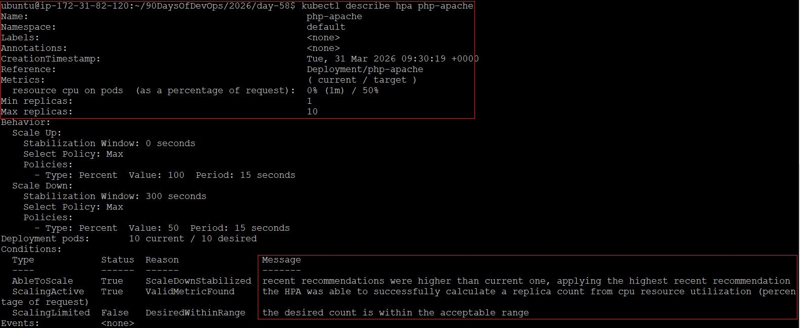

# Day 58 – Metrics Server and Horizontal Pod Autoscaler (HPA)

## Overview

In this lab, we install the **Metrics Server**, explore real-time resource usage, and configure a **Horizontal Pod Autoscaler (HPA)** to automatically scale applications based on CPU usage.

---

# Task 1: Install the Metrics Server (Kind on Ubuntu EC2)

### Step 1: Check if Metrics Server exists

```bash
kubectl get pods -n kube-system | grep metrics-server
```

### Step 2: Install Metrics Server (Kind)

```bash
kubectl apply -f https://github.com/kubernetes-sigs/metrics-server/releases/latest/download/components.yaml
```

### Step 3: Patch for Kind (IMPORTANT)

Kind clusters require insecure TLS:

```bash
kubectl edit deployment metrics-server -n kube-system
```

Under `containers -> args`, add:

```yaml
- --kubelet-insecure-tls
```

Save and exit.

### Step 4: Verify Metrics Server

Wait ~60 seconds:

```bash
kubectl top nodes
kubectl top pods -A
```

### Verification





---

# Task 2: Explore kubectl top

### Commands

```bash
kubectl top nodes
kubectl top pods -A
kubectl top pods -A --sort-by=cpu
```

### Key Insight

* `kubectl top` = **actual usage**
* NOT the same as requests/limits

### Verification

* Identify the pod using highest CPU





---

# Task 3: Create Deployment with CPU Requests

### Create `php-apache.yaml`

```yaml
apiVersion: apps/v1
kind: Deployment
metadata:
  name: php-apache
spec:
  replicas: 1
  selector:
    matchLabels:
      app: php-apache
  template:
    metadata:
      labels:
        app: php-apache
    spec:
      containers:
      - name: php-apache
        image: registry.k8s.io/hpa-example
        ports:
        - containerPort: 80
        resources:
          requests:
            cpu: 200m
```

### Apply Deployment

```bash
kubectl apply -f php-apache.yaml
```

### Expose Service

```bash
kubectl expose deployment php-apache --port=80 --type=ClusterIP
```

### Verify

```bash
kubectl get pods
kubectl top pods
```



---

# Task 4: Create HPA (Imperative)

### Create HPA

```bash
kubectl autoscale deployment php-apache --cpu-percent=50 --min=1 --max=10
```

### Check HPA

```bash
kubectl get hpa
kubectl describe hpa php-apache
```

### Notes

* Initially TARGETS may show `<unknown>`
* Wait ~30 seconds

### Verification



---

# Task 5: Generate Load and Watch Autoscaling

### Run Load Generator

```bash
kubectl run load-generator --image=busybox:1.36 --restart=Never -- /bin/sh -c "while true; do wget -q -O- http://php-apache; done"
```

### Watch HPA

```bash
kubectl get hpa php-apache --watch
```

### Observe

* CPU usage increases
* Replicas scale up

### Stop Load

```bash
kubectl delete pod load-generator
```

### Verification



---

# Task 6: Create HPA (Declarative - autoscaling/v2)

### Delete Old HPA

```bash
kubectl delete hpa php-apache
```

### Create `hpa.yaml`

```yaml
apiVersion: autoscaling/v2
kind: HorizontalPodAutoscaler
metadata:
  name: php-apache
spec:
  scaleTargetRef:
    apiVersion: apps/v1
    kind: Deployment
    name: php-apache
  minReplicas: 1
  maxReplicas: 10
  metrics:
  - type: Resource
    resource:
      name: cpu
      target:
        type: Utilization
        averageUtilization: 50
  behavior:
    scaleUp:
      stabilizationWindowSeconds: 0
      policies:
      - type: Percent
        value: 100
        periodSeconds: 15
    scaleDown:
      stabilizationWindowSeconds: 300
      policies:
      - type: Percent
        value: 50
        periodSeconds: 15
```

### Apply

```bash
kubectl apply -f hpa.yaml
```

### Verify

```bash
kubectl describe hpa php-apache
```

### What behavior controls

* **scaleUp:** how fast pods increase
* **scaleDown:** how slowly pods decrease (stability)



---

# Task 7: Cleanup

```bash
kubectl delete hpa php-apache
kubectl delete svc php-apache
kubectl delete deployment php-apache
kubectl delete pod load-generator
```

---

# Concepts

## What is Metrics Server?

* Collects CPU & memory usage from kubelets
* Required for autoscaling
* Feeds data to HPA
* Updates every ~15 seconds

---

## How HPA Calculates Replicas

Formula:

```
desiredReplicas = ceil(currentReplicas * (currentUsage / targetUsage))
```

### Example

* Current replicas = 2
* CPU usage = 80%
* Target = 50%

```
desiredReplicas = ceil(2 * (80/50)) = ceil(3.2) = 4
```

---

## autoscaling/v1 vs autoscaling/v2

| Feature          | v1 | v2 |
| ---------------- | -- | -- |
| CPU scaling      | ✅  | ✅  |
| Memory scaling   | ❌  | ✅  |
| Custom metrics   | ❌  | ✅  |
| Behavior control | ❌  | ✅  |

---

# Key Learnings

* HPA **requires CPU requests**
* Metrics Server is mandatory for autoscaling
* `kubectl top` shows real-time usage
* Scaling up is fast, scaling down is delayed
* `autoscaling/v2` provides production-grade control

---
