# Day 59 – Helm — Kubernetes Package Manager

## Installing Helm

```bash
curl https://raw.githubusercontent.com/helm/helm/main/scripts/get-helm-3 | bash
helm version
helm env
```

Helm version installed: v3.x.x

---

## Using Bitnami Repository

```bash
helm repo add bitnami https://charts.bitnami.com/bitnami
helm repo update
helm search repo bitnami
```

Bitnami provides 200+ charts.

---

## Task
Over the past eight days you have written Deployments, Services, ConfigMaps, Secrets, PVCs, and more — all as individual YAML files. For a real application you might have dozens of these. Helm is the package manager for Kubernetes, like apt for Ubuntu. Today you install charts, customize them, and create your own.

---

## Expected Output
- Helm installed and a chart deployed from Bitnami
- A release customized, upgraded, and rolled back
- A custom chart created and installed
- A markdown file: `day-59-helm.md`

---

# Task 1: Install Helm

## Install Helm (Ubuntu EC2)

```bash
curl https://raw.githubusercontent.com/helm/helm/main/scripts/get-helm-3 | bash
```

## Verify installation

```bash
helm version
helm env
```

```
version.BuildInfo{Version:"v3.20.1", ...}
```

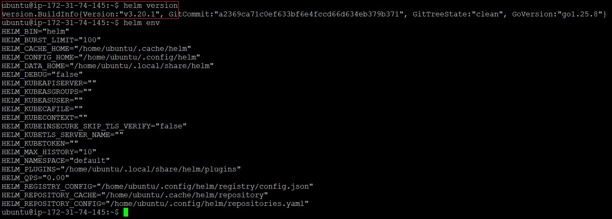

---

# Task 2: Add Repository & Search

## Add Bitnami repo

```bash
helm repo add bitnami https://charts.bitnami.com/bitnami
```

## Update repo

```bash
helm repo update
```

## Search charts

```bash
helm search repo nginx
helm search repo bitnami
```

### Verification:

Bitnami typically has **~200+ charts** (exact number depends on update)

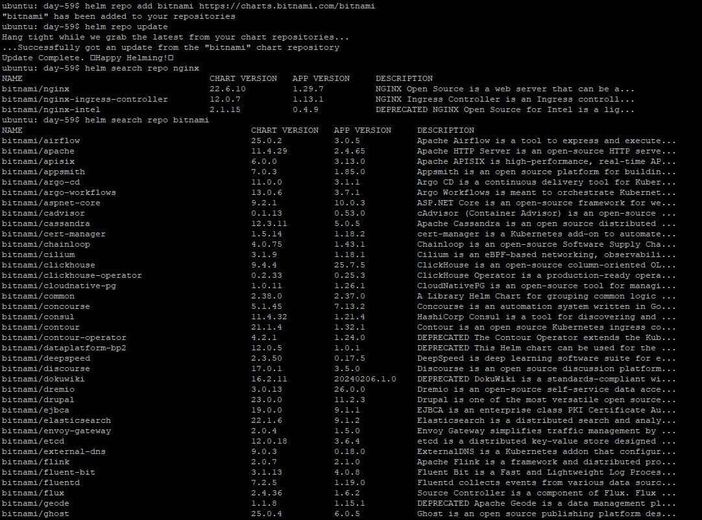

---

# Task 3: Install a Chart

## Install nginx

```bash
helm install my-nginx bitnami/nginx
```

## Check resources

```bash
kubectl get all
```

## Inspect release

```bash
helm list
helm status my-nginx
helm get manifest my-nginx
```

### Verification:

* Pods running:  **1**
* Service type:  **ClusterIP**

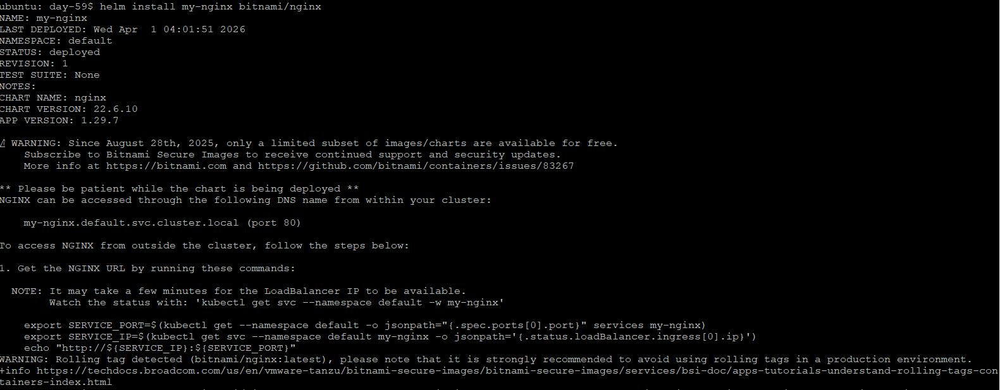

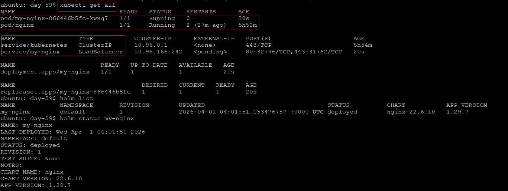

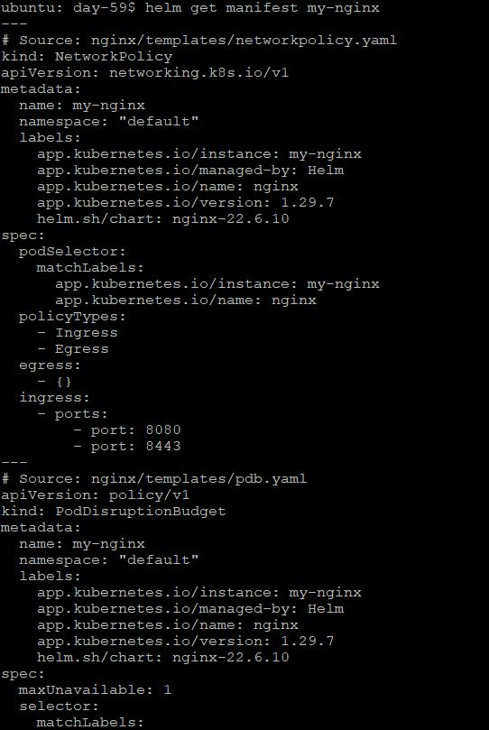

---

# Task 4: Customize with Values

## View default values

```bash
helm show values bitnami/nginx
```

---

## Install with CLI overrides

```bash
helm install nginx-custom bitnami/nginx --set replicaCount=3 --set service.type=NodePort
```

---

## Create values file

```bash
vim custom-values.yaml
```
```yaml
replicaCount: 2

service:
  type: NodePort

resources:
  limits:
    cpu: "200m"
    memory: "256Mi"
  requests:
    cpu: "100m"
    memory: "128Mi"
```

---

## Install using file

```bash
helm install nginx-values bitnami/nginx -f custom-values.yaml
```

## Verify

```bash
kubectl get pods
kubectl get svc
helm get values nginx-values
```

### Verification:

Yes, replicas and service type match YAML

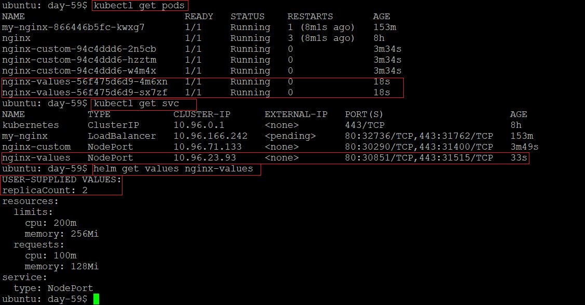

---

# Task 5: Upgrade & Rollback

## Upgrade release

```bash
helm upgrade my-nginx bitnami/nginx --set replicaCount=5
```

## Check history

```bash
helm history my-nginx
```

---

## Rollback

```bash
helm rollback my-nginx 1
```

## Check again

```bash
helm history my-nginx
```

### Verification:

**3 revisions**:

* v1 (original)
* v2 (upgrade)
* v3 (rollback)

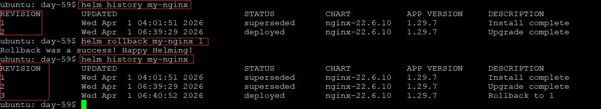

---

# Task 6: Create Your Own Chart

## Create chart

```bash
helm create my-app
cd my-app
```

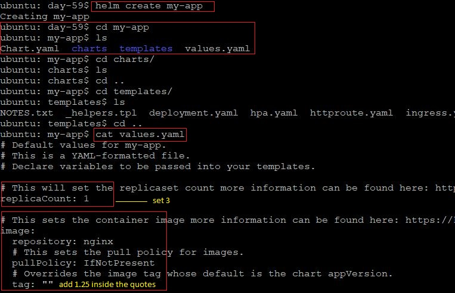

---

## Edit values.yaml

```bash
vim values.yaml
```

Change:

```yaml
replicaCount: 3

image:
  repository: nginx
  tag: "1.25"
```

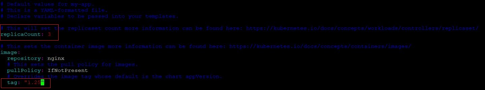

---

## Validate chart

```bash
helm lint .
```

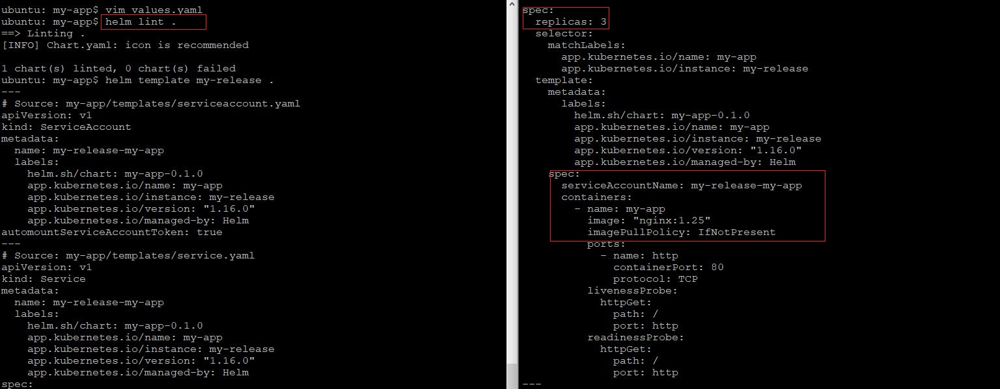

---

## Preview manifests

```bash
helm template my-release .
```
---

## Install chart

```bash
helm install my-release .
```

## Verify

```bash
kubectl get pods
```

**3 pods**

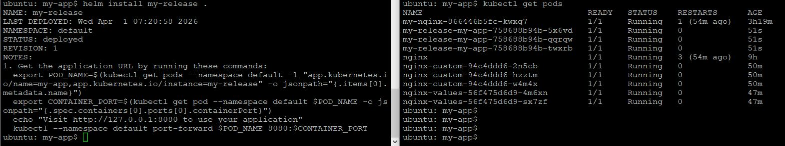

---

## Upgrade

```bash
helm upgrade my-release . --set replicaCount=5

kubectl get pods
```

**5 pods**

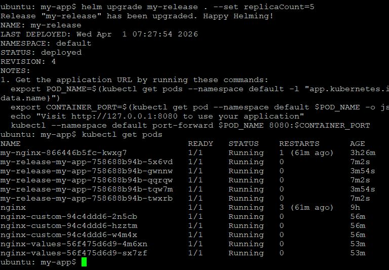

---

# Task 7: Cleanup

## Uninstall releases

```bash
helm uninstall my-nginx
helm uninstall nginx-custom
helm uninstall nginx-values
helm uninstall my-release
```

## Verify

```bash
helm list
```

### Verification:

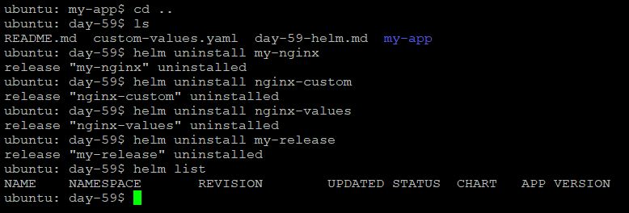

---

## Helm Chart Structure

```
my-app/
  Chart.yaml
  values.yaml
  templates/
    deployment.yaml
    service.yaml
```

---

## Go Templating

Helm uses Go templates:

* `{{ .Values.replicaCount }}`
* `{{ .Chart.Name }}`
* `{{ .Release.Name }}`

These dynamically generate Kubernetes YAML.

---

## Summary

Helm simplifies Kubernetes deployments by packaging configurations into reusable charts. It allows easy customization, version control, upgrades, and rollbacks.

* Helm = **Kubernetes automation**
* Think:

  * YAML manually ❌
  * Helm charts ✅
* Always use:

  * `helm template` before install (debugging lifesaver)

---
