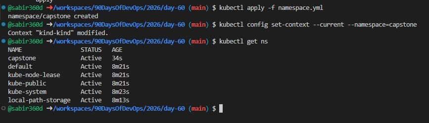
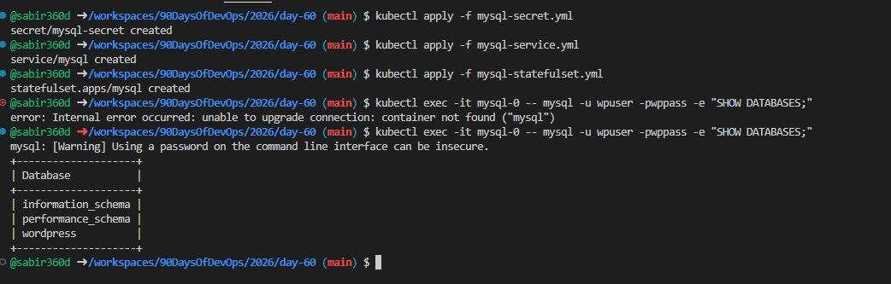
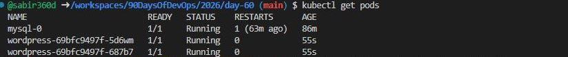
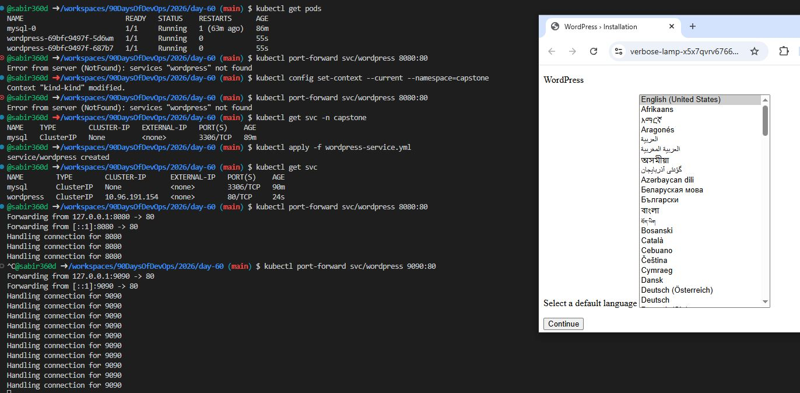
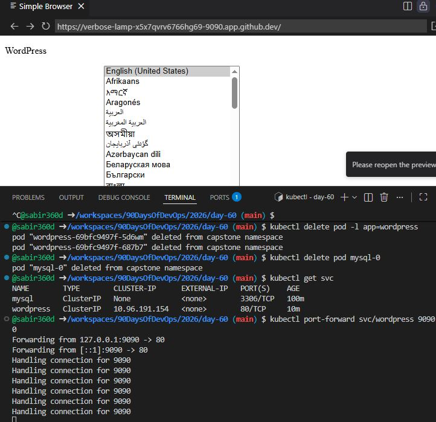
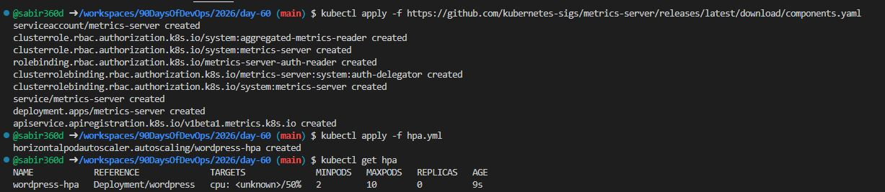
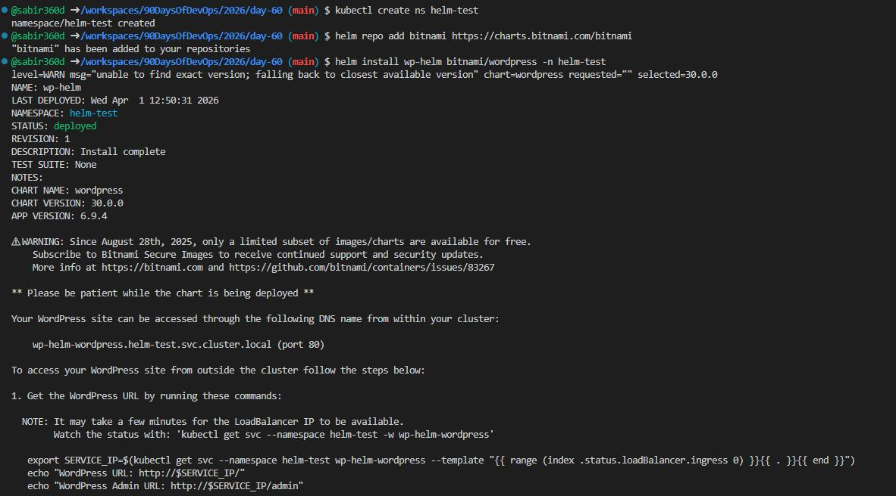
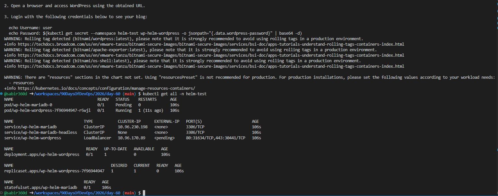
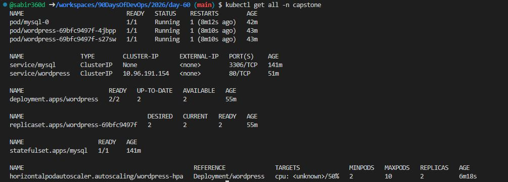
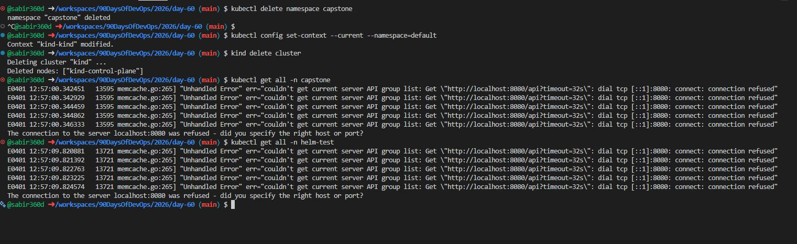

# Day 60 – Capstone: Deploy WordPress + MySQL on Kubernetes

## Overview
This capstone brings together all core Kubernetes concepts by deploying a full WordPress + MySQL application inside a Kubernetes cluster using GitHub Codespaces.

The deployment includes:
- Stateful MySQL with persistent storage
- WordPress running as a scalable Deployment
- Secrets and ConfigMaps for configuration
- Health checks for reliability
- Horizontal Pod Autoscaler for scaling

---

## Architecture

### Components and Flow

- Namespace: `capstone` isolates all resources
- Secret: Stores MySQL credentials securely
- ConfigMap: Stores WordPress database configuration
- StatefulSet: Runs MySQL with stable identity and storage
- Persistent Volume Claim: Ensures MySQL data persistence
- Headless Service: Provides stable DNS for MySQL
- Deployment: Runs WordPress with 2 replicas
- Service (ClusterIP): Exposes WordPress internally
- Port Forwarding: Provides external access in Codespaces
- Probes: Ensure application health
- HPA: Automatically scales WordPress pods

## Project Structure

```
day-60/
├── namespace.yaml
├── mysql-secret.yaml
├── mysql-service.yaml
├── mysql-statefulset.yaml
├── wordpress-configmap.yaml
├── wordpress-deployment.yaml
├── wordpress-service.yaml
├── hpa.yaml
```

### Connection Flow

WordPress Pods → MySQL Headless Service → MySQL StatefulSet → Persistent Volume

---
### Task 1: Create the Namespace (Day 52)
1. Create a `capstone` namespace
2. Set it as your default: `kubectl config set-context --current --namespace=capstone`

[namespace](namespace.yml)

```bash
kubectl apply -f namespace.yaml
kubectl config set-context --current --namespace=capstone



---

### Task 2: Deploy MySQL (Days 54-56)
1. Create a Secret with `MYSQL_ROOT_PASSWORD`, `MYSQL_DATABASE`, `MYSQL_USER`, and `MYSQL_PASSWORD` using `stringData`
2. Create a Headless Service (`clusterIP: None`) for MySQL on port 3306
3. Create a StatefulSet for MySQL with:
   - Image: `mysql:8.0`
   - `envFrom` referencing the Secret
   - Resource requests (cpu: 250m, memory: 512Mi) and limits (cpu: 500m, memory: 1Gi)
   - A `volumeClaimTemplates` section requesting 1Gi of storage, mounted at `/var/lib/mysql`
4. Verify MySQL works: `kubectl exec -it mysql-0 -- mysql -u <user> -p<password> -e "SHOW DATABASES;"`

**Verify:** Can you see the `wordpress` database?

```
[mysql-secret](mysql-secret.yml)

```bash
kubectl apply -f mysql-secret.yaml
```

[text](mysql-service.yml)

[text](mysql-statefulset.yml)

```bash
kubectl apply -f mysql-service.yaml
kubectl apply -f mysql-statefulset.yaml
```



**Verification:**
- Successfully connected to MySQL
- Confirmed `wordpress` database exists

---

### Task 3: Deploy WordPress (Days 52, 54, 57)
1. Create a ConfigMap with `WORDPRESS_DB_HOST` set to `mysql-0.mysql.capstone.svc.cluster.local:3306` and `WORDPRESS_DB_NAME`
2. Create a Deployment with 2 replicas using `wordpress:latest` that:
   - Uses `envFrom` for the ConfigMap
   - Uses `secretKeyRef` for `WORDPRESS_DB_USER` and `WORDPRESS_DB_PASSWORD` from the MySQL Secret
   - Has resource requests and limits
   - Has a liveness probe and readiness probe on `/wp-login.php` port 80
3. Wait until both pods show `1/1 Running`

**Verify:** Are both WordPress pods running and ready?


[Configmap](wordpress-configmap.yml)

[Deployment](wordpress-deployment.yml)

```bash
kubectl apply -f wordpress-configmap.yaml
kubectl apply -f wordpress-deployment.yaml
```



**Verification:**
- Both WordPress pods running and ready

---

### Task 4: Expose WordPress (Day 53)
1. Create a NodePort Service on port 30080 targeting the WordPress pods
2. Access WordPress in your browser:
   - Minikube: `minikube service wordpress -n capstone`
   - Kind: `kubectl port-forward svc/wordpress 8080:80 -n capstone`
3. Complete the setup wizard and create a blog post

**Verify:** Can you see the WordPress setup page?

[Service](mysql-service.yml)

```bash
kubectl apply -f wordpress-service.yaml
kubectl port-forward svc/wordpress 9090:80
```

**Verification:**
- WordPress setup page accessible
- Successfully created a blog post



---

### ### Task 5: Test Self-Healing and Persistence
1. Delete a WordPress pod — watch the Deployment recreate it within seconds. Refresh the site.
2. Delete the MySQL pod: `kubectl delete pod mysql-0 -n capstone` — watch the StatefulSet recreate it
3. After MySQL recovers, refresh WordPress — your blog post should still be there


**Verify:** After deleting both pods, is your blog post still there?

### Tests performed:
1. Deleted WordPress pods  
```bash
kubectl delete pod -l app=wordpress
```
   Result: Pods recreated automatically

2. Deleted MySQL pod  
```bash
kubectl delete pod mysql-0
```
   Result: StatefulSet recreated pod

3. Refreshed WordPress after recovery  
   Result: Blog data persisted (PVC working)

**Conclusion:**
- Self-healing works as expected
- Persistent storage ensures no data loss



---

### Task 6: Set Up HPA (Day 58)
1. Write an HPA manifest targeting the WordPress Deployment with CPU at 50%, min 2, max 10 replicas
2. Apply and check: `kubectl get hpa -n capstone`
3. Run `kubectl get all -n capstone` for the complete picture

**Verify:** Does the HPA show correct min/max and target?

- Installed Metrics Server
```bash
kubectl apply -f https://github.com/kubernetes-sigs/metrics-server/releases/latest/download/components.yaml
```

- Created HPA targeting WordPress Deployment

[hpa](hpa.yml)

- Configured:
```bash
kubectl apply -f hpa.yaml
kubectl get hpa
```
  - Min replicas: 2
  - Max replicas: 10
  - CPU target: 50%

**Verification:**
- HPA correctly reflects scaling configuration



---

### ### Task 7: (Bonus) Compare with Helm (Day 59)
1. Install WordPress using `helm install wp-helm bitnami/wordpress` in a separate namespace
2. Compare: how many resources did each approach create? Which gives more control?
3. Clean up the Helm deployment

| Approach | Control | Complexity |
|----------|--------|-----------|
| Manual   | High   | Moderate  |
| Helm     | Lower  | Easier    |

### Conclusion:
- Helm is faster for deployment
- Manual setup provides deeper control and understanding

```bash
kubectl create ns helm-test

helm repo add bitnami https://charts.bitnami.com/bitnami
helm install wp-helm bitnami/wordpress -n helm-test

kubectl get all -n helm-test
```




---

### Task 8: Cleanup & reflect

### Final Check
```bash
kubectl get all -n capstone
```

### Delete Everything

- Deleted `capstone` namespace
- Reset namespace to default
- Deleted cluster

```bash
kubectl delete namespace capstone
kubectl config set-context --current --namespace=default
kind delete cluster
```

**Verification:**
- All resources removed successfully





---

## Summary

- Successfully deployed a multi-tier application
- Verified Kubernetes self-healing capabilities
- Achieved persistent storage with no data loss
- Implemented auto-scaling based on CPU usage
- Demonstrated understanding of 12 core Kubernetes concepts

---