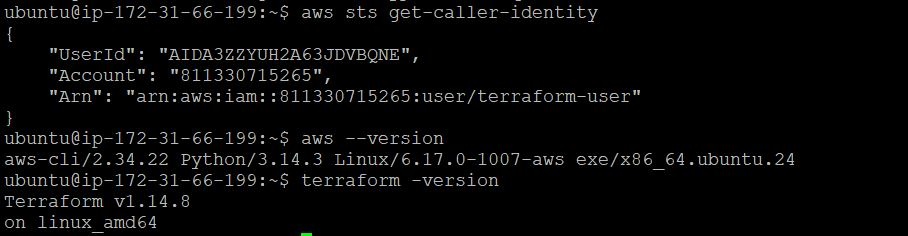
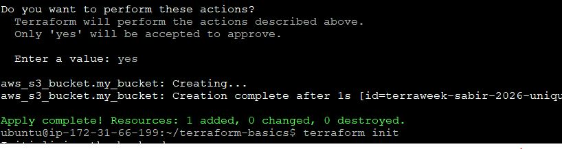
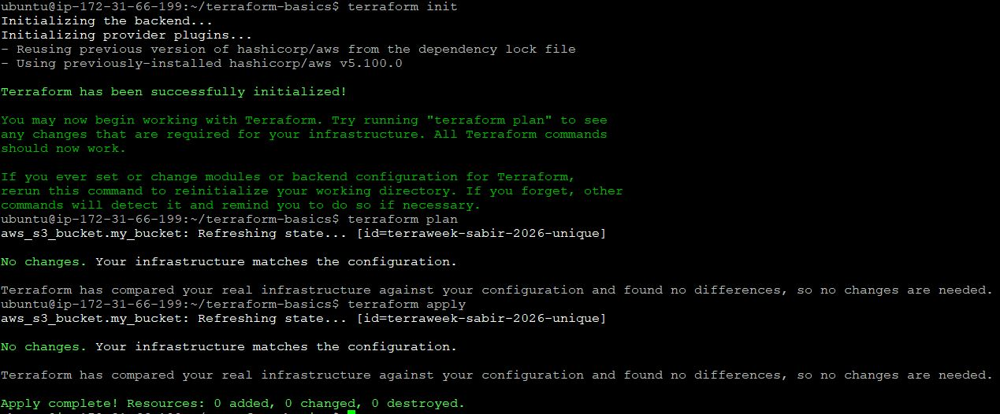
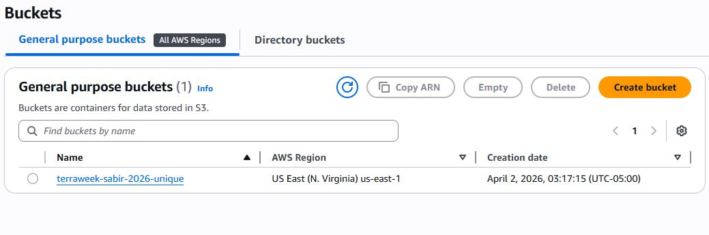
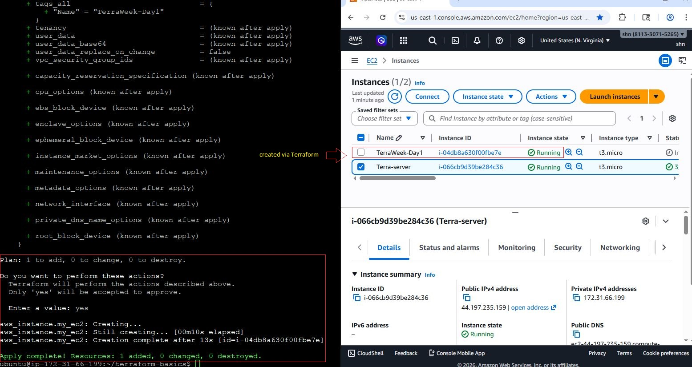
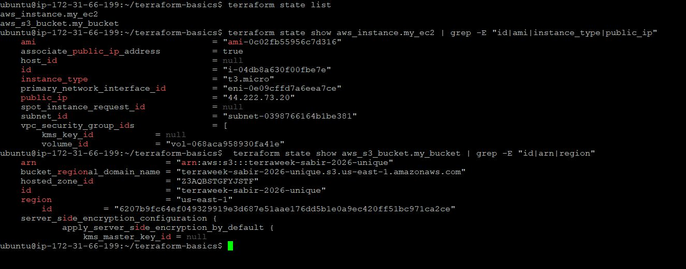
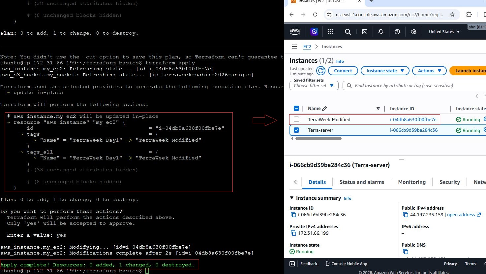
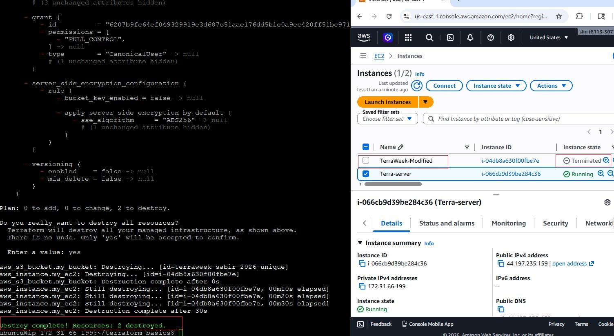
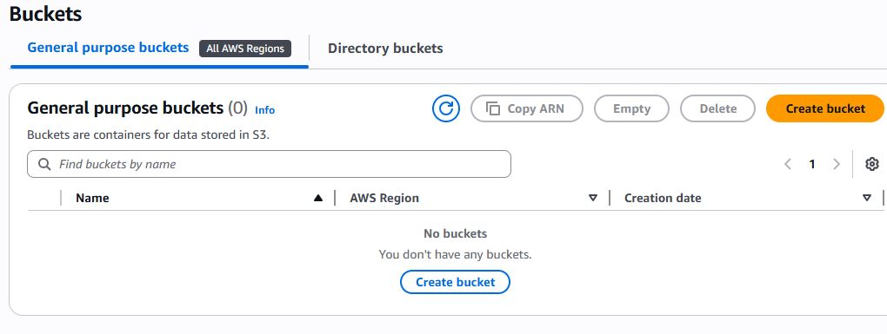

# Day 61 – Introduction to Terraform and Your First AWS Infrastructure

## 1. What is Infrastructure as Code (IaC)?
Infrastructure as Code (IaC) is the practice of defining and managing infrastructure using code instead of manual processes. It allows DevOps teams to provision, modify, and version cloud resources reliably. IaC ensures consistency, repeatability, and automation, reducing human errors when creating servers, networks, and storage.

**Why it matters:**  
- No more manual clicks in the AWS console  
- Easy to replicate environments (Dev, Staging, Prod)  
- Version control for infrastructure (track changes like application code)  
- Enables collaboration and auditing  

Terraform is a declarative, cloud-agnostic IaC tool. Unlike CloudFormation (AWS-specific), Ansible (procedural configuration management), or Pulumi (code-centric), Terraform focuses on **desired state** and uses a provider ecosystem to work with multiple clouds.

---

## 2. Terraform Setup

### Install Terraform

```bash
sudo apt update
sudo apt install terraform -y
terraform -version
````

### Configure AWS CLI

```bash
aws configure
# Enter Access Key ID, Secret Access Key, region (e.g., us-east-1), output (json)
aws sts get-caller-identity
```

### Verified: CLI authenticated, IAM user has S3FullAccess and EC2FullAccess.




---

## 3. First Terraform Project – S3 Bucket

**main.tf:**

```hcl
terraform {
  required_providers {
    aws = {
      source  = "hashicorp/aws"
      version = "~> 5.0"
    }
  }
}

provider "aws" {
  region = "us-east-1"
}

resource "aws_s3_bucket" "my_bucket" {
  bucket = "terraweek-sabir-2026-unique"
  tags = {
    Name        = "Day61Bucket"
    Environment = "Dev"
  }
}
```

### Terraform Lifecycle Commands

```bash
terraform init   # downloads AWS provider, prepares workspace
terraform plan   # shows resources to create
terraform apply  # provisions resources
terraform destroy # deletes all resources
```

**Observations:**

* `.terraform/` directory contains provider binaries and metadata
* Terraform stores resource details in `terraform.tfstate`
* State file is the "source of truth" — never edit manually or commit to Git

**S3 bucket created and verified in AWS console.**











---

## 4. Add EC2 Instance

**Updated `main.tf`:**

```hcl
resource "aws_instance" "my_ec2" {
  ami           = "ami-04eaa218f1349d88b"
  instance_type = "t3.micro"

  tags = {
    Name = "TerraWeek-Day1"
  }
}
```

* `terraform plan` shows:

  * `aws_s3_bucket` → no changes (`terraform.tfstate` already knows it exists)
  * `aws_instance` → to be created

* `terraform apply` provisions EC2

* Verified in AWS EC2 console

### Modify Instance Tag

Changed:

```hcl
Name = "TerraWeek-Modified"
```

* `terraform plan` output shows `~` → in-place update
* Terraform only updates changed metadata without destroying instance





---

## 5. Understanding Terraform State

**Commands:**

```bash
terraform show                # human-readable state
terraform state list           # all managed resources
terraform state show <resource> # detailed view
```

**State file stores:**

* Resource IDs
* Current configuration snapshot
* Metadata and dependencies

**Best practices:**

* Never manually edit
* Never commit to Git




---

## 6. Cleanup

```bash
terraform destroy
```

- All resources removed (S3 + EC2)








---

## 7. Key Learnings

* Terraform tracks **desired vs current state**
* Lifecycle: **init → plan → apply → modify → destroy**
* IaC ensures reproducibility, auditability, and automation
* Using Terraform data sources for AMI avoids hardcoding
* Proper IAM permissions prevent "Access Denied" errors

---
