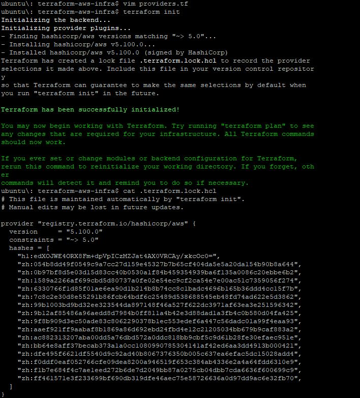
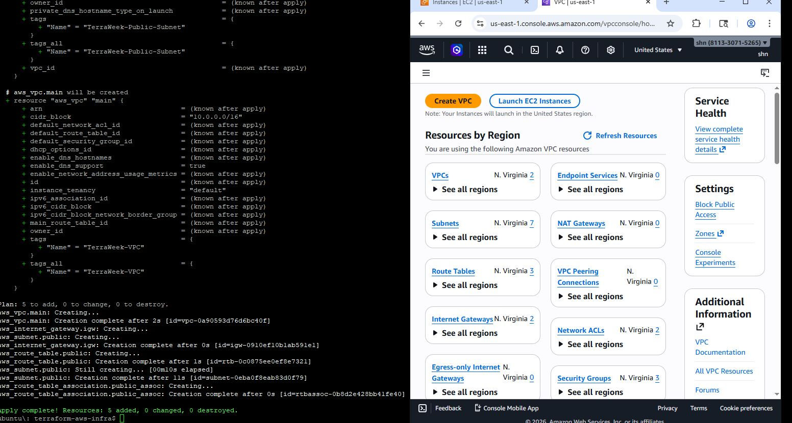
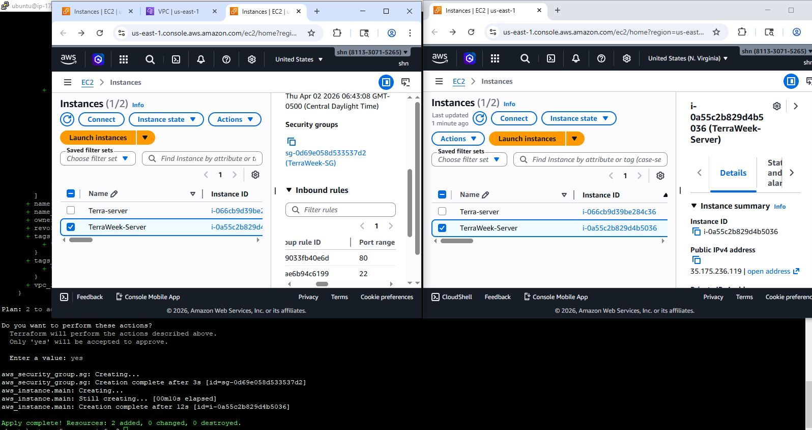
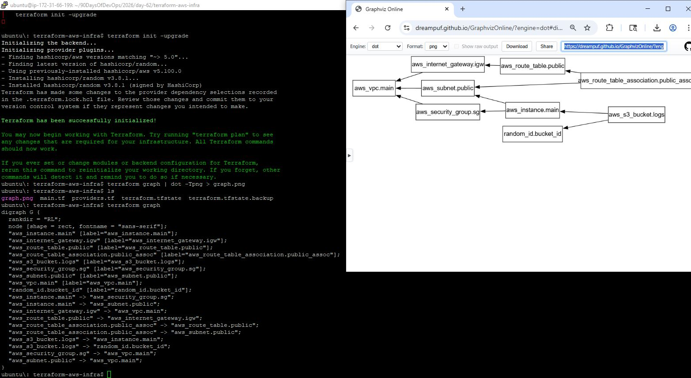
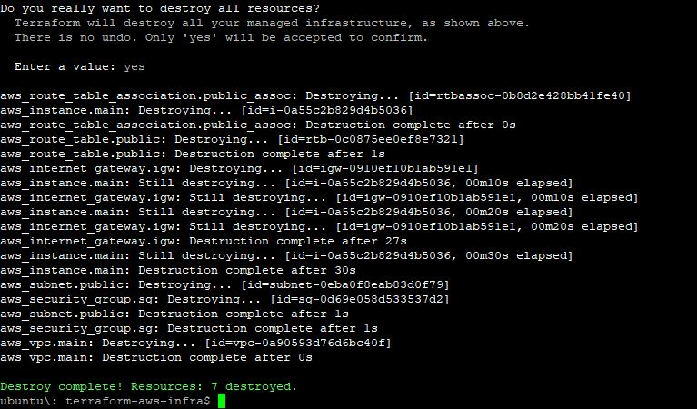

# Day 62 – Providers, Resources, and Dependencies

## Task
Yesterday you created standalone resources. But real infrastructure is connected -- a server lives inside a subnet, a subnet lives inside a VPC, a security group controls what traffic gets in. Today you build a complete networking stack on AWS and learn how Terraform figures out what to create first.

Understanding dependencies is what separates a Terraform beginner from someone who can build production infrastructure.

---

## Expected Output
- A VPC with subnet, internet gateway, route table, security group, and an EC2 instance -- all created via Terraform
- A dependency graph visualized with `terraform graph`
- A markdown file: `day-62-providers-resources.md`

---

### Task 1: Explore the AWS Provider

1. Create a project directory:

```bash
mkdir terraform-aws-infra
cd terraform-aws-infra
```

2. Create `providers.tf`:

```hcl
terraform {
  required_providers {
    aws = {
      source  = "hashicorp/aws"
      version = "~> 5.0"
    }
  }
  required_version = ">= 1.5.0"
}

provider "aws" {
  region = "us-east-1"
}
```

3. Initialize Terraform:

```bash
terraform init
```

* Check the installed provider version in the output
* Review `.terraform.lock.hcl` — this file locks the provider version for reproducible builds

**Explanation:**

* `~> 5.0` → any version ≥ 5.0.0 and < 6.0.0
* `>= 5.0` → any version 5.0.0 or higher
* `= 5.0.0` → exactly version 5.0.0




---

## Task 2: Build a VPC from Scratch

**Create `main.tf`:**

```hcl
# VPC
resource "aws_vpc" "main" {
  cidr_block = "10.0.0.0/16"
  tags = {
    Name = "TerraWeek-VPC"
  }
}

# Subnet
resource "aws_subnet" "public" {
  vpc_id                  = aws_vpc.main.id
  cidr_block              = "10.0.1.0/24"
  map_public_ip_on_launch = true
  tags = {
    Name = "TerraWeek-Public-Subnet"
  }
}

# Internet Gateway
resource "aws_internet_gateway" "igw" {
  vpc_id = aws_vpc.main.id
  tags = {
    Name = "TerraWeek-IGW"
  }
}

# Route Table
resource "aws_route_table" "public" {
  vpc_id = aws_vpc.main.id
  route {
    cidr_block = "0.0.0.0/0"
    gateway_id = aws_internet_gateway.igw.id
  }
  tags = {
    Name = "TerraWeek-Public-RT"
  }
}

# Route Table Association
resource "aws_route_table_association" "public_assoc" {
  subnet_id      = aws_subnet.public.id
  route_table_id = aws_route_table.public.id
}
```

**Commands:**

```bash
terraform plan
terraform apply -auto-approve
```

**Verify:** Check AWS VPC console — all resources should appear and be connected.



---

## Task 3: Understand Implicit Dependencies

- How does Terraform know to create the VPC before the subnet?
Terraform automatically creates resources in the correct order based on references.

- What would happen if you tried to create the subnet before the VPC existed?
If you tried to create a subnet before its VPC, Terraform would fail.

- Find all implicit dependencies in your config and list them
**Implicit dependencies from config:**

* `aws_subnet.public` depends on `aws_vpc.main`
* `aws_internet_gateway.igw` depends on `aws_vpc.main`
* `aws_route_table_association.public_assoc` depends on both `aws_subnet.public` and `aws_route_table.public`

---

## Task 4: Add a Security Group and EC2 Instance

```hcl
# Security Group
resource "aws_security_group" "sg" {
  name        = "TerraWeek-SG"
  description = "Allow SSH and HTTP"
  vpc_id      = aws_vpc.main.id

  ingress {
    from_port   = 22
    to_port     = 22
    protocol    = "tcp"
    cidr_blocks = ["0.0.0.0/0"]
  }

  ingress {
    from_port   = 80
    to_port     = 80
    protocol    = "tcp"
    cidr_blocks = ["0.0.0.0/0"]
  }

  egress {
    from_port   = 0
    to_port     = 0
    protocol    = "-1"
    cidr_blocks = ["0.0.0.0/0"]
  }

  tags = {
    Name = "TerraWeek-SG"
  }
}

# EC2 Instance
resource "aws_instance" "main" {
  ami                    = "ami-0c02fb55956c7d316" # Amazon Linux 2 for us-east-1
  instance_type          = "t2.micro"
  subnet_id              = aws_subnet.public.id
  vpc_security_group_ids = [aws_security_group.sg.id]
  associate_public_ip_address = true

  tags = {
    Name = "TerraWeek-Server"
  }
}
```

**Verification:**

* Terraform apply
* Instance has a public IP and is reachable via SSH



---

## Task 5: Explicit Dependencies with `depends_on`

```hcl
# S3 bucket created after EC2
resource "aws_s3_bucket" "logs" {
  bucket = "terraweek-logs-${random_id.bucket_id.hex}"
  acl    = "private"

  depends_on = [aws_instance.main]
}

resource "random_id" "bucket_id" {
  byte_length = 4
}
```

**Graph Visualization:**

```bash
terraform graph | dot -Tpng > graph.png
```

**Use Cases for `depends_on`:**

1. Resource creation order when Terraform cannot infer it
2. Waiting for external resources or scripts to complete before creating dependent resources





---

## Task 6: Lifecycle Rules and Destroy

```hcl
resource "aws_instance" "main" {
  ami                    = "ami-0c02fb55956c7d316" # Amazon Linux 2 for us-east-1
  instance_type          = "t2.micro"
  subnet_id              = aws_subnet.public.id   # Implicit dependency on subnet
  vpc_security_group_ids = [aws_security_group.sg.id] # Implicit dependency on SG
  associate_public_ip_address = true

  tags = {
    Name = "TerraWeek-Server"
  }

  # Lifecycle rule: create new instance before destroying old one
  lifecycle {
    create_before_destroy = true
  }
}

```

**Lifecycle arguments:**

* `create_before_destroy` → ensures new resource is created before old one is destroyed
* `prevent_destroy` → protects a resource from accidental deletion
* `ignore_changes` → ignore specific attribute changes (e.g., `tags` or `user_data`)

**Destroy Order:**

```bash
terraform destroy
```

* Resources are destroyed in reverse dependency order



---

## Summary

* Providers define which cloud or service Terraform will interact with
* Resources can reference each other to create **implicit dependencies**
* `depends_on` creates **explicit dependencies** when Terraform cannot infer them
* Lifecycle rules control creation and deletion behavior
* Terraform’s graph ensures predictable infrastructure ordering

---

