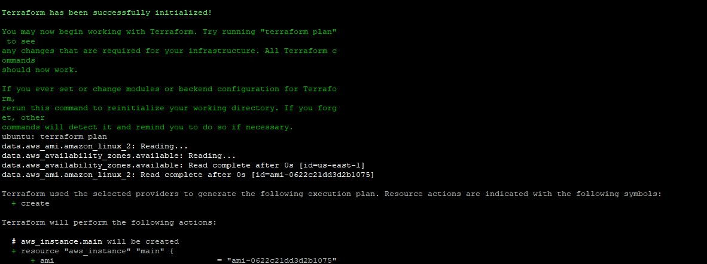

# Day 63: Variables, Outputs, Data Sources and Expressions

## Task Overview
Refactored Day 62 Terraform config to be dynamic, reusable, and environment-aware with no hardcoded values.

---

## Task 1:Extract Variables
Take your Day 62 infrastructure config and refactor it:

1. Create a `variables.tf` file with input variables
2. Replace every hardcoded value in `main.tf` with `var.<name>` references
3. Run `terraform plan` -- it should prompt you for `project_name` since it has no default

**Document:** What are the five variable types in Terraform? (`string`, `number`, `bool`, `list`, `map`)

## main.tf (refractored)

```hcl
provider "aws" {
  region = var.region
}

# Data Sources
data "aws_ami" "amazon_linux_2" {
  most_recent = true
  owners      = ["amazon"]

  filter {
    name   = "name"
    values = ["amzn2-ami-hvm-*-x86_64-gp2"]
  }

  filter {
    name   = "virtualization-type"
    values = ["hvm"]
  }

  filter {
    name   = "root-device-type"
    values = ["ebs"]
  }
}

data "aws_availability_zones" "available" {
  state = "available"
}

# Locals
locals {
  name_prefix = "${var.project_name}-${var.environment}"
  common_tags = {
    Project     = var.project_name
    Environment = var.environment
    ManagedBy   = "Terraform"
  }

  instance_type = var.environment == "prod" ? "t3.small" : var.instance_type
}

# VPC
resource "aws_vpc" "main" {
  cidr_block = var.vpc_cidr

  tags = merge(local.common_tags, {
    Name = "${local.name_prefix}-vpc"
  })
}

# Subnet
resource "aws_subnet" "public" {
  vpc_id                  = aws_vpc.main.id
  cidr_block              = var.subnet_cidr
  availability_zone       = data.aws_availability_zones.available.names[0]
  map_public_ip_on_launch = true

  tags = merge(local.common_tags, {
    Name = "${local.name_prefix}-subnet"
  })
}

# Internet Gateway
resource "aws_internet_gateway" "igw" {
  vpc_id = aws_vpc.main.id

  tags = merge(local.common_tags, {
    Name = "${local.name_prefix}-igw"
  })
}

# Route Table
resource "aws_route_table" "public" {
  vpc_id = aws_vpc.main.id

  route {
    cidr_block = "0.0.0.0/0"
    gateway_id = aws_internet_gateway.igw.id
  }

  tags = merge(local.common_tags, {
    Name = "${local.name_prefix}-rt"
  })
}

# Route Table Association
resource "aws_route_table_association" "public_assoc" {
  subnet_id      = aws_subnet.public.id
  route_table_id = aws_route_table.public.id
}

# Security Group
resource "aws_security_group" "sg" {
  name        = "${local.name_prefix}-sg"
  description = "Allow SSH, HTTP, and HTTPS"
  vpc_id      = aws_vpc.main.id

  dynamic "ingress" {
    for_each = var.allowed_ports
    content {
      from_port   = ingress.value
      to_port     = ingress.value
      protocol    = "tcp"
      cidr_blocks = ["0.0.0.0/0"]
    }
  }

  egress {
    from_port   = 0
    to_port     = 0
    protocol    = "-1"
    cidr_blocks = ["0.0.0.0/0"]
  }

  tags = merge(local.common_tags, {
    Name = "${local.name_prefix}-sg"
  })
}

# EC2 Instance
resource "aws_instance" "main" {
  ami                         = data.aws_ami.amazon_linux_2.id
  instance_type               = local.instance_type
  subnet_id                   = aws_subnet.public.id
  vpc_security_group_ids      = [aws_security_group.sg.id]
  associate_public_ip_address = true

  tags = merge(local.common_tags, {
    Name = "${local.name_prefix}-server"
  })

  lifecycle {
    create_before_destroy = true
  }
}

# S3 Bucket
resource "aws_s3_bucket" "logs" {
  bucket = "${var.project_name}-logs-${random_id.bucket_id.hex}"

  tags = merge(local.common_tags, {
    Name = "${local.name_prefix}-logs"
  })

  depends_on = [aws_instance.main]
}

resource "random_id" "bucket_id" {
  byte_length = 4
}
```

### variables.tf

```hcl
variable "region" {
  description = "AWS region for resources"
  type        = string
  default     = "us-east-1"
}

variable "vpc_cidr" {
  description = "CIDR block for VPC"
  type        = string
  default     = "10.0.0.0/16"
}

variable "subnet_cidr" {
  description = "CIDR block for subnet"
  type        = string
  default     = "10.0.1.0/24"
}

variable "project_name" {
  description = "Name of the project"
  type        = string
}

variable "environment" {
  description = "Environment (dev, staging, prod)"
  type        = string
  default     = "dev"
}

variable "instance_type" {
  description = "EC2 instance type"
  type        = string
  default     = "t3.micro"
}

variable "allowed_ports" {
  description = "Allowed inbound ports"
  type        = list(number)
  default     = [22, 80, 443]
}

variable "extra_tags" {
  description = "Additional tags for resources"
  type        = map(string)
  default     = {}
}
```

### Variable Types

* string
* number
* bool
* list
* map



---

## Task 2: Variable Files and PrecedenceVariable Files and Precedence
- Apply with the default file:
```bash
terraform plan                              # Uses terraform.tfvars automatically
```

-  Apply with the prod file:
```bash
terraform plan -var-file="prod.tfvars"      # Uses prod.tfvars
```

-  Override with CLI:
```bash
terraform plan -var="instance_type=t4g.nano"  # CLI overrides everything
```

- Set an environment variable:
```bash
export TF_VAR_environment="staging"
terraform plan                              # env var overrides default but not tfvars
```

**Document:** Write the variable precedence order from lowest to highest priority.

### terraform.tfvars

```hcl
project_name  = "terraweek"
environment   = "dev"
instance_type = "t3.micro"
```

### prod.tfvars

```hcl
project_name  = "terraweek"
environment   = "prod"
instance_type = "t3.small"
vpc_cidr      = "10.1.0.0/16"
subnet_cidr   = "10.1.1.0/24"
```

### Variable Precedence (Low → High)

1. Defaults in variables.tf
2. terraform.tfvars
3. *.auto.tfvars
4. -var-file
5. -var flag
6. TF_VAR_* environment variables


---

## Task 3: Outputs

```hcl
output "vpc_id" {
  description = "ID of the VPC"
  value       = aws_vpc.main.id
}

output "subnet_id" {
  description = "ID of the public subnet"
  value       = aws_subnet.public.id
}

output "instance_id" {
  description = "ID of the EC2 instance"
  value       = aws_instance.main.id
}

output "instance_public_ip" {
  description = "Public IP address of the EC2 instance"
  value       = aws_instance.main.public_ip
}

output "instance_public_dns" {
  description = "Public DNS name of the EC2 instance"
  value       = aws_instance.main.public_dns
}

output "security_group_id" {
  description = "ID of the security group"
  value       = aws_security_group.sg.id
}

# Additional useful outputs
output "availability_zone" {
  description = "Availability zone used"
  value       = data.aws_availability_zones.available.names[0]
}

output "ami_id" {
  description = "AMI ID used for EC2 instance"
  value       = data.aws_ami.amazon_linux_2.id
}

output "s3_bucket_name" {
  description = "Name of the S3 bucket"
  value       = aws_s3_bucket.logs.bucket
}

output "full_config_summary" {
  description = "Summary of configuration"
  value = {
    project     = var.project_name
    environment = var.environment
    region      = var.region
    instance    = local.instance_type
    vpc_cidr    = var.vpc_cidr
    subnet_cidr = var.subnet_cidr
  }
}
```

Applied config and verified outputs are printed at the end:
```bash
terraform apply

# After apply, you can also run:
terraform output                          # Show all outputs
terraform output instance_public_ip       # Show a specific output
terraform output -json                    # JSON format for scripting
```

**Verify:** Does `terraform output instance_public_ip` return the correct IP?

1[T3](screenshots/T3.JPG)

---

## Task 4: Data Sources

### Difference Between Resource and Data Source

* Resource → Creates infrastructure
* Data Source → Fetches existing information (read-only)

Example:

* resource → creates EC2
* data → gets latest AMI

---

## Task 5: Locals

```hcl
locals {
  name_prefix = "${var.project_name}-${var.environment}"

  common_tags = {
    Project     = var.project_name
    Environment = var.environment
    ManagedBy   = "Terraform"
  }
}
```

**Added, applied and verified**

---

## Task 6: Built-in Functions
# In console, try:
```bash
terraform console
```
> upper("terraweek")
> join("-", ["terra", "week", "2026"])
> format("arn:aws:s3:::%s", "my-bucket")
> length(["a", "b", "c"])
> lookup({dev = "t2.micro", prod = "t3.small"}, "dev")
> cidrsubnet("10.0.0.0/16", 8, 1)
> exit

# Apply with production configuration
```bash
terraform plan -var-file="prod.tfvars"
terraform apply -var-file="prod.tfvars" -auto-approve
```

# Destroy resources when done
```bash
terraform destroy -auto-approve
```

**Five Useful Functions:**
- `merge()` - Combine maps
- `cidrsubnet()` - Calculate subnet CIDRs
- `lookup()` - Get map value with default
- `join()` - Concatenate list with separator
- `upper()/lower()` - Change string case

---

## Difference Between Core Concepts

* variable → input from user
* local → computed value inside config
* output → value shown after apply
* data → fetch external info


---
