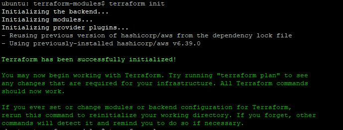
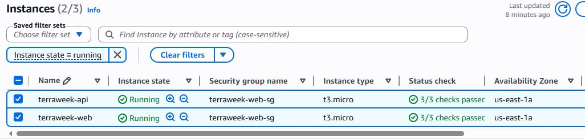
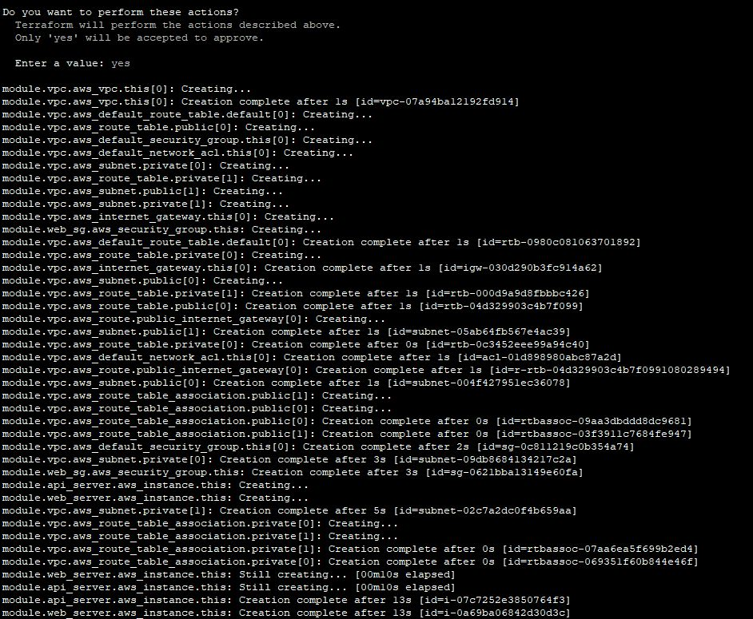
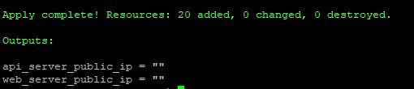
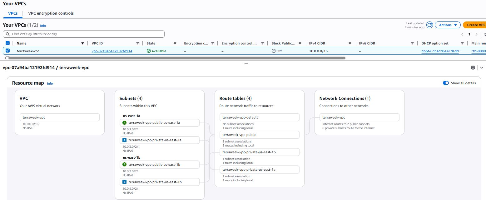
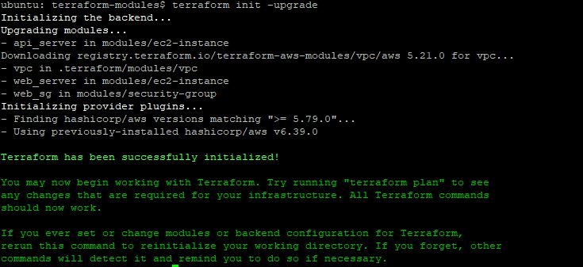
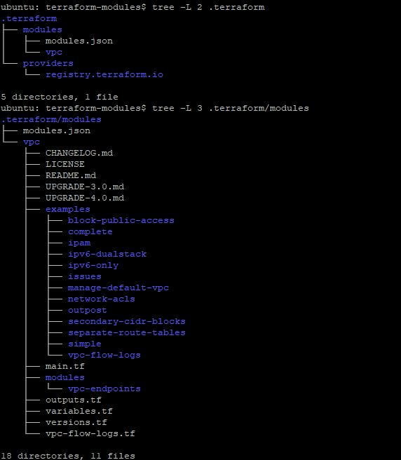
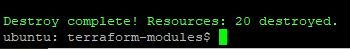

# Day 65 -- Terraform Modules: Build Reusable Infrastructure

## Task
You have been writing everything in one big `main.tf` file. That works for learning, but in real teams you manage dozens of environments with hundreds of resources. Copy-pasting configs across projects is a recipe for disaster.

Today you learn Terraform modules -- the way to package, reuse, and share infrastructure code. Think of modules as functions in programming. Write once, call many times.

---

### Task 1: Understand Module Structure
A Terraform module is just a directory with `.tf` files. Create this structure:

```
terraform-modules/
  main.tf                    # Root module -- calls child modules
  variables.tf               # Root variables
  outputs.tf                 # Root outputs
  providers.tf               # Provider config
  modules/
    ec2-instance/
      main.tf                # EC2 resource definition
      variables.tf           # Module inputs
      outputs.tf             # Module outputs
    security-group/
      main.tf                # Security group resource definition
      variables.tf           # Module inputs
      outputs.tf             # Module outputs
```

Create all the directories and empty files. This is the standard layout every Terraform project follows.

**Document:** What is the difference between a "root module" and a "child module"?

- Root Module
    - Entry point of Terraform execution
    - Contains provider config and calls other modules
- Child Module
    - Reusable component
    - Encapsulates specific infrastructure (EC2, SG, VPC, etc.)

---

### Task 2: Build a Custom EC2 Module
Create `modules/ec2-instance/`:

### `modules/ec2-instance/variables.tf`
[variables.tf](terraform-modules/modules/ec2-instance/variables.tf)


### `modules/ec2-instance/main.tf`
[main.tf](terraform-modules/modules/ec2-instance/main.tf)


### `modules/ec2-instance/outputs.tf`
[outputs.tf](terraform-modules/modules/ec2-instance/outputs.tf)


---

### Task 3: Build a Custom Security Group Module

1. `modules/security-group/variables.tf`
[sg-variables.tf](terraform-modules/modules/security-group/variables.tf)


2. `modules/security-group/main.tf`
[sg-main.tf](terraform-modules/modules/security-group/main.tf)


3. `modules/security-group/outputs.tf`
[sg-output.tf](terraform-modules/modules/security-group/outputs.tf)

---

### Task 4: Call Your Modules from Root
In the root `main.tf`, wire everything together:

1. Create a VPC and subnet directly: Root Module (`main.tf`)
2. Call the security group module
3. Call the EC2 module -- deploy **two instances** with different names using the same module:
4. Add root outputs that reference module outputs:

[tm-main](terraform-modules/main.tf)
[tm-ouputs](terraform-modules/outputs.tf)

5. Apply:
```bash
terraform init    # Downloads/links the local modules
terraform plan    # Should show all resources from both module calls
terraform apply
```







---

### Task 5: Use a Public Registry Module
Instead of building your own VPC from scratch, use the official module from the Terraform Registry.

1. Replace your hand-written VPC resources with:
```hcl
module "vpc" {
  source  = "terraform-aws-modules/vpc/aws"
  version = "~> 5.0"

  name = "terraweek-vpc"
  cidr = "10.0.0.0/16"

  azs             = ["us-east-1a", "us-east-1b"]
  public_subnets  = ["10.0.1.0/24", "10.0.2.0/24"]
  private_subnets = ["10.0.3.0/24", "10.0.4.0/24"]

  enable_nat_gateway = false
  enable_dns_hostnames = true

  tags = local.common_tags
}
```

2. Update your EC2 and SG module calls to reference `module.vpc.vpc_id` and `module.vpc.public_subnets[0]`

3. Run:
```bash
terraform init     # Downloads the registry module
terraform plan
terraform apply
```

4. Compare: how many resources did the VPC module create vs your hand-written VPC from Day 62?

## Registry vs Hand-Written VPC

| Aspect      | Hand-Written VPC | Registry Module  |
| ----------- | ---------------- | ---------------- |
| Resources   | 3             | 17              |
| Features    | Basic            | Production-ready |
| NAT/DNS     | Manual           | Built-in options |
| Reusability | Low              | High             |


| Resource Type               | Hand-written VPC (Day 62) | Module VPC (Day 65) |
| --------------------------- | ------------------------- | ------------------- |
| aws_vpc                     | 1                         | 1                   |
| aws_subnet                  | 2                         | 4                   |
| aws_internet_gateway        | 0                         | 1                   |
| aws_route_table             | 0                         | 4                   |
| aws_route_table_association | 0                         | 4                   |
| aws_default_network_acl     | 0                         | 1                   |
| aws_default_security_group  | 0                         | 1                   |
| aws_route                   | 0                         | 1                   |


This shows the module setup is more comprehensive and production-ready.

**Observation:**
The registry module created significantly more resources (route tables, IGW, associations), making it production-grade compared to my minimal setup.

**Document:** Where does Terraform download registry modules to? Check `.terraform/modules/`.
```
.terraform/modules/
```











---

## Task 6: Module Versioning & Best Practices

1. Pin your registry module version explicitly:
   - `version = "5.1.0"` -- exact version
   - `version = "~> 5.0"` -- any 5.x version
   - `version = ">= 5.0, < 6.0"` -- range

2. Run `terraform init -upgrade` to check for newer versions

3. Check the state to see how modules appear:
```bash
terraform state list
```
Notice the `module.vpc.`, `module.web_server.`, `module.web_sg.` prefixes.

4. Destroy everything:
```bash
terraform destroy
```



---

**Document:** Write down five module best practices:

1. Always pin module versions (avoid breaking changes)
2. Keep modules focused (single responsibility)
3. Never hardcode values — use variables
4. Always expose outputs for reuse
5. Include README.md for documentation

---

## Highlights:

Modules = Functions for Infrastructure

Write once → reuse everywhere → scale safely

---

