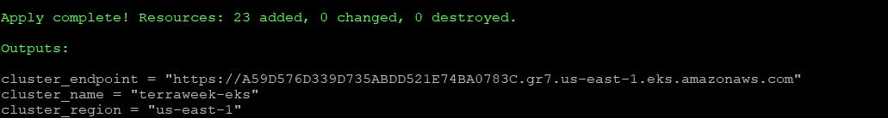
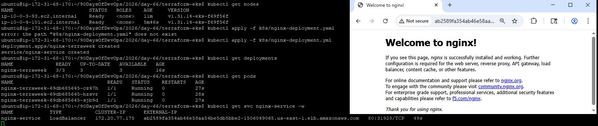
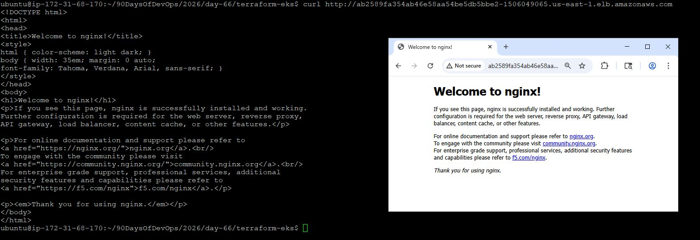
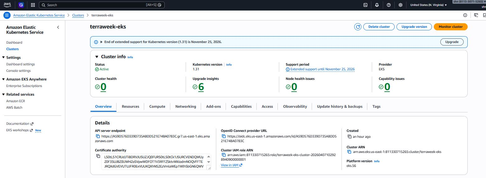
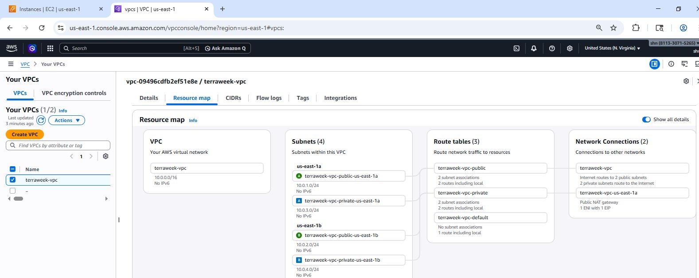
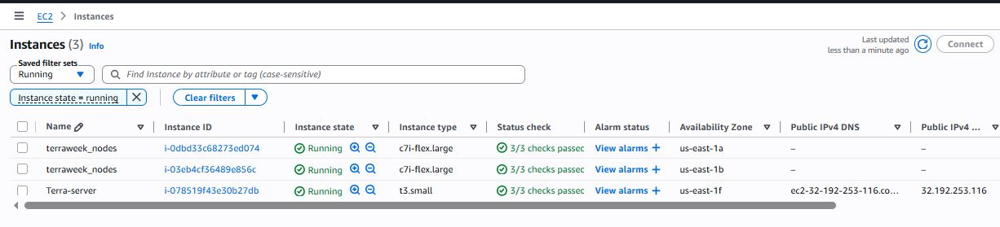
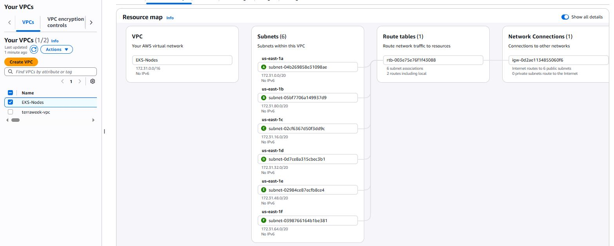
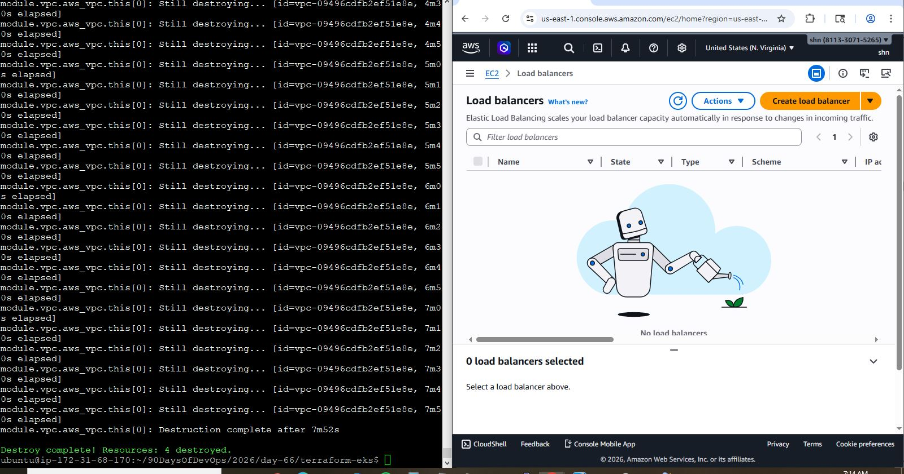
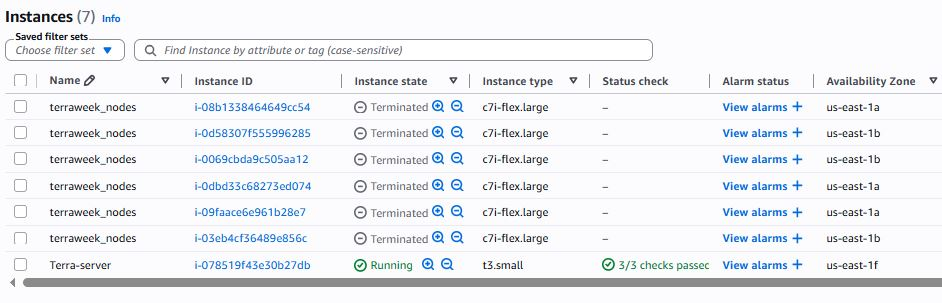

# Day 66 -- Provision an EKS Cluster with Terraform Modules

## Task
You built Kubernetes clusters manually in the Kubernetes week. Today you provision one the DevOps way -- fully automated, repeatable, and destroyable with a single command. You will use Terraform registry modules to create an AWS EKS cluster with a managed node group, connect kubectl, and deploy a workload.

This is what infrastructure teams do every day in production.

---
### Task 1: Project Setup
Create a new project directory with proper file structure:

```
terraform-eks/
  providers.tf        # Provider and backend config
  vpc.tf              # VPC module call
  eks.tf              # EKS module call
  variables.tf        # All input variables
  outputs.tf          # Cluster outputs
  terraform.tfvars    # Variable values
```

## Project Structure

```
terraform-eks/
├── providers.tf
├── variables.tf
├── terraform.tfvars
├── vpc.tf
├── eks.tf
├── outputs.tf
└── k8s/
    └── nginx-deployment.yml
```
---

### providers.tf: [providers](terraform-eks/providers.tf)

### variables.tf: [Variables](terraform-eks/variables.tf)

---

### Task 2: Create the VPC with Registry Module
EKS requires a VPC with both public and private subnets across multiple availability zones.

### vpc.tf: [vpc](terraform-eks/vpc.tf)

**Document:** Why does EKS need both public and private subnets? What do the subnet tags do?

- Private subnets
    - Worker nodes run here (secure, no direct internet exposure)
- Public subnets
    - LoadBalancers (ELB/ALB) live here
    - Accept internet traffic → route to private nodes

- Subnet tags tell EKS:

- Public subnet → create internet-facing LoadBalancers
- Private subnet → create internal LoadBalancers
- Without tags = LoadBalancer service will FAIL

---

### Task 3: Create the EKS Cluster with Registry Module
In `eks.tf`, use the `terraform-aws-modules/eks/aws` module

### eks.tf: [eks](terraform-eks/eks.tf)

---

### Task 4: Apply and Connect kubectl
```bash
terraform init
terraform plan
terraform apply
```
This will take 10-15 minutes. EKS cluster creation is slow -- be patient.

2. Add outputs in `outputs.tf`

### outputs.tf: [outputs](../day-65/terraform-modules/outputs.tf)

### terraform.tfvars: [tfvars](terraform-eks/terraform.tfvars)

3. Update your kubeconfig:
```bash
aws eks update-kubeconfig --name terraweek-eks --region <your-region>
```

4. Verify:
```bash
kubectl get nodes
kubectl get pods -A
kubectl cluster-info
```

**Verify:** Do you see 2 nodes in `Ready` state? Can you see the kube-system pods running?

- Yes. 


---

### Task 5: Deploy a Workload on the Cluster
Your Terraform-provisioned cluster is live. Deploy something on it.

### k8s/nginx-deployment.yml: [ngnix](terraform-eks/k8s/nginx-deployment.yml)

2. Apply:
```bash
kubectl apply -f k8s/nginx-deployment.yaml
```

3. Wait for the LoadBalancer to get an external IP:
```bash
kubectl get svc nginx-service -w
```

4. Access the Nginx page via the LoadBalancer URL

5. Verify the full picture:
```bash
kubectl get nodes
kubectl get deployments
kubectl get pods
kubectl get svc
```

**Verify:** Can you access the Nginx welcome page through the LoadBalancer URL?

- Yes. 

```bash
kubectl get svc nginx-service -w
```

NAME            TYPE           CLUSTER-IP      EXTERNAL-IP                                                               PORT(S)        AGE
nginx-service   LoadBalancer   172.20.77.175   ab2589fa354ab46e58aa54be5db5bbe2-1506049065.us-east-1.elb.amazonaws.com   80:31928/TCP   49s
```

**Access Nginx in browser:**

```text
http://ab2589fa354ab46e58aa54be5db5bbe2-1506049065.us-east-1.elb.amazonaws.com
```





 

 

 



---

### Task 6: Destroy Everything
This is the most important step. EKS clusters cost money. Clean up completely.

1. First, remove the Kubernetes resources (so the AWS LoadBalancer gets deleted)

```bash
kubectl delete -f k8s/nginx-deployment.yaml
```

2. Destroy all Terraform resources:

```bash
terraform destroy
```

3. Verify AWS console:

* EKS clusters: none
* EC2 instances: none
* VPC: deleted
* NAT Gateways: released
* ELBs: deleted





---

## Resources Created

* VPC: 1
* Public Subnets: 2
* Private Subnets: 2
* NAT Gateway: 1
* Internet Gateway: 1
* EKS Cluster: 1
* Node Group (c7i-flex.large): 2 nodes
* IAM Roles and Policies: 3+
* Security Groups: 5+
* ELB for Nginx Service: 1
* CloudWatch Log Groups: 1

* Total: ~15–20 resources (Terraform plan summary)

---