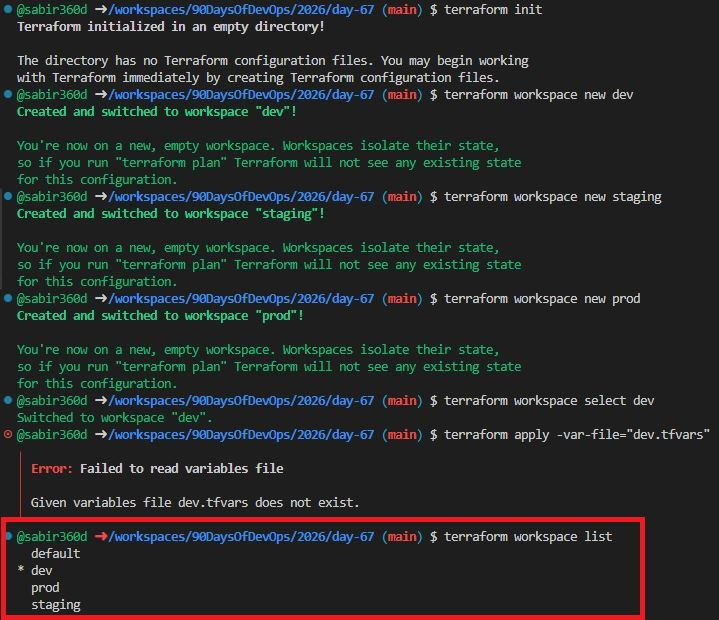
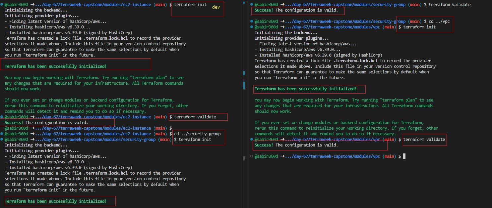
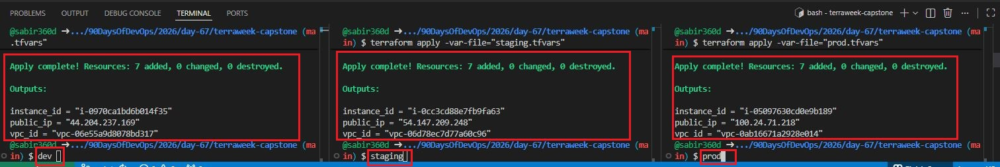
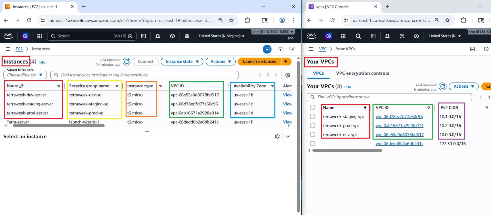
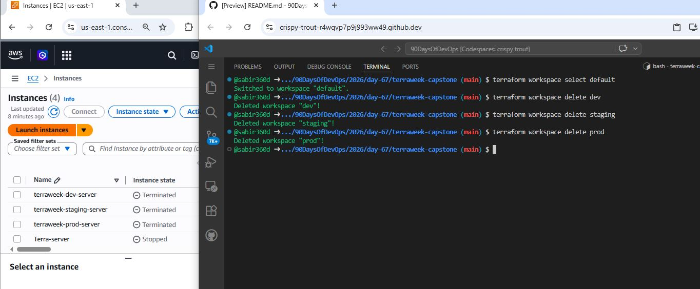

# Day 67 — TerraWeek Capstone: Multi-Environment Infrastructure with Workspaces and Modules

## Overview

This capstone project demonstrates how to build **production-style, multi-environment infrastructure** on AWS using Terraform.

A single Terraform codebase is used to deploy **three isolated environments**:

* Development (`dev`)
* Staging (`staging`)
* Production (`prod`)

Each environment is managed using **Terraform workspaces** and provisioned with:

* A dedicated VPC
* A public subnet
* A security group
* An EC2 instance (with environment-specific sizing)

---

## Task 1: Learn Terraform Workspaces
### 1. What does `terraform.workspace` return?

- It returns the **name of the currently selected workspace** (e.g., `dev`, `staging`, `prod`).

---

### 2. Where does each workspace store its state file?

Each workspace has its own isolated state file:

```
terraform.tfstate.d/<workspace>/terraform.tfstate
```

Example:

```
terraform.tfstate.d/dev/terraform.tfstate
terraform.tfstate.d/staging/terraform.tfstate
terraform.tfstate.d/prod/terraform.tfstate
```

---

### 3. How is this different from using separate directories per environment?
### Workspaces vs Separate Directories

| Workspaces               | Separate Directories    |
| ------------------------ | ----------------------- |
| Single codebase          | Multiple copies of code |
| Shared modules           | Code duplication        |
| Easier to manage         | Harder to maintain      |
| Built-in state isolation | Manual isolation        |




---

## Task 2: Set Up the Project Structure
```
terraweek-capstone/  
├── main.tf               # Root module -- calls child modules
├── variables.tf          # Root variables
├── outputs.tf            # Root outputs
├── providers.tf          # AWS provider and backend
├── locals.tf             # Local values using workspace
├── dev.tfvars            # Dev environment values
├── staging.tfvars        # Staging environment values
├── prod.tfvars           # Prod environment values
├── .gitignore            # Ignore state, .terraform, tfvars with secrets
└── modules/
    ├── vpc/
    │   ├── main.tf
    │   ├── variables.tf
    │   └── outputs.tf
    ├── security-group/
    │   ├── main.tf
    │   ├── variables.tf
    │   └── outputs.tf
    └── ec2-instance/
        ├── main.tf
        ├── variables.tf
        └── outputs.tf
```

---

### Why This Structure is Best Practice

* Separation of concerns (providers, variables, outputs, logic)
* Reusable modules
* Clean, scalable architecture
* Easy debugging and maintenance
* Aligns with real-world DevOps standards

---

# Task 3: Build the Custom Modules

## 1. VPC Module

Creates:

* VPC
* Public subnet
* Internet Gateway
* Route table + association

**Inputs:**

* CIDR blocks
* Environment
* Project name

**Outputs:**

* `vpc_id`
* `subnet_id`

---

## 2. Security Group Module

Creates:

* Security group with dynamic ingress rules
* Allows all outbound traffic

**Inputs:**

* VPC ID
* List of ports
* Environment
* Project name

**Output:**

* `sg_id`

---

## 3. EC2 Instance Module

Creates:

* EC2 instance

**Inputs:**

* AMI ID
* Instance type
* Subnet ID
* Security group IDs
* Environment
* Project name

**Outputs:**

* `instance_id`
* `public_ip`

---

# Root Configuration

The root module:

* Calls all child modules
* Uses `terraform.workspace` for environment awareness
* Applies consistent tagging across all resources




---
## Task 4: Wire It All Together with Workspace-Aware Config
## Environment Configuration (tfvars)

## dev.tfvars

```hcl
vpc_cidr      = "10.0.0.0/16"
subnet_cidr   = "10.0.1.0/24"
instance_type = "t3.micro"
ingress_ports = [22, 80]
```

## staging.tfvars

```hcl
vpc_cidr      = "10.1.0.0/16"
subnet_cidr   = "10.1.1.0/24"
instance_type = "t3.small"
ingress_ports = [22, 80, 443]
```

## prod.tfvars

```hcl
vpc_cidr      = "10.2.0.0/16"
subnet_cidr   = "10.2.1.0/24"
instance_type = "t3.small"
ingress_ports = [80, 443]
```

---

## Task 5: Deploy All Three Environments

### Initialize Terraform

```bash
terraform init
```

### Create Workspaces

```bash
terraform workspace new dev
terraform workspace new staging
terraform workspace new prod
```

---

### Deploy Environments

#### Dev

```bash
terraform workspace select dev
terraform apply -var-file="dev.tfvars"
```

#### Staging

```bash
terraform workspace select staging
terraform apply -var-file="staging.tfvars"
```

#### Prod

```bash
terraform workspace select prod
terraform apply -var-file="prod.tfvars"
```

---

### Verification

After deployment:

* Three separate VPCs created
* Non-overlapping CIDRs
* Three EC2 instances running
* Environment-specific instance types
* Unique naming:

  * `terraweek-dev-server`
  * `terraweek-staging-server`
  * `terraweek-prod-server`

### All environments are fully isolated





---

## Task 6: Document Best Practices

### 1. File Structure

* Separate files for providers, variables, outputs, and logic

### 2. State Management

* Use remote backends (S3)
* Enable state locking (DynamoDB)
* Enable versioning

### 3. Variables

* Never hardcode values
* Use tfvars per environment
* Add validation where possible

### 4. Modules

* One responsibility per module
* Define clear inputs and outputs
* Reusable and composable

### 5. Workspaces

* Isolate environments
* Use `terraform.workspace` for dynamic behavior

### 6. Security

* Ignore sensitive files with `.gitignore`
* Protect state files
* Restrict access to backend

### 7. Commands

* Always run `terraform plan` before `apply`
* Use `terraform fmt` and `terraform validate`

### 8. Tagging

* Tag all resources:

  * Project
  * Environment
  * ManagedBy

### 9. Naming Convention

```
<project>-<environment>-<resource>
```

### 10. Cleanup

* Always destroy unused environments

```bash
terraform destroy
```

---

## Task 7: Destroy All Environments

```bash
terraform workspace select prod
terraform destroy -var-file="prod.tfvars"

terraform workspace select staging
terraform destroy -var-file="staging.tfvars"

terraform workspace select dev
terraform destroy -var-file="dev.tfvars"
```

---

## Delete Workspaces

```bash
terraform workspace select default
terraform workspace delete dev
terraform workspace delete staging
terraform workspace delete prod
```



---

## Final Outcome

This project demonstrates:

* Multi-environment infrastructure design
* Modular Terraform architecture
* Workspace-based deployments
* Environment isolation and scalability
* Production-ready Infrastructure as Code practices


## Conclusion

This capstone project simulates how real-world infrastructure teams operate by using:

* A single codebase
* Multiple environments
* Reusable modules
* Safe and scalable Terraform practices

It represents a complete, production-style Infrastructure as Code implementation.

---