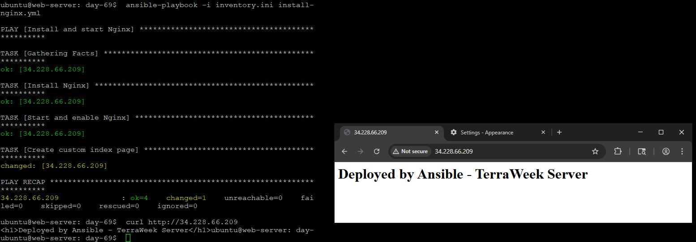
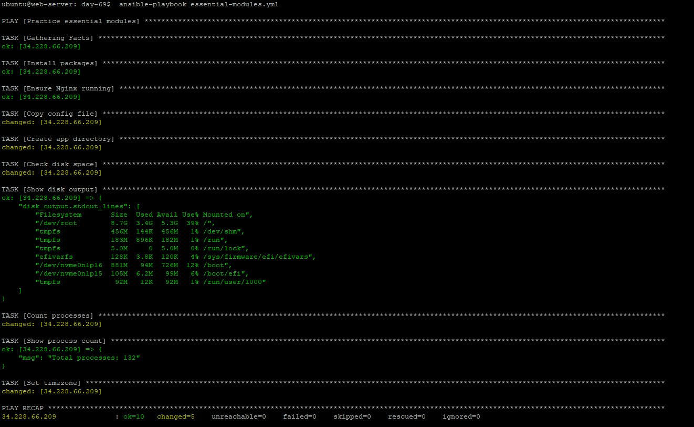
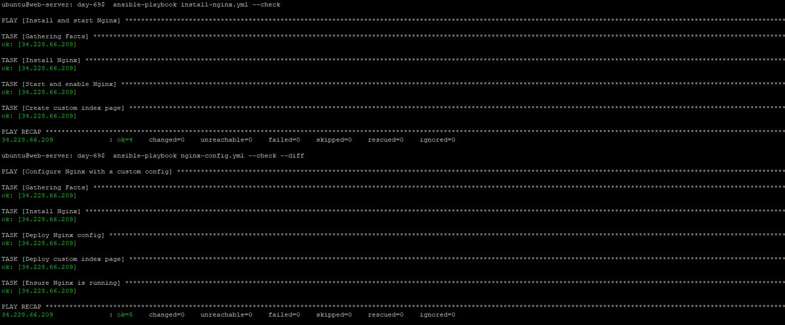
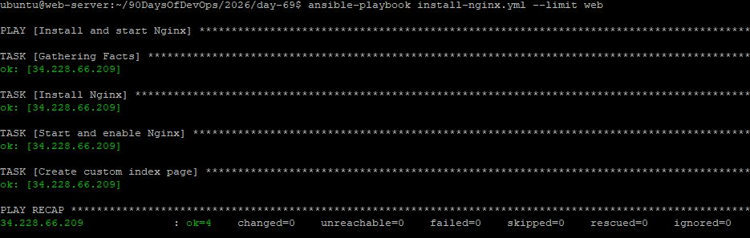
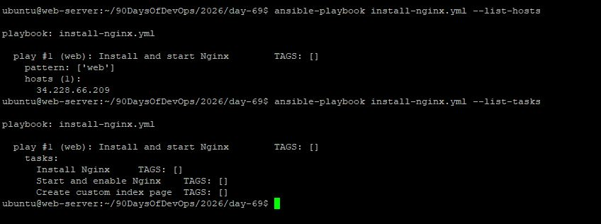
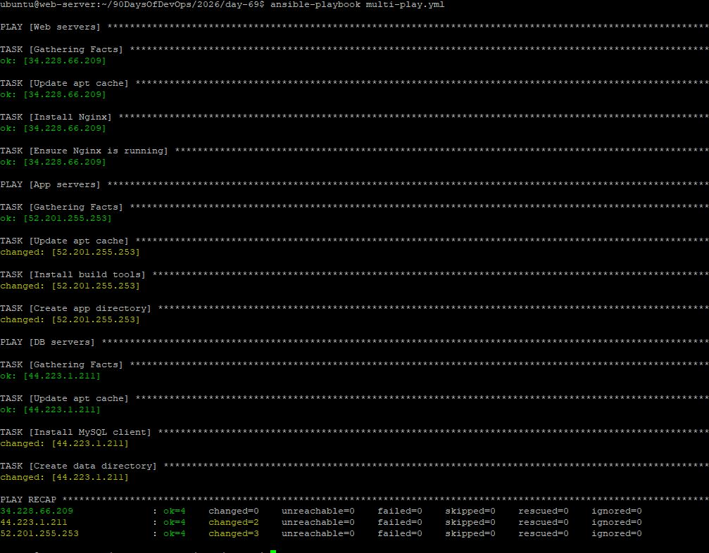

# Day 69 — Ansible Playbooks & Modules 

## Overview

Ad-hoc commands are useful for quick checks, but real automation lives in playbooks. A playbook is a YAML file that describes the desired state of your servers -- which packages to install, which services to run, which files to place where. You write it once, run it a hundred times, and get the same result every time.

## Task 1. First Playbook (Annotated)

### `install-nginx.yml` [text](practice/install-nginx.yml)

## Key Concepts

### Play vs Task

* **Play** → Targets a group of hosts
* **Task** → A single unit of work (e.g., install package)

### Multiple Plays?

- Yes — one playbook can target multiple server groups

### `become: true`

* **Play level** → applies to all tasks
* **Task level** → applies only to that task

### Task Failure Behavior

* Play **stops on failure** by default for that host
* Other hosts continue execution



---

## Task 2. Essential Modules

### `essential-modules.yml` [text](practice/essential-modules.yml)


## Command vs Shell
| Feature | command (`shell=False`) | shell (`shell=True`) | Status |
| :--- | :--- | :--- | :--- |
| **Shell support** |  No |  Yes | Correct. Direct execution doesn't use shell built-ins or environment variables. |
| **Pipes (`\|`)** |  No |  Yes | Correct. The shell is required to interpret the `\|` symbol. |
| **Redirects (`>`)** |  No |  Yes | Correct. Redirection symbols like `>` or `>>` are shell features. |
| **Safety** |  More secure |  Less secure | Correct. Using a shell can lead to shell injection if input is not sanitized. |


**Rule:**

* Use `command` → default
* Use `shell` → only when needed

---

## Task 3. Handlers (Efficient Restarts)

### `nginx-config.yml` [text](practice/nginx-config.yml)

* **First run:** handler runs
* **Second run:** handler skipped

- Only triggers when a change occurs



---

## Task 4. Idempotency Proof

### First Run

```
TASK [Install Nginx] → changed
TASK [Start Nginx] → changed
```

### Second Run

```
TASK [Install Nginx] → ok
TASK [Start Nginx] → ok
```

- No unnecessary changes
- Safe to run repeatedly

[T4](screenshots/T4.JPG)

---

## Task 5. Dry Run, Diff, Verbosity

### Commands

```bash
# Dry run
ansible-playbook install-nginx.yml --check

# Show changes
ansible-playbook nginx-config.yml --check --diff

# Debugging
ansible-playbook install-nginx.yml -vvv

# Limit hosts
ansible-playbook install-nginx.yml --limit web

# Preview execution
ansible-playbook install-nginx.yml --list-hosts
ansible-playbook install-nginx.yml --list-tasks
```

### Why `--check --diff` Matters

* Prevents breaking production
* Shows **exact changes before applying**
* Enables safe reviews and approvals







---

## Task 6. Multiple Plays

### `multi-play.yml` [text](practice/multi-play.yml)

---

## Key Takeaways

* Playbooks = **declarative infrastructure**
* Idempotency = **safe repeatability**
* Modules = **building blocks of automation**
* Handlers = **efficient change management**
* `--check --diff` = **production safety net**



---

## Folder Structure

```
day-69/
├── install-nginx.yml
├── essential-modules.yml
├── nginx-config.yml
├── multi-play.yml
└── files/
    ├── app.conf
    └── nginx.conf
```
