# Day 70 — Variables, Facts, Conditionals and Loops

# Task 1: Variables in Playbooks
- Create variables-demo.yml: 

## Verification

* Playbook executed successfully across all hosts
* Directory `/opt/terraweek-app` created
* Packages installed using `package` module

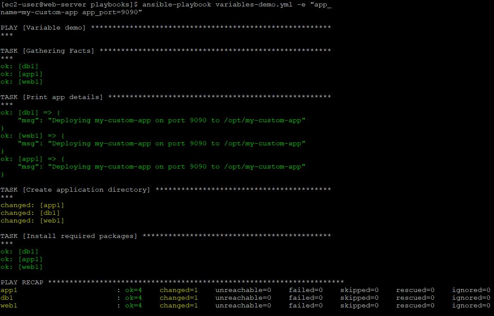

## CLI Override Test

```bash
ansible-playbook variables-demo.yml
```


### Observation

* CLI variables **override playbook variables**

---

# Task 2: group_vars and host_vars

- Variables should not live inside playbooks. Move them to dedicated files.

- Project Structure:

[alt text](scereenshots/T2a.JPG)

## Variable Files:

### group_vars/all.yml
* Common variables applied to all hosts

### group_vars/web.yml
* Applied only to `web` group

### group_vars/db.yml
* Applied only to `db` group

### host_vars/web1.yml
* Applied only to `web1`

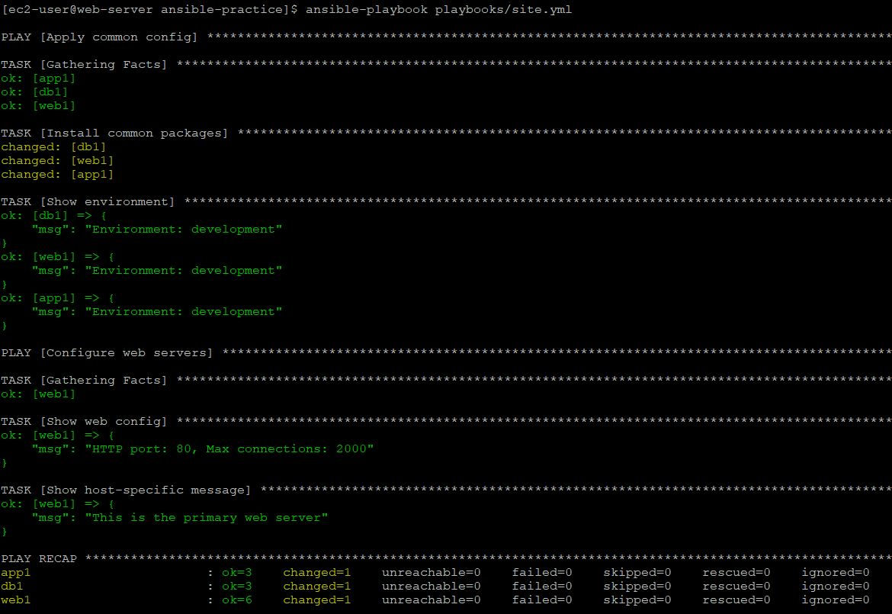


## Playbook Execution Output Highlights

```text
HTTP port: 80, Max connections: 2000
This is the primary web server
```

## Observations

* Variables from `group_vars/all.yml` applied to all hosts
* Variables from `group_vars/web.yml` applied only to web servers
* `web1` used `max_connections = 2000` (from host_vars)
* Host-specific variable `custom_message` worked correctly
* `app1` and `db1` did not run web-specific tasks


## Variable Precedence

Order (low → high):

```
group_vars/all
< group_vars/<group>
< host_vars/<host>
< playbook vars
< task vars
< extra vars (-e)
```
---

#  Task 3: Ansible Facts

## Commands Used

```bash
ansible web -m setup
ansible web -m setup -a "filter=ansible_distribution"
ansible web -m setup -a "filter=ansible_memtotal_mb"
```

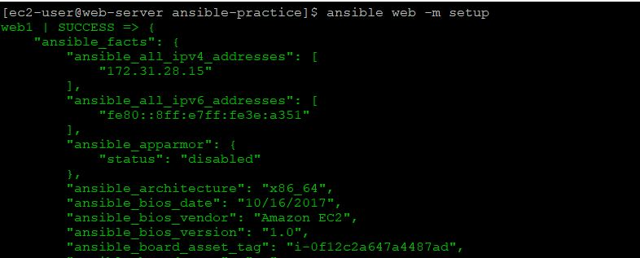

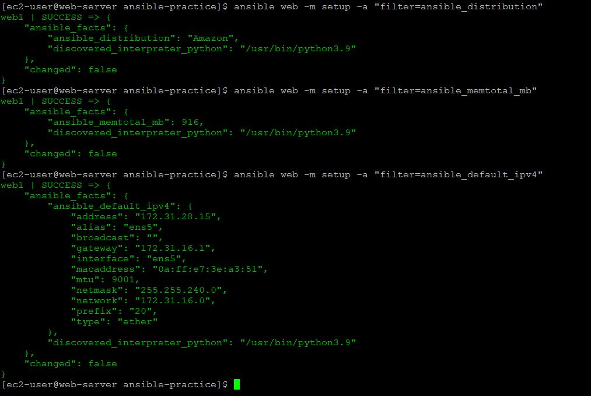

---

## Useful Facts

* `ansible_distribution` → OS detection
* `ansible_distribution_version` → version control
* `ansible_memtotal_mb` → memory checks
* `ansible_default_ipv4.address` → networking
* `ansible_hostname` → host identification

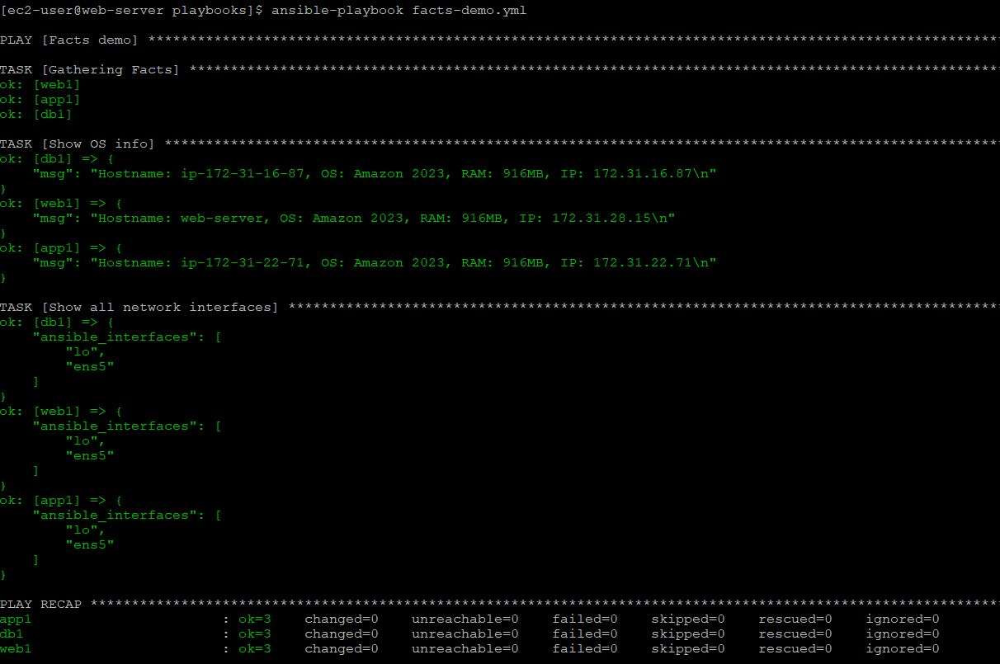

---

# Task 4: Conditionals

## Key Features Used

* Group-based conditions:

  ```yaml
  when: "'web' in group_names"
  ```

* OS-based condition:

  ```yaml
  when: ansible_distribution == "Amazon"
  ```

* Memory condition:

  ```yaml
  when: ansible_memtotal_mb < 1024
  ```

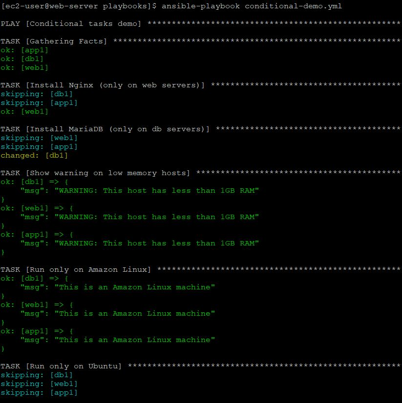

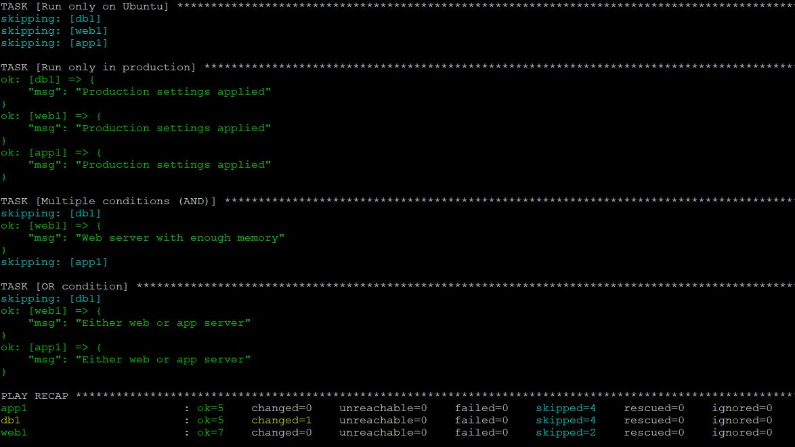

---

## Observations

* Nginx installed only on web servers
* MySQL installed only on db servers
* Low memory warning triggered (<1GB RAM)
* Tasks skipped correctly when conditions not met

---

# Task 5: Loops

## Loop Implementation

* Created multiple users
* Created multiple directories
* Installed multiple packages
* Printed results per iteration

---

## Loop vs with_items

* `loop` is the modern and recommended method
* `with_items` is deprecated

### Differences:

* `loop` is more flexible and readable
* Supports all data types
* Replaces older constructs like:

  * with_items
  * with_dict
  * with_list

### Conclusion:

* Always use `loop` in modern Ansible playbooks

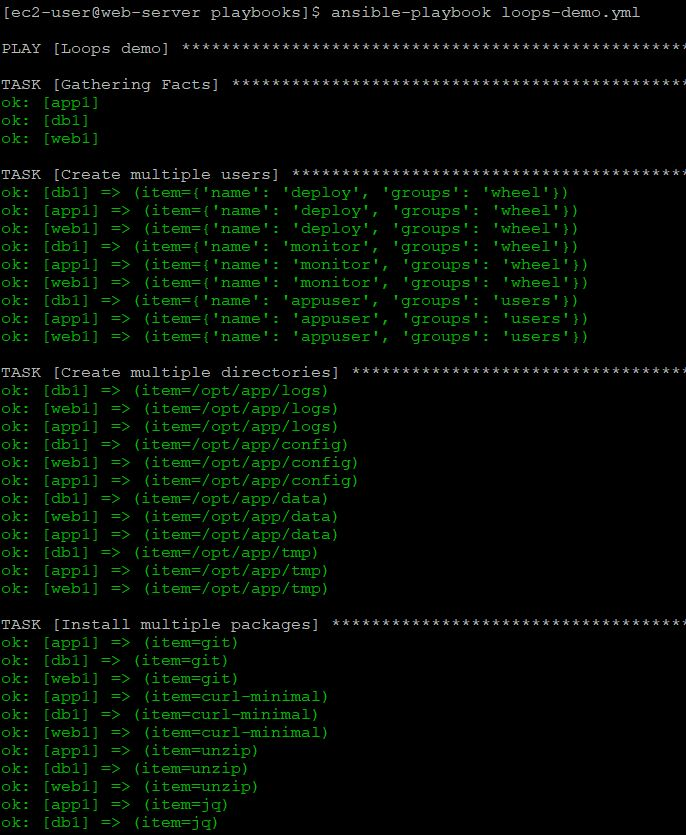

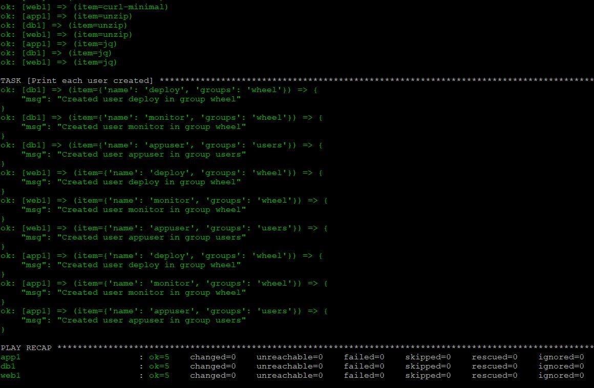

---

#  Task 6: Server Health Report

## Features Used

* `register` to capture command output
* `debug` to display structured report
* `when` for disk alerts
* `copy` to save report to file

---

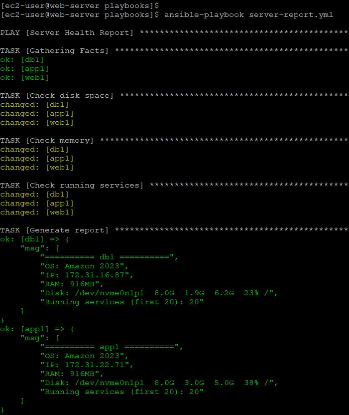

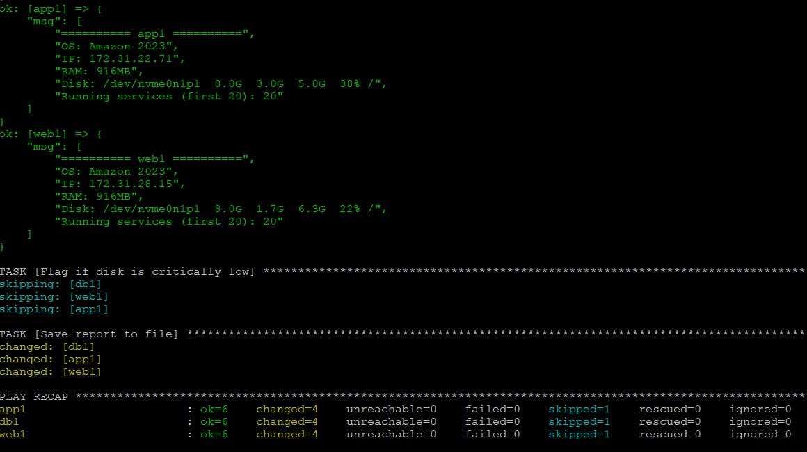

## File Verification

```bash
cat /tmp/server-report-*.txt
```

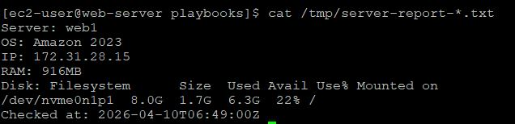

```

---

## Verification

* Hostname matches inventory
* OS matches Ansible facts
* IP matches EC2 private IP
* Memory matches system memory
* Disk usage matches `df -h`
* Timestamp generated correctly

---