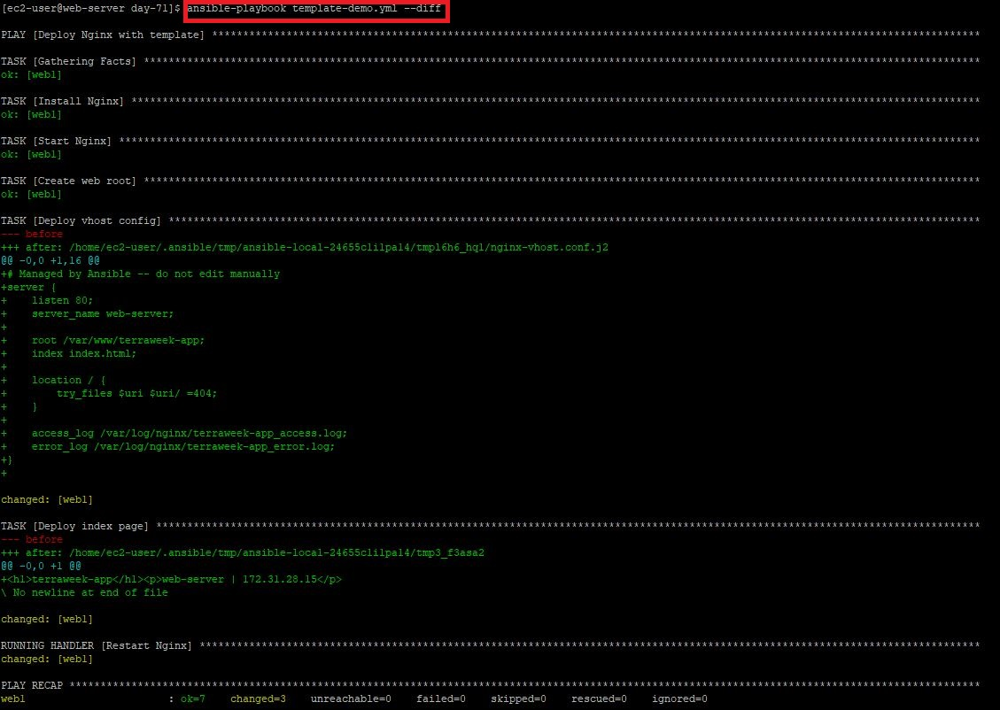
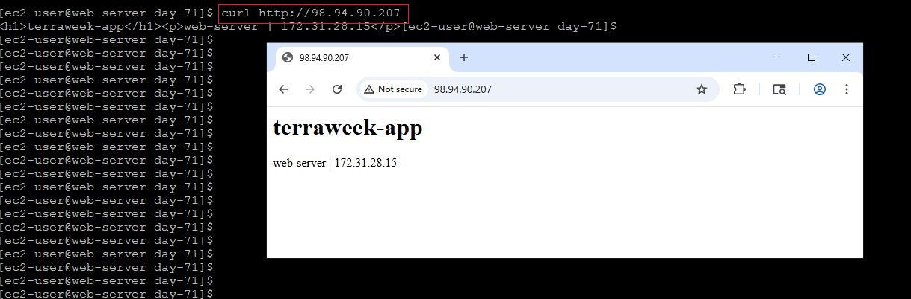
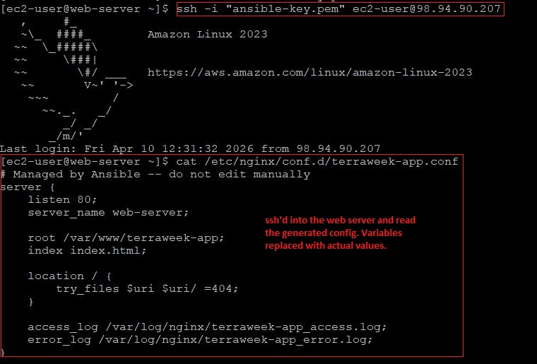
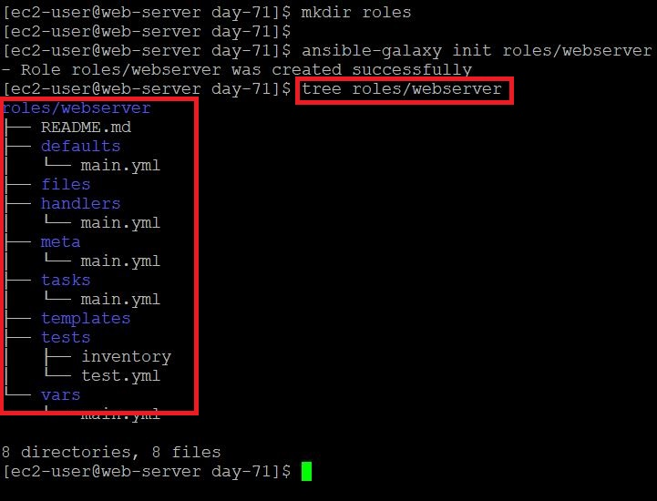
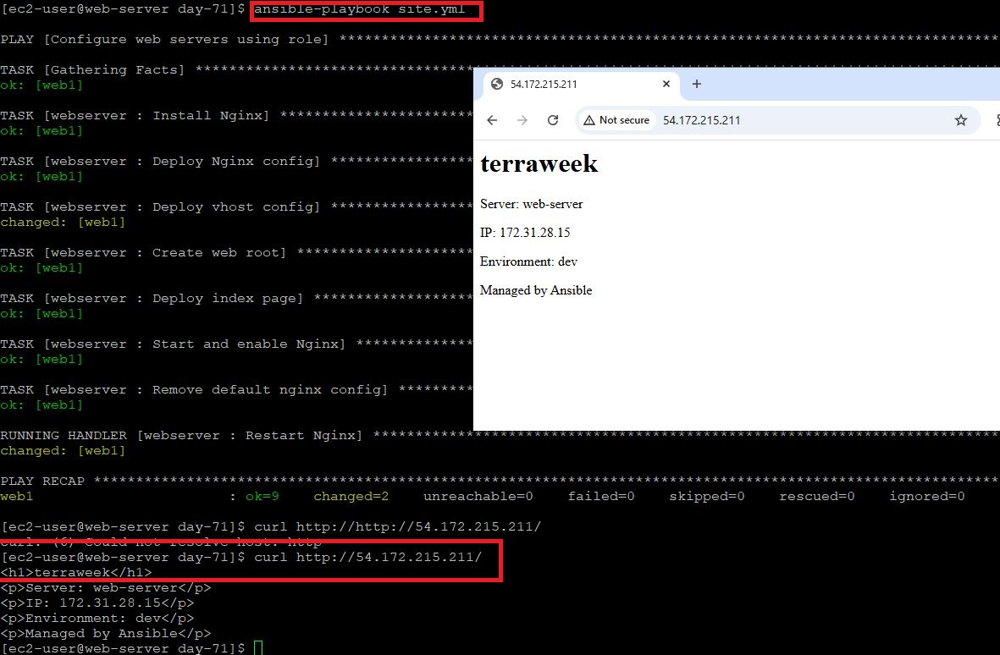
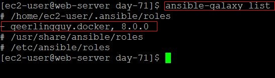
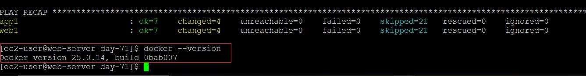
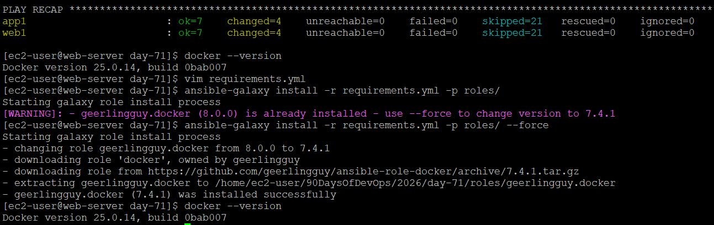
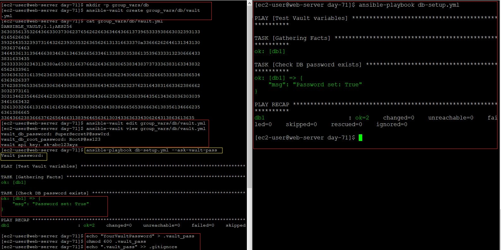
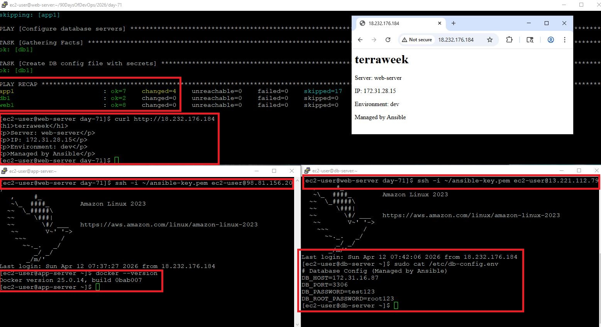

# Day 71 — Roles, Templates, Galaxy & Vault

## Overview

Today focused on organizing and securing Ansible automation using:

* Roles (modular structure)
* Templates (dynamic configs)
* Galaxy (reusable roles)
* Vault (secure secrets)

Environment: **Amazon Linux 2023 (t3.micro)**

---

# Task 1 - Jinja2 Templates

## Structure

```bash
ansible-day71/
├── ansible.cfg
├── inventory.ini
├── template-demo.yml
└── templates/
    └── nginx-vhost.conf.j2
```

## Template (`templates/nginx-vhost.conf.j2`)

```jinja2
server {
    listen {{ http_port | default(80) }};
    server_name {{ ansible_hostname }};

    root /var/www/{{ app_name }};
    index index.html;

    location / {
        try_files $uri $uri/ =404;
    }
}
```

## Playbook (`template-demo.yml`)

```yaml
- name: Deploy Nginx with template
  hosts: web
  become: true
  vars:
    app_name: terraweek-app
    http_port: 80

  tasks:
    - name: Install Nginx
      yum:
        name: nginx
        state: present

    - name: Create web root
      file:
        path: "/var/www/{{ app_name }}"
        state: directory
        mode: '0755'

    - name: Deploy vhost config from template
      template:
        src: templates/nginx-vhost.conf.j2
        dest: "/etc/nginx/conf.d/{{ app_name }}.conf"
        owner: root
        mode: '0644'
      notify: Restart Nginx

    - name: Deploy index page
      copy:
        content: "<h1>{{ app_name }}</h1><p>Host: {{ ansible_hostname }} | IP: {{ ansible_default_ipv4.address }}</p>"
        dest: "/var/www/{{ app_name }}/index.html"

  handlers:
    - name: Restart Nginx
      service:
        name: nginx
        state: restarted
```

## Outcome

* Variables rendered dynamically into config
* Verified via 
```bash
ansible-playbook template-demo.yml --diff
```







---

# Task 2 - Understand the Role Structure

## Generate Role

```bash
ansible-galaxy init roles/webserver
```

## Structure

```bash
roles/webserver/
├── defaults/main.yml
├── handlers/main.yml
├── tasks/main.yml
├── templates/
├── vars/main.yml
```

## Key Concept

* `defaults/` → low priority (overridable)
* `vars/` → high priority



---

# Task 3 - Build a Custom Webserver Role

Build a complete `webserver` role from scratch:

**`roles/webserver/defaults/main.yml`:**
```yaml
---
http_port: 80
app_name: myapp
max_connections: 512
```

**`roles/webserver/tasks/main.yml`:**
```yaml
---
- name: Install Nginx
  yum:
    name: nginx
    state: present

- name: Deploy Nginx config
  template:
    src: nginx.conf.j2
    dest: /etc/nginx/nginx.conf
    owner: root
    mode: '0644'
  notify: Restart Nginx

- name: Deploy vhost config
  template:
    src: vhost.conf.j2
    dest: "/etc/nginx/conf.d/{{ app_name }}.conf"
    owner: root
    mode: '0644'
  notify: Restart Nginx

- name: Create web root
  file:
    path: "/var/www/{{ app_name }}"
    state: directory
    mode: '0755'

- name: Deploy index page
  template:
    src: index.html.j2
    dest: "/var/www/{{ app_name }}/index.html"
    mode: '0644'

- name: Start and enable Nginx
  service:
    name: nginx
    state: started
    enabled: true
```

**`roles/webserver/handlers/main.yml`:**
```yaml
---
- name: Restart Nginx
  service:
    name: nginx
    state: restarted
```

**`roles/webserver/templates/index.html.j2`:**
```html
<h1>{{ app_name }}</h1>
<p>Server: {{ ansible_hostname }}</p>
<p>IP: {{ ansible_default_ipv4.address }}</p>
<p>Environment: {{ app_env | default('development') }}</p>
<p>Managed by Ansible</p>
```

Create the `vhost.conf.j2` and `nginx.conf.j2` templates yourself based on what you learned in Task 1.

Now call the role from a playbook `site.yml`:
```yaml
---
- name: Configure web servers
  hosts: web
  become: true
  roles:
    - role: webserver
      vars:
        app_name: terraweek
        http_port: 80
```

Run it:
```bash
ansible-playbook site.yml
```

**Verify:** Curl the web server. Does the custom page load? Yes



---

# Task 4 - Ansible Galaxy -- Use Community Roles
Ansible Galaxy is a marketplace of pre-built roles.

1. **Search for roles:**
```bash
ansible-galaxy search nginx --platforms EL
ansible-galaxy search mysql
```

2. **Install a role from Galaxy:**
```bash
ansible-galaxy install geerlingguy.docker
```

3. **Check where it was installed:**
```bash
ansible-galaxy list
```

4. **Use the installed role** -- create `docker-setup.yml`:
```yaml
---
- name: Install Docker using Galaxy role
  hosts: app
  become: true
  roles:
    - geerlingguy.docker
```

Run it -- Docker gets installed with a single role call.

5. **Use a requirements file** for managing multiple roles. Create `requirements.yml`:
```yaml
---
roles:
  - name: geerlingguy.docker
    version: "7.4.1"
  - name: geerlingguy.ntp
```

Install all at once:
```bash
ansible-galaxy install -r requirements.yml
```

## Solution: Install Role

```bash
ansible-galaxy install geerlingguy.docker
```

## requirements.yml

```yaml
roles:
  - name: geerlingguy.docker
    version: "7.4.1"
```

## Install via file

```bash
ansible-galaxy install -r requirements.yml -p roles/
```

## Note (AL2023 Fix)

Used native install instead of Galaxy role:

```yaml
- name: Install Docker
  package:
    name: docker
    state: present
```

**Document:** Why use a `requirements.yml` instead of installing roles manually?

- Manual Install
Not reproducible
Version mismatch
Team inconsistency

- requirements.yml
Version controlled
Team consistent
CI/CD friendly
One command setup









---

# Task 5 - Ansible Vault -- Encrypt Secrets

Never put passwords, API keys, or tokens in plain text. Ansible Vault encrypts sensitive data.

1. **Create an encrypted file:**
```bash
ansible-vault create group_vars/db/vault.yml
```
It will ask for a vault password, then open an editor. Add:
```yaml
vault_db_password: SuperSecretP@ssw0rd
vault_db_root_password: R00tP@ssw0rd123
vault_api_key: sk-abc123xyz789
```
Save and exit. Open the file with `cat` -- it is fully encrypted.

2. **Edit an encrypted file:**
```bash
ansible-vault edit group_vars/db/vault.yml
```

3. **View without editing:**
```bash
ansible-vault view group_vars/db/vault.yml
```

4. **Encrypt an existing file:**
```bash
ansible-vault encrypt group_vars/db/secrets.yml
```

5. **Use vault variables in a playbook** -- create `db-setup.yml`:
```yaml
---
- name: Configure database
  hosts: db
  become: true

  tasks:
    - name: Show DB password (never do this in production)
      debug:
        msg: "DB password is set: {{ vault_db_password | length > 0 }}"
```

Run with the vault password:
```bash
ansible-playbook db-setup.yml --ask-vault-pass
```

6. **Use a password file** (better for CI/CD):
```bash
echo "YourVaultPassword" > .vault_pass
chmod 600 .vault_pass
echo ".vault_pass" >> .gitignore

ansible-playbook db-setup.yml --vault-password-file .vault_pass
```

Or set it in `ansible.cfg`:
```ini
[defaults]
vault_password_file = .vault_pass
```

**Document:** Why is `--vault-password-file` better than `--ask-vault-pass` for automated pipelines?


## Outcome

* Secrets encrypted securely
* No manual password prompts



---

# Task 6 - Combine Roles, Templates, and Vault
Write a complete `site.yml` that uses everything you learned today:

```yaml
---
- name: Configure web servers
  hosts: web
  become: true
  roles:
    - role: webserver
      vars:
        app_name: terraweek
        http_port: 80

- name: Configure app servers with Docker
  hosts: app
  become: true
  roles:
    - geerlingguy.docker

- name: Configure database servers
  hosts: db
  become: true
  tasks:
    - name: Create DB config with secrets
      template:
        src: templates/db-config.j2
        dest: /etc/db-config.env
        owner: root
        mode: '0600'
```

Create `templates/db-config.j2`:
```jinja2
# Database Configuration -- Managed by Ansible
DB_HOST={{ ansible_default_ipv4.address }}
DB_PORT={{ db_port | default(3306) }}
DB_PASSWORD={{ vault_db_password }}
DB_ROOT_PASSWORD={{ vault_db_root_password }}
```

Run:
```bash
ansible-playbook site.yml
```
## Final Structure

```bash
ansible-day71/
├── site.yml
├── templates/db-config.j2
├── group_vars/db/vault.yml
├── roles/
│   ├── webserver/
│   └── geerlingguy.docker/
```

## DB Template

```jinja2
DB_HOST={{ ansible_default_ipv4.address }}
DB_PASSWORD={{ vault_db_password }}
DB_ROOT_PASSWORD={{ vault_db_root_password }}
```

## Final Playbook

```yaml
- name: Web
  hosts: web
  roles:
    - webserver

- name: App
  hosts: app
  tasks:
    - name: Install Docker
      package:
        name: docker
        state: present

- name: DB
  hosts: db
  tasks:
    - name: Create config
      template:
        src: templates/db-config.j2
        dest: /etc/db-config.env
        mode: '0600'
```

**Verify:** SSH into the db server and check `/etc/db-config.env`. Are the secrets rendered correctly? Is the file permission `600`?



## Result

* Unified automation across all servers
* Secure + scalable architecture

---

# Summary

* Roles = structure & reuse
* Templates = dynamic configs
* Galaxy = faster development
* Vault = secure secrets
* site.yml = single entry point
* Web server configured via role
* Docker installed on app server
* Secrets securely injected into DB config
* Everything managed via one playbook

---
