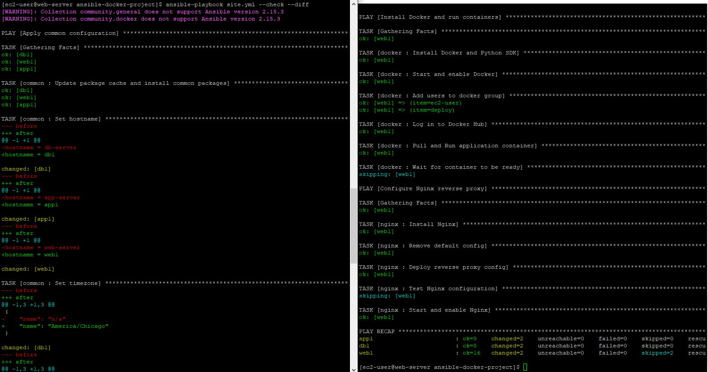
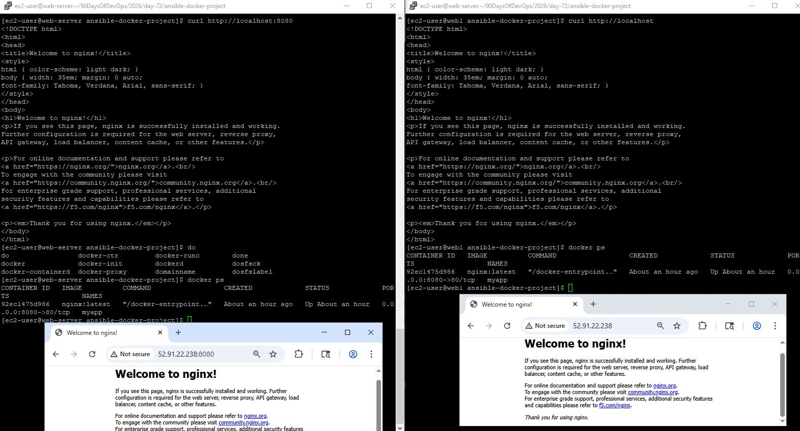
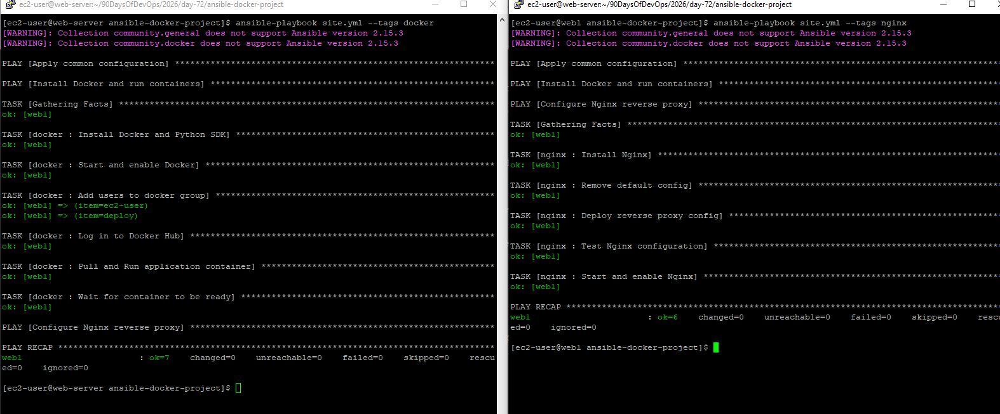
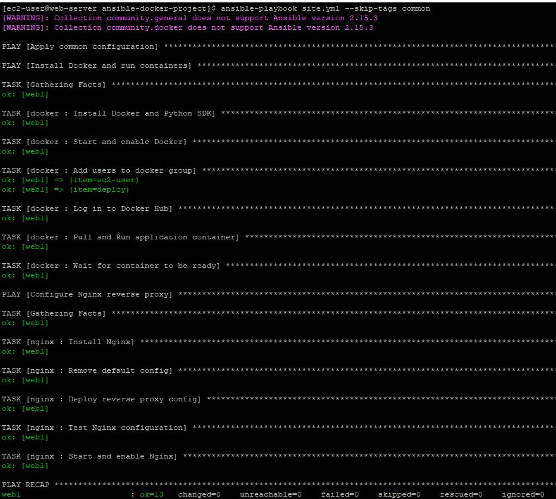
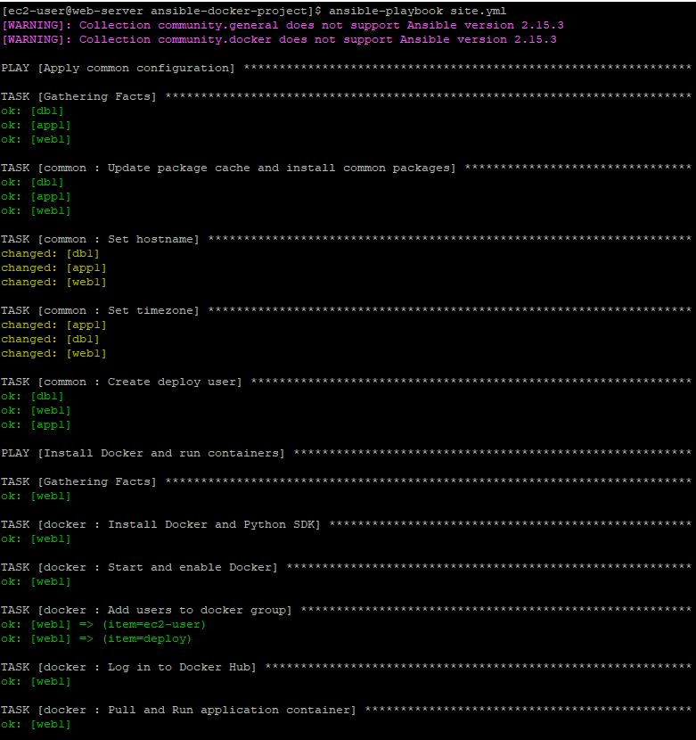
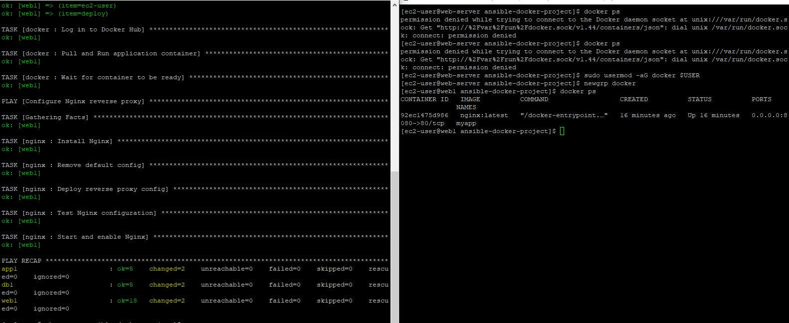
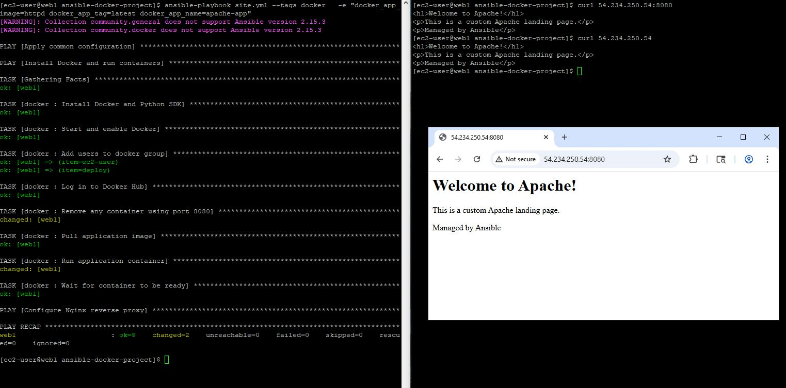
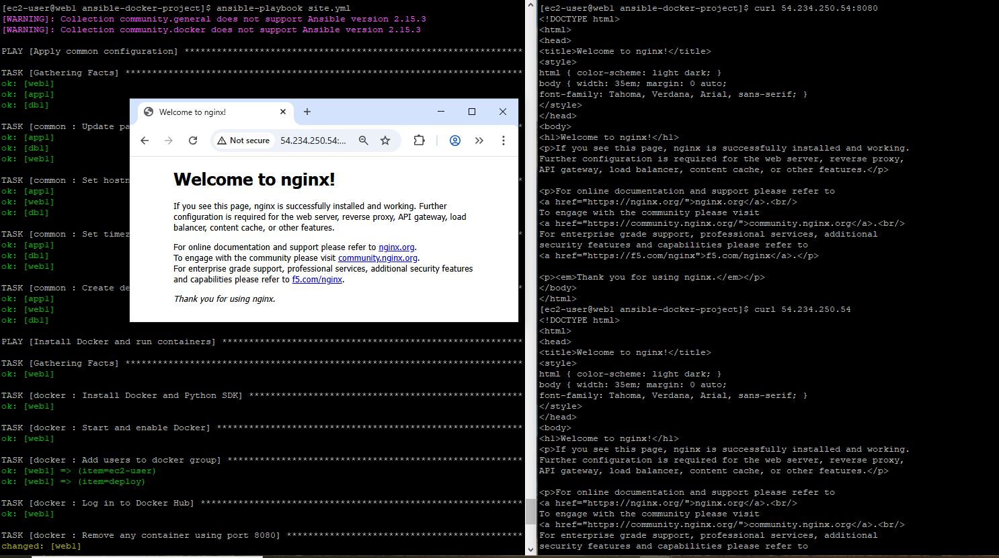

# Day 72 -- Ansible Project: Automate Docker and Nginx Deployment

## Project Overview

This project automates a complete production-style deployment using Ansible on Amazon Linux 2023:

- Server configuration (baseline setup)
- Docker installation and container deployment
- Nginx reverse proxy configuration
- Secure credential management using Ansible Vault
- Idempotent infrastructure (repeatable deployments)

---

## Architecture

```

User → Nginx (Port 80) → Docker Container (Port 8080)

```

---

# Task 1: Plan the Project Structure

## DCreate the complete project layout:
```
ansible-docker-project/
ansible.cfg
inventory.ini
site.yml
group_vars/
all.yml
web/
vars.yml
vault.yml
roles/
common/
docker/
nginx/

```

## Generate the role skeletons:
```bash
mkdir -p ansible-docker-project/roles
cd ansible-docker-project

ansible-galaxy init roles/common
ansible-galaxy init roles/docker
ansible-galaxy init roles/nginx
```
---

# Task 2: Common Role (Amazon Linux 2023)

## roles/common/tasks/main.yml

```yaml
---
- name: Update package cache
  dnf:
    update_cache: yes
  tags: common

- name: Install common packages
  dnf:
    name: "{{ common_packages }}"
    state: present
  tags: common

- name: Set hostname
  hostname:
    name: "{{ inventory_hostname }}"
  tags: common

- name: Set timezone
  community.general.timezone:
    name: "{{ timezone }}"
  tags: common

- name: Create deploy user
  user:
    name: deploy
    groups: wheel
    shell: /bin/bash
    state: present
  tags: common
```

## group_vars/all.yml

```yaml
---
timezone: America/Chicago
project_name: devops-app
app_env: development

common_packages:
  - vim
  - wget
  - git
  - htop
  - tree
  - jq
  - unzip
```

---

# Task 3: Docker Role

## roles/docker/defaults/main.yml

```yaml
---
docker_app_image: nginx
docker_app_tag: latest
docker_app_name: myapp
docker_app_port: 8080
docker_container_port: 80
```

## roles/docker/tasks/main.yml

```yaml
---
- name: Install Docker
  dnf:
    name: docker
    state: present
  tags: docker

- name: Start and enable Docker
  service:
    name: docker
    state: started
    enabled: yes
  tags: docker

- name: Add users to docker group
  user:
    name: "{{ item }}"
    groups: docker
    append: yes
  loop:
    - ec2-user
    - deploy
  tags: docker

- name: Install pip
  dnf:
    name: python3-pip
    state: present
  tags: docker

- name: Install Docker SDK
  pip:
    name: docker
  tags: docker

- name: Log in to Docker Hub
  community.docker.docker_login:
    username: "{{ vault_docker_username }}"
    password: "{{ vault_docker_password }}"
  when: vault_docker_username is defined
  tags: docker

- name: Remove any container using port 8080
  shell: |
    docker ps -q --filter "publish=8080" | xargs -r docker rm -f
  tags: docker

- name: Pull application image
  community.docker.docker_image:
    name: "{{ docker_app_image }}"
    tag: "{{ docker_app_tag }}"
    source: pull
  tags: docker

- name: Run application container
  community.docker.docker_container:
    name: "{{ docker_app_name }}"
    image: "{{ docker_app_image }}:{{ docker_app_tag }}"
    state: started
    recreate: yes
    restart_policy: always
    ports:
      - "{{ docker_app_port }}:{{ docker_container_port }}"
  tags: docker

- name: Wait for container
  uri:
    url: "http://localhost:{{ docker_app_port }}"
    status_code: 200
  register: result
  retries: 5
  delay: 3
  until: result.status == 200
  tags: docker
```

---

# Task 4: Nginx Role

## roles/nginx/tasks/main.yml

```yaml
---
- name: Install nginx
  dnf:
    name: nginx
    state: present
  tags: nginx

- name: Remove default config
  file:
    path: /etc/nginx/conf.d/default.conf
    state: absent
  tags: nginx

- name: Deploy proxy config
  template:
    src: app-proxy.conf.j2
    dest: /etc/nginx/conf.d/app.conf
  notify: Reload Nginx
  tags: nginx

- name: Test nginx config
  command: nginx -t
  changed_when: false
  tags: nginx

- name: Start nginx
  service:
    name: nginx
    state: started
    enabled: yes
  tags: nginx
```

## roles/nginx/templates/app-proxy.conf.j2

```nginx
upstream docker_app {
    server 127.0.0.1:8080;
}

server {
    listen 80;

    location / {
        proxy_pass http://docker_app;
    }

    location /health {
        return 200 'OK';
    }
}
```

---

# Task 5: Vault Security

## Create Vault

```bash
ansible-vault create group_vars/web/vault.yml
```

## vault.yml

```yaml
vault_docker_username: your-username
vault_docker_password: your-token
```

## Vault Password File

```bash
echo "mypassword" > .vault_pass
chmod 600 .vault_pass
```

---

# Task 6: Master Playbook

## site.yml

```yaml
---
- name: Common setup
  hosts: all
  become: yes
  roles:
    - common

- name: Docker setup
  hosts: web
  become: yes
  roles:
    - docker

- name: Nginx setup
  hosts: web
  become: yes
  roles:
    - nginx
```

## Run Deployment

```bash
ansible-playbook site.yml
```
     

---

# Task 7: Swap Application

## Deploy Apache Instead of Nginx

```bash
ansible-playbook site.yml --tags docker \
-e "docker_app_image=httpd docker_app_name=apache-app"
```
# Apache Verification



## Docker

```bash
docker ps
```

# Idempotency Proof

```bash
ansible-playbook site.yml
```

- Second run shows mostly `ok`

```bash

curl http://<IP>:8080
```

## Nginx Proxy

```bash
curl http://<IP>
```




---

# Security

* Credentials encrypted using Ansible Vault
* `.vault_pass` excluded via `.gitignore`

---

# Concepts Used

| Day | Concept                 |
| --- | ----------------------- |
| 68  | Inventory, SSH          |
| 69  | Playbooks, Modules      |
| 70  | Variables               |
| 71  | Roles, Templates, Vault |
| 72  | Full Automation         |

---

# Summary

1. Fully automated deployment
2. Reverse proxy architecture
3. Secure secrets handling
4. Idempotent infrastructure
5. Real-world DevOps workflow

---