# Day 73 -  Introduction to Observability and Prometheus

## Task 1: Understand Observability

### Observability vs Monitoring

**Monitoring**

* Detects when something is wrong using alerts and thresholds
* Example: CPU usage > 80%

**Observability**

* Explains why something is wrong using system data
* Uses metrics, logs, and traces for deep analysis

---

### Three Pillars of Observability

**Metrics**

* Numerical data over time (CPU, memory, request count)

**Logs**

* Timestamped event records (errors, application logs)

**Traces**

* Track a request across multiple services

---

### Why All Three Matter

* Metrics → What is broken
* Logs → Why it broke
* Traces → Where it broke

---

### Architecture Overview

```
[Your App] --> metrics --> [Prometheus] --> [Grafana]
[Your App] --> logs    --> [Promtail]   --> [Loki] --> [Grafana]
[Your App] --> traces  --> [OTEL Collector] --> [Grafana]

[Host]     --> metrics --> [Node Exporter] --> [Prometheus]
[Docker]   --> metrics --> [cAdvisor] --> [Prometheus]```
```

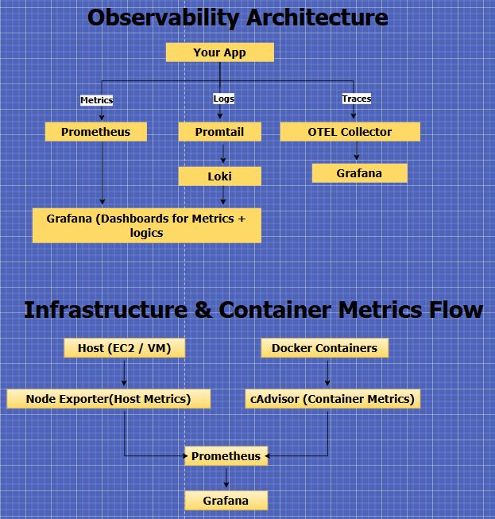

---

## Task 2: Set Up Prometheus with Docker

### prometheus.yml

```yaml
global:
  scrape_interval: 15s
  evaluation_interval: 15s

scrape_configs:
  - job_name: "prometheus"
    static_configs:
      - targets: ["localhost:9090"]
```

---

### docker-compose.yml

```yaml
services:
  prometheus:
    image: prom/prometheus:latest
    container_name: prometheus
    ports:
      - "9090:9090"
    volumes:
      - ./prometheus.yml:/etc/prometheus/prometheus.yml
      - prometheus_data:/prometheus
    command:
      - '--config.file=/etc/prometheus/prometheus.yml'
      - '--storage.tsdb.retention.time=7d'
      - '--storage.tsdb.retention.size=512MB'
    restart: unless-stopped

volumes:
  prometheus_data:
```

---

### Verification

* Prometheus UI accessed via EC2 public IP
* Target `prometheus` shows **UP**

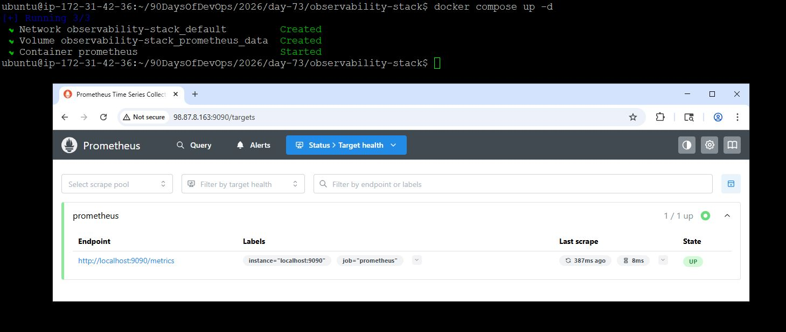

---

## Task 3: Understand Prometheus Concepts

### Key Concepts

**Scrape Targets**

* Endpoints Prometheus pulls metrics from

**Metric Types**

* Counter → only increases (total requests)
* Gauge → increases/decreases (memory usage)
* Histogram → value distribution
* Summary → percentile calculations

**Labels**

* Key-value pairs to differentiate metrics

**Time Series**

* Metric name + labels

---

### Queries Executed

```promql
count({__name__=~".+"})
process_resident_memory_bytes
prometheus_http_requests_total
prometheus_http_requests_total{handler="/api/v1/query"}
```

---

### Counter vs Gauge

**Counter**

* Only increases
* Example: total HTTP requests

**Gauge**

* Can increase or decrease
* Example: memory usage

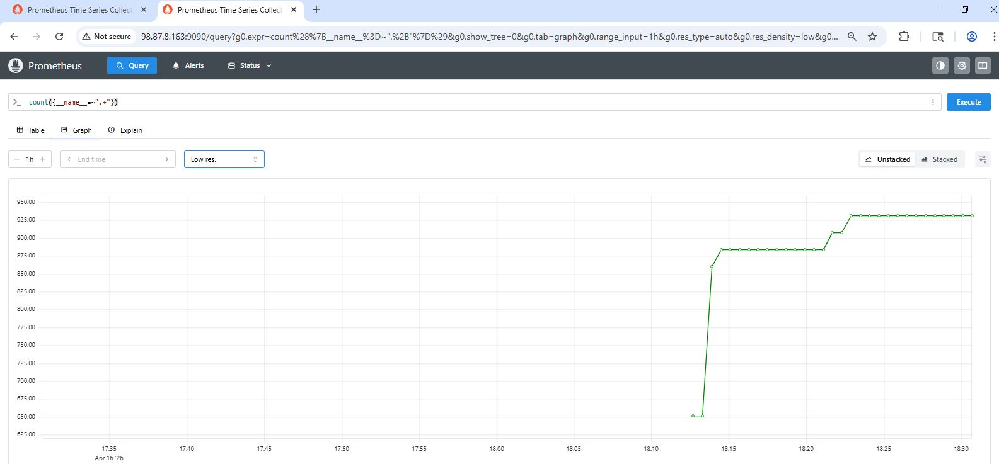 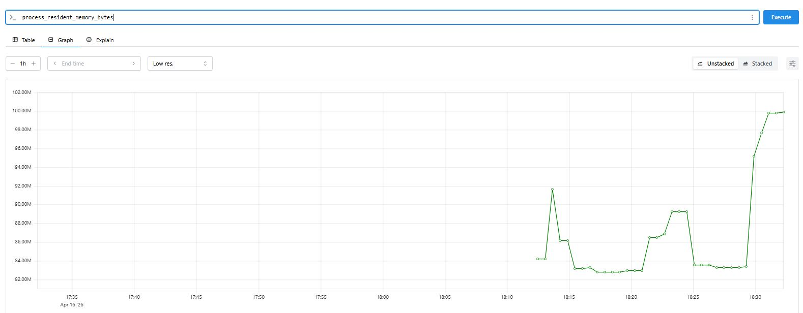 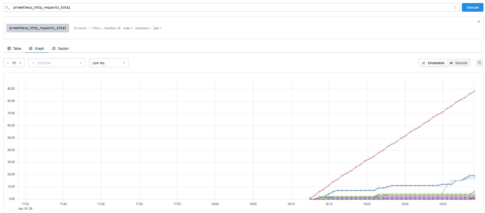 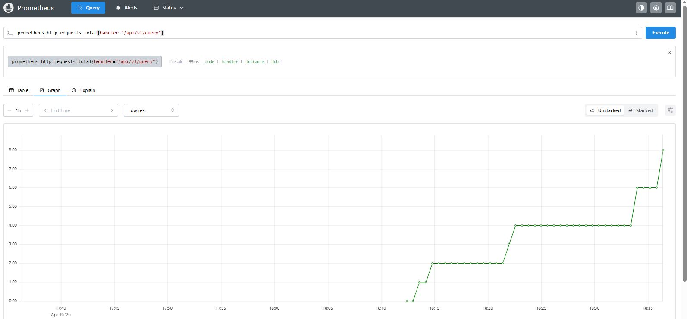

---

## Task 4: Learn PromQL Basics

### Queries

```promql
up
prometheus_http_requests_total[5m]
rate(prometheus_http_requests_total[5m])
sum(rate(prometheus_http_requests_total[5m]))
prometheus_http_requests_total{code="200"}
process_resident_memory_bytes / 1024 / 1024
topk(5, prometheus_http_requests_total)
```

---

### Exercise Solution

```promql
rate(prometheus_http_requests_total{code!="200"}[5m])
```

**Production Version**

```promql
sum(rate(prometheus_http_requests_total{code!="200"}[5m]))
```

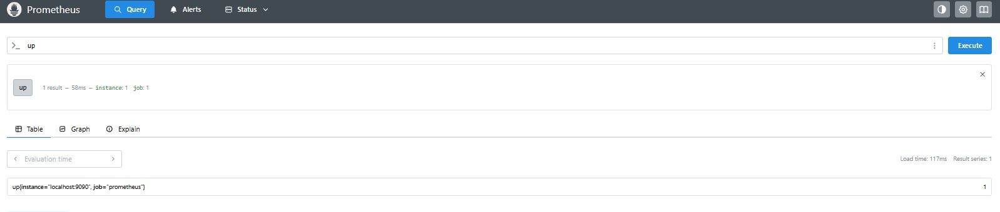 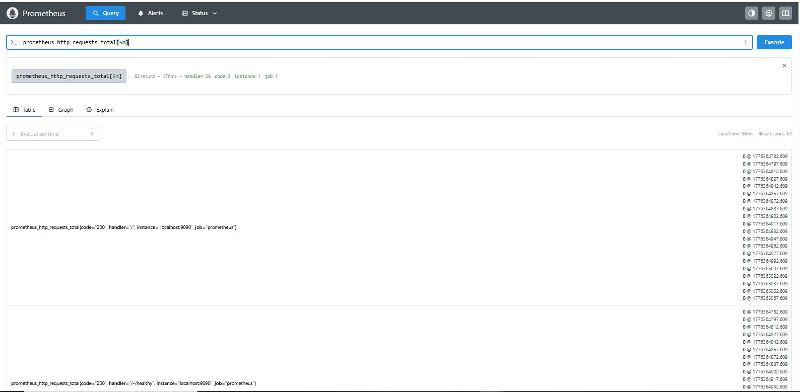 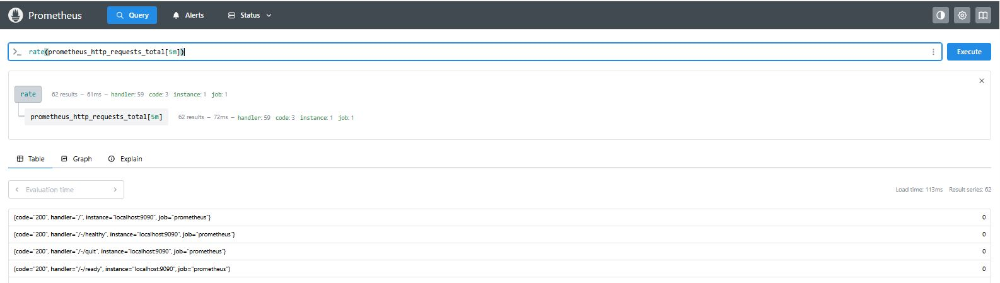 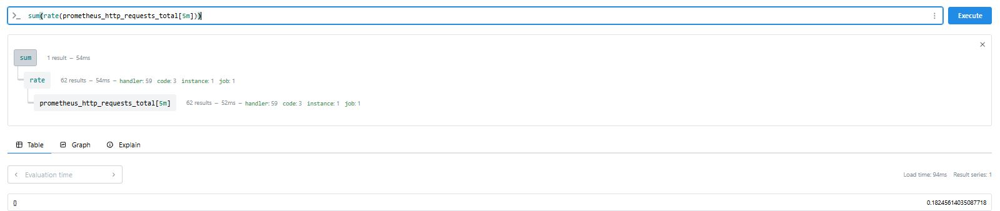 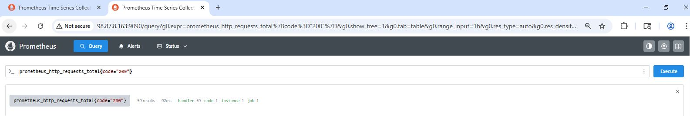 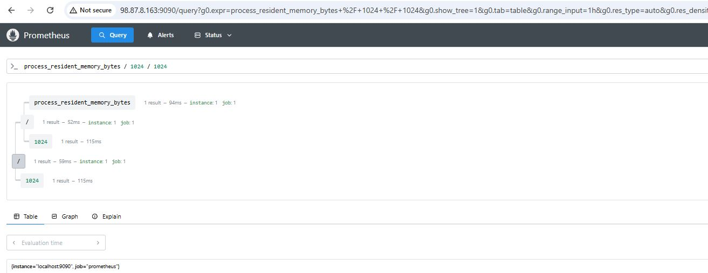 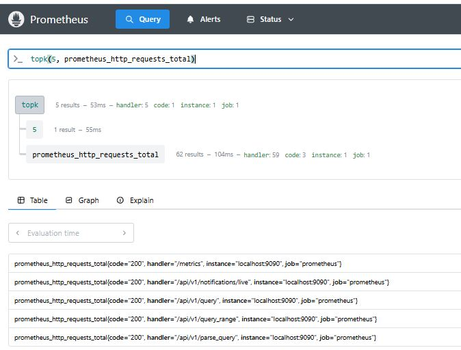 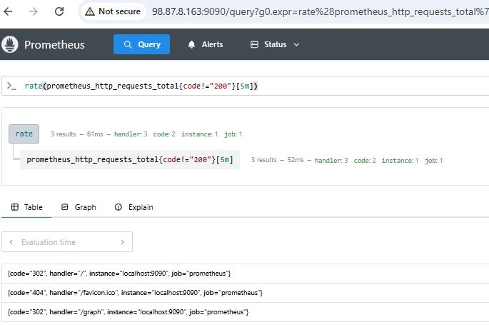

---

## Task 5: Add Sample Application as Target

### Updated docker-compose.yml

```yaml
services:
  prometheus:
    image: prom/prometheus:latest
    container_name: prometheus
    ports:
      - "9090:9090"
    volumes:
      - ./prometheus.yml:/etc/prometheus/prometheus.yml
      - prometheus_data:/prometheus
    command:
      - '--config.file=/etc/prometheus/prometheus.yml'
      - '--storage.tsdb.retention.time=7d'
      - '--storage.tsdb.retention.size=512MB'
    restart: unless-stopped

  notes-app:
    image: trainwithshubham/notes-app:latest
    container_name: notes-app
    ports:
      - "8000:8000"
    restart: unless-stopped

volumes:
  prometheus_data:
```

---

### Updated prometheus.yml

```yaml
global:
  scrape_interval: 15s
  evaluation_interval: 15s

scrape_configs:
  - job_name: "prometheus"
    static_configs:
      - targets: ["localhost:9090"]

  - job_name: "notes-app"
    static_configs:
      - targets: ["notes-app:8000"]
```

---

### Observation

* `prometheus` → UP
* `notes-app` → DOWN

**Reason**

* `/metrics` endpoint not available
* notes.app returned 404 Not Found

**Insight**

> Not all applications expose Prometheus-compatible metrics by default.

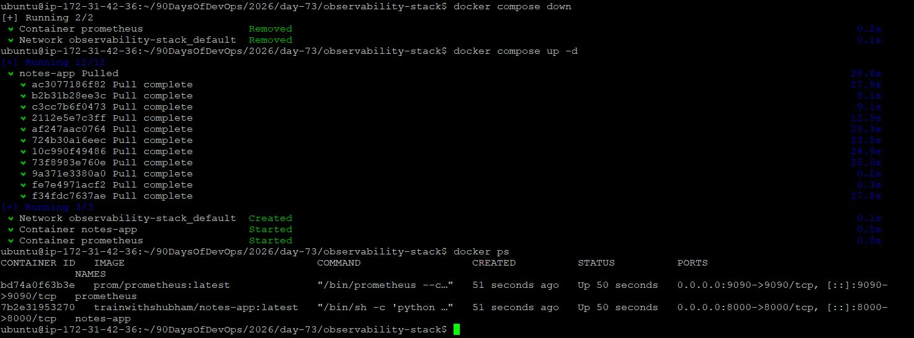 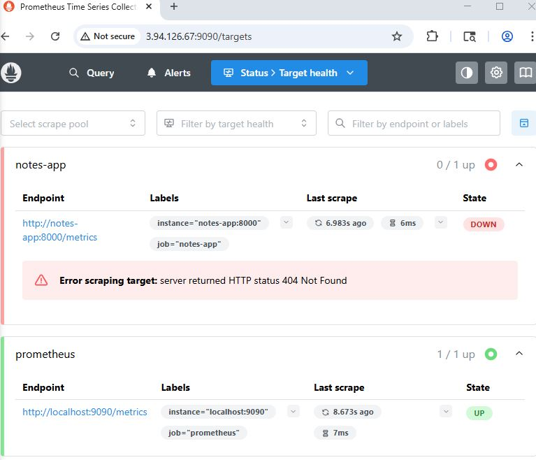

---

2# Task 6: Explore Data Retention and Storage

### Disk Usage Check

```bash
docker exec prometheus du -sh /prometheus
```

---

### Storage Details

* Prometheus uses **TSDB (Time Series Database)**
* Data stored in `/prometheus`

---

### Retention Configuration

```yaml
--storage.tsdb.retention.time=7d
--storage.tsdb.retention.size=512MB
```

---

### Key Concepts

**When retention is exceeded**

* Old data is automatically deleted

**Why volume is important**

* Ensures persistence across container restarts
* Without it → data loss

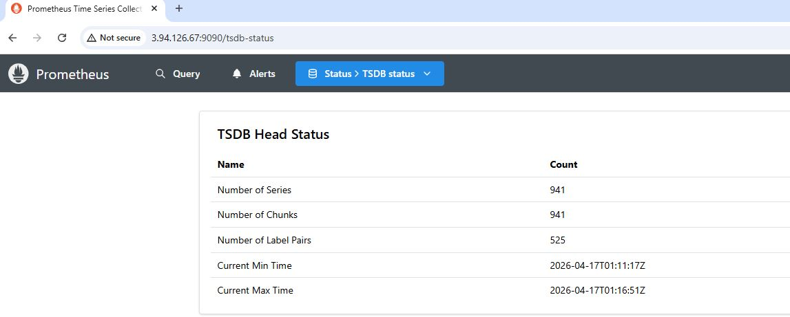

---

## Summary 

* Understood observability fundamentals
* Deployed Prometheus on EC2 using Docker
* Configured scrape targets
* Executed PromQL queries
* Learned storage and retention concepts

---

