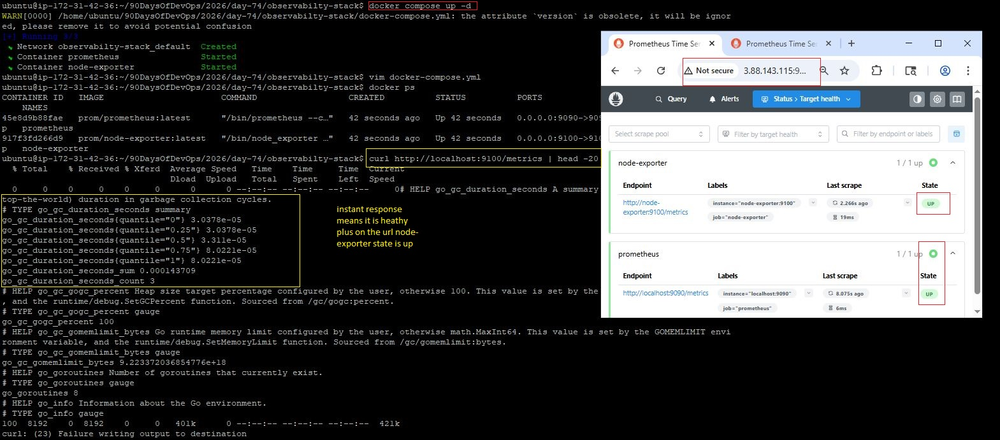
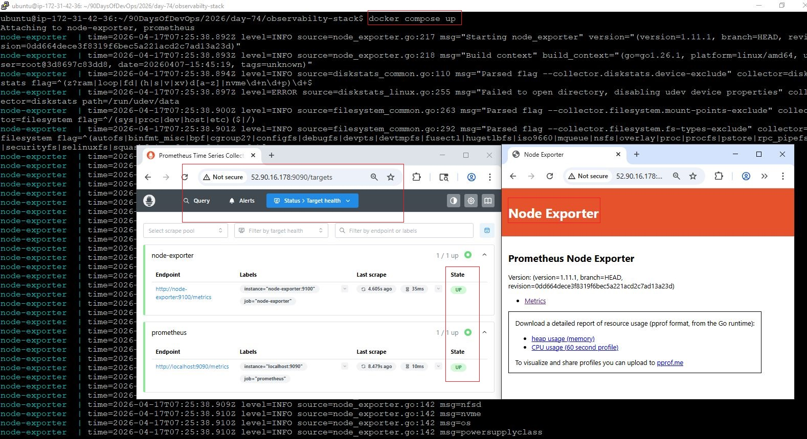
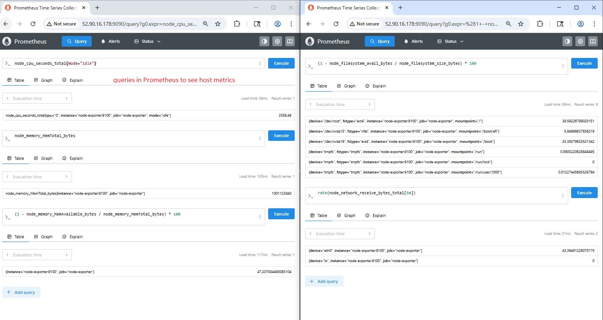
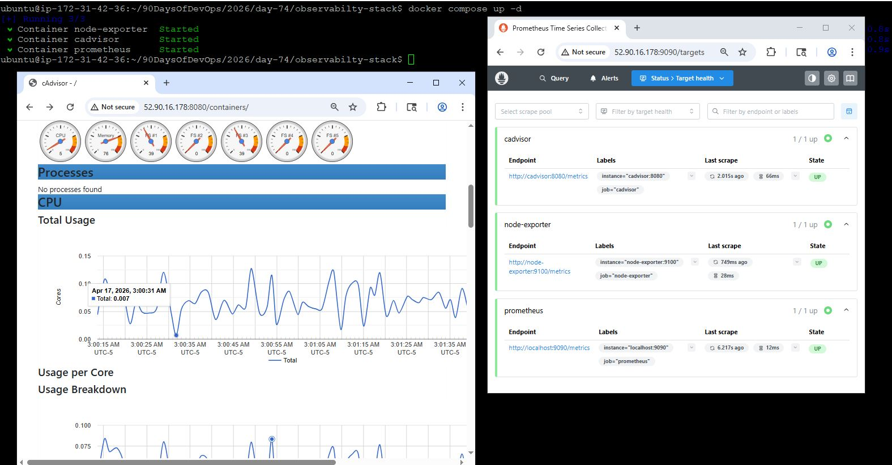
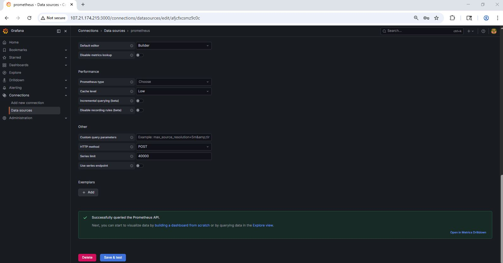
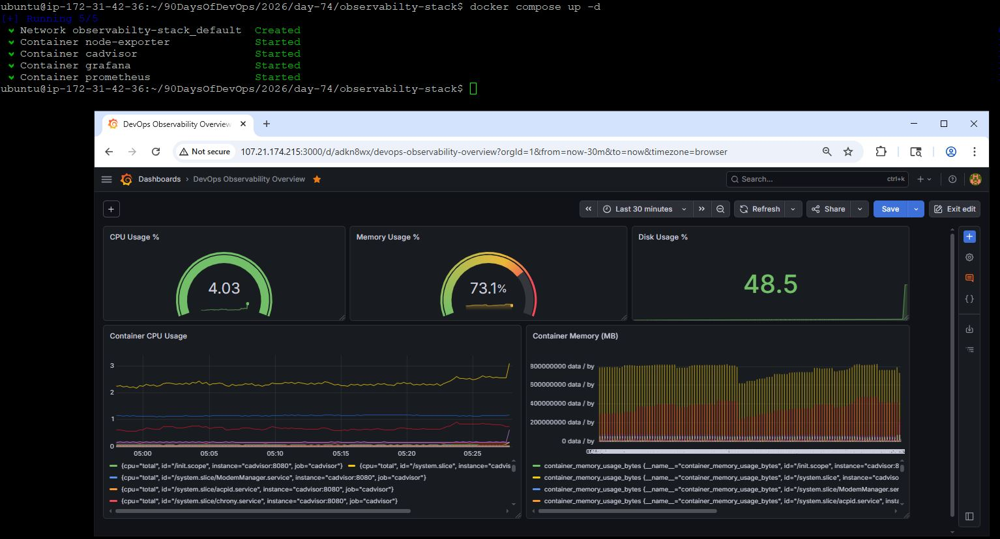
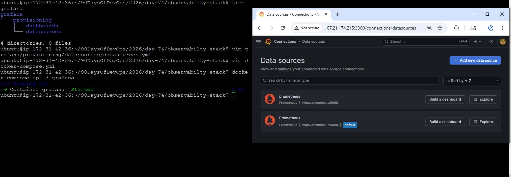
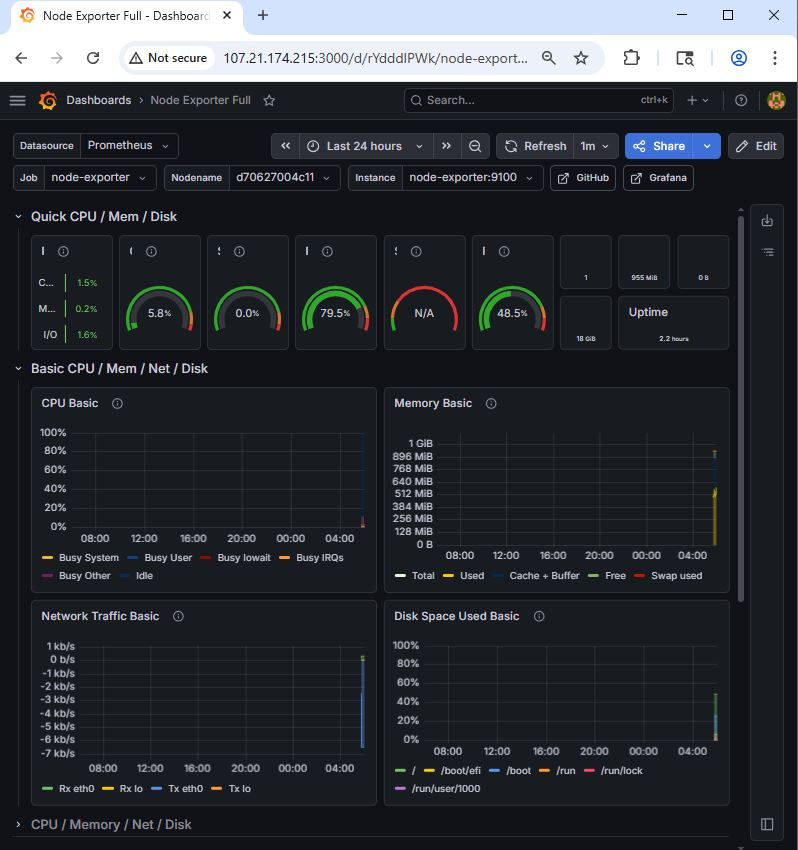
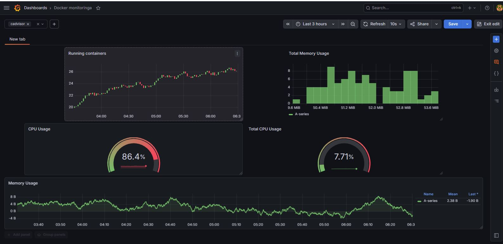
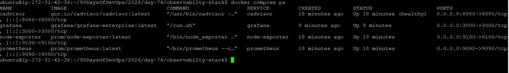

# Day 74 — Node Exporter, cAdvisor, and Grafana Dashboards

## Overview

On Day 74, I extended my observability stack by adding:

* **Node Exporter** → Host-level metrics
* **cAdvisor** → Container-level metrics
* **Grafana** → Visualization layer

This transforms Prometheus from raw metrics into a **production-ready monitoring stack**.

---

# Task 1: Add Node Exporter (Host Metrics)

## Objective

Monitor EC2 instance metrics (CPU, memory, disk, network).

## docker-compose.yml (Addition)

```yaml
  node-exporter:
    image: prom/node-exporter:latest
    container_name: node-exporter
    ports:
      - "9100:9100"
    volumes:
      - /proc:/host/proc:ro
      - /sys:/host/sys:ro
      - /:/rootfs:ro
    command:
      - '--path.procfs=/host/proc'
      - '--path.sysfs=/host/sys'
      - '--path.rootfs=/rootfs'
      - '--collector.filesystem.mount-points-exclude=^/(sys|proc|dev|host|etc)($$|/)'
    restart: unless-stopped
```

## prometheus.yml (Addition)

```yaml
  - job_name: "node-exporter"
    static_configs:
      - targets: ["node-exporter:9100"]
```

## Verification

```bash
curl http://localhost:9100/metrics | head -20
```

## PromQL Queries

```promql
node_cpu_seconds_total{mode="idle"}
node_memory_MemTotal_bytes
node_memory_MemAvailable_bytes
(1 - node_memory_MemAvailable_bytes / node_memory_MemTotal_bytes) * 100
(1 - node_filesystem_avail_bytes / node_filesystem_size_bytes) * 100
rate(node_network_receive_bytes_total[5m])
```

  

---

# Task 2: Add cAdvisor (Container Metrics)

## Objective

Monitor Docker container performance.

## docker-compose.yml (Addition)

```yaml
  cadvisor:
    image: gcr.io/cadvisor/cadvisor:latest
    container_name: cadvisor
    ports:
      - "8080:8080"
    volumes:
      - /var/run/docker.sock:/var/run/docker.sock:ro
      - /sys:/sys:ro
      - /var/lib/docker/:/var/lib/docker:ro
    restart: unless-stopped
```

## prometheus.yml (Addition)

```yaml
  - job_name: "cadvisor"
    static_configs:
      - targets: ["cadvisor:8080"]
```

## Verification

* Open: `http://<EC2-IP>:8080`
* Prometheus Targets → cadvisor = **UP**

## PromQL Queries

```promql
rate(container_cpu_usage_seconds_total{name!=""}[5m])
container_memory_usage_bytes{name!=""}
rate(container_network_receive_bytes_total{name!=""}[5m])
topk(3, container_memory_usage_bytes{name!=""})
```

## Node Exporter vs cAdvisor

| Feature        | Node Exporter    | cAdvisor              |
| -------------- | ---------------- | --------------------- |
| Scope          | Host (EC2)       | Containers (Docker)   |
| Metrics Prefix | node_            | container_            |
| Use Case       | Infra monitoring | Container performance |




---

# Task 3: Set Up Grafana

## Objective

Visualize Prometheus metrics using dashboards.

## docker-compose.yml (Addition)

```yaml
  grafana:
    image: grafana/grafana-enterprise:latest
    container_name: grafana
    ports:
      - "3000:3000"
    volumes:
      - grafana_data:/var/lib/grafana
    environment:
      - GF_SECURITY_ADMIN_USER=admin
      - GF_SECURITY_ADMIN_PASSWORD=admin123
    restart: unless-stopped
```

## Volumes

```yaml
volumes:
  prometheus_data:
  grafana_data:
```

## Datasource Setup

* URL: `http://prometheus:9090`

## Verification

* Login: admin / admin123
* Data source → **Successfully queried Prometheus API**



---

# Task 4: Build Custom Dashboard

## Dashboard Name

**DevOps Observability Overview**

##  Panels

### CPU Usage %

```promql
100 - (avg(rate(node_cpu_seconds_total{mode="idle"}[5m])) * 100)
```

### Memory Usage %

```promql
(1 - node_memory_MemAvailable_bytes / node_memory_MemTotal_bytes) * 100
```

### Container CPU Usage

```promql
rate(container_cpu_usage_seconds_total{name!=""}[5m]) * 100
```

### Container Memory (MB)

```promql
container_memory_usage_bytes{name!=""} / 1024 / 1024
```

### Disk Usage %

```promql
(1 - node_filesystem_avail_bytes{mountpoint="/"} / node_filesystem_size_bytes{mountpoint="/"}) * 100
```



---

# Task 5: Provision Datasource via YAML

## Objective

Automate Grafana setup (production-grade approach)

## Directory Structure

```bash
grafana/
└── provisioning/
    ├── datasources/
    └── dashboards/
```

## datasources.yml

```yaml
apiVersion: 1

datasources:
  - name: Prometheus
    type: prometheus
    access: proxy
    url: http://prometheus:9090
    isDefault: true
    editable: false
```

## docker-compose.yml Update

```yaml
  grafana:
    volumes:
      - grafana_data:/var/lib/grafana
      - ./grafana/provisioning:/etc/grafana/provisioning
```



## Why Provisioning?

* Eliminates manual setup
* Version-controlled
* Reproducible environments
* CI/CD friendly

---

# Task 6: Import Community Dashboards

## Node Exporter Dashboard

* ID: **1860**



##  cAdvisor Dashboard

* ID: **193**



## Outcome

* Full host monitoring dashboard
* Full container monitoring dashboard

---

# Final Verification

```bash
docker compose ps
```



# Summary

Day 74 completed a **full observability stack**:

* Prometheus → Metrics storage
* Node Exporter → Host monitoring
* cAdvisor → Container monitoring
* Grafana → Visualization

---

