# Day 75: Log Management with Loki and Promtail

## Task
Metrics tell you _what_ is broken. Logs tell you _why_. Yesterday you built the metrics pipeline with Prometheus, Node Exporter, cAdvisor, and Grafana. Today you add the second pillar of observability -- logs.

You will set up Grafana Loki (a log aggregation system built by the Grafana team) and Promtail (the agent that ships logs to Loki). By the end of today, your Grafana instance will show both metrics and logs side by side.

---

### Task 1: Understand the Logging Pipeline
Before writing any config, understand how the pieces fit together:

```
[Docker Containers]
       |
       | (write JSON logs to /var/lib/docker/containers/)
       v
  [Promtail]
       |
       | (reads log files, adds labels, pushes to Loki)
       v
    [Loki]
       |
       | (stores logs, indexes by labels)
       v
   [Grafana]
       |
       | (queries Loki with LogQL, displays logs)
       v
   [You]
```

Key differences from the ELK stack:
- Loki does **not** index the full text of logs -- it only indexes labels (like container name, job, filename)
- This makes Loki much cheaper to run and simpler to operate
- Think of it as "Prometheus, but for logs" -- same label-based approach

**Document:** Why does Loki only index labels instead of full text? What is the trade-off?

### Why Loki indexes only labels

Loki indexes only metadata (labels like job, container_name) instead of full log content. This design reduces storage cost and improves performance.

**Trade-off:**
- Pros: Low cost, fast ingestion, simple scaling
- Cons: Slower full-text search compared to ELK

Loki is ideal for observability use cases where logs are correlated with metrics, while ELK is better for deep log analysis and full-text search.

---

### Task 2: Add Loki to the Stack
Create the Loki configuration file.

```bash
mkdir -p loki
```

Create `loki/loki-config.yml`:

## Loki config 
```yaml
auth_enabled: false

server:
  http_listen_port: 3100

common:
  ring:
    instance_addr: 127.0.0.1
    kvstore:
      store: inmemory
  replication_factor: 1
  path_prefix: /loki

schema_config:
  configs:
    - from: 2020-10-24
      store: tsdb
      object_store: filesystem
      schema: v13
      index:
        prefix: index_
        period: 24h

storage_config:
  filesystem:
    directory: /loki/chunks
````
## Docker Compose (Loki)

```yaml
loki:
  image: grafana/loki:latest
  container_name: loki
  ports:
    - "3100:3100"
  volumes:
    - ./loki/loki-config.yml:/etc/loki/loki-config.yml
    - loki_data:/loki
  command: -config.file=/etc/loki/loki-config.yml
  restart: unless-stopped
```

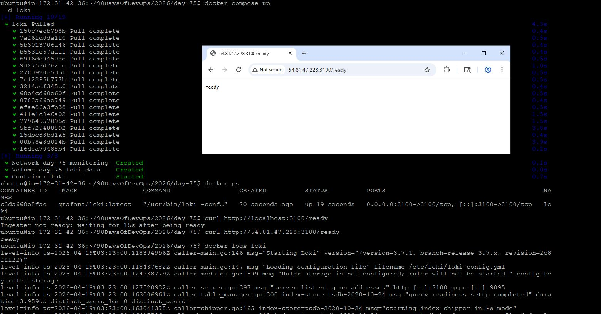

---

### Task 3: Add Promtail to Collect Container Logs (Log Collector)

## Promtail config
```bash
mkdir -p promtail
```

Create `promtail/promtail-config.yml`:

```yaml
server:
  http_listen_port: 9080
  grpc_listen_port: 0

positions:
  filename: /tmp/positions.yaml

clients:
  - url: http://loki:3100/loki/api/v1/push

scrape_configs:
  - job_name: docker
    static_configs:
      - targets:
          - localhost
        labels:
          job: docker
          __path__: /var/lib/docker/containers/*/*-json.log

    pipeline_stages:
      - docker: {}
```

---

## Docker Compose (Promtail)

```yaml
promtail:
  image: grafana/promtail:latest
  container_name: promtail
  volumes:
    - ./promtail/promtail-config.yml:/etc/promtail/promtail-config.yml
    - /var/lib/docker/containers:/var/lib/docker/containers:ro
    - /var/run/docker.sock:/var/run/docker.sock
  command: -config.file=/etc/promtail/promtail-config.yml
  restart: unless-stopped
```

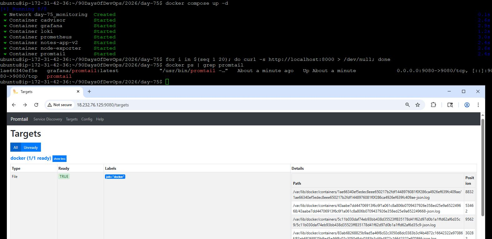

---

### Task 4: Add Loki as Grafana Data Source
dd Loki as a Grafana Datasource
You can add it manually through the UI or auto-provision it with YAML.

**Option A -- Provision via YAML (recommended):**

Update `grafana/provisioning/datasources/datasources.yml`:
```yaml
apiVersion: 1

datasources:
  - name: Prometheus
    type: prometheus
    access: proxy
    url: http://prometheus:9090
    isDefault: true
    editable: false

  - name: Loki
    type: loki
    access: proxy
    url: http://loki:3100
    editable: false
```

Restart Grafana to pick up the new datasource:
```bash
docker compose restart grafana
```

**Option B -- Manual UI setup:**
1. Go to Connections > Data Sources > Add data source
2. Select Loki
3. URL: `http://loki:3100`
4. Save & Test

Either way, you should now have two datasources in Grafana: Prometheus and Loki.

I chose Option A:
## Provisioning config

```yaml
apiVersion: 1

datasources:
  - name: Prometheus
    type: prometheus
    access: proxy
    url: http://prometheus:9090
    isDefault: true

  - name: Loki
    type: loki
    access: proxy
    url: http://loki:3100
```

---

## Restart Grafana

```bash
docker compose restart grafana
```

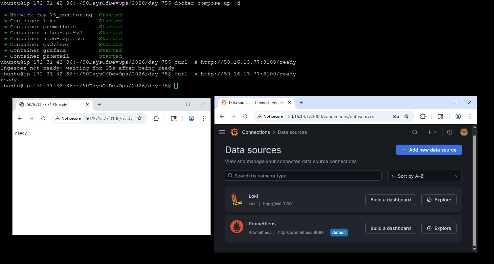

---

### Task 5: Query Logs with LogQL
LogQL is Loki's query language -- similar to PromQL but for logs.

Go to Grafana > Explore (compass icon). Select Loki as the datasource.

1. **Stream selector** -- filter logs by labels:
```logql
{job="docker"}
```
This shows all Docker container logs.

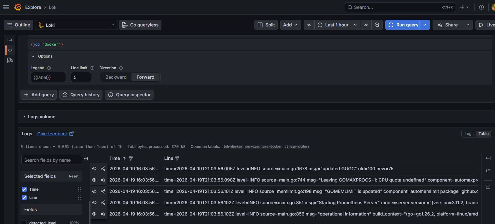

---

2. **Filter by container name:**
```logql
{container_name="prometheus"}
```

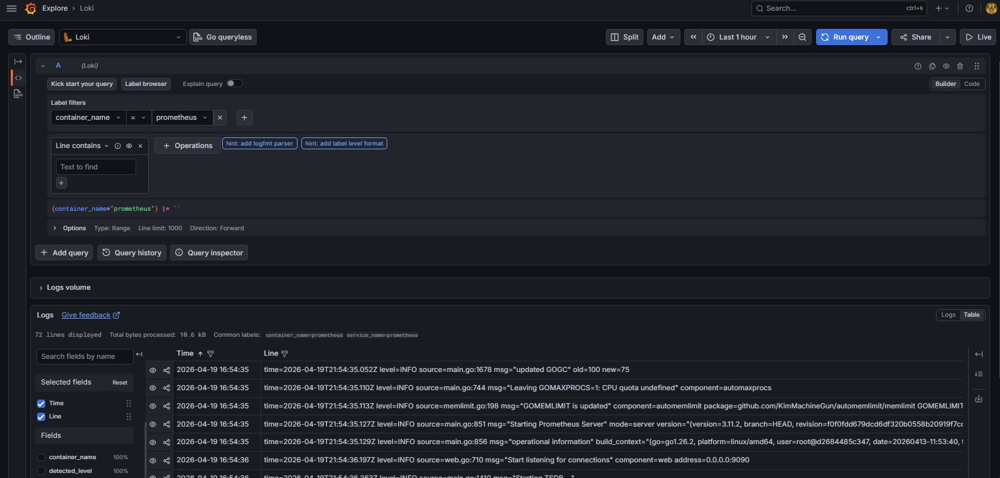

---

3. **Keyword search** -- filter log lines by content:
```logql
{job="docker"} |= "error"
```
`|=` means "line contains". This finds all log lines with the word "error".

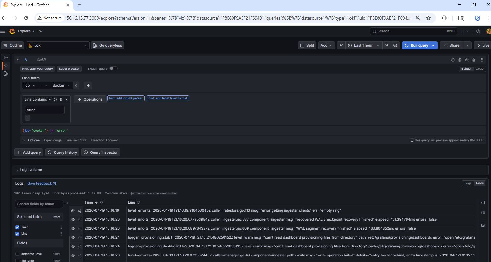

---

4. **Negative filter:**
```logql
{job="docker"} != "health"
```
Excludes lines containing "health" (useful to filter out health check noise).

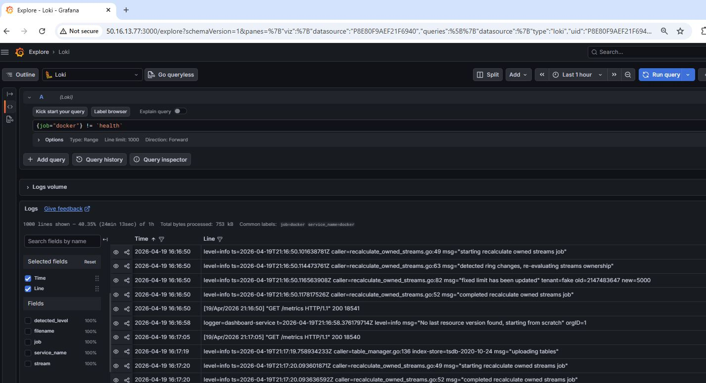

---

5. **Regex filter:**
```logql
{job="docker"} |~ "status=[45]\\d{2}"
```
Finds lines with HTTP 4xx or 5xx status codes.

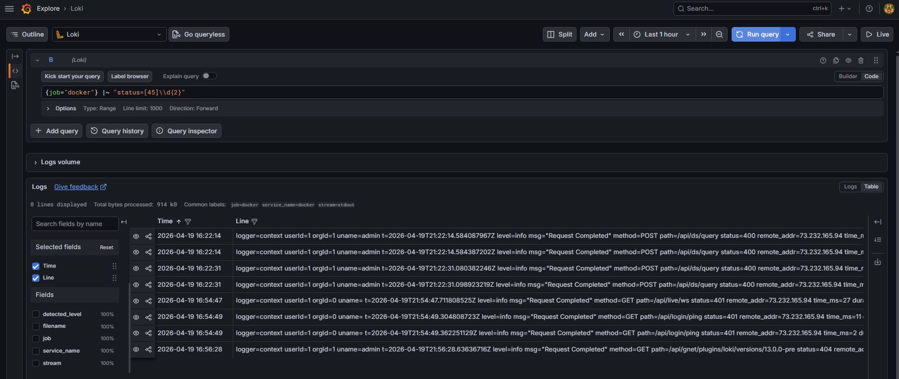

---

6. **Log metric queries** -- count log lines over time:
```logql
count_over_time({job="docker"}[5m])
```

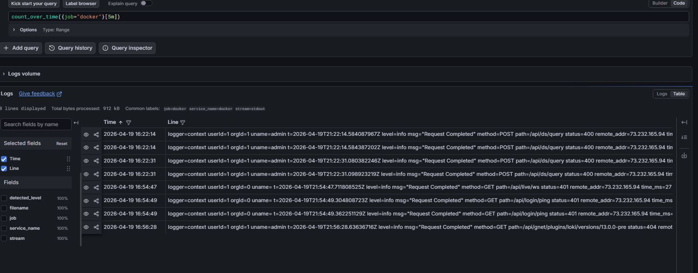

---

7. **Rate of logs per second:**
```logql
rate({job="docker"}[5m])
```

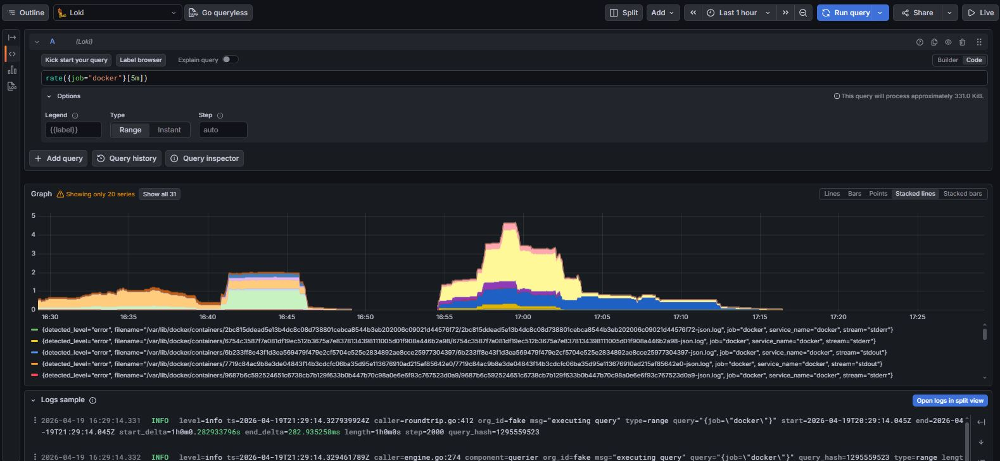

---

8. **Top containers by log volume:**
```logql
topk(5, sum by (container_name) (rate({job="docker"}[5m])))
```

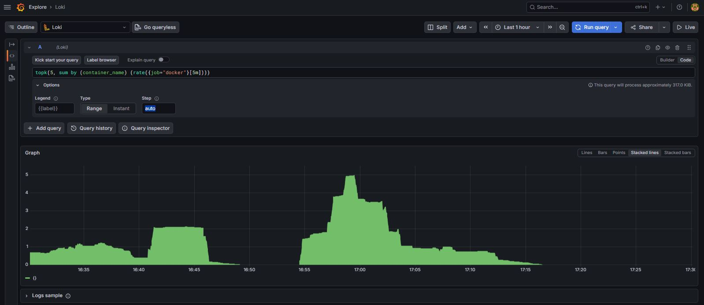

---

**Exercise:** Write a LogQL query that finds all error logs from the notes-app container in the last 1 hour. Then write another query that counts how many error lines per minute.

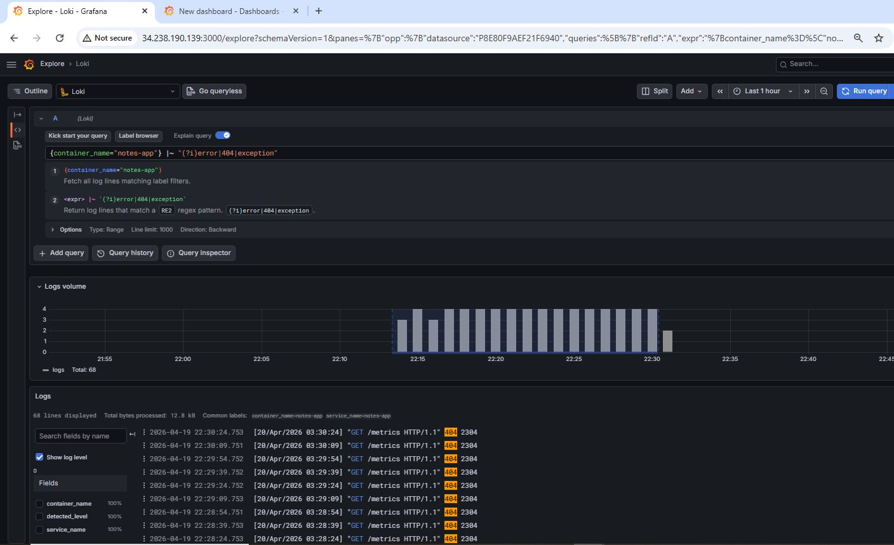

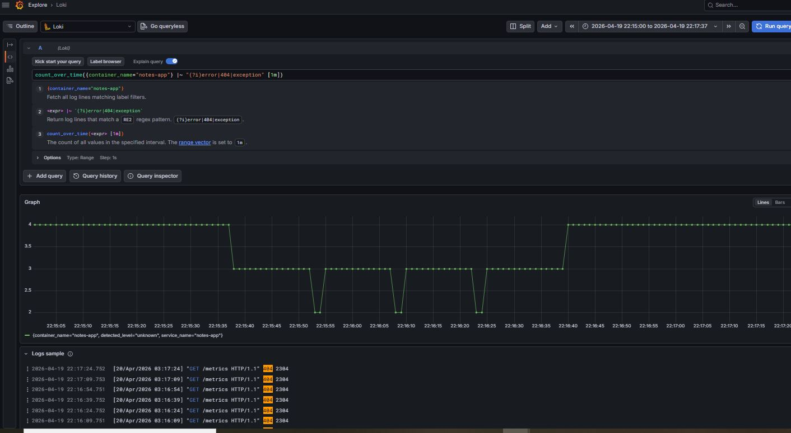

## Highlights

LogQL works similar to PromQL but for logs:

* `|=` → contains filter
* `!=` → exclude filter
* `|~` → regex filter

---

### Task 6: Correlate Metrics and Logs in Grafana
The real power of observability is correlation -- seeing metrics and logs together.

1. **Add a logs panel to your dashboard:**
   - Open the dashboard you built on Day 74
   - Add a new panel
   - Select Loki as the datasource
   - Query: `{job="docker"}`
   - Visualization: Logs
   - Title: "Container Logs"

2. **Use the Explore split view:**
   - Go to Explore
   - Click the split button (two panels side by side)
   - Left panel: Prometheus -- `rate(container_cpu_usage_seconds_total{name="notes-app"}[5m])`
   - Right panel: Loki -- `{container_name="notes-app"}`
   - Now you can see CPU spikes and the corresponding log output at the same time

3. **Time sync:** Click on a spike in the metrics graph and both panels will zoom to that time range. This is how you debug in production -- you see a metric anomaly and immediately check the logs from that exact moment.

**Document:** How does having metrics and logs in the same tool (Grafana) help during incident response compared to checking separate systems?

## Solution based without Day 74 dashboard.
## Metrics Query (Prometheus)

```promql
rate(container_cpu_usage_seconds_total[5m])
```

---

## Logs Query (Loki)

```logql
{job="docker"} |= "notes-app"
```

---

## Correlation Process

1. CPU spike observed in Prometheus
2. Same time range selected
3. Logs automatically filtered in Loki
4. Root cause identified from logs

---

## Key Insight

* Metrics show **what is happening**
* Logs show **why it is happening**

---

## Challenge Faced

* Container labels like `notes-app` were not directly available in Prometheus
* Had to rely on raw cAdvisor metrics
* Used time-based correlation instead of label-based filtering

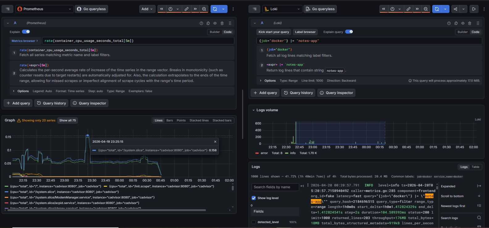

---

## Final Outcome

1. Loki + Promtail working
2. Docker logs collected
3. Grafana integration complete
4. LogQL queries working
5. Metrics + logs correlation achieved

---

## Conclusion

Today I completed the second pillar of observability — **logging**.

Now I have a full stack:

* Prometheus → Metrics
* Loki → Logs
* Grafana → Visualization

---

