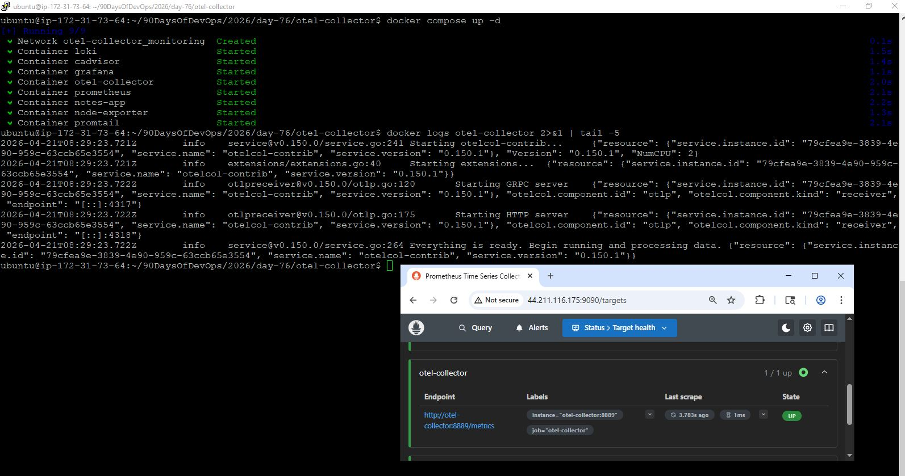
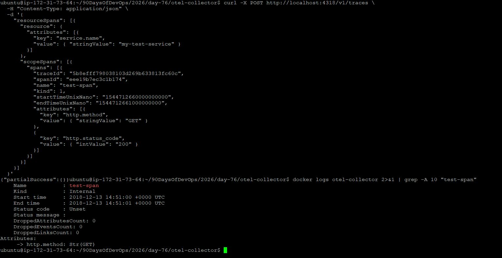
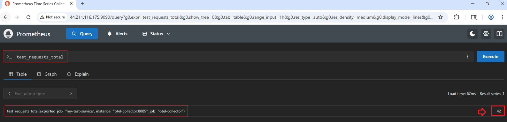
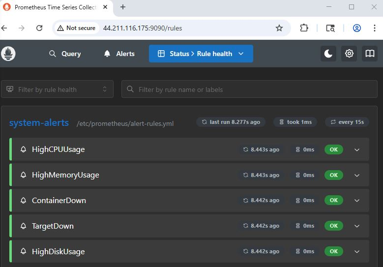
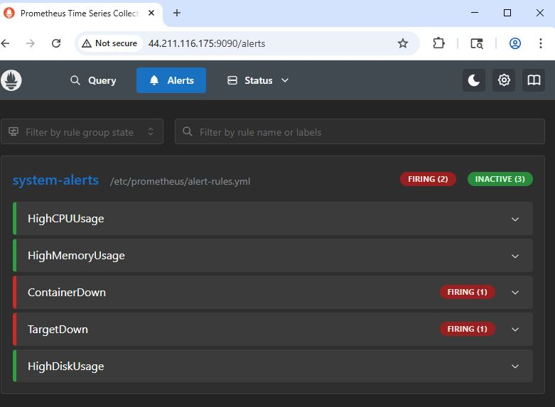
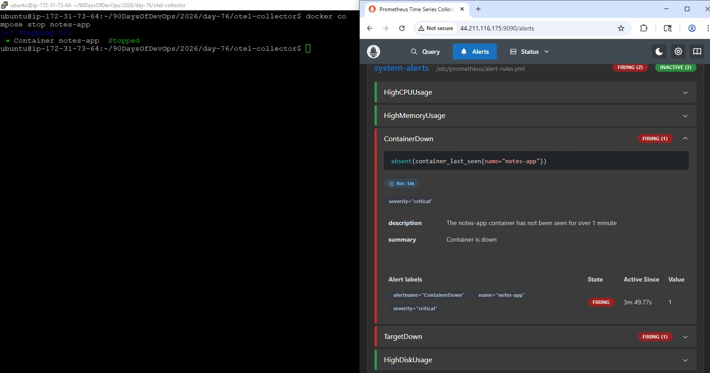
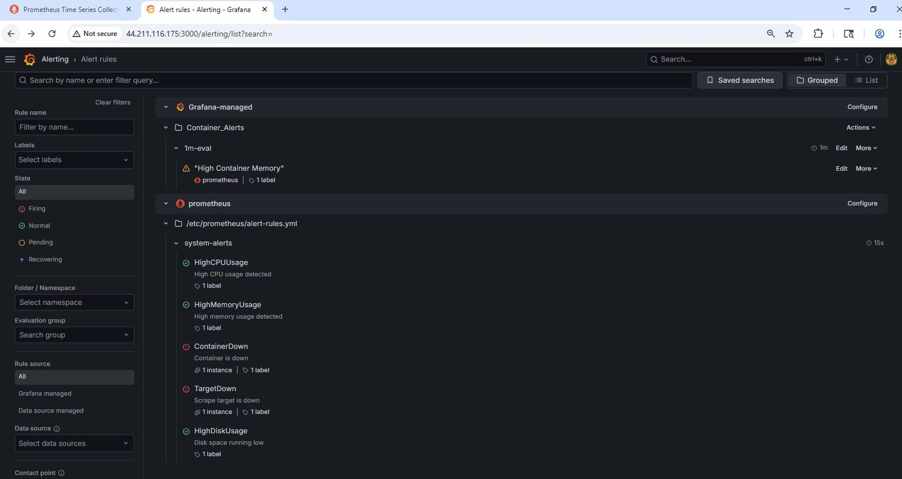

# Day 76: OpenTelemetry and Alerting

## Overview

Today I completed the third pillar of observability by integrating OpenTelemetry for traces and implemented alerting using Prometheus and Grafana. The stack now supports **metrics, logs, and traces**, along with proactive alerting.

---

## Task 1: OpenTelemetry Fundamentals

### What is OpenTelemetry?

OpenTelemetry (OTEL) is a vendor-neutral, open-source framework used to generate, collect, and export telemetry data including:

* Metrics
* Logs
* Traces

It acts as a pipeline layer that sends data to backends like Prometheus, Loki, Jaeger, or Grafana.

---

### OTEL Collector Architecture

OpenTelemetry Collector works using a pipeline model:

* **Receivers** → Accept incoming telemetry data (OTLP, Prometheus, etc.)
* **Processors** → Transform data (batching, filtering, sampling)
* **Exporters** → Send data to backends (Prometheus, debug logs, Jaeger)

---

### What is OTLP?

OTLP (OpenTelemetry Protocol) is the standard format for transmitting telemetry data.

* gRPC → Port 4317
* HTTP → Port 4318

---

### What are Distributed Traces?

A trace represents the lifecycle of a request across multiple services.

* Each step is called a **span**
* Contains:

  * Trace ID
  * Span ID
  * Parent Span ID
  * Duration
  * Attributes

Example:
User → API → Auth Service → Database

---

## Task 2: OpenTelemetry Collector Setup

### Collector Configuration

```yaml
receivers:
  otlp:
    protocols:
      grpc:
      http:

processors:
  batch:

exporters:
  prometheus:
    endpoint: "0.0.0.0:8889"
  debug:
    verbosity: detailed

service:
  pipelines:
    metrics:
      receivers: [otlp]
      processors: [batch]
      exporters: [prometheus]

    traces:
      receivers: [otlp]
      processors: [batch]
      exporters: [debug]

    logs:
      receivers: [otlp]
      processors: [batch]
      exporters: [debug]
```

### Key Points

* OTLP receivers accept telemetry on ports 4317 and 4318
* Metrics are exposed on port 8889 for Prometheus scraping
* Traces and logs are printed to console using debug exporter



---

## Task 3: Sending Traces and Metrics

### Test Trace

Sent a sample trace using curl to OTLP HTTP endpoint:

```bash
curl -X POST http://localhost:4318/v1/traces ...
```

Verified via:

```bash
docker logs otel-collector
```

Observed:

* Trace ID
* Span name (`test-span`)
* HTTP attributes





---

### Test Metric

Sent metric:

```bash
test_requests_total = 42
```

Queried in Prometheus:

```promql
test_requests_total
```



---

### Data Flow

* Metrics: App → OTEL → Prometheus → Grafana
* Traces: App → OTEL → Debug Logs

---

## Task 4: Prometheus Alerting

### Alert Rules

Configured alerts for:

* High CPU Usage
* High Memory Usage
* Container Down
* Target Down
* High Disk Usage

### Key Concepts

* `expr` → PromQL condition
* `for` → prevents alert flapping
* `labels` → severity classification
* `annotations` → human-readable message

---

### Example Alert

```yaml
- alert: HighCPUUsage
  expr: 100 - (avg(rate(node_cpu_seconds_total{mode="idle"}[5m])) * 100) > 80
  for: 2m
```

---

### Testing

Stopped container:

```bash
docker compose stop notes-app
```

Observed alert state transition:

* Inactive → Pending → Firing

  

---

## Task 5: Grafana Alerting

### Alert Rule

* Metric: container memory usage
* Condition: Above 100MB
* Evaluation: 1m interval, 2m duration

### Notification Setup

* Created contact point (Email)
* Configured notification policy
* Alerts successfully triggered and delivered



---

### Prometheus vs Grafana Alerts

| Feature          | Prometheus            | Grafana                    |
| ---------------- | --------------------- | -------------------------- |
| Alert Definition | YAML                  | UI                         |
| Notification     | Requires Alertmanager | Built-in                   |
| Use Case         | Infrastructure        | Application / quick alerts |

---

## Task 6: Final Architecture

### Observability Stack

| Component      | Purpose                  |
| -------------- | ------------------------ |
| Prometheus     | Metrics collection       |
| Node Exporter  | System metrics           |
| cAdvisor       | Container metrics        |
| Grafana        | Visualization & alerting |
| Loki           | Log storage              |
| Promtail       | Log collection           |
| OTEL Collector | Telemetry pipeline       |
| Notes App      | Sample application       |

---

### Final Architecture Diagram

```
METRICS:
Node Exporter / cAdvisor / OTEL → Prometheus → Grafana

LOGS:
Containers → Promtail → Loki → Grafana

TRACES:
App → OTEL Collector → Debug Logs (Future: Jaeger/Tempo)
```

---

## Summary

* Implemented full observability stack
* Added distributed tracing with OpenTelemetry
* Enabled proactive alerting with Prometheus and Grafana
* Built production-style monitoring architecture
* Observability = Metrics + Logs + Traces
* OpenTelemetry standardizes telemetry collection
* Alerting transforms monitoring from reactive → proactive
* Proper architecture is critical for debugging distributed systems

---

