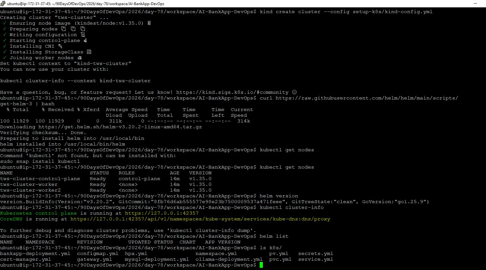
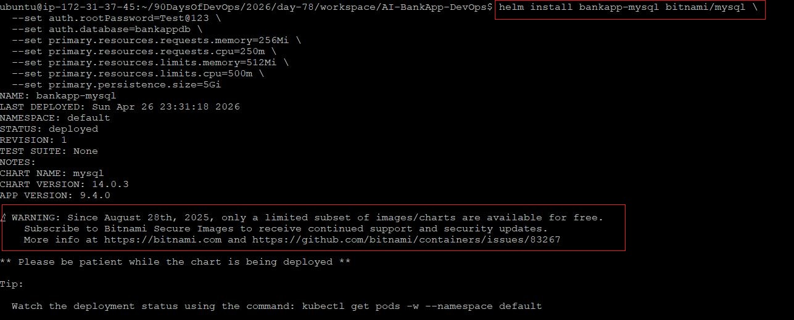
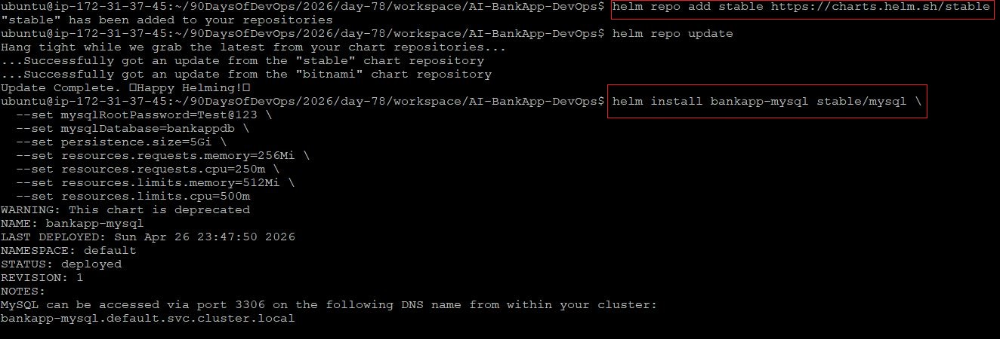
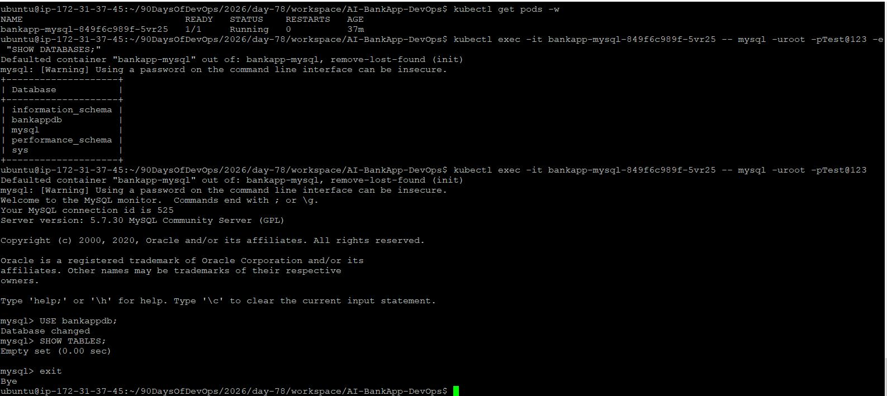
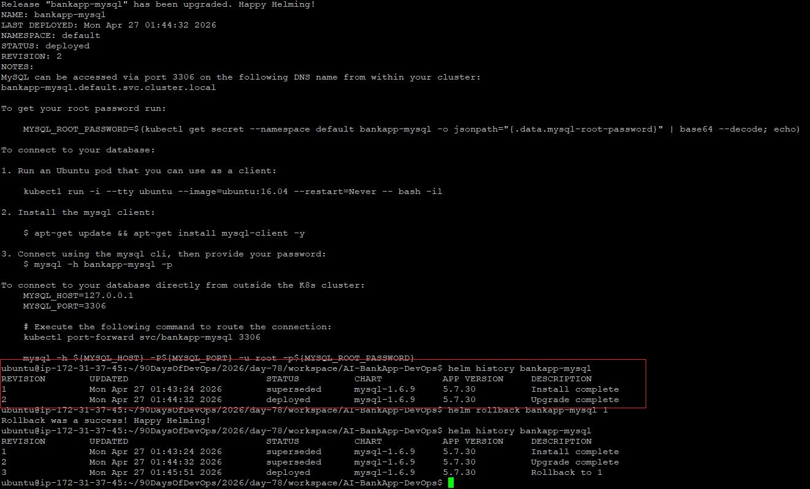
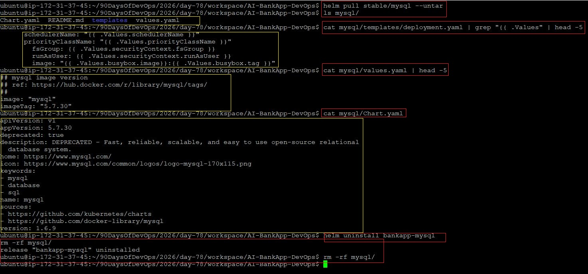

# Day 78: Introduction to Helm and Chart Basics 

## Objective
Learn how to use Helm, the package manager for Kubernetes, to simplify the deployment, versioning, and management of complex applications.

---

## Task 1: Understanding Helm Concepts

### What is Helm?
Helm is often described as the **"apt" or "yum" for Kubernetes**. Instead of managing dozens of individual YAML files, Helm allows you to bundle them into a single package called a **Chart**.

### Core Concepts
- **Chart**: A collection of files that describe a set of Kubernetes resources.
- **Release**: A specific instance of a chart running in a cluster. (e.g., You can install the MySQL chart twice to create `mysql-dev` and `mysql-prod`).
- **Repository**: A storage location where charts are hosted and shared.
- **Values**: Configuration settings that allow you to customize a chart without changing the underlying templates.

### Why Helm over Raw Manifests?
| Aspect | Raw YAML Manifests | Helm Charts |
| :--- | :--- | :--- |
| **Deployment** | Multiple `kubectl apply -f` commands | Single `helm install` command |
| **Customization** | Manual editing of YAML files | Dynamic updates via `values.yaml` |
| **Versioning** | Manual Git versioning | Built-in revision history |
| **Rollbacks** | Manual `git revert` $\rightarrow$ re-apply | Single `helm rollback` command |

---

## Task 2: Environment Setup

### 1. Create Kind Cluster
```bash
git clone -b feat/gitops https://github.com/TrainWithShubham/AI-BankApp-DevOps.git
cd AI-BankApp-DevOps
kind create cluster --config setup-k8s/kind-config.yml
```

### 2. Install Helm
```bash
# Linux
curl https://raw.githubusercontent.com/helm/helm/main/scripts/get-helm-3 | bash

# Verify installation
helm version
```




---

## Task 3: Deploying MySQL using a Helm Chart

Due to Bitnami's restricted tier for certain images, we use the `stable/mysql` repository for learning purposes.

### 1. Add Repository and Install
```bash
helm repo add stable https://charts.helm.sh/stable
helm repo update

helm install bankapp-mysql stable/mysql \
  --set mysqlRootPassword=Test@123 \
  --set mysqlDatabase=bankappdb \
  --set persistence.size=5Gi \
  --set resources.requests.memory=256Mi \
  --set resources.requests.cpu=250m \
  --set resources.limits.memory=512Mi \
  --set resources.limits.cpu=500m 
```

### 2. Verify Deployment
```bash
helm list
kubectl get pods -l app=bankapp-mysql
```

  

---

## Task 4: Customization with Values Files

Instead of using `--set` for every variable, we use a `values.yaml` file for better organization.

### 1. Create `mysql-values.yaml`
```yaml
# Updated for stable/mysql chart

mysqlRootPassword: Test@123
mysqlDatabase: bankappdb
persistence:
  size: 5Gi
resources:
  limits:
    cpu: 500m
    memory: 512Mi
  requests:
    cpu: 250m
    memory: 256Mi
```

### 2. Deploy using the file
```bash
helm install bankapp-mysql-v2 stable/mysql -f mysql-values.yaml
```

 

---

## Task 5: Manage Releases (Upgrade, Rollback, Uninstall)

Helm tracks every change as a **Revision**.

### 1. Upgrade the Release
```bash
helm upgrade bankapp-mysql stable/mysql \
  --set mysqlRootPassword=Test@123 \
  --set mysqlDatabase=bankappdb \
  --reuse-values
```

### 2. View History
```bash
helm history bankapp-mysql
```
*Output shows Revision 1 (Install) and Revision 2 (Upgrade).*

### 3. Rollback to Previous Version
```bash
helm rollback bankapp-mysql 1
```
*Running `helm history` again will show **Revision 3**, which is a copy of Revision 1.*

### 4. Uninstall
```bash
helm uninstall bankapp-mysql
```



---

## Task 6: Exploring Chart Anatomy

To understand how Helm works, we pull the chart files locally to inspect the templates.

### 1. Pull and Unpack
```bash
helm pull stable/mysql --untar
```

### 2. Inspect Structure
```bash
ls -R mysql/
```

### 3. Understanding Templating
In the `stable/mysql` chart, the logic is located in `deployment.yaml`. We can see where Helm injects values using the `{{ .Values... }}` syntax:
```bash
cat mysql/templates/deployment.yaml | grep "{{ .Values"
```

### 4. Metadata (Chart.yaml)
The `Chart.yaml` file differentiates between the package version and the software version:
- **`version`**: The version of the Helm chart (the blueprint).
- **`appVersion`**: The version of the MySQL software being deployed.

```bash
cat mysql/Chart.yaml
```



---

## Troubleshooting Notes
**Chart Structure Differences:** 
When exploring charts, be aware that different maintainers organize folders differently. 
- **Bitnami Charts** often use a `primary/` subdirectory and `statefulset.yaml`.
- **Stable Charts** (like `stable/mysql`) typically use a flat `templates/` directory and `deployment.yaml`.
- **Lesson:** Always use `ls -R` to verify the file path before using `cat`.

## Final Cleanup
```bash
helm uninstall bankapp-mysql
rm -rf mysql/
```
