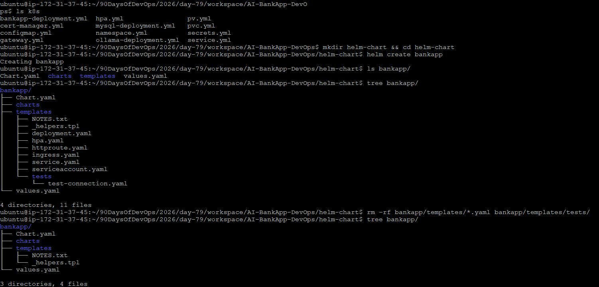
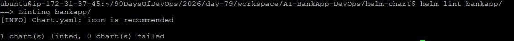
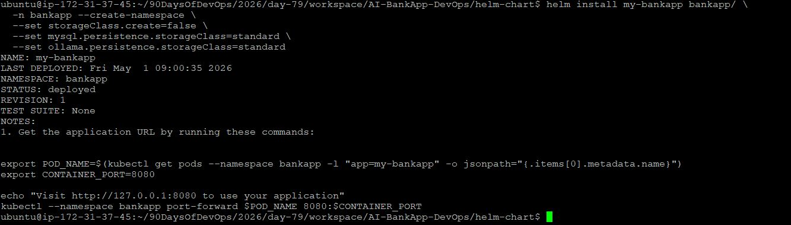
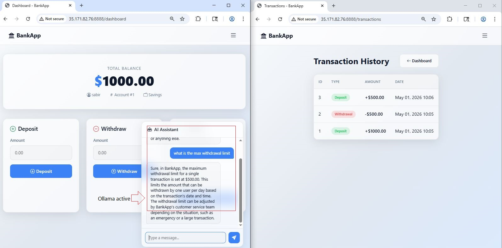

# Day 79: Creating a Custom Helm Chart for AI-BankApp

## Overview
Converted raw Kubernetes manifests of AI-BankApp into a reusable Helm chart.

The application includes:
- Spring Boot BankApp
- MySQL database
- Ollama AI service (optional)
- ConfigMaps, Secrets, PVCs, HPA, and Services

Goal: Replace 12 YAML files with a single Helm-based deployment system.

---

# Task 1: Helm Chart Scaffolding & Analysis

### Steps
```bash
mv  90DaysOfDevOps/2026/day-78/workspace/AI-BankApp-DevOps 90DaysOfDevOps/2026/day-78/workspace/
cd AI-BankApp-DevOps
ls k8s/
helm create bankapp
rm -rf bankapp/templates/*.yaml bankapp/templates/tests/
```



### Observations

Mapped Kubernetes manifests:

| File                   | Purpose            |
| ---------------------- | ------------------ |
| namespace.yml          | Creates namespace  |
| configmap.yml          | App configuration  |
| secrets.yml            | DB credentials     |
| pv.yml / pvc.yml       | Persistent storage |
| bankapp-deployment.yml | Spring Boot app    |
| mysql-deployment.yml   | MySQL DB           |
| ollama-deployment.yml  | AI service         |
| service.yml            | Service exposure   |
| hpa.yml                | Autoscaling        |
| gateway.yml            | API gateway        |
| cert-manager.yml       | TLS setup          |

---

# Task 2: Chart.yaml & values.yaml Design

### Chart Metadata

```yaml
apiVersion: v2
name: bankapp
description: AI-BankApp Helm Chart
version: 0.1.0
appVersion: "1.0.0"
```

---

### Centralized Configuration (values.yaml)

```yaml
bankapp:
  replicaCount: 4

mysql:
  enabled: true

ollama:
  enabled: true
  model: tinyllama

config:
  mysqlDatabase: bankappdb

secrets:
  mysqlPassword: Test@123
```

### Key Learning

* Moved all hardcoded values into values.yaml
* Enabled environment-based configuration

---

# Task 3: Core Helm Templates

### ConfigMap

* Converts static config into dynamic Helm template

### Secret

* Uses `b64enc` for automatic encoding

### Storage

* PVC dynamically generated per environment

### Key Concepts Used

* `{{ .Values }}`
* `include`
* `toYaml`
* `nindent`
* `b64enc`

---

# Task 4: Deployment Templates

### BankApp Deployment

* Spring Boot container
* Init containers for dependency wait (MySQL + Ollama)
* Health probes added

### MySQL Deployment

* Persistent volume mounted at `/var/lib/mysql`
* Secret-based credentials
* Readiness + liveness probes

### Ollama Deployment

* AI model pulled using lifecycle hook
* Persistent model storage
* Optional deployment via `enabled` flag

---

### Key Feature

```yaml
{{- if .Values.ollama.enabled }}
```

Enables/disables AI service dynamically

---

# Task 5: Services & HPA

### Services

* MySQL → ClusterIP
* Ollama → ClusterIP (optional)
* BankApp → ClusterIP / NodePort / LoadBalancer

---

### HPA Configuration

* Min replicas: 2
* Max replicas: 4
* CPU threshold: 70%

```yaml
metrics:
  - type: Resource
    resource:
      name: cpu
```

---

# Task 6: Deployment & Troubleshooting

## Step 1: Validation

```bash
helm lint bankapp/
helm template my-bankapp bankapp/
```

---

## Step 2: Deployment

```bash
helm install my-bankapp bankapp/ -n bankapp --create-namespace
```

---

## Step 3: Issue 1 — ClusterIP Not Accessible

### Problem

Service type was:

```yaml
ClusterIP
```

### Result

* Not accessible from browser

---

## Step 4: Issue 2 — NodePort Not Accessible

After switching:

```yaml
NodePort: 8080:30541
```

Still unreachable externally.

---

## Root Cause Analysis

### 1. Interface Binding Issue

NodePort binds to EC2 private IP:

```
172.31.37.45
```

---

### 2. ClusterIP Isolation

```
10.96.x.x → internal only
```

---

## Fixes Applied

### Fix 1 — Access via EC2 private IP

```bash
curl http://172.31.37.45:30541
```

---

### Fix 2 — Verify port binding

```bash
sudo ss -tulnp | grep 30541
```

---

### Fix 3 — Port Forward (reliable method)

```bash
kubectl port-forward svc/my-bankapp-service -n bankapp 8888:8080 --address 0.0.0.0
```

Access:

```
http://35.171.82.76:8888
```

  

---

# Key Learnings

* Helm replaces raw YAML with reusable templates
* ClusterIP ≠ external access
* NodePort requires AWS Security Group rules
* Kubernetes networking differs from VM networking
* Real debugging involves:

  * Service type
  * Node interface binding
  * Firewall rules

---

# Final Outcome

✔ 12 YAML files converted into Helm chart
✔ Multi-service architecture deployed
✔ Conditional deployments implemented
✔ Autoscaling enabled
✔ Real-world Kubernetes networking debugging completed
✔ Production-style Helm packaging achieved

---

# Summary

This project demonstrates how Helm transforms Kubernetes deployments into:

* Scalable
* Configurable
* Environment-independent
* Production-ready systems

```