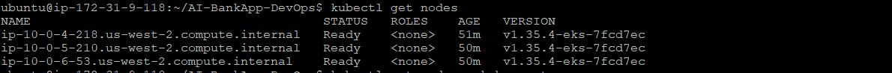
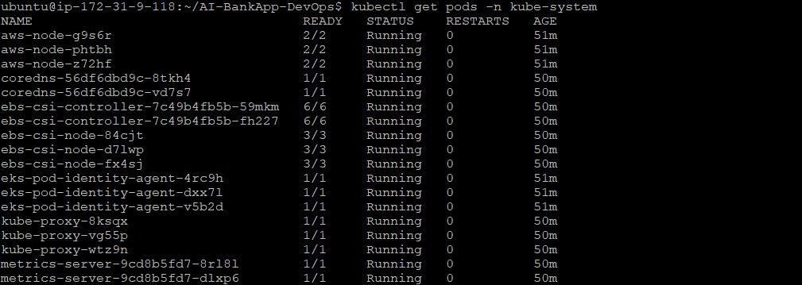
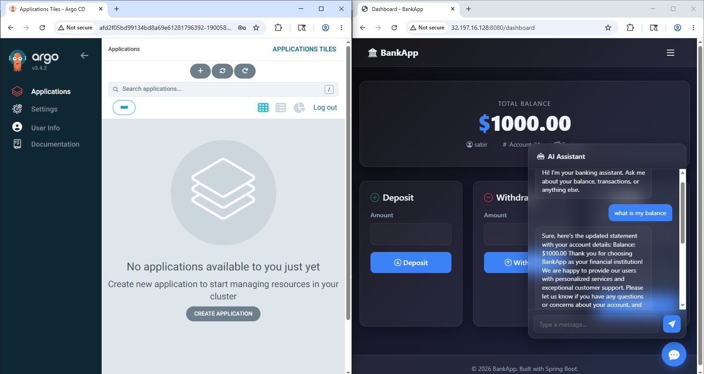

# Day 81 -- Introduction to Amazon EKS with Terraform

## Task Overview
Transitioned the AI-BankApp from a local development environment (Kind) into a production-grade AWS infrastructure cloud environment. Reviewed EKS architecture topologies, adjusted deployment parameters to handle hardware-constrained worker node footprints sustainably, provisioned cloud components using Terraform, and manually verified core database and localized LLM service capabilities

---

# Lab Environment

| Component | Details |
|---|---|
| Remote DevOps Workstation | EC2 `m7i-flex.large` |
| Workstation OS | Ubuntu |
| Workstation Specs | 2 vCPU, 8 GiB RAM, 30 GB gp3 |
| Kubernetes Platform | Amazon EKS 1.35 |
| IaC Tool | Terraform |
| Kubernetes CLI | kubectl |
| Package Manager | Helm |
| GitOps Platform | ArgoCD |
| Region | us-west-2 |

---

## Task 1: Understand EKS Architecture

### 1. What does "managed Kubernetes" mean?
- **Control Plane Management**: AWS abstracts away and hosts the operational control core (API Server, `etcd` key-value cluster store, scheduler, and controller managers). AWS guarantees high availability, automated multi-AZ replication, patching, and control plane version upgrades.
- **Data Plane Responsibility**: The engineer retains operational management over the data plane (Worker Nodes), configuring node sizes, compute boundaries, base operating system images, and manual or automated horizontal cluster scaling metrics.

### 2. EKS Components
- **EKS Control Plane**: Runs inside a highly secured, AWS-isolated infrastructure VPC. Interfaced seamlessly via a secure internet-facing or private network endpoint.
- **Node Groups**: Cluster compute fleets managing operational container runtimes.
  - *Managed Node Groups*: AWS automates instance lifecycle operations, automated rolling updates, and dynamic instance provisioning.
  - *Self-Managed Nodes*: Pure EC2 instances manually provisioned, attached, and configured into the cluster pool by the infrastructure engineer.
  - *Fargate Profiles*: Serverless operational engine executing pods on isolated compute hypervisors without physical node fleets to maintain.
- **VPC and Networking**: Maps individual pods directly to native AWS VPC IP ranges across independent Availability Zones utilizing advanced AWS CNI controllers.
- **IAM Integration (IRSA)**: Integrates AWS IAM security policies natively with granular Kubernetes Service Accounts to pass fine-grained programmatic permissions directly to application workloads.

### 3. EKS Add-ons Used by AI-BankApp
- `coredns`: High-performance cluster-internal service identity and discovery routing engine.
- `kube-proxy`: Local network abstraction framework routing direct host-level traffic safely to back-end pods.
- `vpc-cni`: Implements AWS VPC native IP address provisioning mechanisms directly to single Kubernetes containers.
- `eks-pod-identity-agent`: Simplifies identity token verification routines when application containers request secure access to peripheral cloud tools.
- `aws-ebs-csi-driver`: Bridges Kubernetes Persistent Volume Claims (PVC) cleanly into dynamic cloud block storage allocation architectures (Amazon EBS).
- `metrics-server`: Collects container metrics to facilitate real-time monitoring and drive automated infrastructure adaptations via Horizontal Pod Autoscalers (HPA).

---

## Task 2: Study the AI-BankApp Terraform Configuration

### Directory Layout Review
```text
argocd.tf           # Manages automated declarative ArgoCD GitOps engine setup via Helm chart wrappers
eks.tf              # Configures primary EKS cluster endpoints, system settings, and associated IAM profiles
outputs.tf          # Emits automated kubectl context update parameters and default validation credentials
provider.tf         # Establishes AWS, Helm, and Kubernetes configuration API authorization variables
terraform.tfvars    # Declares local project settings override blocks to dictate cloud instance sizing
variables.tf        # Houses type validations and system default data scopes for the configuration suite
vpc.tf              # Builds structural public, private, and intra network zone isolates across AZs
```

### Architectural Layout Diagram (Draw.io Flowchart Style)

```text
+-------------------------------------------------------------------------------+

|                        [ Remote DevOps Workstation ]                          |
|                        EC2 Instance: m7i-flex.large                           |
|                  Tools: aws-cli, terraform, kubectl, helm                     |
+-------------------------------------------------------------------------------+

                                       |
                                       | (terraform apply)
                                       v
+-------------------------------------------------------------------------------+

|                             AWS Cloud Region                                  |
|                             [ Region: us-west-2 ]                             |
|                                                                               |
|  +-------------------------------------------------------------------------+  |
|  |                            VPC (10.0.0.0/16)                            |  |
|  |                                                                         |  |
|  |  +-------------------------------------------------------------------+  |  |
|  |  |                    EKS CONTROL PLANE (Managed)                    |  |  |
|  |  |           [ API Server ]  --  [ etcd ]  --  [ Scheduler ]         |  |  |
|  |  +-------------------------------------------------------------------+  |  |
|  |                                   |                                     |  |
|  |                                   | (AWS VPC-CNI Cross-Network Link)     |  |
|  |                                   v                                     |  |
|  |  +-------------------------------------------------------------------+  |  |
|  |  |                 EKS DATA PLANE (Managed Node Group)               |  |  |
|  |  |                 Instance Type Topology: 3x t3.small                  |  |  |
|  |  |                                                                   |  |  |
|  |  |  +---------------------------+   +-----------------------------+  |  |  |
|  |  |  |     Worker Node #1        |   |       Worker Node #2        |  |  |  |
|  |  |  |     [ Private Subnet ]    |   |       [ Private Subnet ]    |  |  |  |
|  |  |  +---------------------------+   +-----------------------------+  |  |  |
|  |  |  | Pods:                     |   | Pods:                       |  |  |  |
|  |  |  |  o mysql-deployment       |   |  o ollama-deployment        |  |  |  |
|  |  |  |                           |   |                             |  |  |
|  |  |  | Storage Integration:      |   | Storage Integration:        |  |  |  |
|  |  |  |  o aws-ebs-csi driver     |   |  o aws-ebs-csi driver       |  |  |  |
|  |  |  |         |                 |   |         |                   |  |  |  |
|  |  |  |         v                 |   |         v                   |  |  |  |
|  |  |  |   [ 5Gi EBS Volume ]      |   |   [ 10Gi EBS Volume ]       |  |  |  |
|  |  |  +---------------------------+   +-----------------------------+  |  |  |
|  |  |                                                 |                    |  |  |
|  |  |                                  +--------------+                    |  |  |
|  |  |                                  v                                   |  |  |
|  |  |  +-------------------------------------------------------------+  |  |  |
|  |  |  |                       Worker Node #3                        |  |  |  |
|  |  |  |                     [ Private Subnet ]                      |  |  |  |
|  |  |  +-------------------------------------------------------------+  |  |  |
|  |  |  | Pods:                                                       |  |  |  |
|  |  |  |  o bankapp-deployment (Multi-replicas scaled dynamically)   |  |  |  |
|  |  |  |  o ArgoCD Core Engine Pods                                  |  |  |  |
|  |  |  |  o Cluster Metrics Server Pods                              |  |  |  |
|  |  |  +-------------------------------------------------------------+  |  |  |
|  |  +-------------------------------------------------------------------+  |  |
|  +-------------------------------------------------------------------------+  |
+-------------------------------------------------------------------------------+
```

---

## Task 3 & 4: Provisioning and Cluster Integration

### 1. Cost and Footprint Optimization Strategy
To run these labs efficiently on AWS, a cost-optimization approach was taken. A single, free-tier eligible `m7i-flex.large` EC2 instance was provisioned as a remote DevOps workstation. This hosted the client utilities (`aws-cli`, `terraform`, `kubectl`, `helm`), offloading all processing tasks from local hardware constraints. 

To maximize cluster efficiency while containing cloud costs, `terraform/terraform.tfvars` was modified to transition the compute fleet from `t3.medium` instances down to `t3.small` nodes:

```hcl
aws_region         = "us-west-2"
cluster_name       = "bankapp-eks"
cluster_version    = "1.35"
node_instance_type = "t3.small"   # Optimized resource footprint
node_desired_count = 3            # Maintains sufficient pod scheduling networks
node_max_count     = 3            # Hard limit to prevent accidental auto-scaling costs
```

### 2. Infrastructure Initialization and Execution
The workspace directory was initialized, verified via programmatic execution plans, and securely deployed into AWS:
```bash
terraform init
terraform plan
terraform apply --auto-approve
```
Following a 15-minute cluster creation timeline, the credentials were pulled locally into the active workspace config context:
```bash
aws eks update-kubeconfig --name bankapp-eks --region us-west-2
```

### 3. Verification of EKS Core States
```bash
kubectl get nodes -o wide
```

### See Screenshots Below

 

 


 

---

# Task 6: EKS Cost Analysis and Cleanup Strategy

# Optimized Infrastructure Cost Breakdown

| Component | Approximate Cost |
|---|---|
| EKS Control Plane | ~$0.10/hr |
| 3 × t3.small Nodes | ~$0.07/hr |
| NAT Gateway | ~$0.045/hr |
| ArgoCD LoadBalancer | ~$0.025/hr |
| EBS Volumes | Minimal |
| Total | ~$0.25/hr |

---

# Why NAT Gateway Costs Are High

The NAT Gateway continuously incurs:
- hourly operational charges
- data processing charges

Even during low traffic periods.

Because worker nodes are deployed into private subnets, outbound internet traffic requires NAT traversal for:
- image pulls
- AWS API communication
- package retrieval
- cloud integrations

---

# Cleanup Procedures

## Remove Only Application Workloads

```bash
kubectl delete -f k8s/
```

---

## Destroy Entire Infrastructure

```bash
cd terraform
terraform destroy
```

This safely removes:
- EKS Cluster
- Managed Node Groups
- VPC
- NAT Gateway
- LoadBalancers
- IAM Roles
- EBS Volumes

---

# Summary

- Learned Amazon EKS architecture and networking fundamentals
- Understood Terraform-based Infrastructure as Code workflows
- Provisioned a production-style Kubernetes cluster on AWS
- Configured multi-AZ networking with managed node groups
- Validated EKS add-ons and IRSA integrations
- Troubleshot Kubernetes scheduling failures in constrained environments
- Optimized workloads for low-cost AWS infrastructure
- Successfully deployed AI-BankApp with persistent EBS-backed storage
- Integrated Ollama workloads into Kubernetes under constrained resource boundaries
- Validated cluster health, HPA behavior, and storage provisioning
- Prepared the environment for future GitOps workflows using ArgoCD

---